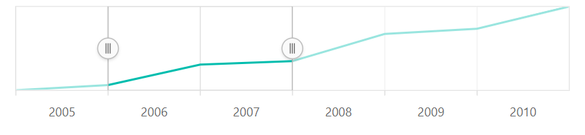

# Series Type in Blazor Range Selector Component

The Range Selector supports three types of series for rendering data.

<!-- markdownlint-disable MD036 -->

## Line

<!-- markdownlint-disable MD036 -->

To render a line series, set the series [Type](https://help.syncfusion.com/cr/blazor/Syncfusion.Blazor.Charts.RangeNavigatorSeries.html#Syncfusion_Blazor_Charts_RangeNavigatorSeries_Type) to **Line**. By default, the line series is rendered in the Range Selector.

```cshtml

@using Syncfusion.Blazor.Charts

<SfRangeNavigator Value="@Value" ValueType="RangeValueType.DateTime" IntervalType="RangeIntervalType.Years">
    <RangeNavigatorSeriesCollection>
        <RangeNavigatorSeries DataSource="@StockInfo" XName="Date" Type="RangeNavigatorType.Line" YName="Close">
        </RangeNavigatorSeries>
    </RangeNavigatorSeriesCollection>
</SfRangeNavigator>

@code {
    public class StockDetails
    {
        public DateTime Date { get; set; }
        public double Close { get; set; }
    }

    public DateTime[] Value = new DateTime[] { new DateTime(2006, 01, 01), new DateTime(2008, 01, 01) };

    public List<StockDetails> StockInfo = new List<StockDetails>
    {
        new StockDetails { Date = new DateTime(2005, 01, 01), Close = 21 },
        new StockDetails { Date = new DateTime(2006, 01, 01), Close = 24 },
        new StockDetails { Date = new DateTime(2007, 01, 01), Close = 36 },
        new StockDetails { Date = new DateTime(2008, 01, 01), Close = 38 },
        new StockDetails { Date = new DateTime(2009, 01, 01), Close = 54 },
        new StockDetails { Date = new DateTime(2010, 01, 01), Close = 57 },
        new StockDetails { Date = new DateTime(2011, 01, 01), Close = 70 }
    };
}

```



## Area

To render an area series, set the series [Type](https://help.syncfusion.com/cr/blazor/Syncfusion.Blazor.Charts.RangeNavigatorSeries.html#Syncfusion_Blazor_Charts_RangeNavigatorSeries_Type) to **Area**.

```cshtml

@using Syncfusion.Blazor.Charts

<SfRangeNavigator Value="@Value" ValueType="RangeValueType.DateTime" IntervalType="RangeIntervalType.Years">
    <RangeNavigatorSeriesCollection>
        <RangeNavigatorSeries DataSource="@StockInfo" XName="Date" Type="RangeNavigatorType.Area" YName="Close">
        </RangeNavigatorSeries>
    </RangeNavigatorSeriesCollection>
</SfRangeNavigator>

@code {
    public class StockDetails
    {
        public DateTime Date { get; set; }
        public double Close { get; set; }
    }

    public DateTime[] Value = new DateTime[] { new DateTime(2006, 01, 01), new DateTime(2008, 01, 01) };

    public List<StockDetails> StockInfo = new List<StockDetails>
    {
        new StockDetails { Date = new DateTime(2005, 01, 01), Close = 21 },
        new StockDetails { Date = new DateTime(2006, 01, 01), Close = 24 },
        new StockDetails { Date = new DateTime(2007, 01, 01), Close = 36 },
        new StockDetails { Date = new DateTime(2008, 01, 01), Close = 38 },
        new StockDetails { Date = new DateTime(2009, 01, 01), Close = 54 },
        new StockDetails { Date = new DateTime(2010, 01, 01), Close = 57 },
        new StockDetails { Date = new DateTime(2011, 01, 01), Close = 70 }
    };
}

```


## Step Line

To render a step line series, set the series [Type](https://help.syncfusion.com/cr/blazor/Syncfusion.Blazor.Charts.RangeNavigatorSeries.html#Syncfusion_Blazor_Charts_RangeNavigatorSeries_Type) to **Step Line**.

```cshtml

@using Syncfusion.Blazor.Charts

<SfRangeNavigator Value="@Value" ValueType="RangeValueType.DateTime" IntervalType="RangeIntervalType.Years">
    <RangeNavigatorSeriesCollection>
        <RangeNavigatorSeries DataSource="@StockInfo" XName="Date" Type="RangeNavigatorType.StepLine" YName="Close">
        </RangeNavigatorSeries>
    </RangeNavigatorSeriesCollection>
</SfRangeNavigator>

@code {
    public class StockDetails
    {
        public DateTime Date { get; set; }
        public double Close { get; set; }
    }

    public DateTime[] Value = new DateTime[] { new DateTime(2006, 01, 01), new DateTime(2008, 01, 01) };

    public List<StockDetails> StockInfo = new List<StockDetails>
    {
        new StockDetails { Date = new DateTime(2005, 01, 01), Close = 21 },
        new StockDetails { Date = new DateTime(2006, 01, 01), Close = 24 },
        new StockDetails { Date = new DateTime(2007, 01, 01), Close = 36 },
        new StockDetails { Date = new DateTime(2008, 01, 01), Close = 38 },
        new StockDetails { Date = new DateTime(2009, 01, 01), Close = 54 },
        new StockDetails { Date = new DateTime(2010, 01, 01), Close = 57 },
        new StockDetails { Date = new DateTime(2011, 01, 01), Close = 70 }
    };
}

```


