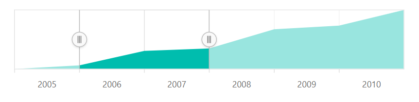
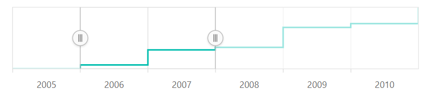

# Series Types in the Blazor Range Selector (SfRangeNavigator)

To render the data, the Range Selector supports three types of series.

<!-- markdownlint-disable MD036 -->

## Line

<!-- markdownlint-disable MD036 -->

To render a line series, use series [`Type`](https://help.syncfusion.com/cr/blazor/Syncfusion.Blazor.Charts.RangeNavigatorSeries.html#Syncfusion_Blazor_Charts_RangeNavigatorSeries_Type) as **Line**. By default, the line series is rendered in the Range Selector.





## Area

To render an area series, use series [`Type`](https://help.syncfusion.com/cr/blazor/Syncfusion.Blazor.Charts.RangeNavigatorSeries.html#Syncfusion_Blazor_Charts_RangeNavigatorSeries_Type) as **Area**.





## Step Line

To render a Step line series, use series [`Type`](https://help.syncfusion.com/cr/blazor/Syncfusion.Blazor.Charts.RangeNavigatorSeries.html#Syncfusion_Blazor_Charts_RangeNavigatorSeries_Type) as **Step Line**.





