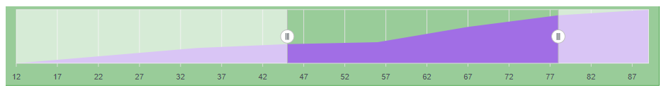
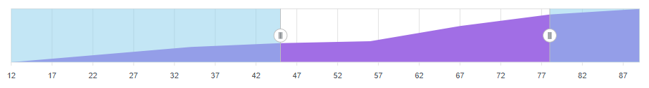
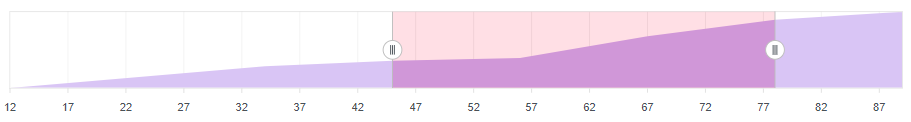
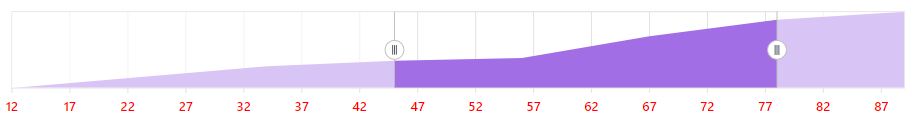

# Style and Appearance in Blazor Range Navigator Component

Style and Appearance provide options to customize the visual design of the **Syncfusion Blazor Range Navigator** component, ensuring consistency with your application’s branding and theme.

By using CSS selectors and ID-based styling, you can customize colors, typography, spacing, borders, and other visual properties of TreeMap items, labels, and SVG elements.

**Basic Range Navigator Setup**

```cshtml
@using Syncfusion.Blazor.Charts

<SfRangeNavigator id="stockRange" Value="@Value">
    <RangeNavigatorRangeTooltipSettings Enable="true"></RangeNavigatorRangeTooltipSettings>
    <RangeNavigatorSeriesCollection>
        <RangeNavigatorSeries DataSource="@StockInfo"
                              XName="Date"
                              YName="Close"
                              Type="RangeNavigatorType.Area">
        </RangeNavigatorSeries>
    </RangeNavigatorSeriesCollection>
</SfRangeNavigator>

@code {
    public class StockDetails
    {
        public double Date { get; set; }
        public double Close { get; set; }
    }

    public List<StockDetails> StockInfo = new()
    {
        new StockDetails { Date = 12, Close = 28 },
        new StockDetails { Date = 34, Close = 44 },
        new StockDetails { Date = 45, Close = 48 },
        new StockDetails { Date = 56, Close = 50 },
        new StockDetails { Date = 67, Close = 66 },
        new StockDetails { Date = 78, Close = 78 },
        new StockDetails { Date = 89, Close = 84 }
    };

    public int[] Value = new int[] { 45, 78 };
}
```

## Customize Range Navigator Root Element
Customize the root container of the Range Navigator to apply global styling such as background color, padding, and borders. The root element uses the `.e-rangenavigator` class and affects the overall appearance of the entire control.

```css
.e-rangenavigator {
    background-color: green;
}
```

This styles the entire Range Navigator container.



## Customize Unselected Range Regions

Modify the appearance of unselected regions (left and right areas outside the selected range) to create visual distinction and improve user interaction clarity. Unselected regions are rendered as SVG elements with IDs, allowing independent styling for left and right areas.

**Left unselected region**

```css
[id*="_leftUnSelectedArea"] {
    fill: skyblue;
    opacity: 0.5;
}
```

**Right unselected region**

```css
[id*="_rightUnSelectedArea"] {
    fill: skyblue;
    opacity: 0.5;
}
```



## Customize Selected Range Region
Style the highlighted selected range area to emphasize the active data range and improve visual focus. The selected region can be customized to stand out from unselected areas, making it easier for users to identify the current selection.

```css
[id*="_SelectedArea"] {
    fill: blue;
}
```

This CSS overrides the default theme color and the color set through [RangeNavigatorStyleSettings](https://help.syncfusion.com/cr/blazor/Syncfusion.Blazor.Charts.RangeNavigatorStyleSettings.html).



## Customize Axis Label Text
Format the axis labels to match your application's typography and readability standards. Control font size, color, weight, and family to ensure axis labels are prominent and aligned with your design system. This improves data readability and visual hierarchy in the Range Navigator.

```css
[id*="_FirstLevelAxisLabels"] text {
    fill: red;
    font-size: 14px;
    font-weight: 600;
    font-family: "Segoe UI", Arial, sans-serif;
}
```



N> SVG presentation attributes such as fill, stroke, and font-size may require **!important** when overridden by inline SVG styles.