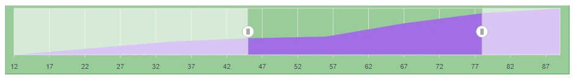
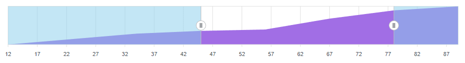
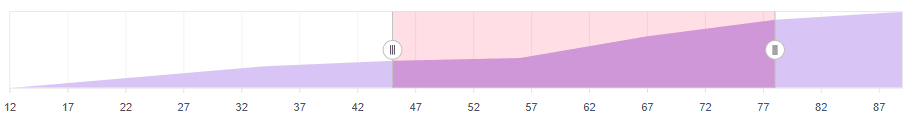
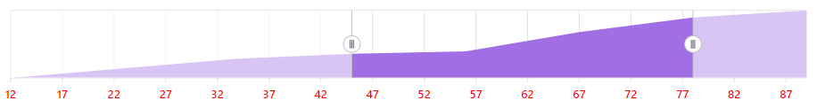

# Blazor Range Selector Style and Appearance

The visual design of the Syncfusion Blazor Range Selector can be customized to keep it consistent with your application's branding and theme.

By using CSS class and ID-based selectors, you can customize the colors, typography, spacing, and borders of the [SfRangeNavigator](https://help.syncfusion.com/cr/blazor/Syncfusion.Blazor.Charts.SfRangeNavigator.html) SVG elements, such as the root container, the selected and unselected regions, and the axis labels. Some of these can also be configured through the [RangeNavigatorStyleSettings](https://help.syncfusion.com/cr/blazor/Syncfusion.Blazor.Charts.RangeNavigatorStyleSettings.html) and [RangeNavigatorLabelStyle](https://help.syncfusion.com/cr/blazor/Syncfusion.Blazor.Charts.RangeNavigatorLabelStyle.html) settings.

## Basic setup

The following markup is used by the CSS examples in the sections below. Add the CSS to your global stylesheet (for example, `wwwroot/css/site.css`).

```cshtml
@using Syncfusion.Blazor.Charts

<SfRangeNavigator ID="stockRange" Value="@Value">
    <RangeNavigatorRangeTooltipSettings Enable="true"></RangeNavigatorRangeTooltipSettings>
    <RangeNavigatorSeriesCollection>
        <RangeNavigatorSeries DataSource="@StockInfo"
                              XName="Date"
                              YName="Close"
                              Type="RangeNavigatorType.Area">
        </RangeNavigatorSeries>
    </RangeNavigatorSeriesCollection>
</SfRangeNavigator>

@code {
    public class StockDetails
    {
        public double Date { get; set; }
        public double Close { get; set; }
    }

    public List<StockDetails> StockInfo = new()
    {
        new StockDetails { Date = 12, Close = 28 },
        new StockDetails { Date = 34, Close = 44 },
        new StockDetails { Date = 45, Close = 48 },
        new StockDetails { Date = 56, Close = 50 },
        new StockDetails { Date = 67, Close = 66 },
        new StockDetails { Date = 78, Close = 78 },
        new StockDetails { Date = 89, Close = 84 }
    };

    public int[] Value = new int[] { 45, 78 };
}
```

## Customize the root element

Style the root container to apply global styling such as background color, padding, and borders. The root element uses the `.e-rangenavigator` class and affects the overall appearance of the entire control.

```css
.e-rangenavigator {
    background-color: green;
}
```

This styles the entire Range Selector container.



## Customize the unselected regions

Modify the appearance of the unselected regions (the left and right areas outside the selected range) to create visual distinction and improve clarity. The unselected regions are rendered as SVG elements with IDs, allowing the left and right areas to be styled independently. The fill color can also be set through the [UnselectedRegionColor](https://help.syncfusion.com/cr/blazor/Syncfusion.Blazor.Charts.RangeNavigatorStyleSettings.html#Syncfusion_Blazor_Charts_RangeNavigatorStyleSettings_UnselectedRegionColor) property.

**Left unselected region**

```css
[id*="_leftUnSelectedArea"] {
    fill: skyblue;
    opacity: 0.5;
}
```

**Right unselected region**

```css
[id*="_rightUnSelectedArea"] {
    fill: skyblue;
    opacity: 0.5;
}
```



## Customize the selected region

Style the highlighted selected range area to emphasize the active data range and improve visual focus. The selected region can be customized to stand out from the unselected areas, making it easier for users to identify the current selection.

```css
[id*="_SelectedArea"] {
    fill: pink;
    opacity: 0.5;
}
```

This CSS overrides the default theme color and the color set through the [SelectedRegionColor](https://help.syncfusion.com/cr/blazor/Syncfusion.Blazor.Charts.RangeNavigatorStyleSettings.html#Syncfusion_Blazor_Charts_RangeNavigatorStyleSettings_SelectedRegionColor) property of [RangeNavigatorStyleSettings](https://help.syncfusion.com/cr/blazor/Syncfusion.Blazor.Charts.RangeNavigatorStyleSettings.html).



## Customize the axis label text

Format the axis labels to match your application's typography and readability standards. Control the font size, color, weight, and family to ensure the axis labels are prominent and aligned with your design system. The same options are available through the [RangeNavigatorLabelStyle](https://help.syncfusion.com/cr/blazor/Syncfusion.Blazor.Charts.RangeNavigatorLabelStyle.html) setting.

```css
[id*="_FirstLevelAxisLabels"] text {
    fill: red;
    font-size: 14px;
    font-weight: 600;
    font-family: "Segoe UI", Arial, sans-serif;
}
```



N> SVG presentation attributes such as `fill`, `stroke`, and `font-size` may require `!important` when overriding inline SVG styles.

## See Also

* [Customization](./custom)
* [Grid and Tick Lines](./grid-tick)