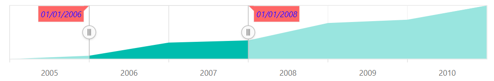

# Tooltip in Blazor Range Selector Component

<!-- markdownlint-disable MD036 -->

The Range Selector supports tooltips for sliders, displaying the selected start and end values.

<!-- markdownlint-disable MD013 -->

## Enable Tooltip

Enable the tooltip by setting the [Enable](https://help.syncfusion.com/cr/blazor/Syncfusion.Blazor.Charts.RangeNavigatorRangeTooltipSettings.html#Syncfusion_Blazor_Charts_RangeNavigatorRangeTooltipSettings_Enable) property to **true**.

```cshtml

@using Syncfusion.Blazor.Charts

<SfRangeNavigator Value="@Value" ValueType="RangeValueType.DateTime">
    <RangeNavigatorRangeTooltipSettings Enable="true" DisplayMode="TooltipDisplayMode.Always">
    </RangeNavigatorRangeTooltipSettings>
    <RangeNavigatorSeriesCollection>
        <RangeNavigatorSeries DataSource="@StockInfo" XName="Date" Type="RangeNavigatorType.Area" YName="Close">
        </RangeNavigatorSeries>
    </RangeNavigatorSeriesCollection>
</SfRangeNavigator>

@code {
    public class StockDetails
    {
        public DateTime Date { get; set; }
        public double Close { get; set; }
    }

    public DateTime[] Value = new DateTime[] { new DateTime(2006, 01, 01), new DateTime(2008, 01, 01) };

    public List<StockDetails> StockInfo = new List<StockDetails>
    {
        new StockDetails { Date = new DateTime(2005, 01, 01), Close = 21 },
        new StockDetails { Date = new DateTime(2006, 01, 01), Close = 24 },
        new StockDetails { Date = new DateTime(2007, 01, 01), Close = 36 },
        new StockDetails { Date = new DateTime(2008, 01, 01), Close = 38 },
        new StockDetails { Date = new DateTime(2009, 01, 01), Close = 54 },
        new StockDetails { Date = new DateTime(2010, 01, 01), Close = 57 },
        new StockDetails { Date = new DateTime(2011, 01, 01), Close = 70 }
    };
}

```


## Tooltip Customization

Customize the tooltip using these properties:

* [Enable](https://help.syncfusion.com/cr/blazor/Syncfusion.Blazor.Charts.RangeNavigatorRangeTooltipSettings.html#Syncfusion_Blazor_Charts_RangeNavigatorRangeTooltipSettings_Enable) – Controls tooltip visibility.
* [DisplayMode](https://help.syncfusion.com/cr/blazor/Syncfusion.Blazor.Charts.RangeNavigatorRangeTooltipSettings.html#Syncfusion_Blazor_Charts_RangeNavigatorRangeTooltipSettings_DisplayMode) – Sets the display mode.
* [Fill](https://help.syncfusion.com/cr/blazor/Syncfusion.Blazor.Charts.RangeNavigatorRangeTooltipSettings.html#Syncfusion_Blazor_Charts_RangeNavigatorRangeTooltipSettings_Fill) – Sets the background color.
* [Opacity](https://help.syncfusion.com/cr/blazor/Syncfusion.Blazor.Charts.RangeNavigatorRangeTooltipSettings.html#Syncfusion_Blazor_Charts_RangeNavigatorRangeTooltipSettings_Opacity) – Sets the opacity.
* [Format](https://help.syncfusion.com/cr/blazor/Syncfusion.Blazor.Charts.RangeNavigatorRangeTooltipSettings.html#Syncfusion_Blazor_Charts_RangeNavigatorRangeTooltipSettings_Format) – Sets the tooltip text format.
* [RangeNavigatorTooltipTextStyle](https://help.syncfusion.com/cr/blazor/Syncfusion.Blazor.Charts.RangeNavigatorTooltipTextStyle.html) – Customizes the [FontSize](https://help.syncfusion.com/cr/blazor/Syncfusion.Blazor.Charts.RangeNavigatorTooltipTextStyle.html#Syncfusion_Blazor_Charts_RangeNavigatorTooltipTextStyle_Size), the [Color](https://help.syncfusion.com/cr/blazor/Syncfusion.Blazor.Charts.ChartCommonFont.html#Syncfusion_Blazor_Charts_ChartCommonFont_Color), the [FontFamily](https://help.syncfusion.com/cr/blazor/Syncfusion.Blazor.Charts.ChartCommonFont.html#Syncfusion_Blazor_Charts_ChartCommonFont_FontFamily), the [FontStyle](https://help.syncfusion.com/cr/blazor/Syncfusion.Blazor.Charts.ChartCommonFont.html#Syncfusion_Blazor_Charts_ChartCommonFont_FontStyle), the [FontWeight](https://help.syncfusion.com/cr/blazor/Syncfusion.Blazor.Charts.ChartCommonFont.html#Syncfusion_Blazor_Charts_ChartCommonFont_FontWeight), the [TextAlignment](https://help.syncfusion.com/cr/blazor/Syncfusion.Blazor.Charts.ChartCommonFont.html#Syncfusion_Blazor_Charts_ChartCommonFont_TextAlignment) and the [TextOverflow](https://help.syncfusion.com/cr/blazor/Syncfusion.Blazor.Charts.ChartCommonFont.html#Syncfusion_Blazor_Charts_ChartCommonFont_TextOverflow) of the tooltip text.
* [RangeNavigatorTooltipBorder](https://help.syncfusion.com/cr/blazor/Syncfusion.Blazor.Charts.RangeNavigatorTooltipBorder.html) – Customizes the [Width](https://help.syncfusion.com/cr/blazor/Syncfusion.Blazor.Charts.ChartCommonBorder.html#Syncfusion_Blazor_Charts_ChartCommonBorder_Width) and the [Color](https://help.syncfusion.com/cr/blazor/Syncfusion.Blazor.Charts.ChartCommonBorder.html#Syncfusion_Blazor_Charts_ChartCommonBorder_Color) of the tooltip border.

```cshtml

@using Syncfusion.Blazor.Charts

<SfRangeNavigator Value="@Value" ValueType="RangeValueType.DateTime">
    <RangeNavigatorRangeTooltipSettings Enable="true" Fill="red" Opacity="0.6" DisplayMode="TooltipDisplayMode.Always">
        <RangeNavigatorTooltipTextStyle Color="blue" Size="12px" FontStyle="italic"></RangeNavigatorTooltipTextStyle>
    </RangeNavigatorRangeTooltipSettings>
    <RangeNavigatorSeriesCollection>
        <RangeNavigatorSeries DataSource="@StockInfo" XName="Date" Type="RangeNavigatorType.Area" YName="Close">
        </RangeNavigatorSeries>
    </RangeNavigatorSeriesCollection>
</SfRangeNavigator>

@code {
    public class StockDetails
    {
        public DateTime Date { get; set; }
        public double Close { get; set; }
    }

    public DateTime[] Value = new DateTime[] { new DateTime(2006, 01, 01), new DateTime(2008, 01, 01) };

    public List<StockDetails> StockInfo = new List<StockDetails>
    {
        new StockDetails { Date = new DateTime(2005, 01, 01), Close = 21 },
        new StockDetails { Date = new DateTime(2006, 01, 01), Close = 24 },
        new StockDetails { Date = new DateTime(2007, 01, 01), Close = 36 },
        new StockDetails { Date = new DateTime(2008, 01, 01), Close = 38 },
        new StockDetails { Date = new DateTime(2009, 01, 01), Close = 54 },
        new StockDetails { Date = new DateTime(2010, 01, 01), Close = 57 },
        new StockDetails { Date = new DateTime(2011, 01, 01), Close = 70 }
    };
}

```



## Label Format

Use the [LabelFormat](https://help.syncfusion.com/cr/blazor/Syncfusion.Blazor.Charts.SfRangeNavigator.html#Syncfusion_Blazor_Charts_SfRangeNavigator_LabelFormat) property to format and parse dates in the tooltip.

```cshtml

@using Syncfusion.Blazor.Charts

<SfRangeNavigator Value="@Value" ValueType="RangeValueType.DateTime">
    <RangeNavigatorRangeTooltipSettings Enable="true" DisplayMode="TooltipDisplayMode.Always" Format="y/M/d">
    </RangeNavigatorRangeTooltipSettings>
    <RangeNavigatorSeriesCollection>
        <RangeNavigatorSeries DataSource="@StockInfo" XName="Date" Type="RangeNavigatorType.Area" YName="Close">
        </RangeNavigatorSeries>
    </RangeNavigatorSeriesCollection>
</SfRangeNavigator>

@code {
    public class StockDetails
    {
        public DateTime Date { get; set; }
        public double Close { get; set; }
    }

    public DateTime[] Value = new DateTime[] { new DateTime(2006, 01, 01), new DateTime(2008, 01, 01) };

    public List<StockDetails> StockInfo = new List<StockDetails>
    {
        new StockDetails { Date = new DateTime(2005, 01, 01), Close = 21 },
        new StockDetails { Date = new DateTime(2006, 01, 01), Close = 24 },
        new StockDetails { Date = new DateTime(2007, 01, 01), Close = 36 },
        new StockDetails { Date = new DateTime(2008, 01, 01), Close = 38 },
        new StockDetails { Date = new DateTime(2009, 01, 01), Close = 54 },
        new StockDetails { Date = new DateTime(2010, 01, 01), Close = 57 },
        new StockDetails { Date = new DateTime(2011, 01, 01), Close = 70 }
    };
}

```


The following table shows the results of applying common date and time formats to the [LabelFormat](https://help.syncfusion.com/cr/blazor/Syncfusion.Blazor.Charts.SfRangeNavigator.html#Syncfusion_Blazor_Charts_SfRangeNavigator_LabelFormat) property.

<!-- markdownlint-disable MD033 -->
<table>
<tr>
<td><b>Label Value</b></td>
<td><b>Label Format Property Value</b></td>
<td><b>Result </b></td>
<td><b>Description </b></td>
</tr>
<tr>
<td>new Date(2000, 03, 10)</td>
<td>EEEE</td>
<td>Monday</td>
<td>The date is displayed in the day format.</td>
</tr>
<tr>
<td>new Date(2000, 03, 10)</td>
<td>yMd</td>
<td>04/10/2000</td>
<td>The date is displayed in the month/date/year format.</td>
</tr>
<tr>
<td>new Date(2000, 03, 10)</td>
<td> MMM </td>
<td>Apr</td>
<td>The shorthand month for the date is displayed.</td>
</tr>
<tr>
<td>new Date(2000, 03, 10)</td>
<td>hm</td>
<td>12:00 AM</td>
<td>Time of the date value is displayed as label.</td>
</tr>
<tr>
<td>new Date(2000, 03, 10)</td>
<td>hms</td>
<td>12:00:00 AM</td>
<td>The label is displayed in hours:minutes:seconds format.</td>
</tr>
</table>
