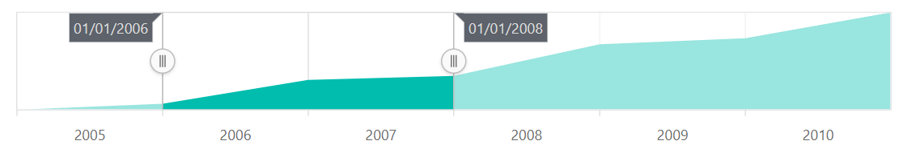
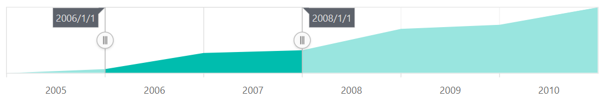

# Tooltip in the Blazor Range Selector (SfRangeNavigator)

<!-- markdownlint-disable MD036 -->

The tooltip for sliders are supported by the Range Selector. Sliders are used in the Range Selector to select data from a specific range. The tooltip displays the selected start and end values.

<!-- markdownlint-disable MD013 -->

## Enable tooltip

The tooltip can be used to display information about the selected data and it is enabled by setting the [`Enable`](https://help.syncfusion.com/cr/blazor/Syncfusion.Blazor.Charts.RangeNavigatorRangeTooltipSettings.html#Syncfusion_Blazor_Charts_RangeNavigatorRangeTooltipSettings_Enable) property to **true**.





## Tooltip Customization

The tooltip can be customized using the following properties:

* [`Enable`](https://help.syncfusion.com/cr/blazor/Syncfusion.Blazor.Charts.RangeNavigatorRangeTooltipSettings.html#Syncfusion_Blazor_Charts_RangeNavigatorRangeTooltipSettings_Enable) - Customizes the visibility of the tooltip.
* [`DisplayMode`](https://help.syncfusion.com/cr/blazor/Syncfusion.Blazor.Charts.RangeNavigatorRangeTooltipSettings.html#Syncfusion_Blazor_Charts_RangeNavigatorRangeTooltipSettings_DisplayMode) - Customizes the display mode of the tooltip.
* [`Fill`](https://help.syncfusion.com/cr/blazor/Syncfusion.Blazor.Charts.RangeNavigatorRangeTooltipSettings.html#Syncfusion_Blazor_Charts_RangeNavigatorRangeTooltipSettings_Fill) - Customizes the background color of the tooltip.
* [`Opacity`](https://help.syncfusion.com/cr/blazor/Syncfusion.Blazor.Charts.RangeNavigatorRangeTooltipSettings.html#Syncfusion_Blazor_Charts_RangeNavigatorRangeTooltipSettings_Opacity) - Customizes the opacity of the tooltip.
* [`Format`](https://help.syncfusion.com/cr/blazor/Syncfusion.Blazor.Charts.RangeNavigatorRangeTooltipSettings.html#Syncfusion_Blazor_Charts_RangeNavigatorRangeTooltipSettings_Format) - Customizes the format of the tooltip text.
* [`RangeNavigatorTooltipTextStyle`](https://help.syncfusion.com/cr/blazor/Syncfusion.Blazor.Charts.RangeNavigatorTooltipTextStyle.html) - Customizes the [`Size`](https://help.syncfusion.com/cr/blazor/Syncfusion.Blazor.Charts.RangeNavigatorTooltipTextStyle.html#Syncfusion_Blazor_Charts_RangeNavigatorTooltipTextStyle_Size), the [`Color`](https://help.syncfusion.com/cr/blazor/Syncfusion.Blazor.Charts.ChartCommonFont.html#Syncfusion_Blazor_Charts_ChartCommonFont_Color), the [`FontFamily`](https://help.syncfusion.com/cr/blazor/Syncfusion.Blazor.Charts.ChartCommonFont.html#Syncfusion_Blazor_Charts_ChartCommonFont_FontFamily), the [`FontStyle`](https://help.syncfusion.com/cr/blazor/Syncfusion.Blazor.Charts.ChartCommonFont.html#Syncfusion_Blazor_Charts_ChartCommonFont_FontStyle), the [`FontWeight`](https://help.syncfusion.com/cr/blazor/Syncfusion.Blazor.Charts.ChartCommonFont.html#Syncfusion_Blazor_Charts_ChartCommonFont_FontWeight), the [`TextAlignment`](https://help.syncfusion.com/cr/blazor/Syncfusion.Blazor.Charts.ChartCommonFont.html#Syncfusion_Blazor_Charts_ChartCommonFont_TextAlignment) and the [`TextOverflow`](https://help.syncfusion.com/cr/blazor/Syncfusion.Blazor.Charts.ChartCommonFont.html#Syncfusion_Blazor_Charts_ChartCommonFont_TextOverflow) of the tooltip text.
* [`RangeNavigatorTooltipBorder`](https://help.syncfusion.com/cr/blazor/Syncfusion.Blazor.Charts.RangeNavigatorTooltipBorder.html) - Customize the [`Width`](https://help.syncfusion.com/cr/blazor/Syncfusion.Blazor.Charts.ChartCommonBorder.html#Syncfusion_Blazor_Charts_ChartCommonBorder_Width) and the [`Color`](https://help.syncfusion.com/cr/blazor/Syncfusion.Blazor.Charts.ChartCommonBorder.html#Syncfusion_Blazor_Charts_ChartCommonBorder_Color) of the tooltip border.





## Label Format

The [`LabelFormat`](https://help.syncfusion.com/cr/blazor/Syncfusion.Blazor.Charts.SfRangeNavigator.html#Syncfusion_Blazor_Charts_SfRangeNavigator_LabelFormat) property in the tooltip is used to format and parse the date to all globalize formats.





The following table shows the results of applying some common date and time formats to the [`LabelFormat`](https://help.syncfusion.com/cr/blazor/Syncfusion.Blazor.Charts.SfRangeNavigator.html#Syncfusion_Blazor_Charts_SfRangeNavigator_LabelFormat) property.

<!-- markdownlint-disable MD033 -->
<table>
<tr>
<td><b>Label Value</b></td>
<td><b>Label Format Property Value</b></td>
<td><b>Result </b></td>
<td><b>Description </b></td>
</tr>
<tr>
<td>new Date(2000, 03, 10)</td>
<td>EEEE</td>
<td>Monday</td>
<td>The date is displayed in the day format.</td>
</tr>
<tr>
<td>new Date(2000, 03, 10)</td>
<td>yMd</td>
<td>04/10/2000</td>
<td>The date is displayed in the month/date/year format.</td>
</tr>
<tr>
<td>new Date(2000, 03, 10)</td>
<td> MMM </td>
<td>Apr</td>
<td>The shorthand month for the date is displayed.</td>
</tr>
<tr>
<td>new Date(2000, 03, 10)</td>
<td>hm</td>
<td>12:00 AM</td>
<td>Time of the date value is displayed as label.</td>
</tr>
<tr>
<td>new Date(2000, 03, 10)</td>
<td>hms</td>
<td>12:00:00 AM</td>
<td>The label is displayed in hours:minutes:seconds format.</td>
</tr>
</table>