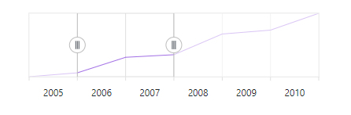
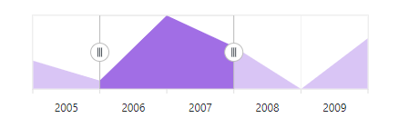
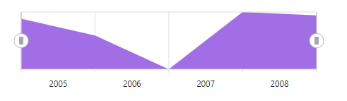
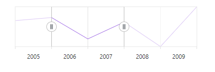
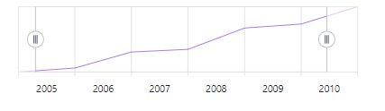

<!-- markdownlint-disable MD036 -->

# Working with Data in Blazor Range Selector Component

The Range Selector uses [SfDataManager](https://help.syncfusion.com/cr/blazor/Syncfusion.Blazor.Data.SfDataManager.html), supporting both RESTful JSON data services and IEnumerable binding. The [DataSource](https://help.syncfusion.com/cr/blazor/Syncfusion.Blazor.Charts.RangeNavigatorSeries.html#Syncfusion_Blazor_Charts_RangeNavigatorSeries_DataSource) can be set using either the [SfDataManager](https://help.syncfusion.com/cr/blazor/Syncfusion.Blazor.Data.SfDataManager.html) property or a list of business objects.

Supported data binding methods:
* List binding
* Remote data

## List Binding

To bind a list to the Range Selector, assign an IEnumerable object to the [DataSource](https://help.syncfusion.com/cr/blazor/Syncfusion.Blazor.Charts.RangeNavigatorSeries.html#Syncfusion_Blazor_Charts_RangeNavigatorSeries_DataSource) property. The data source can also be provided as an instance of [SfDataManager](https://help.syncfusion.com/cr/blazor/Syncfusion.Blazor.Data.SfDataManager.html) or by using the [SfDataManager](https://help.syncfusion.com/cr/blazor/Syncfusion.Blazor.Data.SfDataManager.html) component.

```cshtml

@using Syncfusion.Blazor.Charts

<SfRangeNavigator Value="@Value" ValueType="RangeValueType.DateTime" IntervalType="RangeIntervalType.Years">
    <RangeNavigatorSeriesCollection>
        <RangeNavigatorSeries DataSource="@StockInfo" XName="Date" Type="RangeNavigatorType.Line" YName="Close">
        </RangeNavigatorSeries>
    </RangeNavigatorSeriesCollection>
</SfRangeNavigator>

@code {
    public class StockDetails
    {
        public DateTime Date { get; set; }
        public double Close { get; set; }
    }

    public DateTime[] Value = new DateTime[] { new DateTime(2006, 01, 01), new DateTime(2008, 01, 01) };

    public List<StockDetails> StockInfo = new List<StockDetails>
    {
        new StockDetails { Date = new DateTime(2005, 01, 01), Close = 21 },
        new StockDetails { Date = new DateTime(2006, 01, 01), Close = 24 },
        new StockDetails { Date = new DateTime(2007, 01, 01), Close = 36 },
        new StockDetails { Date = new DateTime(2008, 01, 01), Close = 38 },
        new StockDetails { Date = new DateTime(2009, 01, 01), Close = 54 },
        new StockDetails { Date = new DateTime(2010, 01, 01), Close = 57 },
        new StockDetails { Date = new DateTime(2011, 01, 01), Close = 70 }
    };
}

```



N> By default, [SfDataManager](https://help.syncfusion.com/cr/blazor/Syncfusion.Blazor.Data.SfDataManager.html) uses **BlazorAdaptor** for list data binding.

### ExpandoObject Binding

Range Selector is a generic component strongly bound to a model type. When the model type is unknown at compile time, data can be bound as a list of **ExpandoObject**. Assign the **ExpandoObject** list to the [DataSource](https://help.syncfusion.com/cr/blazor/Syncfusion.Blazor.Charts.RangeNavigatorSeries.html#Syncfusion_Blazor_Charts_RangeNavigatorSeries_DataSource) property.

```cshtml

@using Syncfusion.Blazor.Charts
@using System.Dynamic

<SfRangeNavigator Value="@Value" ValueType="RangeValueType.DateTime">
    <RangeNavigatorSeriesCollection>
        <RangeNavigatorSeries DataSource="@StockInfo" XName="X" Type="RangeNavigatorType.Area" YName="Y">
        </RangeNavigatorSeries>
    </RangeNavigatorSeriesCollection>
</SfRangeNavigator>

@code {
    private List<DateTime> Dates = new List<DateTime> { new DateTime(2005, 01, 01), new DateTime(2006, 01, 01), 
        new DateTime(2007, 01, 01), new DateTime(2008, 01, 01), new DateTime(2009, 01, 01), new DateTime(2010, 01, 01), new DateTime(2011, 01, 01) };
    public DateTime[] Value = new DateTime[] { new DateTime(2006, 01, 01), new DateTime(2008, 01, 01) };

    public List<ExpandoObject> StockInfo { get; set; } = new List<ExpandoObject>();
    private Random randomNum = new Random();

    protected override void OnInitialized()
    {
        StockInfo = Enumerable.Range(0, 6).Select((x) =>
        {
            dynamic d = new ExpandoObject();
            d.X = Dates[x];
            d.Y = randomNum.Next(20, 70);
            return d;
        }).Cast<ExpandoObject>().ToList<ExpandoObject>();
    }   
}

```



### DynamicObject Binding

Range Selector supports **DynamicObject** as a data source when the model type is unknown. Assign the **DynamicObject** list to the [DataSource](https://help.syncfusion.com/cr/blazor/Syncfusion.Blazor.Charts.RangeNavigatorSeries.html#Syncfusion_Blazor_Charts_RangeNavigatorSeries_DataSource) property.

```cshtml

@using Syncfusion.Blazor.Charts
@using System.Dynamic

<SfRangeNavigator ValueType="RangeValueType.DateTime" Width="450">
    <RangeNavigatorSeriesCollection>
        <RangeNavigatorSeries DataSource="@MedalDetails" XName="X" Type="RangeNavigatorType.Area" YName="Y">
        </RangeNavigatorSeries>
    </RangeNavigatorSeriesCollection>
</SfRangeNavigator>

@code {
    private List<DateTime> Dates = new List<DateTime> { new DateTime(2005, 01, 01), new DateTime(2006, 01, 01), 
        new DateTime(2007, 01, 01), new DateTime(2008, 01, 01), new DateTime(2009, 01, 01), new DateTime(2010, 01, 01), new DateTime(2011, 01, 01) };
    public DateTime[] Value = new DateTime[] { new DateTime(2006, 01, 01), new DateTime(2008, 01, 01) };

    private Random randomNum = new Random();
    public List<DynamicDictionary> MedalDetails = new List<DynamicDictionary>() { };

    protected override void OnInitialized()
    {
        MedalDetails = Enumerable.Range(0, 5).Select((x) =>
        {
            dynamic d = new DynamicDictionary();
            d.X = Dates[x];
            d.Y = randomNum.Next(20, 80);
            return d;
        }).Cast<DynamicDictionary>().ToList<DynamicDictionary>();
    }

    public class DynamicDictionary : DynamicObject
    {
        Dictionary<string, object> dictionary = new Dictionary<string, object>();

        public override bool TryGetMember(GetMemberBinder binder, out object result)
        {
            string name = binder.Name;
            return dictionary.TryGetValue(name, out result);
        }

        public override bool TrySetMember(SetMemberBinder binder, object value)
        {
            dictionary[binder.Name] = value;
            return true;
        }

        public override System.Collections.Generic.IEnumerable<string> GetDynamicMemberNames()
        {
            return this.dictionary?.Keys;
        }
    }
}

```



## Remote Data

### Binding with OData Services

[OData](https://www.odata.org/documentation/odata-version-3-0/) is a standardized protocol for creating and consuming data. Retrieve data from an OData service using [SfDataManager](https://help.syncfusion.com/cr/blazor/Syncfusion.Blazor.Data.SfDataManager.html). The following example demonstrates remote data binding using an OData service.

```cshtml

@using Syncfusion.Blazor.Charts
@using Syncfusion.Blazor.Data

<SfRangeNavigator ValueType="RangeValueType.Double">    
    <RangeNavigatorSeriesCollection>
        <RangeNavigatorSeries XName="OrderID" Type="RangeNavigatorType.Line" YName="Freight">
            <SfDataManager Url="https://services.odata.org/V4/Northwind/Northwind.svc/Orders" Adaptor="Adaptors.ODataAdaptor"></SfDataManager>
        </RangeNavigatorSeries>
    </RangeNavigatorSeriesCollection>
</SfRangeNavigator>

```



### Binding with OData v4 Services

The [SfDataManager](https://help.syncfusion.com/cr/blazor/Syncfusion.Blazor.Data.SfDataManager.html) can retrieve and consume OData v4 services. For more information, see the [OData documentation](http://docs.oasis-open.org/odata/odata/v4.0/errata03/os/complete/part1-protocol/odata-v4.0-errata03-os-part1-protocol-complete.html#_Toc453752197). To bind an OData v4 service, use the **ODataV4Adaptor**.

```cshtml

@using Syncfusion.Blazor.Charts
@using Syncfusion.Blazor.Data

<SfRangeNavigator ValueType="RangeValueType.Double">    
    <RangeNavigatorSeriesCollection>
        <RangeNavigatorSeries XName="OrderID" Type="RangeNavigatorType.Line" YName="Freight">
            <SfDataManager Url="https://services.odata.org/V4/Northwind/Northwind.svc/Orders" Adaptor="Adaptors.ODataV4Adaptor"></SfDataManager>
        </RangeNavigatorSeries>
    </RangeNavigatorSeriesCollection>
</SfRangeNavigator>

```


### Web API

Use the [WebApiAdaptor](https://help.syncfusion.com/cr/blazor/Syncfusion.Blazor.Data.WebApiAdaptor.html) to bind a Range Selector to a Web API created with an [OData](https://www.odata.org/documentation/odata-version-3-0/) endpoint.

```cshtml

@using Syncfusion.Blazor.Data
@using Syncfusion.Blazor.Charts

<SfRangeNavigator ValueType="RangeValueType.Double">    
    <RangeNavigatorSeriesCollection>
        <RangeNavigatorSeries XName="OrderID" Type="RangeNavigatorType.Line" YName="Freight">
            <SfDataManager Url="https://services.odata.org/V4/Northwind/Northwind.svc/Orders" Adaptor="Adaptors.WebAPIAdaptor"></SfDataManager>
        </RangeNavigatorSeries>
    </RangeNavigatorSeriesCollection>
</SfRangeNavigator>

```


### Sending Additional Parameters to the Server

To send custom parameters in a data request, add them to the [Query](https://help.syncfusion.com/cr/blazor/Syncfusion.Blazor.Charts.RangeNavigatorSeries.html#Syncfusion_Blazor_Charts_RangeNavigatorSeries_Query) object and assign it to the Range Selector's `Query` property.

```cshtml

@using Syncfusion.Blazor.Data
@using Syncfusion.Blazor.Charts

<SfRangeNavigator ValueType="RangeValueType.Double">    
    <RangeNavigatorSeriesCollection>
        <RangeNavigatorSeries Query="@RNQuery" XName="OrderID" Type="RangeNavigatorType.Line" YName="Freight">
            <SfDataManager Url="https://services.odata.org/V4/Northwind/Northwind.svc/Orders" Adaptor="Adaptors.ODataV4Adaptor"></SfDataManager>
        </RangeNavigatorSeries>
    </RangeNavigatorSeriesCollection>
</SfRangeNavigator>

@code {
    public Query RNQuery { get; set; }

    protected override void OnInitialized()
    {
        RNQuery = new Query().Take(10).Where("Freight", "GreaterThan", 300, false);
    }
}

```


## Observable Collection

The [ObservableCollection](https://learn.microsoft.com/en-us/dotnet/api/system.collections.objectmodel.observablecollection-1?view=net-6.0) provides notifications when items are added, removed, or moved. The implemented [INotifyCollectionChanged](https://learn.microsoft.com/en-us/dotnet/api/system.collections.specialized.inotifycollectionchanged?view=net-6.0) notifies when dynamic changes occur in the collection.

```cshtml

@using Syncfusion.Blazor.Charts
@using System.Collections.ObjectModel;

<SfRangeNavigator Value="@Value" ValueType="RangeValueType.DateTime" IntervalType="RangeIntervalType.Years">
    <RangeNavigatorSeriesCollection>
        <RangeNavigatorSeries DataSource="@ChartPoints" XName="Date" Type="RangeNavigatorType.Line" YName="Close">
        </RangeNavigatorSeries>
    </RangeNavigatorSeriesCollection>
</SfRangeNavigator>

@code {
    public ObservableCollection<RangeData> ChartPoints { get; set; }

    public DateTime[] Value = new DateTime[] { new DateTime(2006, 01, 01), new DateTime(2008, 01, 01) };

    public class RangeData
    {
        public DateTime Date { get; set; }
        public double Close { get; set; }
        public static ObservableCollection<RangeData> GetData()
        {
            ObservableCollection<RangeData> ChartPoints = new ObservableCollection<RangeData>()
            {
                new RangeData { Date = new DateTime(2005, 01, 01), Close = 21 },
                new RangeData { Date = new DateTime(2006, 01, 01), Close = 24 },
                new RangeData { Date = new DateTime(2007, 01, 01), Close = 36 },
                new RangeData { Date = new DateTime(2008, 01, 01), Close = 38 },
                new RangeData { Date = new DateTime(2009, 01, 01), Close = 54 },
                new RangeData { Date = new DateTime(2010, 01, 01), Close = 57 },
                new RangeData { Date = new DateTime(2011, 01, 01), Close = 70 }
            };
            return ChartPoints;
        }
    }

    protected override void OnInitialized()
    {
        this.ChartPoints = RangeData.GetData();
    }
}

```



N> Refer to the [Blazor Range Selector](https://www.syncfusion.com/blazor-components/blazor-range-selector) feature tour page for feature highlights, and explore the [Blazor Range Selector Example](https://blazor.syncfusion.com/demos/range-selector/range-navigator?theme=fluent) to see various types and time-dependent data representations.
