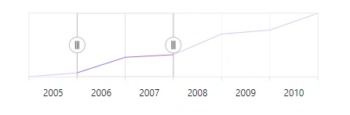
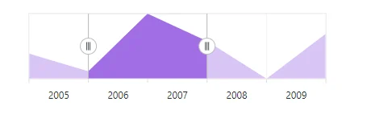
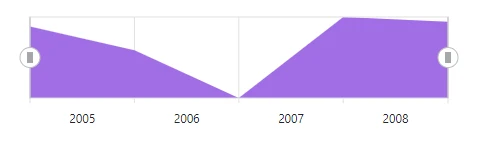
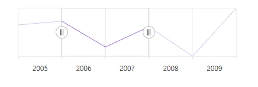
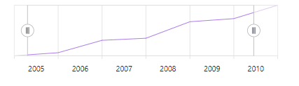

<!-- markdownlint-disable MD036 -->

# Blazor Range Selector Working with Data

The Range Selector uses [SfDataManager](https://help.syncfusion.com/cr/blazor/Syncfusion.Blazor.Data.SfDataManager.html), which supports both RESTful JSON data services binding and IEnumerable binding. The [DataSource](https://help.syncfusion.com/cr/blazor/Syncfusion.Blazor.Charts.RangeNavigatorSeries.html#Syncfusion_Blazor_Charts_RangeNavigatorSeries_DataSource) value can be set using either [SfDataManager](https://help.syncfusion.com/cr/blazor/Syncfusion.Blazor.Data.SfDataManager.html) property value or a list of business objects.

It supports the following data binding methods:
* List binding
* Remote data
* Observable collection

## List binding

For list binding, assign an `IEnumerable` object to the [DataSource](https://help.syncfusion.com/cr/blazor/Syncfusion.Blazor.Charts.RangeNavigatorSeries.html#Syncfusion_Blazor_Charts_RangeNavigatorSeries_DataSource) property of the series. The list data source can also be provided through the [SfDataManager](https://help.syncfusion.com/cr/blazor/Syncfusion.Blazor.Data.SfDataManager.html) component.

```cshtml

@using Syncfusion.Blazor.Charts

<SfRangeNavigator Value="@Value" ValueType="RangeValueType.DateTime" IntervalType="RangeIntervalType.Years">
    <RangeNavigatorSeriesCollection>
        <RangeNavigatorSeries DataSource="@StockInfo" XName="Date" Type="RangeNavigatorType.Line" YName="Close">
        </RangeNavigatorSeries>
    </RangeNavigatorSeriesCollection>
</SfRangeNavigator>

@code {

    public class StockDetails
    {
        public DateTime Date { get; set; }
        public double Close { get; set; }
    }

    public DateTime[] Value = new DateTime[] { new DateTime(2006, 01, 01), new DateTime(2008, 01, 01) };

    public List<StockDetails> StockInfo = new List<StockDetails>
    {
        new StockDetails { Date = new DateTime(2005, 01, 01), Close = 21 },
        new StockDetails { Date = new DateTime(2006, 01, 01), Close = 24 },
        new StockDetails { Date = new DateTime(2007, 01, 01), Close = 36 },
        new StockDetails { Date = new DateTime(2008, 01, 01), Close = 38 },
        new StockDetails { Date = new DateTime(2009, 01, 01), Close = 54 },
        new StockDetails { Date = new DateTime(2010, 01, 01), Close = 57 },
        new StockDetails { Date = new DateTime(2011, 01, 01), Close = 70 }
    };
}

```



N> By default, [SfDataManager](https://help.syncfusion.com/cr/blazor/Syncfusion.Blazor.Data.SfDataManager.html) uses **BlazorAdaptor** for list data-binding.

### ExpandoObject binding

The Range Selector is a generic component that is strongly bound to a model type. When the model type is not known at compile time, data can be bound to the Range Selector as a list of **ExpandoObject**. The **ExpandoObject** can be bound to Range Selector by assigning to the [DataSource](https://help.syncfusion.com/cr/blazor/Syncfusion.Blazor.Charts.RangeNavigatorSeries.html#Syncfusion_Blazor_Charts_RangeNavigatorSeries_DataSource) property.

```cshtml

@using Syncfusion.Blazor.Charts
@using System.Dynamic

<SfRangeNavigator Value="@Value" ValueType="RangeValueType.DateTime">
    <RangeNavigatorSeriesCollection>
        <RangeNavigatorSeries DataSource="@StockInfo" XName="X" Type="RangeNavigatorType.Area" YName="Y">
        </RangeNavigatorSeries>
    </RangeNavigatorSeriesCollection>
</SfRangeNavigator>

@code{
    private List<DateTime> Dates = new List<DateTime> { new DateTime(2005, 01, 01), new DateTime(2006, 01, 01), 
        new DateTime(2007, 01, 01), new DateTime(2008, 01, 01), new DateTime(2009, 01, 01), new DateTime(2010, 01, 01), new DateTime(2011, 01, 01) };
    public DateTime[] Value = new DateTime[] { new DateTime(2006, 01, 01), new DateTime(2008, 01, 01) };
    public List<ExpandoObject> StockInfo { get; set; } = new List<ExpandoObject>();
    private Random randomNum = new Random();
    protected override void OnInitialized()
    {
        StockInfo = Enumerable.Range(0, 6).Select((x) =>
        {
            dynamic d = new ExpandoObject();
            d.X = Dates[x];
            d.Y = randomNum.Next(20, 70);
            return d;
        }).Cast<ExpandoObject>().ToList<ExpandoObject>();
    }
        
}
```



### DynamicObject binding

The Range Selector supports a **DynamicObject** data source when the model type is unknown at compile time. The **DynamicObject** is bound to the Range Selector by assigning it to the [DataSource](https://help.syncfusion.com/cr/blazor/Syncfusion.Blazor.Charts.RangeNavigatorSeries.html#Syncfusion_Blazor_Charts_RangeNavigatorSeries_DataSource) property.

```cshtml

@using Syncfusion.Blazor.Charts
@using System.Dynamic

<SfRangeNavigator ValueType="RangeValueType.DateTime" Width="450">
    <RangeNavigatorSeriesCollection>
        <RangeNavigatorSeries DataSource="@MedalDetails" XName="X" Type="RangeNavigatorType.Area" YName="Y">
        </RangeNavigatorSeries>
    </RangeNavigatorSeriesCollection>
</SfRangeNavigator>


@code{
    
    private List<DateTime> Dates = new List<DateTime> { new DateTime(2005, 01, 01), new DateTime(2006, 01, 01), 
        new DateTime(2007, 01, 01), new DateTime(2008, 01, 01), new DateTime(2009, 01, 01), new DateTime(2010, 01, 01), new DateTime(2011, 01, 01) };
    public DateTime[] Value = new DateTime[] { new DateTime(2006, 01, 01), new DateTime(2008, 01, 01) };
    private Random randomNum = new Random();
    public List<DynamicDictionary> MedalDetails = new List<DynamicDictionary>() { };
    protected override void OnInitialized()
    {
        MedalDetails = Enumerable.Range(0, 5).Select((x) =>
        {
            dynamic d = new DynamicDictionary();
            d.X = Dates[x];
            d.Y = randomNum.Next(20, 80);
            return d;
        }).Cast<DynamicDictionary>().ToList<DynamicDictionary>();
    }
    public class DynamicDictionary : DynamicObject
    {
        Dictionary<string, object> dictionary = new Dictionary<string, object>();

        public override bool TryGetMember(GetMemberBinder binder, out object result)
        {
            string name = binder.Name;
            return dictionary.TryGetValue(name, out result);
        }
        public override bool TrySetMember(SetMemberBinder binder, object value)
        {
            dictionary[binder.Name] = value;
            return true;
        }

        public override System.Collections.Generic.IEnumerable<string> GetDynamicMemberNames()
        {
            return this.dictionary?.Keys;
        }
    }

}

```



## Remote data

### Binding with OData services

[OData](https://www.odata.org/documentation/odata-version-3-0/) is a standardized protocol for creating and consuming data. You can retrieve data from an OData service using the [SfDataManager](https://help.syncfusion.com/cr/blazor/Syncfusion.Blazor.Data.SfDataManager.html) with the [ODataAdaptor](https://help.syncfusion.com/cr/blazor/Syncfusion.Blazor.Data.ODataAdaptor.html). Refer to the following code example for remote data binding using an OData service.

```cshtml

@using Syncfusion.Blazor.Charts
@using Syncfusion.Blazor.Data
@using Syncfusion.Blazor

<SfRangeNavigator ValueType="RangeValueType.Double">    
    <RangeNavigatorSeriesCollection>
        <RangeNavigatorSeries XName="OrderID" Type="RangeNavigatorType.Line" YName="Freight">
            <SfDataManager Url="https://services.odata.org/V4/Northwind/Northwind.svc/Orders" Adaptor="Adaptors.ODataAdaptor"></SfDataManager>
        </RangeNavigatorSeries>
    </RangeNavigatorSeriesCollection>
</SfRangeNavigator>

```



### Binding with OData v4 services

The [SfDataManager](https://help.syncfusion.com/cr/blazor/Syncfusion.Blazor.Data.SfDataManager.html) can retrieve and consume OData v4 services, which are an upgraded version of the OData protocol. Refer to the [OData documentation](https://docs.oasis-open.org/odata/odata/v4.0/errata03/os/complete/part1-protocol/odata-v4.0-errata03-os-part1-protocol-complete.html) for additional information on OData v4 services. To bind an OData v4 service, use the [ODataV4Adaptor](https://help.syncfusion.com/cr/blazor/Syncfusion.Blazor.Data.ODataV4Adaptor.html).

```cshtml

@using Syncfusion.Blazor.Charts
@using Syncfusion.Blazor.Data

<SfRangeNavigator ValueType="RangeValueType.Double">    
    <RangeNavigatorSeriesCollection>
        <RangeNavigatorSeries XName="OrderID" Type="RangeNavigatorType.Line" YName="Freight">
            <SfDataManager Url="https://services.odata.org/V4/Northwind/Northwind.svc/Orders" Adaptor="Adaptors.ODataV4Adaptor"></SfDataManager>
        </RangeNavigatorSeries>
    </RangeNavigatorSeriesCollection>
</SfRangeNavigator>

```


### Web API

The [WebApiAdaptor](https://help.syncfusion.com/cr/blazor/Syncfusion.Blazor.Data.WebApiAdaptor.html) can be used to bind the Range Selector to a Web API service that follows OData query conventions.

```cshtml
@using Syncfusion.Blazor.Data
@using Syncfusion.Blazor.Charts
@using Syncfusion.Blazor

<SfRangeNavigator ValueType="RangeValueType.Double">    
    <RangeNavigatorSeriesCollection>
        <RangeNavigatorSeries XName="OrderID" Type="RangeNavigatorType.Line" YName="Freight">
            <SfDataManager Url="https://services.odata.org/V4/Northwind/Northwind.svc/Orders" Adaptor="Adaptors.WebAPIAdaptor"></SfDataManager>
        </RangeNavigatorSeries>
    </RangeNavigatorSeriesCollection>
</SfRangeNavigator>

```


### Sending additional parameters to the server

To create a data request with a custom parameter, build a [Query](https://help.syncfusion.com/cr/blazor/Syncfusion.Blazor.Data.Query.html) object with the required parameters and assign it to the [Query](https://help.syncfusion.com/cr/blazor/Syncfusion.Blazor.Charts.RangeNavigatorSeries.html#Syncfusion_Blazor_Charts_RangeNavigatorSeries_Query) property of the series.

The following sample code shows how to send parameters using the `Query` property of the series.

```cshtml
@using Syncfusion.Blazor.Data
@using Syncfusion.Blazor.Charts
@using Syncfusion.Blazor

<SfRangeNavigator ValueType="RangeValueType.Double">    
    <RangeNavigatorSeriesCollection>
        <RangeNavigatorSeries Query="@RNQuery" XName="OrderID" Type="RangeNavigatorType.Line" YName="Freight">
            <SfDataManager Url="https://services.odata.org/V4/Northwind/Northwind.svc/Orders" Adaptor="Adaptors.ODataV4Adaptor"></SfDataManager>
        </RangeNavigatorSeries>
    </RangeNavigatorSeriesCollection>
</SfRangeNavigator>

@code {
    public Query RNQuery { get; set; }

    protected override void OnInitialized()
    {
        RNQuery = new Query().Take(10).Where("Freight", "GreaterThan", 300, false);
    }

}
```


## Observable collection

The [ObservableCollection](https://learn.microsoft.com/en-us/dotnet/api/system.collections.objectmodel.observablecollection-1) (dynamic data collection) provides notifications when items are added, removed, or moved. Its [INotifyCollectionChanged](https://learn.microsoft.com/en-us/dotnet/api/system.collections.specialized.inotifycollectionchanged) implementation notifies the Range Selector whenever items are added, removed, moved, or the collection is cleared, so the component re-renders automatically.

```cshtml

@using Syncfusion.Blazor.Charts
@using System.Collections.ObjectModel;

<SfRangeNavigator Value="@Value" ValueType="RangeValueType.DateTime" IntervalType="RangeIntervalType.Years">
    <RangeNavigatorSeriesCollection>
        <RangeNavigatorSeries DataSource="@ChartPoints" XName="Date" Type="RangeNavigatorType.Line" YName="Close">
        </RangeNavigatorSeries>
    </RangeNavigatorSeriesCollection>
</SfRangeNavigator>

@code {
    public ObservableCollection<RangeData> ChartPoints { get; set; }

    public DateTime[] Value = new DateTime[] { new DateTime(2006, 01, 01), new DateTime(2008, 01, 01) };

    public class RangeData
    {
        public DateTime Date { get; set; }
        public double Close { get; set; }
        public static ObservableCollection<RangeData> GetData()
        {
            ObservableCollection<RangeData> ChartPoints = new ObservableCollection<RangeData>()
            {
                new RangeData { Date = new DateTime(2005, 01, 01), Close = 21 },
                new RangeData { Date = new DateTime(2006, 01, 01), Close = 24 },
                new RangeData { Date = new DateTime(2007, 01, 01), Close = 36 },
                new RangeData { Date = new DateTime(2008, 01, 01), Close = 38 },
                new RangeData { Date = new DateTime(2009, 01, 01), Close = 54 },
                new RangeData { Date = new DateTime(2010, 01, 01), Close = 57 },
                new RangeData { Date = new DateTime(2011, 01, 01), Close = 70 }
            };
            return ChartPoints;
        }
    }

    protected override void OnInitialized()
    {
        this.ChartPoints = RangeData.GetData();
    }
}
```



## See also

* [Type of Data](./data)
* [Series Type](./series-type)

N> Refer to our [Blazor Range Selector](https://www.syncfusion.com/blazor-components/blazor-range-selector) feature tour page for its groundbreaking feature representations and also explore our [Blazor Range Selector Example](https://blazor.syncfusion.com/demos/range-selector/range-navigator?theme=fluent2) to know various Range Selector types and how to represent time-dependent data, showing trends at equal intervals.