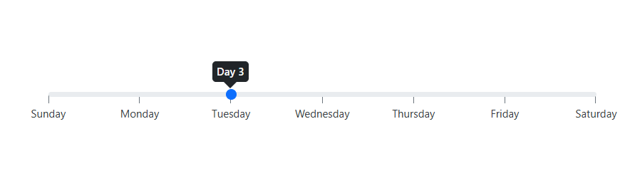

# Formatting in Blazor Range Slider Component

The [`Format`](https://help.syncfusion.com/cr/blazor/Syncfusion.Blazor.Inputs.SliderTicks.html#Syncfusion_Blazor_Inputs_SliderTicks_Format) feature is used to customize the units and appearance of slider values. Formatted values are also applied to the ARIA attributes of the slider to ensure accessible output. There are two ways to apply formatting in the slider.

* Use the `Format` API of the slider, which leverages the built-in internationalization and .NET standard format strings.
* Customize formatting using the [`TicksRendering`](https://help.syncfusion.com/cr/blazor/Syncfusion.Blazor.Inputs.SliderEvents-1.html#Syncfusion_Blazor_Inputs_SliderEvents_1_TicksRendering) and [`OnTooltipChange`](https://help.syncfusion.com/cr/blazor/Syncfusion.Blazor.Inputs.SliderEvents-1.html#Syncfusion_Blazor_Inputs_SliderEvents_1_OnTooltipChange) events.

```cshtml
@using Syncfusion.Blazor.Inputs

<SfSlider @bind-Value="@CurrencyValue">
    <SliderTooltip IsVisible="true" ShowOn="TooltipShowOn.Always" Format="C2" Placement="TooltipPlacement.Before"></SliderTooltip>
    <SliderTicks Placement="Placement.Before" Format="C2" ShowSmallTicks="true" LargeStep="20" SmallStep="10"></SliderTicks>
</SfSlider>

@code {
    int CurrencyValue = 30;
}
```


## Using format API

Slider provides predefined formatting styles such as Numeric (`N`), Percentage (`P`), Currency (`C`), and custom numeric format strings (for example, `#`). These formats are culture-aware and use the application’s current culture for symbols and separators.

```cshtml
@using Syncfusion.Blazor.Inputs

<SfSlider Min="1" Max="10" @bind-Value="@PercentageValue">
    <SliderTicks Placement="Placement.After" Format="P0" ShowSmallTicks="true" LargeStep="2" SmallStep="1"></SliderTicks>
    <SliderTooltip IsVisible="true" ShowOn="TooltipShowOn.Always" Format="P0" Placement="TooltipPlacement.Before"></SliderTooltip>
</SfSlider>

@code {
    int PercentageValue = 3;
}

```


## Using Events

For custom scenarios, use event handlers like [`TicksRendering`](https://help.syncfusion.com/cr/blazor/Syncfusion.Blazor.Inputs.SliderEvents-1.html#Syncfusion_Blazor_Inputs_SliderEvents_1_TicksRendering) and [`OnTooltipChange`](https://help.syncfusion.com/cr/blazor/Syncfusion.Blazor.Inputs.SliderEvents-1.html#Syncfusion_Blazor_Inputs_SliderEvents_1_OnTooltipChange). The following example formats tick labels as weekday names and tooltips as day numbers.

```cshtml
@using Syncfusion.Blazor.Inputs

<SfSlider id='default' Min="0" Max="6" @bind-Value="@Value">
    <SliderEvents TValue="int" OnTooltipChange="@TooltipChange" TicksRendering="@TickesRendering"></SliderEvents>
    <SliderTicks Placement="Placement.After" LargeStep="1"></SliderTicks>
    <SliderTooltip Placement="TooltipPlacement.Before" IsVisible="true"></SliderTooltip>
</SfSlider>

@code{

    private int Value = 2;

    public void TickesRendering(SliderTickEventArgs args)
    {
        string[] daysArr = { "Sunday", "Monday", "Tuesday", "Wednesday", "Thursday", "Friday", "Saturday" };

        args.Text = daysArr[int.Parse(args.Value.ToString())];
    }

    public void TooltipChange(SliderTooltipEventArgs<int> args)
    {
        args.Text = "Day " + (args.Value + 1).ToString();
    }
}

```

