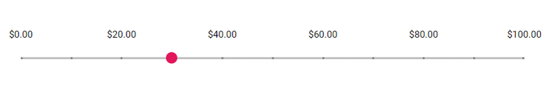
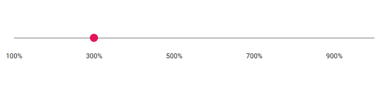

# Formatting

The `Format` feature used to customize the units of Slider values to desired format. The formatted values will also be applied to the ARIA attributes of the slider. There are two ways of achieving formatting in slider.

>Use the `Format` API of slider which utilizes our Internationalization to format values.

```csharp
@using Syncfusion.Blazor.Inputs

<SfSlider @bind-Value="@CurrencyValue">
    <SliderTooltip IsVisible="true" ShowOn="TooltipShowOn.Always" Format="C2" Placement="TooltipPlacement.Before"></SliderTooltip>
    <SliderTicks Placement="Placement.Before" Format="C2" ShowSmallTicks="true" LargeStep="20" SmallStep="10"></SliderTicks>
</SfSlider>

@code {
    int CurrencyValue = 30;
}
```



## Using format API

Slider provides different predefined formatting styles like Numeric (N), Percentage (P), Currency (C) and # specifiers. In this below example we have formatted the ticks and tooltip values into percentage.

```csharp
@using Syncfusion.Blazor.Inputs

<SfSlider Min="1" Max="10" @bind-Value="@PercentageValue">
    <SliderTicks Placement="Placement.After" Format="P0" ShowSmallTicks="true" LargeStep="2" SmallStep="1"></SliderTicks>
    <SliderTooltip IsVisible="true" ShowOn="TooltipShowOn.Always" Format="P0" Placement="TooltipPlacement.Before"></SliderTooltip>
</SfSlider>

@code {
    int PercentageValue = 3;
}

```


