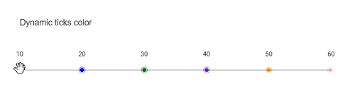

# Customize the tick label in Blazor Range Slider Component

The slider’s tick appearance can be customized with CSS. By overriding the slider’s CSS classes, the tick marks (icons) and their styles can be tailored. Ticks help users identify current values on the slider. Tick generation is controlled by the [`SmallStep`](https://help.syncfusion.com/cr/blazor/Syncfusion.Blazor.Inputs.SliderTicks.html#Syncfusion_Blazor_Inputs_SliderTicks_SmallStep) and [`LargeStep`](https://help.syncfusion.com/cr/blazor/Syncfusion.Blazor.Inputs.SliderTicks.html#Syncfusion_Blazor_Inputs_SliderTicks_LargeStep) settings. By default, the slider uses the `e-tick` class for ticks. The example below appends a custom class during the `TicksRendering` event and injects a glyph via CSS to render custom tick icons.

```css
.e-scale .e-tick.e-custom::before {
    content: '\e967';
    position: absolute;
}

```

In this example, individual tick colors are applied using the `:nth-child(child_number)` selector to target each tick element.

```css
#ticks_slider .e-scale :nth-child(1)::before {
    color: red;
}

```

```cshtml

@using Syncfusion.Blazor.Inputs

<div id="app">
    <div id="container">
        <div class="col-lg-12 control-section">
            <div class="slider-content-wrapper">
                <div class="slider_container" id="slider_wrapper">
                    <div class="slider_labelText userselect">Dynamic ticks color</div>
                    <!-- Ticks slider element -->
                    <SfSlider ID="ticks_slider" Enabled="true" Min="10" Max="60" Step="10" Type=SliderType.Default @bind-Value="@value">
                        <SliderTicks Placement="Placement.Before"
                                         ShowSmallTicks="true"
                                         LargeStep="10"
                                         SmallStep="10"></SliderTicks>
                        <SliderEvents TicksRendering="@TicksRendering" TValue="int"></SliderEvents>
                    </SfSlider>
                </div>
            </div>
        </div>
    </div>
</div>

@code {
    int value = 50;
    public void TicksRendering(SliderTickEventArgs args)
    {
       args.HtmlAttributes["class"] = args.HtmlAttributes["class"] + " e-custom";
    }
}

<style>
    #app {
        height: 40px;
        position: absolute;
        width: 50%;
    }

    .slider-content_wrapper {
        width: 40%;
        margin: 0 auto;
        min-width: 185px;
    }
    
    .userselect {
        -webkit-user-select: none;
        /* Safari 3.1+ */
        -moz-user-select: none;
        /* Firefox 2+ */
        -ms-user-select: none;
        /* IE 10+ */
        user-select: none;
        /* Standard syntax */
    }
    
    .slider_labelText {
        text-align: -webkit-left;
        font-weight: 500;
        font-size: 13px;
        padding-bottom: 40px;
    }
    
    .slider_container {
        margin-top: 40px;
    }
    
    #ticks_slider.e-control.e-slider .e-range {
        z-index: unset;
    }
    
    #ticks_slider .e-scale .e-tick {
        background-image: none;
        visibility: visible;
        font-family: 'e-customized-icons';
    }
    
    #ticks_slider .e-scale {
        z-index: 0 !important;
    }
    
    #ticks_slider .e-scale .e-tick.e-custom::before {
        font-size: 14px;
        content: '\e967';
        position: absolute;
    }
    
    #ticks_slider .e-scale ::before {
        left: calc(50% - 6px);
        top: 3px;
    }
    
    #ticks_slider .e-scale :nth-child(1)::before {
        left: calc(0% - 6px);
    }
    
    #ticks_slider .e-scale :nth-child(6)::before {
        left: calc(100% - 6px);
    }
    
    #ticks_slider .e-scale :nth-child(1)::before {
        color: red;
    }

    #ticks_slider .e-scale :nth-child(2)::before {
        color: blue;
    }
    
    #ticks_slider .e-scale :nth-child(3)::before {
        color: green;
    }
    
    #ticks_slider .e-scale :nth-child(4)::before {
        color: blueviolet;
    }
    
    #ticks_slider .e-scale :nth-child(5)::before {
        color: orange;
    }
    
    #ticks_slider .e-scale :nth-child(6)::before {
        color: pink;
    }
    
    #slider+.e-scale .e-tick.e-first-tick :nth-child(2) {
        margin-left: -20px;
    }
    
    @font-face {
        font-family: 'e-customized-icons';
        src: url(data:application/x-font-ttf;charset=utf-8;base64,AAEAAAAKAIAAAwAgT1MvMj8iS4cAAAEoAAAAVmNtYXDS5tJrAAABjAAAAEBnbHlmdMAKbQAAAdQAAAOwaGVhZBNseyYAAADQAAAANmhoZWEHogNjAAAArAAAACRobXR4C9AAAAAAAYAAAAAMbG9jYQCaAdgAAAHMAAAACG1heHABEAEuAAABCAAAACBuYW1lc0cOBgAABYQAAAIlcG9zdNSlKbQAAAesAAAARwABAAADUv9qAFoEAAAA//UD8wABAAAAAAAAAAAAAAAAAAAAAwABAAAAAQAAtxzLE18PPPUACwPoAAAAANgtmycAAAAA2C2bJwAAAAAD8wPzAAAACAACAAAAAAAAAAEAAAADASIAAwAAAAAAAgAAAAoACgAAAP8AAAAAAAAAAQPwAZAABQAAAnoCvAAAAIwCegK8AAAB4AAxAQIAAAIABQMAAAAAAAAAAAAAAAAAAAAAAAAAAAAAUGZFZABA6QLpZwNS/2oAWgPzAJYAAAABAAAAAAAABAAAAAPoAAAD6AAAAAAAAgAAAAMAAAAUAAMAAQAAABQABAAsAAAABgAEAAEAAukC6Wf//wAA6QLpZ///AAAAAAABAAYABgAAAAEAAgAAAAAAmgHYAAIAAAAAA+oD6gAzAIcAAAEzHxghNT8WEx8THQEPEisBLxI9AT8SAgAQECQmKCgpKScTEhIREA8ODQwKCgQHBQQBAfwqAQMFBgcKCgwNDg8QERISEycpKSgoJiQgDQwMDAwXFhUUEhEPDQsJCAIDAQEBAQMCCAkLDQ8REhQVFhcMDAwMDQ0MDAwMFxYVFBIRDw0LCQgCAwEBAQEDAggJCw0PERIUFRYXDAwMDAGFAQMEBwkKDQ4ICAkKCgoLCwwMDAcNDg8Og3sPDw4NDgwMDAsLCgoKCQgIDg0KCQcEAwJnAQEBAgMHCgsNDxESExUWFwwMDQwNDA0MDAwXFhUTExAPDQwJBwMCAgEBAgIDBwkMDQ8QExMVFhcMDAwNDA0MDQwMFxYVExIRDw0LCgcDAgEBAAAAAwAAAAAD8wPzAF8AwAEhAAABDxMfFz8XLxcPAjcfFA8XLxc/Fx8CJw8UHxc/Fy8XDwIBqRQUFBISERAQDg0NCwoJBwcFBAIBAQIEBQcHCQoLDQ0OEBAREhIUFBQVFhYWFhYWFRUTFBISERAQDg0NCwoJBwcFBAIBAQIEBQcHCQoLDQ0OEBAREhIUExUVFhYWFhYWtg4NGxkZGBYWFRMSEA8OCwsIBwUDAQEDBQcICwsODxASExUWFhgZGRsbHB0dHh4dHRwbGxkZGBYWFRMSEA8NDAsIBwUDAQEDBQcICwsODxASExUVFxgZGRsbHB0dHh4dHd0QDx4eHBsaGRcWFRIREA0MCQgGAwEBAwYICQwNEBESFRYXGRobHB4eHyEgIiIiIiAhHx4eHBsaGRcWFRIREA0MCQgGAwEBAwYICQwNEBESFRYXGRobHB4eHyEgIiIiIiEDPAYICQoLDQ0OEBAREhITFBUVFRYXFhYWFRQUFBISERAQDg0MDAoJBwcFBAIBAQIEBQcHCQoMDA0OEBAREhIUFBQVFhYWFxYVFRUUExISERAQDg0NCwoJCAYFBAIBAQIEZAQECgwODxASExUVFxgYGhsbHB0dHh4dHRwbGxkZGBYWFBQSEA8NDAoJBwUDAQEDBQcICwsODxASExUWFhgZGRsbHB0dHh4dHRwbGxoYGBcVFRMSEA8OCwsIBwUDAQEDBTYFBQwNEBESFRYXGRobHB0fHyEgIiIiIiEgHx4eHBsaGRcWFBMRDw4MCQgGAwEBAwYICQwODxETFBYXGRobHB4eHyEgIiIiIiAhHx4eHBsaGRcWFRIRDw4MCQgGAwEBAwYAAAAAAAASAN4AAQAAAAAAAAABAAAAAQAAAAAAAQAHAAEAAQAAAAAAAgAHAAgAAQAAAAAAAwAHAA8AAQAAAAAABAAHABYAAQAAAAAABQALAB0AAQAAAAAABgAHACgAAQAAAAAACgAsAC8AAQAAAAAACwASAFsAAwABBAkAAAACAG0AAwABBAkAAQAOAG8AAwABBAkAAgAOAH0AAwABBAkAAwAOAIsAAwABBAkABAAOAJkAAwABBAkABQAWAKcAAwABBAkABgAOAL0AAwABBAkACgBYAMsAAwABBAkACwAkASMgZS1pY29uc1JlZ3VsYXJlLWljb25zZS1pY29uc1ZlcnNpb24gMS4wZS1pY29uc0ZvbnQgZ2VuZXJhdGVkIHVzaW5nIFN5bmNmdXNpb24gTWV0cm8gU3R1ZGlvd3d3LnN5bmNmdXNpb24uY29tACAAZQAtAGkAYwBvAG4AcwBSAGUAZwB1AGwAYQByAGUALQBpAGMAbwBuAHMAZQAtAGkAYwBvAG4AcwBWAGUAcgBzAGkAbwBuACAAMQAuADAAZQAtAGkAYwBvAG4AcwBGAG8AbgB0ACAAZwBlAG4AZQByAGEAdABlAGQAIAB1AHMAaQBuAGcAIABTAHkAbgBjAGYAdQBzAGkAbwBuACAATQBlAHQAcgBvACAAUwB0AHUAZABpAG8AdwB3AHcALgBzAHkAbgBjAGYAdQBzAGkAbwBuAC4AYwBvAG0AAAAAAgAAAAAAAAAKAAAAAAAAAAAAAAAAAAAAAAAAAAAAAAADAQIBAwEEAAh0ZW1wLWN1cxJGQl9DaGVja2JveF9zZWxlY3QAAAA=) format('truetype');
        font-weight: normal;
        font-style: normal;
    }
</style>
```

