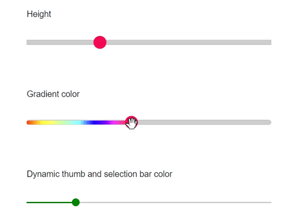
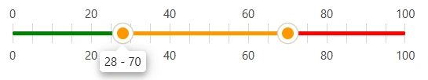

# How to customize the bar in Blazor Range Slider

The slider’s appearance can be customized with CSS. By overriding the slider CSS classes, the slider bar can be styled to match application design requirements. The slider bar supports theme-based styling and can be further customized. By default, the slider uses the `e-slider-track` class for the track. The selected portion (between the handles) uses the `e-range` class. Override either or both classes with custom color values, as shown in the three scenarios below.

## Customizing the track height

The simplest way to customize the bar is to change the track height. The following example renders a thicker 8-pixel track with no border radius.

```cshtml
@using Syncfusion.Blazor.Inputs

<div class="slider_container">
    <div class="slider-labeltext slider_userselect">Height</div>
    <SfSlider TValue="int" Value="30" ID="height_slider"></SfSlider>
</div>

<style>
    #height_slider.e-control.e-slider .e-slider-track {
        height: 8px;
        top: calc(50% - 4px);
        border-radius: 0;
    }
</style>
```

## Customizing the bar with a gradient

Apply a CSS gradient to the selected range to create a multi-color effect. The rule below sets the selected range to a 6-pixel-tall gradient bar; the underlying track is rendered 8 pixels tall to provide a visible border.

```cshtml
@using Syncfusion.Blazor.Inputs

<div class="slider_container">
    <div class="slider-labeltext slider_userselect">Gradient color</div>
    <SfSlider TValue="int" Value="50" ID="gradient_slider" Type="SliderType.MinRange"></SfSlider>
</div>

<style>
#gradient_slider.e-control.e-slider .e-range {
    height: 6px;
    top: calc(50% - 3px);
    border-radius: 5px;
    background: -webkit-linear-gradient(left, #e1451d 0, #fdff47 17%, #86f9fe 50%, #2900f8 65%, #6e00f8 74%, #e33df9 83%, #e14423 100%);
    background: linear-gradient(left, #e1451d 0, #fdff47 17%, #86f9fe 50%, #2900f8 65%, #6e00f8 74%, #e33df9 83%, #e14423 100%);
    background: -moz-linear-gradient(left, #e1451d 0, #fdff47 17%, #86f9fe 50%, #2900f8 65%, #6e00f8 74%, #e33df9 83%, #e14423 100%);
    background: url(data:image/svg+xml;base64,PD94bWwgdmVyc2lvbj0iMS4wIiA/Pgo8c3ZnIHhtbG5zPSJodHRwOi8vd3d3LnczLm9yZy8yMDAwL3N2ZyIgd2lkdGg9IjEwMCUiIGhlaWdodD0iMTAwJSIgdmlld0JveD0iMCAwIDEgMSIgcHJlc2VydmVBc3BlY3RSYXRpbz0ibm9uZSI+CiAgPGxpbmVhckdyYWRpZW50IGlkPSJncmFkLXVjZ2ctZ2VuZXJhdGVkIiBncmFkaWVudFVuaXRzPSJ1c2VyU3BhY2VPblVzZSIgeDE9IjAlIiB5MT0iMCUiIHgyPSIxMDAlIiB5Mj0iMCUiPgogICAgPHN0b3Agb2Zmc2V0PSIwIiBzdG9wLWNvbG9yPSIjZTE0NTFkIiBzdG9wLW9wYWNpdHk9IjEiLz4KICAgIDxzdG9wIG9mZnNldD0iMTclIiBzdG9wLWNvbG9yPSIjZmRmZjQ3IiBzdG9wLW9wYWNpdHk9IjEiLz4KICAgIDxzdG9wIG9mZnNldD0iNTAlIiBzdG9wLWNvbG9yPSIjODZmOWZlIiBzdG9wLW9wYWNpdHk9IjEiLz4KICAgIDxzdG9wIG9mZnNldD0iNjUlIiBzdG9wLWNvbG9yPSIjMjkwMGY4IiBzdG9wLW9wYWNpdHk9IjEiLz4KICAgIDxzdG9wIG9mZnNldD0iNzQlIiBzdG9wLWNvbG9yPSIjNmUwMGY4IiBzdG9wLW9wYWNpdHk9IjEiLz4KICAgIDxzdG9wIG9mZnNldD0iODMlIiBzdG9wLWNvbG9yPSIjZTMzZGY5IiBzdG9wLW9wYWNpdHk9IjEiLz4KICAgIDxzdG9wIG9mZnNldD0iMTAwJSIgc3RvcC1jb2xvcj0iI2UxNDQyMyIgc3RvcC1vcGFjaXR5PSIxIi8+CiAgPC9saW5lYXJHcmFkaWVudD4KICA8cmVjdCB4PSIwIiB5PSIwIiB3aWR0aD0iMSIgaGVpZ2h0PSIxIiBmaWxsPSJ1cmwoI2dyYWQtdWNnZy1nZW5lcmF0ZWQpIiAvPgo8L3N2Zz4=);
}
</style>
```

## Customizing the bar with dynamic colors

Bind the [`CssClass`](https://help.syncfusion.com/cr/blazor/Syncfusion.Blazor.Inputs.SfSlider-1.html#Syncfusion_Blazor_Inputs_SfSlider_1_CssClass) parameter to a variable and update it from the [`ValueChange`](https://help.syncfusion.com/cr/blazor/Syncfusion.Blazor.Inputs.SliderEvents-1.html#Syncfusion_Blazor_Inputs_SliderEvents_1_ValueChange) event to change the range and handle color based on the current value. The `else` branch below ensures the initial value of `0` still gets a color.

```cshtml
@using Syncfusion.Blazor.Inputs

<div class="slider_container">
    <div class="slider-labeltext slider_userselect">Dynamic thumb and selection bar color</div>
    <SfSlider TValue="int" @bind-Value="@Value" ID="dynamic_color_slider" Type="SliderType.MinRange" CssClass="@DynamicColor">
        <SliderEvents TValue="int" ValueChange="@(e => { OnChange(e.Value); })"></SliderEvents>
    </SfSlider>
</div>
@code {
    string DynamicColor = "e-slider-green";
    int Value = 20;
    void OnChange(int value)
    {
        if (value <= 25)
        {
            DynamicColor = "e-slider-green";
        }
        else if (value <= 50)
        {
            DynamicColor = "e-slider-royalblue";
        }
        else if (value <= 75)
        {
            DynamicColor = "e-slider-darkorange";
        }
        else
        {
            DynamicColor = "e-slider-red";
        }
    }
}
```

## Complete example with all three scenarios

The following sample combines the height, gradient, and dynamic-color scenarios in a single page so you can compare them side by side.

```cshtml
@using Syncfusion.Blazor.Inputs;

<div class="col-lg-12 control-section">
    <div class="control-wrapper">
        <div class="slider-content-wrapper">
            <div class="slider_container">
                <div class="slider-labeltext slider_userselect">Height</div>
                <SfSlider TValue="int" Value="30" ID="height_slider">
                </SfSlider>
            </div>
            <div class="slider_container">
                <div class="slider-labeltext slider_userselect">Gradient color</div>
                <SfSlider TValue="int" Value="50" ID="gradient_slider" Type="SliderType.MinRange">
                </SfSlider>
            </div>
            <div class="slider_container">
                <div class="slider-labeltext slider_userselect">Dynamic thumb and selection bar color</div>
                <SfSlider TValue="int" @bind-Value="@Value" ID="dynamic_color_slider" Type="SliderType.MinRange" CssClass="@DynamicColor">
                    <SliderEvents TValue="int" ValueChange="@(e => { OnChange(e.Value); })"></SliderEvents>
                </SfSlider>
            </div>
        </div>
    </div>
</div>
@code {
    string DynamicColor = "e-slider-green";
    int Value = 20;
    void OnChange(int value)
    {
        if (value <= 25)
        {
            DynamicColor = "e-slider-green";
        }
        else if (value <= 50)
        {
            DynamicColor = "e-slider-royalblue";
        }
        else if (value <= 75)
        {
            DynamicColor = "e-slider-darkorange";
        }
        else
        {
            DynamicColor = "e-slider-red";
        }
    }
}
<style>
    #dynamic_color_slider.e-slider-royalblue .e-range {
        background-color: royalblue;
    }

    #dynamic_color_slider.e-slider-green .e-range {
        background-color: green;
    }

    #dynamic_color_slider.e-slider-darkorange .e-range {
        background-color: darkorange;
    }

    #dynamic_color_slider.e-slider-red .e-range {
        background-color: red;
    }

    #dynamic_color_slider.e-slider-royalblue .e-handle {
        background-color: royalblue;
    }

    #dynamic_color_slider.e-slider-green .e-handle {
        background-color: green;
    }

    #dynamic_color_slider.e-slider-darkorange .e-handle {
        background-color: darkorange;
    }

    #dynamic_color_slider.e-slider-red .e-handle {
        background-color: red;
    }

    .slider-content-wrapper {
        width: 40%;
        margin: 0 auto;
        min-width: 185px;
    }

    .slider-userselect {
        -webkit-user-select: none;
        /* Safari 3.1+ */
        -moz-user-select: none;
        /* Firefox 2+ */
        -ms-user-select: none;
        /* IE 10+ */
        user-select: none;
        /* Standard syntax */
    }

    .slider-labeltext {
        text-align: -webkit-left;
        font-weight: 500;
        font-size: 13px;
        padding-bottom: 10px;
    }

    .e-slider-container #height_slider.e-slider .e-handle,
    .e-slider-container #gradient_slider.e-slider .e-handle {
        height: 20px;
        width: 20px;
    }

    .e-slider-container.e-horizontal #height_slider .e-handle,
    .e-slider-container.e-horizontal #gradient_slider .e-handle {
        margin-left: -10px;
        top: calc(50% - 10px);
    }

    .slider_container {
        margin-top: 40px;
    }

    #height_slider.e-control.e-slider .e-slider-track {
        height: 8px;
        top: calc(50% - 4px);
        border-radius: 0;
    }


    #gradient_slider.e-control.e-slider .e-range {
        height: 6px;
        top: calc(50% - 3px);
        border-radius: 5px;
        background: -webkit-linear-gradient(left, #e1451d 0, #fdff47 17%, #86f9fe 50%, #2900f8 65%, #6e00f8 74%, #e33df9 83%, #e14423 100%);
        background: linear-gradient(left, #e1451d 0, #fdff47 17%, #86f9fe 50%, #2900f8 65%, #6e00f8 74%, #e33df9 83%, #e14423 100%);
        background: -moz-linear-gradient(left, #e1451d 0, #fdff47 17%, #86f9fe 50%, #2900f8 65%, #6e00f8 74%, #e33df9 83%, #e14423 100%);
        background: url(data:image/svg+xml;base64,PD94bWwgdmVyc2lvbj0iMS4wIiA/Pgo8c3ZnIHhtbG5zPSJodHRwOi8vd3d3LnczLm9yZy8yMDAwL3N2ZyIgd2lkdGg9IjEwMCUiIGhlaWdodD0iMTAwJSIgdmlld0JveD0iMCAwIDEgMSIgcHJlc2VydmVBc3BlY3RSYXRpbz0ibm9uZSI+CiAgPGxpbmVhckdyYWRpZW50IGlkPSJncmFkLXVjZ2ctZ2VuZXJhdGVkIiBncmFkaWVudFVuaXRzPSJ1c2VyU3BhY2VPblVzZSIgeDE9IjAlIiB5MT0iMCUiIHgyPSIxMDAlIiB5Mj0iMCUiPgogICAgPHN0b3Agb2Zmc2V0PSIwIiBzdG9wLWNvbG9yPSIjZTE0NTFkIiBzdG9wLW9wYWNpdHk9IjEiLz4KICAgIDxzdG9wIG9mZnNldD0iMTclIiBzdG9wLWNvbG9yPSIjZmRmZjQ3IiBzdG9wLW9wYWNpdHk9IjEiLz4KICAgIDxzdG9wIG9mZnNldD0iNTAlIiBzdG9wLWNvbG9yPSIjODZmOWZlIiBzdG9wLW9wYWNpdHk9IjEiLz4KICAgIDxzdG9wIG9mZnNldD0iNjUlIiBzdG9wLWNvbG9yPSIjMjkwMGY4IiBzdG9wLW9wYWNpdHk9IjEiLz4KICAgIDxzdG9wIG9mZnNldD0iNzQlIiBzdG9wLWNvbG9yPSIjNmUwMGY4IiBzdG9wLW9wYWNpdHk9IjEiLz4KICAgIDxzdG9wIG9mZnNldD0iODMlIiBzdG9wLWNvbG9yPSIjZTMzZGY5IiBzdG9wLW9wYWNpdHk9IjEiLz4KICAgIDxzdG9wIG9mZnNldD0iMTAwJSIgc3RvcC1jb2xvcj0iI2UxNDQyMyIgc3RvcC1vcGFjaXR5PSIxIi8+CiAgPC9saW5lYXJHcmFkaWVudD4KICA8cmVjdCB4PSIwIiB5PSIwIiB3aWR0aD0iMSIgaGVpZ2h0PSIxIiBmaWxsPSJ1cmwoI2dyYWQtdWNnZy1nZW5lcmF0ZWQpIiAvPgo8L3N2Zz4=);
    }

    #gradient_slider.e-control.e-slider .e-slider-track {
        height: 8px;
        top: calc(50% - 4px);
        border-radius: 5px;
    }
</style>

```



## Customizing the Range Slider Track with Color Segments

You can enhance the Blazor Range Slider by defining different track colors for specific value ranges. This is done using the [`ColorRange`](https://help.syncfusion.com/cr/blazor/Syncfusion.Blazor.Inputs.ColorRange.html) child elements within the [`SliderColorRanges`](https://help.syncfusion.com/cr/blazor/Syncfusion.Blazor.Inputs.SliderColorRanges.html) tag.

**How it works:**

* [``Start``](https://help.syncfusion.com/cr/blazor/Syncfusion.Blazor.Inputs.ColorRange.html#Syncfusion_Blazor_Inputs_ColorRange_Start): Defines where the color segment begins.
* [``End``](https://help.syncfusion.com/cr/blazor/Syncfusion.Blazor.Inputs.ColorRange.html#Syncfusion_Blazor_Inputs_ColorRange_End): Defines where the color segment ends.
* [``Color``](https://help.syncfusion.com/cr/blazor/Syncfusion.Blazor.Inputs.ColorRange.html#Syncfusion_Blazor_Inputs_ColorRange_Color): Specifies the color for the segment.

```cshtml
@using Syncfusion.Blazor.Inputs

<SfSlider ID="sliderTracks" TValue="int[]" Min="0" Max="100" Value=@RangeValue Type="SliderType.Range" Width="400px">
    <SliderTicks Placement="Placement.Both" ShowSmallTicks="true" LargeStep="20" SmallStep="5"></SliderTicks>
    <SliderTooltip IsVisible="true" Placement="TooltipPlacement.Before" ShowOn="TooltipShowOn.Always"></SliderTooltip>
    <SliderColorRanges>
        <ColorRange Start="0" End="50" Color="green"></ColorRange>
        <ColorRange Start="50" End="100" Color="red"></ColorRange>
    </SliderColorRanges>
</SfSlider>

@code {
    public int[] RangeValue = { 30, 70 };
}

<style>
    #sliderTracks.e-slider .e-range, #sliderTracks.e-slider .e-handle {
        background-color: #FF9800;
    }

    #sliderTracks.e-slider .e-handle {
        border-radius: 50%;
        border: 0;
    }

</style>

```


