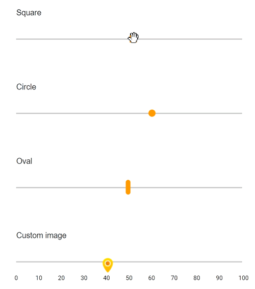

# Customize the thumb in Blazor Range Slider Component

Slider appearance can be customized through CSS. By overriding the slider CSS classes, you can customize the thumb. By default, slider has unique class `e-handle` for slider thumb. You can override the following class as per your requirement. Here, in the sample, the slider thumb has been customized to square, circle, oval shapes, and background image has also been customized.

```cshtml
@using Syncfusion.Blazor.Inputs;
@using Syncfusion.Blazor.Buttons;

<div class="col-lg-12 control-section">
    <div class="control-wrapper">
        <div class="slider-content-wrapper">
            <div class="slider_container">
                <div class="labelText slider-userselect">Square</div>
                <SfSlider Value="30" ID="square_slider">
                </SfSlider>
            </div>
            <div class="slider_container">
                <div class="labelText slider-userselect">Circle</div>
                <SfSlider Value="30" ID="circle_slider">
                </SfSlider>
            </div>
            <div class="slider_container">
                <div class="labelText slider-userselect">Oval</div>
                <SfSlider Value="30" ID="oval_slider">
                </SfSlider>
            </div>
            <div class="slider_container">
                <div class="labelText slider-userselect">Custom image</div>
                <SfSlider Value="30" ID="image_slider">
                    <SliderTicks Placement="@Placement.After" LargeStep="10" SmallStep="5" ShowSmallTicks="true"></SliderTicks>
                </SfSlider>
            </div>
        </div>
    </div>
</div>
<style>
    .slider-content-wrapper {
        width: 40%;
        margin: 0 auto;
        min-width: 185px;
    }

    .slider-userselect {
        -webkit-user-select: none;
        /* Safari 3.1+ */
        -moz-user-select: none;
        /* Firefox 2+ */
        -ms-user-select: none;
        /* IE 10+ */
        user-select: none;
        /* Standard syntax */
    }

    .labelText {
        text-align: -webkit-left;
        font-weight: 500;
        font-size: 13px;
        padding-bottom: 10px;
    }

    .slider_container {
        margin-top: 40px;
    }

    #square_slider.e-control.e-slider .e-handle {
        border-radius: 0%;
        background-color: #f9920b;
        border: 0;
    }

    #circle_slider.e-control.e-slider .e-handle {
        background-color: #f9920b;
        border-radius: 50%;
        border: 0;
    }

    #image_slider.e-control.e-slider .e-handle {
        height: 25px;
        width: 24px;
        background-size: 24px;
    }

    #image_slider.e-control.e-slider .e-handle {
        background-image: url(https://ej2.syncfusion.com/demos/src/slider/images/thumb.png);
        background-repeat: no-repeat;
        background-color: transparent;
        border: 0;
    }

    #square_slider .e-tab-handle::after,
    #circle_slider .e-tab-handle::after {
        background-color: #f9920b;
    }

    #image_slider .e-tab-handle::after {
        background-color: transparent;
    }

    #oval_slider.e-control.e-slider .e-handle {
        height: 25px;
        width: 8px;
        top: 3px;
        border-radius: 15px;
        background-color: #f9920b;
    }
</style>
```

