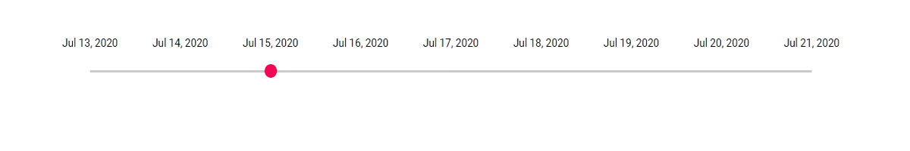

# Date Range Slider

The date formatting can be achieved using `TicksRendering` and `TooltipChange` events. The process of date formatting is explained in the below sample.

```csharp
@using System.Globalization;
@using Syncfusion.Blazor.Inputs

<SfSlider TValue="int" Min="MinValue()" Max="@MaxValue()" @bind-Value="@value">
    <SliderEvents TicksRendering="@TickesRendering" TValue="int" OnTooltipChange="@TooltipChange"></SliderEvents>
    <SliderTicks LargeStep="1" ShowSmallTicks="true" Placement="Placement.Before"> </SliderTicks>
    <SliderTooltip Placement="TooltipPlacement.After" IsVisible="true"></SliderTooltip>
</SfSlider>

@code{
    int value = 15;
    string MonthName = new DateTime(DateTime.Now.Year, DateTime.Now.Month, 13).ToString("MMM", CultureInfo.InvariantCulture);
    public double MinValue()
    {
        DateTime datetime = new DateTime(DateTime.Now.Year, DateTime.Now.Month, 13);
        return datetime.Day;
    }
    public double MaxValue()
    {
        DateTime datetime = new DateTime(DateTime.Now.Year, DateTime.Now.Month, 21);
        return datetime.Day;
    }
    public void TickesRendering(SliderTickEventArgs args)
    {
        args.Text = MonthName + " " +args.Value + ", " + DateTime.Now.Year;
    }
    public void TooltipChange(SliderTooltipEventArgs<int> args)
    {
        args.Text = MonthName + " " + args.Value + ", " + DateTime.Now.Year;
    }
}
```

The output will be as follows.

