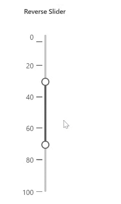

# Reversible Slider in Blazor Range Slider Component

You can create a Reverse Slider by setting the `Min` property to the maximum value and the `Max` property to the minimum value. An example of how to achieve a Reverse Slider is shown below

```cshtml
@using System.Globalization;
@using Syncfusion.Blazor.Inputs

<SfSlider Min="100" Max="0" Orientation="@SliderOrientation.Vertical" Type=SliderType.Range Value="@Range">
    <SliderTicks Placement="Placement.Before" LargeStep="20"></SliderTicks>
    <SliderTooltip Placement="TooltipPlacement.After" IsVisible="true"></SliderTooltip>
</SfSlider>

@code {
    // Specifies the value of the Range Slider.
    int[] Range = { 30, 70 };
}
```



N> Reversible order is currently supported only with `Vertical Orientation` Slider.