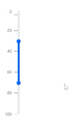

# Reversible Slider in Blazor Range Slider Component

You can create a Range Slider rendered with values in reverse order by setting the [`Min`](https://help.syncfusion.com/cr/blazor/Syncfusion.Blazor.Inputs.SfSlider-1.html#Syncfusion_Blazor_Inputs_SfSlider_1_Min) property to the maximum value and the [`Max`](https://help.syncfusion.com/cr/blazor/Syncfusion.Blazor.Inputs.SfSlider-1.html#Syncfusion_Blazor_Inputs_SfSlider_1_Max) property to the minimum value. An example of how to achieve a Reversible Slider is shown below

```cshtml
@using System.Globalization;
@using Syncfusion.Blazor.Inputs

<div id="app">
    <SfSlider Min="100" Max="0" Orientation="@SliderOrientation.Vertical" Type=SliderType.Range Value="@Range">
        <SliderTicks Placement="Placement.Before" LargeStep="20"></SliderTicks>
        <SliderTooltip Placement="TooltipPlacement.After" IsVisible="true"></SliderTooltip>
    </SfSlider>
</div>

@code {
    // Specifies the value of the Range Slider.
    int[] Range = { 30, 70 };
}

<style>
    #app {
        color: #008cff;
        height: 340px;
        left: 30%;
        position: absolute;
        width: 50%;
    }
</style>
```



N> Reversible order can be achieved with horizontal orientation Slider by setting [EnableRtl](https://help.syncfusion.com/cr/blazor/Syncfusion.Blazor.Inputs.SfSlider-1.html#Syncfusion_Blazor_Inputs_SfSlider_1_EnableRtl) as true.
