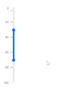

# How to create a reversible range slider in Blazor

Create a reversible slider (values displayed in descending order) by setting the [`Min`](https://help.syncfusion.com/cr/blazor/Syncfusion.Blazor.Inputs.SfSlider-1.html#Syncfusion_Blazor_Inputs_SfSlider_1_Min) property to the maximum value and the [`Max`](https://help.syncfusion.com/cr/blazor/Syncfusion.Blazor.Inputs.SfSlider-1.html#Syncfusion_Blazor_Inputs_SfSlider_1_Max) property to the minimum value. The example below renders a vertical range slider that counts down from 100 to 0.ow

```cshtml
@using Syncfusion.Blazor.Inputs

<div id="app">
    <SfSlider TValue="int[]" Min="100" Max="0" Orientation="@SliderOrientation.Vertical" Type="SliderType.Range" Value="@Range">
        <SliderTicks Placement="Placement.Before" LargeStep="20"></SliderTicks>
        <SliderTooltip Placement="TooltipPlacement.After" IsVisible="true"></SliderTooltip>
    </SfSlider>
</div>

@code {
    // Specifies the value of the Range Slider. Values must be within [Min=100, Max=0] when reversed.
    int[] Range = { 70, 30 };
}

<style>
    #app {
        color: #008cff;
        height: 340px;
        left: 30%;
        position: absolute;
        width: 50%;
    }
</style>
```



N> For a horizontal slider, a reversed visual order can be achieved by enabling right-to-left layout with [EnableRtl](https://help.syncfusion.com/cr/blazor/Syncfusion.Blazor.Inputs.SfSlider-1.html#Syncfusion_Blazor_Inputs_SfSlider_1_EnableRtl) set to `true`. 
