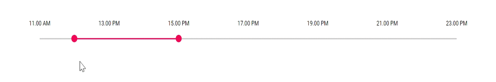

# How to format time range slider in Blazor Range Slider

Time formatting for the Blazor Range Slider can be achieved in the same way as date formatting by using the [`TicksRendering`](https://help.syncfusion.com/cr/blazor/Syncfusion.Blazor.Inputs.SliderEvents-1.html#Syncfusion_Blazor_Inputs_SliderEvents_1_TicksRendering) and [`OnTooltipChange`](https://help.syncfusion.com/cr/blazor/Syncfusion.Blazor.Inputs.SliderEvents-1.html#Syncfusion_Blazor_Inputs_SliderEvents_1_OnTooltipChange) events.

```cshtml
@using Syncfusion.Blazor.Inputs

<SfSlider TValue="int[]" Min="@MinValue()" Max="@MaxValue()" Type="SliderType.Range" @bind-Value="@SliderValues">
    <SliderEvents TValue="int[]" OnTooltipChange="@TooltipChange" TicksRendering="@TicksRendering"></SliderEvents>
    <SliderTicks Placement="Placement.Before" LargeStep="7200000" SmallStep="3600000" ShowSmallTicks="true"></SliderTicks>
    <SliderTooltip Placement="TooltipPlacement.After" IsVisible="true"></SliderTooltip>
</SfSlider>

@code{
    int[] SliderValues = new int[] { 43200000, 54000000 };
    public double MinValue()
    {
        DateTime datetime = new DateTime(2013, 6, 13, 11, 0, 0);
        return datetime.TimeOfDay.TotalMilliseconds;
    }
    public double MaxValue()
    {
        DateTime datetime = new DateTime(2013, 6, 13, 23, 0, 0);
        return datetime.TimeOfDay.TotalMilliseconds;
    }
    public void TicksRendering(SliderTickEventArgs args)
    {
        double time = args.Value / 3600000;
        // Special-case 12: 12.00 AM is midnight and 12.00 PM is noon.
        if (time == 0)
        {
            args.Text = "12.00 AM";
        }
        else if (time == 12)
        {
            args.Text = "12.00 PM";
        }
        else if (time > 12)
        {
            args.Text = (time - 12) + ".00 PM";
        }
        else
        {
            args.Text = time + ".00 AM";
        }
    }
    public void TooltipChange(SliderTooltipEventArgs<int[]> args)
    {
        double FirstValue = args.Value[0] / 3600000;
        double SecondValue = args.Value[1] / 3600000;
        string firstSuffix = FirstValue < 12 ? "AM" : "PM";
        string secondSuffix = SecondValue < 12 ? "AM" : "PM";
        // Display 12 instead of 0 for the 12-hour clock.
        double firstDisplay = FirstValue == 0 ? 12 : (FirstValue > 12 ? FirstValue - 12 : FirstValue);
        double secondDisplay = SecondValue == 0 ? 12 : (SecondValue > 12 ? SecondValue - 12 : SecondValue);

        args.Text = firstDisplay + ".00 " + firstSuffix + " - " + secondDisplay + ".00 " + secondSuffix;
    }
}
```

