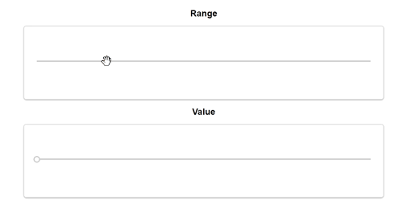

# Validation of Slider in Blazor Range Slider Component

The Range Slider component can be validated using our FormValidator. The following steps walk-through slider validation. Render slider component inside a form, by giving the required styles.

In Blazor Range Slider component, the DataAnnotation Validator is used here.

```csharp
 public class Annotation
{
    [Required, Range(0, 40, ErrorMessage = "You must select a value less than or equal to forty.")]
    public int Value { get; set; }
}
```

```cshtml
@using System.ComponentModel.DataAnnotations;
@using Syncfusion.Blazor.Inputs;

<div class="form-title">
    <span>Range</span>
</div>
<EditForm Model="@annotation">
    <DataAnnotationsValidator />
    <div class="form-group">
        <div class="e-float-input">
            <SfSlider @bind-Value ="annotation.Value"></SfSlider>
            <ValidationMessage For="@(() => annotation.Value)" />
        </div>
    </div>
</EditForm>
<div class="form-title">
    <span>Value</span>
</div>
<EditForm Model="@annotation">
    <DataAnnotationsValidator />
    <div class="form-group">
        <div class="e-float-input">
            <SfSlider @bind-Value="annotation.rangeval"></SfSlider>
            <ValidationMessage For="@(() => annotation.rangeval)" />
        </div>
    </div>
</EditForm>
@code {
    private Annotation annotation = new Annotation();
    public class Annotation
    {
        [Required, Range(0, 40, ErrorMessage = "You must select a value less than or equal to forty.")]
        public int Value { get; set; }
        [Required, RegularExpression("40", ErrorMessage = "You must select a value equal to forty.")]
        public int rangeval { get; set; }
    }
}
<style>
    .e-error,
    .e-float-text {
        font-weight: 500;
    }

    table,
    td,
    th {
        padding: 5px;
    }

    .form-horizontal {
        margin-left: 0;
        margin-right: 0;
    }

    form {
        border: 1px solid #ccc;
        box-shadow: 0 1px 3px 0 rgba(0, 0, 0, 0.36);
        border-radius: 5px;
        background: #f9f9f9;
        padding: 23px;
        padding-bottom: 20px;
        margin: auto;
        max-width: 650px;
    }
    
    .form-title {
        width: 100%;
        text-align: center;
        padding: 10px;
        font-size: 16px;
        font-weight: 600;
        color: black;
    }
</style>
```

