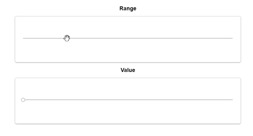

# How to validate slider in Blazor Range Slider

The Range Slider component can be validated using Blazor’s built-in form validation with DataAnnotations. The steps below demonstrate how to place the slider inside an EditForm and display validation messages.

In the following examples, the DataAnnotationsValidator is used to validate slider values.

```csharp
 public class Annotation
{
    [Required, Range(0, 40, ErrorMessage = "You must select a value less than or equal to forty.")]
    public int Value { get; set; }
}
```

```cshtml
@using System.ComponentModel.DataAnnotations;
@using Syncfusion.Blazor.Inputs;
@using Microsoft.AspNetCore.Components.Forms

<div class="form-title">
    <span>MinRange (0–40)</span>
</div>
<EditForm Model="@annotation">
    <DataAnnotationsValidator />
    <div class="form-group">
        <div class="e-float-input">
            <SfSlider TValue="int" @bind-Value="annotation.Value"></SfSlider>
            <ValidationMessage For="@(() => annotation.Value)" />
        </div>
    </div>
</EditForm>
<div class="form-title">
    <span>Range (must equal 40)</span>
</div>
<EditForm Model="@annotation">
    <DataAnnotationsValidator />
    <div class="form-group">
        <div class="e-float-input">
            <SfSlider TValue="int" @bind-Value="annotation.rangeval"></SfSlider>
            <ValidationMessage For="@(() => annotation.rangeval)" />
        </div>
    </div>
</EditForm>
@code {
    private Annotation annotation = new Annotation();

    public class Annotation
    {
        [Required, Range(0, 40, ErrorMessage = "You must select a value between 0 and 40.")]
        public int Value { get; set; }

        [Required, Range(40, 40, ErrorMessage = "You must select a value equal to 40.")]
        public int rangeval { get; set; }
    }
}
<style>
    .e-error,
    .e-float-text {
        font-weight: 500;
    }

    table,
    td,
    th {
        padding: 5px;
    }

    .form-horizontal {
        margin-left: 0;
        margin-right: 0;
    }

    form {
        border: 1px solid #ccc;
        box-shadow: 0 1px 3px 0 rgba(0, 0, 0, 0.36);
        border-radius: 5px;
        background: #f9f9f9;
        padding: 23px;
        padding-bottom: 20px;
        margin: auto;
        max-width: 650px;
    }

    .form-title {
        width: 100%;
        text-align: center;
        padding: 10px;
        font-size: 16px;
        font-weight: 600;
        color: black;
    }
</style>
```

