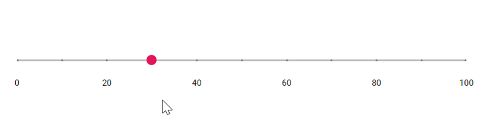
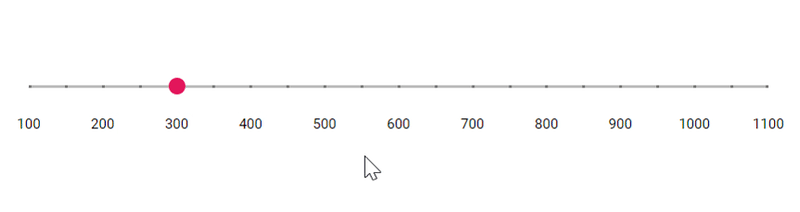

# Ticks in Blazor Range Slider Component

The Ticks in Slider supports to easily identify the current value/values of the Slider. It contains [`SmallStep`](https://help.syncfusion.com/cr/blazor/Syncfusion.Blazor.Inputs.SliderTicks.html#Syncfusion_Blazor_Inputs_SliderTicks_SmallStep) and [`LargeStep`](https://help.syncfusion.com/cr/blazor/Syncfusion.Blazor.Inputs.SliderTicks.html#Syncfusion_Blazor_Inputs_SliderTicks_LargeStep). The value of the major ticks alone will be displayed in the slider. In order to enable/disable the small ticks, use the [`ShowSmallTicks`](https://help.syncfusion.com/cr/blazor/Syncfusion.Blazor.Inputs.SliderTicks.html#Syncfusion_Blazor_Inputs_SliderTicks_ShowSmallTicks) property.

```cshtml
@using Syncfusion.Blazor.Inputs

<SfSlider @bind-Value="@value">
    <SliderTicks Placement="Placement.After" ShowSmallTicks="true" LargeStep="20" SmallStep="10"></SliderTicks>
    <SliderTooltip IsVisible="true" ShowOn="TooltipShowOn.Always" Placement="TooltipPlacement.Before"></SliderTooltip>
</SfSlider>

@code {
    int value = 30;
}
```



## Step

When the Slider is moved, it increases/decreases the value based on the step value. By default, the value is increased/decreased by 1. Use the [`Step`](https://help.syncfusion.com/cr/blazor/Syncfusion.Blazor.Inputs.SfSlider-1.html#Syncfusion_Blazor_Inputs_SfSlider_1_Step) property to change the increment step value.

```cshtml
@using Syncfusion.Blazor.Inputs

<SfSlider Step="10" @bind-Value="@value">
   <SliderTooltip IsVisible="true" ShowOn="TooltipShowOn.Always" Placement="TooltipPlacement.Before"></SliderTooltip>
</SfSlider>

@code {
    int value = 30;
}
```


## Min and Max

Enables the minimum/starting and maximum/ending value of the Slider, by using the [`Min`](https://help.syncfusion.com/cr/blazor/Syncfusion.Blazor.Inputs.SfSlider-1.html#Syncfusion_Blazor_Inputs_SfSlider_1_Min) and [`Max`](https://help.syncfusion.com/cr/blazor/Syncfusion.Blazor.Inputs.SfSlider-1.html#Syncfusion_Blazor_Inputs_SfSlider_1_Max) property. By default, the minimum value is 1 and maximum value is 100. In the following sample the slider is rendered with the min value as 100 and max value as 1100.

```cshtml
@using Syncfusion.Blazor.Inputs

<SfSlider @bind-Value ="@value" Min="100" Max="1100">
     <SliderTicks Placement="Placement.After" ShowSmallTicks="true" LargeStep="100" SmallStep="50"></SliderTicks>
    <SliderTooltip IsVisible="true" ShowOn="TooltipShowOn.Always" Placement="TooltipPlacement.Before"></SliderTooltip>
</SfSlider>

@code {
    int value = 300;
}
```



## ValueChanged

The [ValueChanged](https://help.syncfusion.com/cr/blazor/Syncfusion.Blazor.Inputs.SfSlider-1.html#Syncfusion_Blazor_Inputs_SfSlider_1_ValueChanged) property of the Blazor Range Slider component allows you to define a callback method that will be invoked whenever the value of the Slider changes. This property enables you to capture the updated value of the Slider and perform custom actions based on the new value. The callback method can be used to handle any logic associated with the Slider value change, such as updating other parts of the application, triggering events, or displaying notifications.

```cshtml

@using Syncfusion.Blazor.Inputs
@inject IJSRuntime JSRuntime

<SfSlider TValue="int" Step="1" Min="1" Max="20" Value="value" ValueChanged="OnValueChanged">
    <SliderTooltip IsVisible="true" ShowOn="TooltipShowOn.Always" Placement="TooltipPlacement.After"></SliderTooltip>
</SfSlider>

@code {
    int value = 5;
    public void OnValueChanged(int newValue)
    {
        // Update the value variable with the new value
        value = newValue; 
        // For example, you can display the new value using an alert:
        JSRuntime.InvokeVoidAsync("alert", $"Slider value changed to: {value}");
    }
}

```
