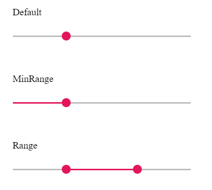

# Types in Blazor Range Slider Component

The types of Slider are as follows:

| **Types** | **Usage** |
| --- | --- |
| Default | Shows a default Slider to select a single value. |
| MinRange | Displays the shadow from the start value to the current selected value. |
| Range | Selects a range of values. It also displays the shadow in-between the selection range. |

>Both the Default Slider and Min-Range Slider have same behavior that is used to select a single value.
In Min-Range Slider, a shadow is considered from the start value to current handle position. But the Range Slider
contains two handles that is used to select a range of values and a shadow is considered in between the two handles.

```cshtml
@using Syncfusion.Blazor.Inputs

<SfSlider Value="30"></SfSlider>
<SfSlider Value="40" Type="SliderType.MinRange"></SfSlider>
<SfSlider Value=@RangeValue Type="SliderType.Range"></SfSlider>

@code{
    public int[] RangeValue = { 30, 70 };
}
```

