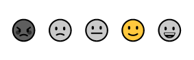

# Templates in Blazor Rating Component

The Blazor Rating component supports to customize the appearance of the rating item by using Templates.

The Template types of Rating are as follows:

* Empty Template
* Full Template

## Empty Template
You can access information about the un-rated item by setting [EmptyTemplate](https://help.syncfusion.com/cr/blazor/Syncfusion.Blazor.Inputs.SfRating.html#Syncfusion_Blazor_Inputs_SfRating_EmptyTemplate) property. 

Below example demonstrates the Empty Template of Rating.

```cshtml

@using Syncfusion.Blazor.Inputs

<SfRating>
    <EmptyTemplate>
        <span class='custom-font sf-rating-heart'></span>
    </EmptyTemplate>
</SfRating>

<style>
    .e-rating-container .custom-font {
        background: linear-gradient(to right, rgb(254,87,133,255) var(--rating-value), transparent var(--rating-value));
        background-clip: text;
        -webkit-background-clip: text;
        -webkit-text-fill-color: transparent;
        -webkit-text-stroke: 1px rgb(254,87,133,255);
    }

    @@font-face {
        font-family: 'rating';
        src: url(data:application/x-font-ttf;charset=utf-8;base64,AAEAAAAKAIAAAwAgT1MvMj1uSfQAAAEoAAAAVmNtYXDnEudaAAABjAAAADhnbHlm4LiFsgAAAcwAAAJsaGVhZCKCSVkAAADQAAAANmhoZWEIUQQEAAAArAAAACRobXR4DAAAAAAAAYAAAAAMbG9jYQCMATYAAAHEAAAACG1heHABDwCZAAABCAAAACBuYW1l75Kp8wAABDgAAAIZcG9zdDjyU90AAAZUAAAANwABAAAEAAAAAFwEAAAAAAAD9AABAAAAAAAAAAAAAAAAAAAAAwABAAAAAQAA2T6Kh18PPPUACwQAAAAAAN+4AkEAAAAA37gCQQAAAAAD9APaAAAACAACAAAAAAAAAAEAAAADAI0AAgAAAAAAAgAAAAoACgAAAP8AAAAAAAAAAQQAAZAABQAAAokCzAAAAI8CiQLMAAAB6wAyAQgAAAIABQMAAAAAAAAAAAAAAAAAAAAAAAAAAAAAUGZFZABA5wHnAgQAAAAAXAQAAAAAAAABAAAAAAAABAAAAAQAAAAEAAAAAAAAAgAAAAMAAAAUAAMAAQAAABQABAAkAAAABAAEAAEAAOcC//8AAOcB//8AAAABAAQAAAACAAEAAAAAAIwBNgABAAAAAAPzA9oAfAAAEw8WFR8PPw41Lx4jDwwvDw8GqAwMDAsKCgoJCAgIBwYGBQUEBAMCAgEBAQECAwMEBQULFSMhOVJliOxTOSEdFg0IBQQDAwIBAQEBAgIDBAQFBQYGBwgICAkKCgoLDAwMDAwMDQwMDQwZGBgYFxUVFBIRCAgGBwkLCwwNDg4PEBAQEREREhEODg4ODg4NA8IGBwcICAkJCgoKCwsMCwwNDA0MDQ0ODQ0ODQ0ODQ0NDRUiMCtEX26P/V5FKycjFhQNDQ0ODQ0ODQ0NDgwNDQwNCwwMCwoLCgoJCAkIBwcGBQUEAwMCAQECBQYJCw4PERMKCgsMEQ8PDQ0LCwoICAYFBAMCAQEBAgIEBAUAAgAAAAAD9APFAAMAjAAANzMRIwEPAxUXDwwRMzcfBDcXPwo9AS8FPwsvCDc1Pwg1LwU1Pw01LwkHJT8ENS8LIw8BDK2tAfkCCgQBAQEBGCERERITIgkJKBAGIQc1Bx45k9sOBQgLDQsJBQMEAgIECQYCAQEBAw4ECQgGBwMDAQEBAQMDAwkCAQEDFgsFBAQDAwICAgQECgEBAQQKBwcGBQUEAwMBAQEBBAUHCQUFBQYR/q0PCQQDAgEBAwMKDBUDBwYMCw0HB1oBhwHeAQUDA3YfCgQsOh0bHBovCQgbDP6KAQEfAwEBAQIBAQMGCgoMBggICAUICQgLBQQEBAUDBgMHCAgMCAcIBwYGBgUFCQQCBgIEDAkGBQYHCQkKCQgIBwsEAgUDAgQEBAUFBgcHCAcGBgYGCgkIBgICAQEBAUYxGRobDQ0MDQsiHjEEBAIEAQECAAAAEgDeAAEAAAAAAAAAAQAAAAEAAAAAAAEABgABAAEAAAAAAAIABwAHAAEAAAAAAAMABgAOAAEAAAAAAAQABgAUAAEAAAAAAAUACwAaAAEAAAAAAAYABgAlAAEAAAAAAAoALAArAAEAAAAAAAsAEgBXAAMAAQQJAAAAAgBpAAMAAQQJAAEADABrAAMAAQQJAAIADgB3AAMAAQQJAAMADACFAAMAAQQJAAQADACRAAMAAQQJAAUAFgCdAAMAAQQJAAYADACzAAMAAQQJAAoAWAC/AAMAAQQJAAsAJAEXIHJhdGluZ1JlZ3VsYXJyYXRpbmdyYXRpbmdWZXJzaW9uIDEuMHJhdGluZ0ZvbnQgZ2VuZXJhdGVkIHVzaW5nIFN5bmNmdXNpb24gTWV0cm8gU3R1ZGlvd3d3LnN5bmNmdXNpb24uY29tACAAcgBhAHQAaQBuAGcAUgBlAGcAdQBsAGEAcgByAGEAdABpAG4AZwByAGEAdABpAG4AZwBWAGUAcgBzAGkAbwBuACAAMQAuADAAcgBhAHQAaQBuAGcARgBvAG4AdAAgAGcAZQBuAGUAcgBhAHQAZQBkACAAdQBzAGkAbgBnACAAUwB5AG4AYwBmAHUAcwBpAG8AbgAgAE0AZQB0AHIAbwAgAFMAdAB1AGQAaQBvAHcAdwB3AC4AcwB5AG4AYwBmAHUAcwBpAG8AbgAuAGMAbwBtAAAAAAIAAAAAAAAACgAAAAAAAAAAAAAAAAAAAAAAAAAAAAAAAwECAQMBBAAFaGVhcnQFdGh1bWIAAAA=) format('truetype');
        font-weight: normal;
        font-style: normal;
    }

    [class^="sf-rating-"], [class*=" sf-rating-"] {
        font-family: 'rating' !important;
        speak: none;
        font-style: normal;
        font-weight: normal;
        font-variant: normal;
        text-transform: none;
        line-height: 1;
        -webkit-font-smoothing: antialiased;
        -moz-osx-font-smoothing: grayscale;
    }

    .sf-rating-heart:before {
        content: "\e702";
    }
</style>

```


## Full Template

You can access information about the rated item by setting [FullTemplate](https://help.syncfusion.com/cr/blazor/Syncfusion.Blazor.Inputs.SfRating.html#Syncfusion_Blazor_Inputs_SfRating_FullTemplate) property.

Below example demonstrates the Full Template of Rating.

```cshtml

@using Syncfusion.Blazor.Inputs

<SfRating>
    <FullTemplate>
        <span class='custom-font sf-icon-star'></span>
    </FullTemplate>
    <EmptyTemplate>
        <span class='custom-font sf-icon-star'></span>
    </EmptyTemplate>
</SfRating>

<style>

    .e-rating-container .custom-font {
        background: linear-gradient(to right, rgb(255,215,0) var(--rating-value), transparent var(--rating-value));
        background-clip: text;
        -webkit-background-clip: text;
        -webkit-text-fill-color: transparent;
        -webkit-text-stroke: 1px rgb(255,215,0);
    }

    @@font-face {
        font-family: 'RatingIcon';
        src: url(data:application/x-font-ttf;charset=utf-8;base64,AAEAAAAKAIAAAwAgT1MvMj1tSfIAAAEoAAAAVmNtYXDnEOdVAAABiAAAADZnbHlm9cEZjAAAAcgAAAA4aGVhZCK0htcAAADQAAAANmhoZWEIUQQDAAAArAAAACRobXR4CAAAAAAAAYAAAAAIbG9jYQAcAAAAAAHAAAAABm1heHABDQAWAAABCAAAACBuYW1lOGHbkgAAAgAAAAJJcG9zdHSFYngAAARMAAAALgABAAAEAAAAAFwEAAAAAAAD9AABAAAAAAAAAAAAAAAAAAAAAgABAAAAAQAAru5xRl8PPPUACwQAAAAAAN/RIPMAAAAA39Eg8wAAAAAD9AP0AAAACAACAAAAAAAAAAEAAAACAAoAAQAAAAAAAgAAAAoACgAAAP8AAAAAAAAAAQQAAZAABQAAAokCzAAAAI8CiQLMAAAB6wAyAQgAAAIABQMAAAAAAAAAAAAAAAAAAAAAAAAAAAAAUGZFZABA5wDnAAQAAAAAXAQAAAAAAAABAAAAAAAABAAAAAQAAAAAAAACAAAAAwAAABQAAwABAAAAFAAEACIAAAAEAAQAAQAA5wD//wAA5wD//wAAAAEABAAAAAEAAAAAAAAAHAAAAAEAAAAAA/QD9AAJAAABBRMDJQUDEyUDAWb+pvo7ATUBNTv6/qaaAqs1/wD+lqurAWoBADUBSQAAAAASAN4AAQAAAAAAAAABAAAAAQAAAAAAAQAKAAEAAQAAAAAAAgAHAAsAAQAAAAAAAwAKABIAAQAAAAAABAAKABwAAQAAAAAABQALACYAAQAAAAAABgAKADEAAQAAAAAACgAsADsAAQAAAAAACwASAGcAAwABBAkAAAACAHkAAwABBAkAAQAUAHsAAwABBAkAAgAOAI8AAwABBAkAAwAUAJ0AAwABBAkABAAUALEAAwABBAkABQAWAMUAAwABBAkABgAUANsAAwABBAkACgBYAO8AAwABBAkACwAkAUcgUmF0aW5nSWNvblJlZ3VsYXJSYXRpbmdJY29uUmF0aW5nSWNvblZlcnNpb24gMS4wUmF0aW5nSWNvbkZvbnQgZ2VuZXJhdGVkIHVzaW5nIFN5bmNmdXNpb24gTWV0cm8gU3R1ZGlvd3d3LnN5bmNmdXNpb24uY29tACAAUgBhAHQAaQBuAGcASQBjAG8AbgBSAGUAZwB1AGwAYQByAFIAYQB0AGkAbgBnAEkAYwBvAG4AUgBhAHQAaQBuAGcASQBjAG8AbgBWAGUAcgBzAGkAbwBuACAAMQAuADAAUgBhAHQAaQBuAGcASQBjAG8AbgBGAG8AbgB0ACAAZwBlAG4AZQByAGEAdABlAGQAIAB1AHMAaQBuAGcAIABTAHkAbgBjAGYAdQBzAGkAbwBuACAATQBlAHQAcgBvACAAUwB0AHUAZABpAG8AdwB3AHcALgBzAHkAbgBjAGYAdQBzAGkAbwBuAC4AYwBvAG0AAAAAAgAAAAAAAAAKAAAAAAAAAAAAAAAAAAAAAAAAAAAAAAACAQIBAwAEc3RhcgAAAAA=) format('truetype');
        font-weight: normal;
        font-style: normal;
    }

    [class^="sf-icon-"], [class*=" sf-icon-"] {
        font-family: 'RatingIcon' !important;
        speak: none;
        font-style: normal;
        font-weight: normal;
        font-variant: normal;
        text-transform: none;
        line-height: 1;
        -webkit-font-smoothing: antialiased;
        -moz-osx-font-smoothing: grayscale;
    }

    .sf-icon-star:before {
        content: "\e700";
    }

</style>

```


## Emoji Icon

You can also use Emoji icon as a rating item.

Below example demonstrates the Emoji Icon of Rating.

```cshtml

@using Syncfusion.Blazor.Inputs

<SfRating EnableSingleSelection=true EnableAnimation=false>
    <EmptyTemplate>
        @{
            @if (context.Index == 0)
                {
                <span class='angry emoji'>😡</span>
                }
            else if (context.Index == 1)
                {
                <span class='disagree emoji'>🙁</span>
                }
            else if (context.Index == 2)
                {
                <span class='neutral emoji'>😐</span>
                }
            else if (context.Index == 3)
                {
                <span class='agree emoji'>🙂</span>
                }
            else
                {
                <span class='happy emoji'>😀</span>
                }
        }
    </EmptyTemplate>
</SfRating>

<style>
    .e-rating-item-container:not(.e-rating-selected) .emoji {
        filter: grayscale(1);
    }
</style>

```



## SVG Icon

You can also use SVG icon as a rating item.

Below example demonstrates the SVG Icon of Rating.

```cshtml

@using Syncfusion.Blazor.Inputs

<SfRating EnableAnimation=false>
    <EmptyTemplate>
        <svg width="35" height="25" class="e-rating-svg-icon">
            <rect width="35" height="25" fill="transparent" style="stroke-width:2;stroke:rgb(173,181,189)" />
        </svg>
    </EmptyTemplate>
    <FullTemplate>
        <svg width="35" height="25" class="e-rating-svg-icon">
            <defs>
                <linearGradient id=@("grad"+context.Index.ToString()) x1="0%" y1="0%" x2="100%" y2="0%">
                    <stop class="start" offset="0%" />
                    <stop class="end" offset="100%" />
                </linearGradient>
            </defs>
            <rect width="35" height="25" fill=@("url(#grad"+context.Index.ToString()+")") style="stroke-width:2;stroke:rgb(173,181,189)" />
        </svg>
    </FullTemplate>
</SfRating>

<style>
    .e-rating-svg-icon #grad0 .start {
        stop-color: #FF0000;
    }

    .e-rating-svg-icon #grad0 .end,
    .e-rating-svg-icon #grad1 .start {
        stop-color: #ff5101;
    }

    .e-rating-svg-icon #grad1 .end,
    .e-rating-svg-icon #grad2 .start {
        stop-color: #ffc801;
    }

    .e-rating-svg-icon #grad2 .end,
    .e-rating-svg-icon #grad3 .start {
        stop-color: #dbe300;
    }

    .e-rating-svg-icon #grad3 .end,
    .e-rating-svg-icon #grad4 .start {
        stop-color: #8bc301;
    }

    .e-rating-svg-icon #grad4 .end {
        stop-color: #4eaa01;
    }
</style>

```


## PNG Image

You can also use PNG image as a rating item.

Below example demonstrates the PNG image of Rating.

```cshtml

@using Syncfusion.Blazor.Inputs

<SfRating>
    <FullTemplate>        
        
    </FullTemplate>
    <EmptyTemplate>
        
    </EmptyTemplate>
</SfRating>

```

