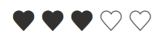

# Appearance in Blazor Rating Component

The appearance of the Blazor Rating component can be customized to match application design requirements.

## Items count

You can specify the number of rating items using the [ItemsCount](https://help.syncfusion.com/cr/blazor/Syncfusion.Blazor.Inputs.SfRating.html#Syncfusion_Blazor_Inputs_SfRating_ItemsCount) property.

```cshtml

@using Syncfusion.Blazor.Inputs

<SfRating Value="3" ItemsCount="8"></SfRating>

```

In this example, the rating component displays 8 rating items. The `Value` property specifies how many items appear filled, so 3 of the 8 items are filled.


## Disabled

Disable the Syncfusion<sup style="font-size:70%">&reg;</sup> Blazor Rating component by using the [Disabled](https://help.syncfusion.com/cr/blazor/Syncfusion.Blazor.Inputs.SfRating.html#Syncfusion_Blazor_Inputs_SfRating_Disabled) property. When the `Disabled` property is set to `true`, the rating component will be disabled and the user will not be able to interact with it and a disabled rating component may have a different visual appearance than an enabled one.

```cshtml

@using Syncfusion.Blazor.Inputs

<SfRating Value="3" Disabled=true></SfRating>

```


## Visible

Use the [Visible](https://help.syncfusion.com/cr/blazor/Syncfusion.Blazor.Inputs.SfRating.html#Syncfusion_Blazor_Inputs_SfRating_Visible) property of the Blazor Rating component to control the visibility of the component. When the `Visible` property is set to `true`, the rating component will be visible on the page. When it is set to `false`, the component will be hidden.

```cshtml

@using Syncfusion.Blazor.Inputs

<SfRating Value="3" Visible=true></SfRating>

```


## Read only

Use the [ReadOnly](https://help.syncfusion.com/cr/blazor/Syncfusion.Blazor.Inputs.SfRating.html#Syncfusion_Blazor_Inputs_SfRating_ReadOnly) property of the Blazor Rating component to make the component non-interactive and prevent changes to the rating value via mouse or keyboard.

```cshtml

@using Syncfusion.Blazor.Inputs

<SfRating Value="3" ReadOnly=true></SfRating>

```


## CssClass

Customize the appearance of the rating component, such as by changing its colors, fonts, sizes, or other visual aspects by using the [CssClass](https://help.syncfusion.com/cr/blazor/Syncfusion.Blazor.Inputs.SfRating.html#Syncfusion_Blazor_Inputs_SfRating_CssClass) property. 

### Changing rating symbol border color

Change the rating icon border color in Blazor Rating component, you can use the `CssClass` property and set the `text-stroke` CSS property of `.e-rating-icon` to your desired border color.

```cshtml

<SfRating Value="3" CssClass="custom-font"></SfRating>

<style>

    .e-rating-container.custom-font .e-rating-item-list:hover .e-rating-item-container .e-rating-icon,
    .e-rating-container.custom-font .e-rating-item-container .e-rating-icon {
        /* To change rating symbol border color */
        -webkit-text-stroke: 2px #ae9e9d;        
    }

</style>

```


### Changing rated/un-rated symbol fill color 

Customize the fill colors of rated and un-rated icons in the Rating component using the `CssClass` property and the `linear-gradient` color-stops in the `background` CSS property of `.e-rating-icon`. The **first** color-stop defines the rated fill color and the **second** defines the un-rated fill color.

```cshtml

<SfRating Value="3" CssClass="custom-font"></SfRating>

<style>

    .e-rating-container.custom-font .e-rating-item-list:hover .e-rating-item-container .e-rating-icon,
    .e-rating-container.custom-font .e-rating-item-container .e-rating-icon {
        /* To change rated symbol fill color and un-rated symbol fill color */
        background: linear-gradient(to right, #ffe814 var(--rating-value), #d8d7d4 var(--rating-value));
        background-clip: text;
        -webkit-background-clip: text;
    }

</style>

```

This customizes the rated fill color to `#ffe814` and the unrated fill color to `#d8d7d4`. The `--rating-value` custom property in the gradient reflects the current value of the rating item.


### Changing the item spacing

To change the space between rating items in the Blazor Rating component, use the `CssClass` property and set the `margin` or `padding` of `.e-rating-item-container` to the desired size. 

```cshtml

<SfRating Value="3" CssClass="custom-font"></SfRating>

<style>

    .e-rating-container.custom-font .e-rating-item-container {
        /* To change the size between items */
        margin:0px 7px;
    }   

</style>

```


## Changing icon using CssClass

To change the rating item icon in the Blazor Rating component, use the `CssClass` property and set the `content` of `.e-icons.e-star-filled:before` to the desired font icon.

```cshtml

<SfRating Value="3" CssClass="custom-icon"></SfRating>

<style>

    .custom-icon .e-icons.e-star-filled:before {
        content: "\e702";
    }

    @@font-face {
        font-family: 'custom-icon';
        src: url(data:application/x-font-ttf;charset=utf-8;base64,AAEAAAAKAIAAAwAgT1MvMj1vSfQAAAEoAAAAVmNtYXDnEudXAAABiAAAADZnbHlmVIZrowAAAcgAAAEYaGVhZCK6KOUAAADQAAAANmhoZWEIUAQDAAAArAAAACRobXR4CAAAAAAAAYAAAAAIbG9jYQCMAAAAAAHAAAAABm1heHABDQCJAAABCAAAACBuYW1lv3dY+QAAAuAAAAJVcG9zdN12YnkAAAU4AAAALwABAAAEAAAAAFwEAAAAAAAD8wABAAAAAAAAAAAAAAAAAAAAAgABAAAAAQAAEGWKhV8PPPUACwQAAAAAAN/UcgcAAAAA39RyBwAAAAAD8wPaAAAACAACAAAAAAAAAAEAAAACAH0AAQAAAAAAAgAAAAoACgAAAP8AAAAAAAAAAQQAAZAABQAAAokCzAAAAI8CiQLMAAAB6wAyAQgAAAIABQMAAAAAAAAAAAAAAAAAAAAAAAAAAAAAUGZFZABA5wLnAgQAAAAAXAQAAAAAAAABAAAAAAAABAAAAAQAAAAAAAACAAAAAwAAABQAAwABAAAAFAAEACIAAAAEAAQAAQAA5wL//wAA5wL//wAAAAEABAAAAAEAAAAAAAAAjAAAAAEAAAAAA/MD2gB8AAATDxYVHw8/DjUvHiMPDC8PDwaoDAwMCwoKCgkICAgHBgYFBQQEAwICAQEBAQIDAwQFBQsVIyE5UmWI7FM5IR0WDQgFBAMDAgEBAQECAgMEBAUFBgYHCAgICQoKCgsMDAwMDAwNDAwNDBkYGBgXFRUUEhEICAYHCQsLDA0ODg8QEBARERESEQ4ODg4ODg0DwgYHBwgICQkKCgoLCwwLDA0MDQwNDQ4NDQ4NDQ4NDQ0NFSIwK0Rfbo/9XkUrJyMWFA0NDQ4NDQ4NDQ0ODA0NDA0LDAwLCgsKCgkICQgHBwYFBQQDAwIBAQIFBgkLDg8REwoKCwwRDw8NDQsLCggIBgUEAwIBAQECAgQEBQAAABIA3gABAAAAAAAAAAEAAAABAAAAAAABAAsAAQABAAAAAAACAAcADAABAAAAAAADAAsAEwABAAAAAAAEAAsAHgABAAAAAAAFAAsAKQABAAAAAAAGAAsANAABAAAAAAAKACwAPwABAAAAAAALABIAawADAAEECQAAAAIAfQADAAEECQABABYAfwADAAEECQACAA4AlQADAAEECQADABYAowADAAEECQAEABYAuQADAAEECQAFABYAzwADAAEECQAGABYA5QADAAEECQAKAFgA+wADAAEECQALACQBUyBjdXN0b20taWNvblJlZ3VsYXJjdXN0b20taWNvbmN1c3RvbS1pY29uVmVyc2lvbiAxLjBjdXN0b20taWNvbkZvbnQgZ2VuZXJhdGVkIHVzaW5nIFN5bmNmdXNpb24gTWV0cm8gU3R1ZGlvd3d3LnN5bmNmdXNpb24uY29tACAAYwB1AHMAdABvAG0ALQBpAGMAbwBuAFIAZQBnAHUAbABhAHIAYwB1AHMAdABvAG0ALQBpAGMAbwBuAGMAdQBzAHQAbwBtAC0AaQBjAG8AbgBWAGUAcgBzAGkAbwBuACAAMQAuADAAYwB1AHMAdABvAG0ALQBpAGMAbwBuAEYAbwBuAHQAIABnAGUAbgBlAHIAYQB0AGUAZAAgAHUAcwBpAG4AZwAgAFMAeQBuAGMAZgB1AHMAaQBvAG4AIABNAGUAdAByAG8AIABTAHQAdQBkAGkAbwB3AHcAdwAuAHMAeQBuAGMAZgB1AHMAaQBvAG4ALgBjAG8AbQAAAAACAAAAAAAAAAoAAAAAAAAAAAAAAAAAAAAAAAAAAAAAAAIBAgEDAAVoZWFydAAAAA==) format('truetype');
        font-weight: normal;
        font-style: normal;
    }

    .custom-icon .e-icons.e-star-filled {
        font-family: 'custom-icon' !important;
        speak: none;
        font-style: normal;
        font-weight: normal;
        font-variant: normal;
        text-transform: none;
        line-height: 1;
        -webkit-font-smoothing: antialiased;
        -moz-osx-font-smoothing: grayscale;
    }

</style>

```

