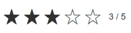
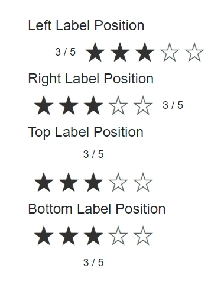
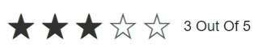

# Labels in Blazor Rating Component

> **Prerequisites:** Install the [Syncfusion.Blazor](https://www.nuget.org/packages/Syncfusion.Blazor) NuGet package and add `@using Syncfusion.Blazor.Inputs` to your component.

> **Supported versions:** Syncfusion Blazor `Syncfusion.Blazor` (compatible with .NET 6.0, .NET 7.0, .NET 8.0, and .NET 9.0).

Use the [ShowLabel](https://help.syncfusion.com/cr/blazor/Syncfusion.Blazor.Inputs.SfRating.html#Syncfusion_Blazor_Inputs_SfRating_ShowLabel) property to display a label that shows the current rating value. The default value is `false`. When set to `true`, the default label renders the current value and the total (for example, `3 / 5`).

```cshtml

@using Syncfusion.Blazor.Inputs

<SfRating Value="3" ShowLabel=true></SfRating>

```



## Label position

Control where the label appears using the [LabelPosition](https://help.syncfusion.com/cr/blazor/Syncfusion.Blazor.Inputs.SfRating.html#Syncfusion_Blazor_Inputs_SfRating_LabelPosition) property. The default position is `Right`. In right-to-left layouts, `Left` and `Right` positions follow RTL direction (so `Right` visually appears on the left and vice versa).

The following label positions are supported:

* **Top** - The label appears above the rating.
* **Bottom** - The label appears below the rating.
* **Left** - The label appears on the left side of the rating.
* **Right** - The label appears on the right side of the rating (default).

```cshtml

@using Syncfusion.Blazor.Inputs

<label>Left Label Position</label><br/>
<SfRating Value=3 ShowLabel=true LabelPosition=LabelPosition.Left></SfRating><br/>

<label>Right Label Position</label><br />
<SfRating Value=3 ShowLabel=true></SfRating><br/>

<label>Top Label Position</label><br />
<SfRating Value=3 ShowLabel=true LabelPosition=LabelPosition.Top></SfRating><br/>

<label>Bottom Label Position</label><br />
<SfRating Value=3 ShowLabel=true LabelPosition=LabelPosition.Bottom></SfRating><br/>

```




## Label template

Use the [LabelTemplate](https://help.syncfusion.com/cr/blazor/Syncfusion.Blazor.Inputs.SfRating.html#Syncfusion_Blazor_Inputs_SfRating_LabelTemplate) tag directive to provide custom content for the label. The current rating value is passed to the template as `@context` (a `double`). When a template is provided and `ShowLabel` is `true`, the template replaces the default label.

The following example localizes the label text using `IStringLocalizer`:

```cshtml

@using Syncfusion.Blazor.Inputs
@using Microsoft.Extensions.Localization
@inject IStringLocalizer<MyResources> Localizer

<SfRating Value="3" ShowLabel=true>
    <LabelTemplate>
        @($"{context} {Localizer["OutOf"]} 5")
    </LabelTemplate>
</SfRating>

```

