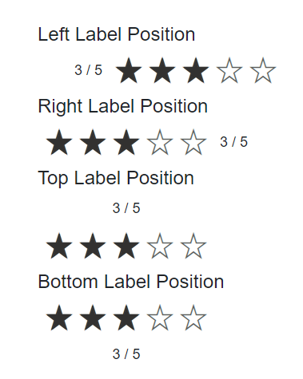

# Labels in Blazor Rating Component

You can use the [ShowLabel](https://help.syncfusion.com/cr/blazor/Syncfusion.Blazor.Inputs.SfRating.html#Syncfusion_Blazor_Inputs_SfRating_ShowLabel) property to display a label that shows the current value of the rating. When the `ShowLabel` property is set to `true`, a label will be displayed.

```cshtml

@using Syncfusion.Blazor.Inputs

<SfRating Value="3" ShowLabel=true></SfRating>

```


## Label position

The Rating component allows you to place the label on the top, bottom, left, or right side of the rating using the [LabelPosition](https://help.syncfusion.com/cr/blazor/Syncfusion.Blazor.Inputs.SfRating.html#Syncfusion_Blazor_Inputs_SfRating_LabelPosition) property. 

The following label positions are supported:

* Top: The label is placed on the top of the rating.
* Bottom: The label is placed on the bottom of the rating.
* Left: The label is placed on the left side of the rating.
* Right: The label is placed on the right side of the rating.

```cshtml

@using Syncfusion.Blazor.Inputs

<label>Left Label Position</label><br/>
<SfRating Value=3 ShowLabel=true LabelPosition="LabelPosition.Left"></SfRating><br/>

<label>Right Label Position</label><br />
<SfRating Value=3 ShowLabel=true></SfRating><br/>

<label>Top Label Position </label><br />
<SfRating Value=3 ShowLabel=true LabelPosition="LabelPosition.Top"></SfRating><br/>

<label>Bottom Label Position</label><br />
<SfRating Value=3 ShowLabel=true LabelPosition="LabelPosition.Bottom"></SfRating><br/>

```




## Label template

You can use the [LabelTemplate](https://help.syncfusion.com/cr/blazor/Syncfusion.Blazor.Inputs.SfRating.html#Syncfusion_Blazor_Inputs_SfRating_LabelTemplate) tag directive to specify a custom template for the `Label` of the rating. The current value of the rating will be passed as the `context` when building the content of the label. This allows you to include dynamic information about the rating in the template.

```cshtml

@using Syncfusion.Blazor.Inputs

<SfRating Value="3" ShowLabel=true>
    <LabelTemplate>@context Out Of 5</LabelTemplate>
</SfRating>

```

