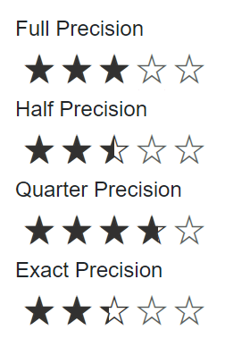

# Precision Modes in Blazor Rating Component

Use the [Precision](https://help.syncfusion.com/cr/blazor/Syncfusion.Blazor.Inputs.SfRating.html#Syncfusion_Blazor_Inputs_SfRating_Precision) property of the Blazor Rating component to control how finely users can select values. The default precision is `Full`. Interaction by mouse and keyboard follows the selected precision step.

The Blazor Rating component supports the following precision modes:

* Full: Increases in whole-number steps (1.0). For example, from 2 the next possible ratings include 3, 4, and so on.
* Half: Increases in 0.5 steps. For example, from 2.5 the next possible ratings include 3, 3.5, 4, and so on.
* Quarter: Increases in 0.25 steps. For example, from 3.75 the next possible ratings include 4, 4.25, 4.5, and so on.
* Exact: Increases in 0.1 steps. For example, from 3.9 the next possible ratings include 4, 4.1, 4.2, and so on.

```cshtml

@using Syncfusion.Blazor.Inputs

<label>Full Precision</label><br/>
<SfRating Value="3" Precision="PrecisionType.Full"></SfRating><br/>

<label>Half Precision</label><br/>
<SfRating Value="2.5" Precision="PrecisionType.Half"></SfRating><br/>

<label>Quarter Precision</label><br/>
<SfRating Value="3.75" Precision="PrecisionType.Quarter"></SfRating><br/>

<label>Exact Precision</label><br/>
<SfRating Value="2.3" Precision="PrecisionType.Exact"></SfRating><br/>

```

