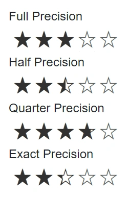

# Precision Modes in Blazor Rating Component

> **Prerequisites:** Install the [Syncfusion.Blazor](https://www.nuget.org/packages/Syncfusion.Blazor) NuGet package and add `@using Syncfusion.Blazor.Inputs` to your component.

> **Supported versions:** Syncfusion Blazor `Syncfusion.Blazor` (compatible with .NET 6.0, .NET 7.0, .NET 8.0, and .NET 9.0).

Use the [Precision](https://help.syncfusion.com/cr/blazor/Syncfusion.Blazor.Inputs.SfRating.html#Syncfusion_Blazor_Inputs_SfRating_Precision) property of the Blazor Rating component to control the step size users can select per item. The default precision is `Full`. Mouse clicks, touch taps, and keyboard arrow keys all increment the value by the selected precision step. When `Precision` is combined with `Min`, the resulting value snaps to the nearest valid step that is greater than or equal to `Min`.

The Blazor Rating component supports the following precision modes:

* **Full** - Increases in whole-number steps (1.0) per item. For example, from 2 the next possible ratings include 3, 4, and so on.
* **Half** - Increases in 0.5 steps per item. For example, from 2.5 the next possible ratings include 3, 3.5, 4, and so on.
* **Quarter** - Increases in 0.25 steps per item. For example, from 3.75 the next possible ratings include 4, 4.25, 4.5, and so on.
* **Exact** - Increases in 0.1 steps per item (the smallest supported step). For example, from 3.9 the next possible ratings include 4, 4.1, 4.2, and so on.

```cshtml

@using Syncfusion.Blazor.Inputs

<label>Full Precision</label><br/>
<SfRating Value="3" Precision=PrecisionType.Full></SfRating><br/>

<label>Half Precision</label><br/>
<SfRating Value="2.5" Precision=PrecisionType.Half></SfRating><br/>

<label>Quarter Precision</label><br/>
<SfRating Value="3.75" Precision=PrecisionType.Quarter></SfRating><br/>

<label>Exact Precision</label><br/>
<SfRating Value="2.3" Precision=PrecisionType.Exact></SfRating><br/>

```

