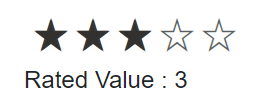

# Selection in Blazor Rating Component

The Blazor Rating component lets users choose a value using a visual scale. Selection can be changed by clicking or tapping the icons, or programmatically. Key options include the current value, minimum value, single-selection behavior, and an optional reset button.


```cshtml

@using Syncfusion.Blazor.Inputs

<SfRating Value="3"></SfRating>

```


## Selected value

Use the [Value](https://help.syncfusion.com/cr/blazor/Syncfusion.Blazor.Inputs.SfRating.html#Syncfusion_Blazor_Inputs_SfRating_Value) property to get or set the currently selected rating. The value is a double and can be updated with two-way binding or by setting it programmatically. The selected value determines which items are rendered as selected and respects the configured precision, minimum, and item count.

```cshtml

@using Syncfusion.Blazor.Inputs

<SfRating @bind-Value=value></SfRating>
<br/>
Rated Value : @value
@code{
    double value= 3;    
}

```



## Min value

Use the [Min](https://help.syncfusion.com/cr/blazor/Syncfusion.Blazor.Inputs.SfRating.html#Syncfusion_Blazor_Inputs_SfRating_Min) property to set the lowest selectable rating. For example, if `Min` is 2, selecting a value lower than 2 is not permitted. If the current `Value` is below `Min`, it snaps to the minimum.

```cshtml

@using Syncfusion.Blazor.Inputs

<SfRating Min="2"></SfRating>

```


## Single selection

Use the [EnableSingleSelection](https://help.syncfusion.com/cr/blazor/Syncfusion.Blazor.Inputs.SfRating.html#Syncfusion_Blazor_Inputs_SfRating_EnableSingleSelection) property to visually select only one item at a time. When set to `true`, only the chosen item appears selected while the others appear unselected. The `Value` still reflects the selected item index according to the configured precision.

```cshtml

@using Syncfusion.Blazor.Inputs

<SfRating Value="3" EnableSingleSelection=true></SfRating>

```


## Show or hide reset button

Use the [AllowReset](https://help.syncfusion.com/cr/blazor/Syncfusion.Blazor.Inputs.SfRating.html#Syncfusion_Blazor_Inputs_SfRating_AllowReset) property to display a reset button. When `AllowReset` is `true`, a reset control appears that resets the rating to the `Min` value. By default, `AllowReset` is `false`.

```cshtml

@using Syncfusion.Blazor.Inputs

<SfRating Value="3" AllowReset=true></SfRating>

```

