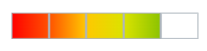

# Templates in Blazor Rating Component

The Blazor Rating component supports templates to customize the appearance of rating items. Templates let you define custom content for items to create tailored and interactive experiences.

The rating component supports the following templates for item customization:

* [EmptyTemplate](https://help.syncfusion.com/cr/blazor/Syncfusion.Blazor.Inputs.SfRating.html#Syncfusion_Blazor_Inputs_SfRating_EmptyTemplate): Template applied to unrated items.
* [FullTemplate](https://help.syncfusion.com/cr/blazor/Syncfusion.Blazor.Inputs.SfRating.html#Syncfusion_Blazor_Inputs_SfRating_FullTemplate): Template applied to rated items.

## Empty (unrated) symbol template

Use the `EmptyTemplate` tag directive to customize the appearance of unrated items. The [RatingItemContext](https://help.syncfusion.com/cr/blazor/Syncfusion.Blazor.Inputs.RatingItemContext.html) is passed as the `context` to the template and provides information such as the item `Value` and `Index`. If `FullTemplate` is not defined, `EmptyTemplate` is used for both rated and unrated items; custom styles can differentiate the states for visual clarity.

```cshtml

@using Syncfusion.Blazor.Inputs

<SfRating Value="3">
    <EmptyTemplate>
        <span class='custom-font sf-rating-heart'></span>
    </EmptyTemplate>
</SfRating>

<style>
    .e-rating-container .custom-font {
        /* To add the background color for the font icon. */
        background: linear-gradient(to right, rgb(254,87,133,255) var(--rating-value), transparent var(--rating-value));
        /* To clip the background to the icon (text) alone. */
        background-clip: text;
        -webkit-background-clip: text;
        /* To make the background color visible instead of font color. */
        -webkit-text-fill-color: transparent;
        /* To provide a border for font icon. */
        -webkit-text-stroke: 1px rgb(254,87,133,255);
    }

    @@font-face {
        font-family: 'rating';
        src: url(data:application/x-font-ttf;charset=utf-8;base64,AAEAAAAKAIAAAwAgT1MvMj1uSfQAAAEoAAAAVmNtYXDnEudaAAABjAAAADhnbHlm4LiFsgAAAcwAAAJsaGVhZCKCSVkAAADQAAAANmhoZWEIUQQEAAAArAAAACRobXR4DAAAAAAAAYAAAAAMbG9jYQCMATYAAAHEAAAACG1heHABDwCZAAABCAAAACBuYW1l75Kp8wAABDgAAAIZcG9zdDjyU90AAAZUAAAANwABAAAEAAAAAFwEAAAAAAAD9AABAAAAAAAAAAAAAAAAAAAAAwABAAAAAQAA2T6Kh18PPPUACwQAAAAAAN+4AkEAAAAA37gCQQAAAAAD9APaAAAACAACAAAAAAAAAAEAAAADAI0AAgAAAAAAAgAAAAoACgAAAP8AAAAAAAAAAQQAAZAABQAAAokCzAAAAI8CiQLMAAAB6wAyAQgAAAIABQMAAAAAAAAAAAAAAAAAAAAAAAAAAAAAUGZFZABA5wHnAgQAAAAAXAQAAAAAAAABAAAAAAAABAAAAAQAAAAEAAAAAAAAAgAAAAMAAAAUAAMAAQAAABQABAAkAAAABAAEAAEAAOcC//8AAOcB//8AAAABAAQAAAACAAEAAAAAAIwBNgABAAAAAAPzA9oAfAAAEw8WFR8PPw41Lx4jDwwvDw8GqAwMDAsKCgoJCAgIBwYGBQUEBAMCAgEBAQECAwMEBQULFSMhOVJliOxTOSEdFg0IBQQDAwIBAQEBAgIDBAQFBQYGBwgICAkKCgoLDAwMDAwMDQwMDQwZGBgYFxUVFBIRCAgGBwkLCwwNDg4PEBAQEREREhEODg4ODg4NA8IGBwcICAkJCgoKCwsMCwwNDA0MDQ0ODQ0ODQ0ODQ0NDRUiMCtEX26P/V5FKycjFhQNDQ0ODQ0ODQ0NDgwNDQwNCwwMCwoLCgoJCAkIBwcGBQUEAwMCAQECBQYJCw4PERMKCgsMEQ8PDQ0LCwoICAYFBAMCAQEBAgIEBAUAAgAAAAAD9APFAAMAjAAANzMRIwEPAxUXDwwRMzcfBDcXPwo9AS8FPwsvCDc1Pwg1LwU1Pw01LwkHJT8ENS8LIw8BDK2tAfkCCgQBAQEBGCERERITIgkJKBAGIQc1Bx45k9sOBQgLDQsJBQMEAgIECQYCAQEBAw4ECQgGBwMDAQEBAQMDAwkCAQEDFgsFBAQDAwICAgQECgEBAQQKBwcGBQUEAwMBAQEBBAUHCQUFBQYR/q0PCQQDAgEBAwMKDBUDBwYMCw0HB1oBhwHeAQUDA3YfCgQsOh0bHBovCQgbDP6KAQEfAwEBAQIBAQMGCgoMBggICAUICQgLBQQEBAUDBgMHCAgMCAcIBwYGBgUFCQQCBgIEDAkGBQYHCQkKCQgIBwsEAgUDAgQEBAUFBgcHCAcGBgYGCgkIBgICAQEBAUYxGRobDQ0MDQsiHjEEBAIEAQECAAAAEgDeAAEAAAAAAAAAAQAAAAEAAAAAAAEABgABAAEAAAAAAAIABwAHAAEAAAAAAAMABgAOAAEAAAAAAAQABgAUAAEAAAAAAAUACwAaAAEAAAAAAAYABgAlAAEAAAAAAAoALAArAAEAAAAAAAsAEgBXAAMAAQQJAAAAAgBpAAMAAQQJAAEADABrAAMAAQQJAAIADgB3AAMAAQQJAAMADACFAAMAAQQJAAQADACRAAMAAQQJAAUAFgCdAAMAAQQJAAYADACzAAMAAQQJAAoAWAC/AAMAAQQJAAsAJAEXIHJhdGluZ1JlZ3VsYXJyYXRpbmdyYXRpbmdWZXJzaW9uIDEuMHJhdGluZ0ZvbnQgZ2VuZXJhdGVkIHVzaW5nIFN5bmNmdXNpb24gTWV0cm8gU3R1ZGlvd3d3LnN5bmNmdXNpb24uY29tACAAcgBhAHQAaQBuAGcAUgBlAGcAdQBsAGEAcgByAGEAdABpAG4AZwByAGEAdABpAG4AZwBWAGUAcgBzAGkAbwBuACAAMQAuADAAcgBhAHQAaQBuAGcARgBvAG4AdAAgAGcAZQBuAGUAcgBhAHQAZQBkACAAdQBzAGkAbgBnACAAUwB5AG4AYwBmAHUAcwBpAG8AbgAgAE0AZQB0AHIAbwAgAFMAdAB1AGQAaQBvAHcAdwB3AC4AcwB5AG4AYwBmAHUAcwBpAG8AbgAuAGMAbwBtAAAAAAIAAAAAAAAACgAAAAAAAAAAAAAAAAAAAAAAAAAAAAAAAwECAQMBBAAFaGVhcnQFdGh1bWIAAAA=) format('truetype');
        font-weight: normal;
        font-style: normal;
    }

    [class^="sf-rating-"], [class*=" sf-rating-"] {
        font-family: 'rating' !important;
        speak: none;
        font-style: normal;
        font-weight: normal;
        font-variant: normal;
        text-transform: none;
        line-height: 1;
        -webkit-font-smoothing: antialiased;
        -moz-osx-font-smoothing: grayscale;
    }

    .sf-rating-heart:before {
        content: "\e702";
    }
</style>

```


N> The current value of the rating item is available in the template context (`RatingItemContext`) as `Value` and `Index`. The rating item element also exposes a CSS custom property (`--rating-value`) representing the filled portion, which can be used to support precision in templates.

## Full (rated) symbol template

To customize the appearance of **rated** items in the Syncfusion<sup style="font-size:70%">&reg;</sup> Blazor rating component, you can use the `FullTemplate` tag directive. This directive allows you to specify a custom layout for the rated items, which can include any content you desire.
The [RatingItemContext](https://help.syncfusion.com/cr/blazor/Syncfusion.Blazor.Inputs.RatingItemContext.html) is passed as a `context` to the template, allowing it to access information about the rated item, such as its `Value` and `Index`.

```cshtml

@using Syncfusion.Blazor.Inputs

<SfRating Value="3">
    <FullTemplate>
        <span class='custom-font sf-icon-fill-star'></span>
    </FullTemplate>
    <EmptyTemplate>
        <span class='custom-font sf-icon-empty-star'></span>
    </EmptyTemplate>
</SfRating>

<style>

    .e-rating-container .custom-font {
        /* To change the icon font color. */
        color: rgb(255,215,0);
    }

    @@font-face {
        font-family: 'rating-template';
        src: url(data:application/x-font-ttf;charset=utf-8;base64,AAEAAAAKAIAAAwAgT1MvMj1tSfMAAAEoAAAAVmNtYXDnEOdaAAABjAAAADhnbHlm+icDjQAAAcwAAAE0aGVhZCK49ucAAADQAAAANmhoZWEIUQQEAAAArAAAACRobXR4DAAAAAAAAYAAAAAMbG9jYQAcAJoAAAHEAAAACG1heHABDwBkAAABCAAAACBuYW1lmYExxgAAAwAAAAKFcG9zdCH169QAAAWIAAAAQAABAAAEAAAAAFwEAAAAAAAD9AABAAAAAAAAAAAAAAAAAAAAAwABAAAAAQAAgPX4jF8PPPUACwQAAAAAAN/TWPsAAAAA39NY+wAAAAAD9AP0AAAACAACAAAAAAAAAAEAAAADAFgAAgAAAAAAAgAAAAoACgAAAP8AAAAAAAAAAQQAAZAABQAAAokCzAAAAI8CiQLMAAAB6wAyAQgAAAIABQMAAAAAAAAAAAAAAAAAAAAAAAAAAAAAUGZFZABA5wDnAQQAAAAAXAQAAAAAAAABAAAAAAAABAAAAAQAAAAEAAAAAAAAAgAAAAMAAAAUAAMAAQAAABQABAAkAAAABAAEAAEAAOcB//8AAOcA//8AAAABAAQAAAABAAIAAAAAABwAmgABAAAAAAP0A/QACQAAAQUTAyUFAxMlAwFn/qX6OwE1ATU7+v6lmQKsNf7//pasrAFqAQE1AUgAAAIAAAAAA/QD5AAdAFcAAAEfBAUPAxUTLwEjDwETNS8DJT8EJwMFDwQVHwIDBx8EMzclBRczPwU1Az8CNS8DJQMvBisBDwUCYAICBgMHASCwBAMCGuoHCAjpGgIDBLEBHgcGBgJiHXb+uQgHBgQBAgTUHgECBAUHCAkIAQ4BDgcJBAQEBwQDHdMEAgMFBgf+tHYDAgMEBAQEBQUEBAQEAwICnwMDBgIDNbAGBgYE/uCBAgKBAR0HBgYGsDQCBAYD3Fr+9jwDBAcHBQgIB9T+twUIBwcEAwKVlQIBAgIFBwgJAUnUBwgJCAcFBD0BCgQDBAICAgEBAgICBAMAAAAAEgDeAAEAAAAAAAAAAQAAAAEAAAAAAAEADwABAAEAAAAAAAIABwAQAAEAAAAAAAMADwAXAAEAAAAAAAQADwAmAAEAAAAAAAUACwA1AAEAAAAAAAYADwBAAAEAAAAAAAoALABPAAEAAAAAAAsAEgB7AAMAAQQJAAAAAgCNAAMAAQQJAAEAHgCPAAMAAQQJAAIADgCtAAMAAQQJAAMAHgC7AAMAAQQJAAQAHgDZAAMAAQQJAAUAFgD3AAMAAQQJAAYAHgENAAMAAQQJAAoAWAErAAMAAQQJAAsAJAGDIHJhdGluZy10ZW1wbGF0ZVJlZ3VsYXJyYXRpbmctdGVtcGxhdGVyYXRpbmctdGVtcGxhdGVWZXJzaW9uIDEuMHJhdGluZy10ZW1wbGF0ZUZvbnQgZ2VuZXJhdGVkIHVzaW5nIFN5bmNmdXNpb24gTWV0cm8gU3R1ZGlvd3d3LnN5bmNmdXNpb24uY29tACAAcgBhAHQAaQBuAGcALQB0AGUAbQBwAGwAYQB0AGUAUgBlAGcAdQBsAGEAcgByAGEAdABpAG4AZwAtAHQAZQBtAHAAbABhAHQAZQByAGEAdABpAG4AZwAtAHQAZQBtAHAAbABhAHQAZQBWAGUAcgBzAGkAbwBuACAAMQAuADAAcgBhAHQAaQBuAGcALQB0AGUAbQBwAGwAYQB0AGUARgBvAG4AdAAgAGcAZQBuAGUAcgBhAHQAZQBkACAAdQBzAGkAbgBnACAAUwB5AG4AYwBmAHUAcwBpAG8AbgAgAE0AZQB0AHIAbwAgAFMAdAB1AGQAaQBvAHcAdwB3AC4AcwB5AG4AYwBmAHUAcwBpAG8AbgAuAGMAbwBtAAAAAAIAAAAAAAAACgAAAAAAAAAAAAAAAAAAAAAAAAAAAAAAAwECAQMBBAAJZmlsbC1zdGFyCmVtcHR5LXN0YXIAAA==) format('truetype');
        font-weight: normal;
        font-style: normal;
    }

    [class^="sf-icon-"], [class*=" sf-icon-"] {
        font-family: 'rating-template' !important;
        speak: none;
        font-style: normal;
        font-weight: normal;
        font-variant: normal;
        text-transform: none;
        line-height: 1;
        -webkit-font-smoothing: antialiased;
        -moz-osx-font-smoothing: grayscale;
    }

    .sf-icon-fill-star:before {
        content: "\e700";
    }

    .sf-icon-empty-star:before {
        content: "\e701";
    }

</style>

```


## Using Emoji icon as rating symbol

Use emoji as rating symbols by placing them as template content within the `EmptyTemplate` tag directive. This approach works well with single selection and animations disabled for a clean experience.

```cshtml

@using Syncfusion.Blazor.Inputs

<SfRating Value=4 EnableSingleSelection=true EnableAnimation=false>
    <EmptyTemplate>
        @{
            if (context.Index == 0)
            {
                <span class='angry emoji'>😡</span>
            }
            else if (context.Index == 1)
            {
                <span class='disagree emoji'>🙁</span>
            }
            else if (context.Index == 2)
            {
                <span class='neutral emoji'>😐</span>
            }
            else if (context.Index == 3)
            {
                <span class='agree emoji'>🙂</span>
            }
            else
            {
                <span class='happy emoji'>😀</span>
            }
        }
    </EmptyTemplate>
</SfRating>

<style>
    /* To change the color of an unselected rating item. */
    .e-rating-item-container:not(.e-rating-selected) .emoji {
        filter: grayscale(1);
    }
</style>

```


## Using SVG icon as rating symbol

Use SVG icons as rating symbols by specifying them as template content within the `EmptyTemplate` and `FullTemplate` tag directives. Gradients can be applied per item using unique IDs derived from the item index.

```cshtml

@using Syncfusion.Blazor.Inputs

<SfRating Value="4" EnableAnimation=false>
    <EmptyTemplate>
        <svg width="35" height="25" class="e-rating-svg-icon">
            <rect width="35" height="25" fill="transparent" style="stroke-width:2;stroke:rgb(173,181,189)" />
        </svg>
    </EmptyTemplate>
    <FullTemplate>
        <svg width="35" height="25" class="e-rating-svg-icon">
            <defs>
                <linearGradient id=@("grad"+context.Index.ToString()) x1="0%" y1="0%" x2="100%" y2="0%">
                    <stop class="start" offset="0%" />
                    <stop class="end" offset="100%" />
                </linearGradient>
            </defs>
            <rect width="35" height="25" fill=@("url(#grad"+context.Index.ToString()+")") style="stroke-width:2;stroke:rgb(173,181,189)" />
        </svg>
    </FullTemplate>
</SfRating>

<style>
    /* To change the size between items */
    .e-rating-container .e-rating-item-container {
        padding: 0px;
    }

    /* To set the gradient color */
    .e-rating-svg-icon #grad0 .start {
        stop-color: #FF0000;
    }

    .e-rating-svg-icon #grad0 .end,
    .e-rating-svg-icon #grad1 .start {
        stop-color: #ff5101;
    }

    .e-rating-svg-icon #grad1 .end,
    .e-rating-svg-icon #grad2 .start {
        stop-color: #ffc801;
    }

    .e-rating-svg-icon #grad2 .end,
    .e-rating-svg-icon #grad3 .start {
        stop-color: #dbe300;
    }

    .e-rating-svg-icon #grad3 .end,
    .e-rating-svg-icon #grad4 .start {
        stop-color: #8bc301;
    }

    .e-rating-svg-icon #grad4 .end {
        stop-color: #4eaa01;
    }

</style>

```



## Using PNG image as rating symbol

Use PNG images as rating symbols by specifying them as template content within the `EmptyTemplate` and `FullTemplate` tag directives.

```cshtml

@using Syncfusion.Blazor.Inputs

<SfRating Value="3">
    <FullTemplate>
        
    </FullTemplate>
    <EmptyTemplate>
        
    </EmptyTemplate>
</SfRating>

@code {
    private string fullTemplateImage = "";//Provide the URL for the image here.
    private string emptyTemplateImage = "";//Provide the URL for the image here.
}

```

