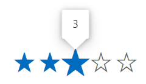
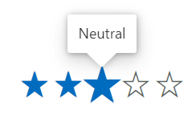
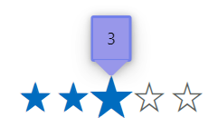

# Tooltip in Blazor Rating Component

The Blazor rating component supports tooltip to show additional information in rating items by setting the [ShowTooltip](https://help.syncfusion.com/cr/blazor/Syncfusion.Blazor.Inputs.SfRating.html#Syncfusion_Blazor_Inputs_SfRating_ShowTooltip) property. If enabled, the tooltip appears when the user hovers over a rating item.

```cshtml

@using Syncfusion.Blazor.Inputs

<SfRating Value="3" ShowTooltip=true></SfRating>

```



## Tooltip template

You can use the [TooltipTemplate](https://help.syncfusion.com/cr/blazor/Syncfusion.Blazor.Inputs.SfRating.html#Syncfusion_Blazor_Inputs_SfRating_TooltipTemplate) tag directive to specify a custom template for the `Tooltip` of the rating. The current value of the rating will be passed as the `context` when building the content of the tooltip. This allows you to include dynamic information about the rating in the template.

```cshtml

@using Syncfusion.Blazor.Inputs

<SfRating Value=4 ShowTooltip=true>
    <TooltipTemplate>
        <b>@((context == 1)?"Angry":(context == 2)?"Sad":(context == 3)?"Neutral":(context == 4)?"Good":"Happy")</b>
    </TooltipTemplate>
</SfRating>

```



## Tooltip customization

You can customize the appearance of the tooltips using the `CssClass` property of the Blazor Rating component and by defining the custom styles for tooltip elements like the below example.

N> You can find more information about customizing the appearance of the tooltip in the [Tooltip Customization](https://blazor.syncfusion.com/documentation/tooltip/style) documentation.

```cshtml

@using Syncfusion.Blazor.Inputs

<SfRating Value="3" CssClass="customtooltip" ShowTooltip=true></SfRating>

<style>

    /* To change the radius of the tooltip corners. */
    .customtooltip .e-tooltip-wrap {
        border-radius: 3px;
    }

    /* To change the size of the tooltip content. */
    .customtooltip .e-tooltip-wrap .e-tip-content {
        font-size:14px;
    }

    /* To change the border color and width for tooltip. */
    .customtooltip .e-tooltip-wrap.e-popup {
        border: 2px solid #969393;
    }

    /* To change the color for arrow of the tooltip. */
    .customtooltip .e-tooltip-wrap .e-arrow-tip-inner.e-tip-bottom {
        border: 12px solid #9693
    }

    /* To change the top border color for arrow of the tooltip. */
    .customtooltip .e-tooltip-wrap .e-arrow-tip-outer.e-tip-bottom {
        border-top: 12.5px solid #969393;
    }

</style>

```

