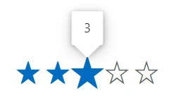
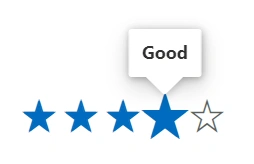
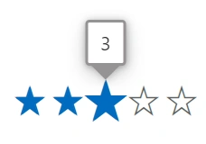

# Tooltip in Blazor Rating

The Blazor Rating component provides tooltip support to display additional information for rating items. Set the [ShowTooltip](https://help.syncfusion.com/cr/blazor/Syncfusion.Blazor.Inputs.SfRating.html#Syncfusion_Blazor_Inputs_SfRating_ShowTooltip) property to control the visibility of tooltips. By default, this property is set to true, and a tooltip is displayed when the user hovers over a rating item. When set to false, tooltips are disabled and will not be shown for rating items.

```cshtml

@using Syncfusion.Blazor.Inputs

<SfRating Value="3" ShowTooltip=true></SfRating>

```



## Tooltip template

Use the [TooltipTemplate](https://help.syncfusion.com/cr/blazor/Syncfusion.Blazor.Inputs.SfRating.html#Syncfusion_Blazor_Inputs_SfRating_TooltipTemplate) tag directive to define custom content for the tooltip. The current item’s value is passed to the template as the `context` (a double), allowing dynamic tooltip content based on the hovered item.

```cshtml

@using Syncfusion.Blazor.Inputs

<SfRating Value=4 ShowTooltip=true>
    <TooltipTemplate>
        <b>@((context == 1) ? "Angry" : (context == 2) ? "Sad" : (context == 3) ? "Neutral" : (context == 4) ? "Good" : "Happy")</b>
    </TooltipTemplate>
</SfRating>

```



## Tooltip customization

Use the `CssClass` property on the Rating component and write styles scoped to that class to customize the tooltip. The class is applied to the component's root element, so you can target the nested tooltip elements without affecting other tooltips on the page.

> For more details on styling options, refer to the [Tooltip styling documentation](https://blazor.syncfusion.com/documentation/tooltip/style). For accessibility, ensure tooltip text is concise, meaningful, and readable; tooltips should supplement visible information rather than replace it.

```cshtml

@using Syncfusion.Blazor.Inputs

<SfRating Value="3" CssClass="customtooltip" ShowTooltip=true></SfRating>

<style>

    /* To change the radius of the tooltip corners. */
    .customtooltip .e-tooltip-wrap {
        border-radius: 3px;
    }

    /* To change the size of the tooltip content. */
    .customtooltip .e-tooltip-wrap .e-tip-content {
        font-size: 14px;
    }

    /* To change the border color and width for tooltip. */
    .customtooltip .e-tooltip-wrap.e-popup {
        border: 2px solid #969393;
    }

    /* To change the color for arrow of the tooltip. */
    .customtooltip .e-tooltip-wrap .e-arrow-tip-inner.e-tip-bottom {
        border: 12px solid #9693
    }

    /* To change the top border color for arrow of the tooltip. */
    .customtooltip .e-tooltip-wrap .e-arrow-tip-outer.e-tip-bottom {
        border-top: 8px solid #969393;
    }

</style>

```

