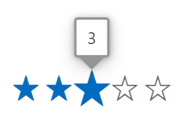

# Tooltip in Blazor Rating Component

The Tooltip of the Rating which used to display the current value of a rating. Using the [ShowTooltip](https://help.syncfusion.com/cr/blazor/Syncfusion.Blazor.Inputs.SfRating.html#Syncfusion_Blazor_Inputs_SfRating_ShowTooltip) property.

Below example demonstrates Tooltip of Rating.

```cshtml

@using Syncfusion.Blazor.Inputs

<SfRating ShowTooltip=true></SfRating>

```


## Tooltip Template

The Rating supports to customize the content of the tooltip by setting [TooltipTemplate](https://help.syncfusion.com/cr/blazor/Syncfusion.Blazor.Inputs.SfRating.html#Syncfusion_Blazor_Inputs_SfRating_TooltipTemplate) tag directive.

Below example demonstrates the tooltip template of Rating.

```cshtml

@using Syncfusion.Blazor.Inputs

<SfRating ShowTooltip=true>
    <TooltipTemplate>@context Star</TooltipTemplate>
</SfRating>

```


## Tooltip Customization

The Rating Tooltip can be customized by using the CssClass property, which accepts custom CSS class names that defines the specific user-defined styles and themes to be applied on the Tooltip element.

Below example demonstrates the tooltip template of Rating.

```cshtml

@using Syncfusion.Blazor.Inputs

<SfRating CssClass="customtooltip" ShowTooltip=true></SfRating>

<style>
    .customtooltip .e-tooltip-wrap.e-popup {
        background-color: #2682cb;
        border: 2px solid #5074cd;
    }

    .customtooltip .e-tooltip-wrap .e-arrow-tip-inner.e-tip-bottom {
        color: #2682cb;
    }

    .customtooltip .e-tooltip-wrap .e-arrow-tip-outer.e-tip-bottom {
        border-top: #2682cb;
    }
</style>

```

