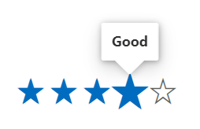

# Tooltip in Blazor Rating Component

The Blazor Rating component supports tooltips that display additional information for rating items by enabling the [ShowTooltip](https://help.syncfusion.com/cr/blazor/Syncfusion.Blazor.Inputs.SfRating.html#Syncfusion_Blazor_Inputs_SfRating_ShowTooltip) property. When enabled (default is `false`), a tooltip appears when the user hovers over a rating item.

```cshtml

@using Syncfusion.Blazor.Inputs

<SfRating Value="3" ShowTooltip=true></SfRating>

```


## Tooltip template

Use the [TooltipTemplate](https://help.syncfusion.com/cr/blazor/Syncfusion.Blazor.Inputs.SfRating.html#Syncfusion_Blazor_Inputs_SfRating_TooltipTemplate) tag directive to define custom content for the tooltip. The current item’s value is passed to the template as the `context` (a double), allowing dynamic tooltip content based on the hovered item.

```cshtml

@using Syncfusion.Blazor.Inputs

<SfRating Value=4 ShowTooltip=true>
    <TooltipTemplate>
        <b>@((context == 1)?"Angry":(context == 2)?"Sad":(context == 3)?"Neutral":(context == 4)?"Good":"Happy")</b>
    </TooltipTemplate>
</SfRating>

```



## Tooltip customization

Customize the appearance of tooltips by assigning a custom CSS class using the `CssClass` property on the Blazor Rating component and writing styles scoped to that class. The class is applied to the component’s root element, which lets you target the nested tooltip elements without affecting other tooltips.

N> For more details on styling options, refer to the [tooltip customization](https://blazor.syncfusion.com/documentation/tooltip/style) documentation. For accessibility, ensure tooltip text is concise, meaningful, and readable. Tooltips should supplement visible information.

```cshtml

@using Syncfusion.Blazor.Inputs

<SfRating Value="3" CssClass="customtooltip" ShowTooltip=true></SfRating>

<style>

    /* To change the radius of the tooltip corners. */
    .customtooltip .e-tooltip-wrap {
        border-radius: 3px;
    }

    /* To change the size of the tooltip content. */
    .customtooltip .e-tooltip-wrap .e-tip-content {
        font-size:14px;
    }

    /* To change the border color and width for tooltip. */
    .customtooltip .e-tooltip-wrap.e-popup {
        border: 2px solid #969393;
    }

    /* To change the color for arrow of the tooltip. */
    .customtooltip .e-tooltip-wrap .e-arrow-tip-inner.e-tip-bottom {
        border: 12px solid #9693
    }

    /* To change the top border color for arrow of the tooltip. */
    .customtooltip .e-tooltip-wrap .e-arrow-tip-outer.e-tip-bottom {
        border-top: 12.5px solid #969393;
    }

</style>

```

