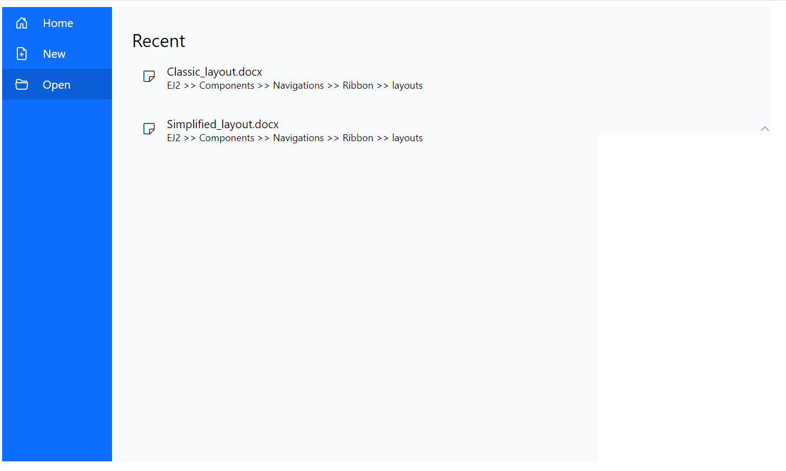

# Backstage in Blazor Ribbon component

The Ribbon component supports a backstage view as an enhancement to the traditional file menu. The backstage view displays options such as application settings, user details, and more. It is configured using the [RibbonBackstageMenuSettings](https://help.syncfusion.com/cr/blazor/Syncfusion.Blazor.Ribbon.RibbonBackstageMenuSettings.html) tag directive.

Backstage menu options appear on the left panel, and the corresponding content is shown on the right panel.

## Visibility

Set the [Visible](https://help.syncfusion.com/cr/blazor/Syncfusion.Blazor.Ribbon.RibbonBackstageMenuSettings.html#Syncfusion_Blazor_Ribbon_RibbonBackstageMenuSettings_Visible) property of the [RibbonBackstageMenuSettings](https://help.syncfusion.com/cr/blazor/Syncfusion.Blazor.Ribbon.RibbonBackstageMenuSettings.html) tag directive to `true` to show the backstage view. By default, the backstage view is hidden.

## Adding backstage items

Add menu items to the backstage view using the [BackstageMenuItems](https://help.syncfusion.com/cr/blazor/Syncfusion.Blazor.Ribbon.BackstageMenuItems.html) tag directive. Each menu item can define properties such as [ID](https://help.syncfusion.com/cr/blazor/Syncfusion.Blazor.Ribbon.BackstageMenuItem.html#Syncfusion_Blazor_Ribbon_BackstageMenuItem_ID), [Text](https://help.syncfusion.com/cr/blazor/Syncfusion.Blazor.Ribbon.BackstageMenuItem.html#Syncfusion_Blazor_Ribbon_BackstageMenuItem_Text), [IconCss](https://help.syncfusion.com/cr/blazor/Syncfusion.Blazor.Ribbon.BackstageMenuItem.html#Syncfusion_Blazor_Ribbon_BackstageMenuItem_IconCss), and content templates.




@using Syncfusion.Blazor.Ribbon;
@using Syncfusion.Blazor.SplitButtons;

    <SfRibbon>
        <RibbonBackstageMenuSettings Text="File" Visible="true">
            <BackstageMenuItems>
                <BackstageMenuItem ID="home" Text="Home" IconCss="e-icons e-home">@GetBackstageContent("home")</BackstageMenuItem>
                <BackstageMenuItem ID="new" Text="New" IconCss="e-icons e-file-new">@GetBackstageContent("new")</BackstageMenuItem>
                <BackstageMenuItem ID="open" Text="Open" IconCss="e-icons e-folder-open">@GetBackstageContent("open")</BackstageMenuItem>
            </BackstageMenuItems>
        </RibbonBackstageMenuSettings>
        <RibbonTabs>
            <RibbonTab HeaderText="Home">
                <RibbonGroups>
                    <RibbonGroup HeaderText="Clipboard">
                        <RibbonCollections>
                            <RibbonCollection>
                                <RibbonItems>
                                    <RibbonItem Type=RibbonItemType.SplitButton>
                                        <RibbonSplitButtonSettings Content="Paste" IconCss="e-icons e-paste" Items="@formatItems"></RibbonSplitButtonSettings>
                                    </RibbonItem>
                                </RibbonItems>
                            </RibbonCollection>
                            <RibbonCollection>
                                <RibbonItems>
                                    <RibbonItem Type=RibbonItemType.Button>
                                        <RibbonButtonSettings Content="Cut" IconCss="e-icons e-cut" ></RibbonButtonSettings>
                                    </RibbonItem>
                                    <RibbonItem Type=RibbonItemType.Button>
                                        <RibbonButtonSettings Content="Copy" IconCss="e-icons e-copy"></RibbonButtonSettings>
                                    </RibbonItem>
                                    <RibbonItem Type=RibbonItemType.Button>
                                        <RibbonButtonSettings Content="Format Painter" IconCss="e-icons e-format-painter"></RibbonButtonSettings>
                                    </RibbonItem>
                                </RibbonItems>
                            </RibbonCollection>
                        </RibbonCollections>
                    </RibbonGroup>
                </RibbonGroups>
            </RibbonTab>
        </RibbonTabs>
    </SfRibbon>

@code{
    List<DropDownMenuItem> formatItems = new List<DropDownMenuItem>()
    {
        new DropDownMenuItem{ Text = "Keep Source Format" },
        new DropDownMenuItem{ Text = "Merge Format" },
        new DropDownMenuItem{ Text = "Keep Text Only" }
    };

    RenderFragment GetBackstageContent(string item) => item switch
{
    "home" => @

    

        
New

        

            

            New document
        

    

    

        
Recent

        @{
    var recentDocuments = new List<(string icon, string name, string description)>
    {
    ("e-notes", "Classic_layout.docx", "EJ2 >> Components >> Navigations >> Ribbon >> layouts"),
    };
        }
        @foreach (var doc in recentDocuments)
    {
        @RenderWrapperContent(doc.icon, doc.name, doc.description)
    }
    

,
    "new" => @

    
New

    

        

        New document
    

,
    "open" => @

    
Recent

    @{
var recentDocuments = new List<(string icon, string name, string description)>
{
("e-notes", "Classic_layout.docx", "EJ2 >> Components >> Navigations >> Ribbon >> layouts"),
("e-notes", "Simplified_layout.docx", "EJ2 >> Components >> Navigations >> Ribbon >> layouts"),
};
    }
    @foreach (var doc in recentDocuments)
{
    @RenderWrapperContent(doc.icon, doc.name, doc.description)
}

};

RenderFragment RenderWrapperContent(string icon, string name, string description) =>
@

    <table>
        <tbody>
            <tr>
                <td></td>
                <td>
                    @name
                    @description
                </td>
            </tr>
        </tbody>
    </table>

;
}




## Adding footer items

Add footer items to the backstage view by setting the [IsFooter](https://help.syncfusion.com/cr/blazor/Syncfusion.Blazor.Ribbon.BackstageMenuItem.html#Syncfusion_Blazor_Ribbon_BackstageMenuItem_IsFooter) property in the [BackstageMenuItem](https://help.syncfusion.com/cr/blazor/Syncfusion.Blazor.Ribbon.BackstageMenuItem.html) tag directive to `true`. Footer items are displayed at the bottom of the menu. By default, the value is `false`.




@using Syncfusion.Blazor.Ribbon;
@using Syncfusion.Blazor.SplitButtons;

    <SfRibbon>
        <RibbonBackstageMenuSettings Text="File" Visible="true">
            <BackstageMenuItems>
                <BackstageMenuItem ID="home" Text="Home" IconCss="e-icons e-home">@GetBackstageContent("home")</BackstageMenuItem>
                <BackstageMenuItem ID="new" Text="New" IconCss="e-icons e-file-new">@GetBackstageContent("new")</BackstageMenuItem>
                <BackstageMenuItem ID="open" Text="Open" IconCss="e-icons e-folder-open">@GetBackstageContent("open")</BackstageMenuItem>
                <BackstageMenuItem ID="account" Text="Account" IsFooter="true">@GetBackstageContent("account")</BackstageMenuItem>
            </BackstageMenuItems>
        </RibbonBackstageMenuSettings>
        <RibbonTabs>
            <RibbonTab HeaderText="Home">
                <RibbonGroups>
                    <RibbonGroup HeaderText="Clipboard">
                        <RibbonCollections>
                            <RibbonCollection>
                                <RibbonItems>
                                    <RibbonItem Type=RibbonItemType.SplitButton>
                                        <RibbonSplitButtonSettings Content="Paste" IconCss="e-icons e-paste" Items="@formatItems"></RibbonSplitButtonSettings>
                                    </RibbonItem>
                                </RibbonItems>
                            </RibbonCollection>
                            <RibbonCollection>
                                <RibbonItems>
                                    <RibbonItem Type=RibbonItemType.Button>
                                        <RibbonButtonSettings Content="Cut" IconCss="e-icons e-cut" ></RibbonButtonSettings>
                                    </RibbonItem>
                                    <RibbonItem Type=RibbonItemType.Button>
                                        <RibbonButtonSettings Content="Copy" IconCss="e-icons e-copy"></RibbonButtonSettings>
                                    </RibbonItem>
                                    <RibbonItem Type=RibbonItemType.Button>
                                        <RibbonButtonSettings Content="Format Painter" IconCss="e-icons e-format-painter"></RibbonButtonSettings>
                                    </RibbonItem>
                                </RibbonItems>
                            </RibbonCollection>
                        </RibbonCollections>
                    </RibbonGroup>
                </RibbonGroups>
            </RibbonTab>
        </RibbonTabs>
    </SfRibbon>

@code{
    List<DropDownMenuItem> formatItems = new List<DropDownMenuItem>()
    {
        new DropDownMenuItem{ Text = "Keep Source Format" },
        new DropDownMenuItem{ Text = "Merge Format" },
        new DropDownMenuItem{ Text = "Keep Text Only" }
    };

    RenderFragment GetBackstageContent(string item) => item switch
{
    "home" => @

    

        
New

        

            

            New document
        

    

    

        
Recent

        @{
    var recentDocuments = new List<(string icon, string name, string description)>
    {
    ("e-notes", "Classic_layout.docx", "EJ2 >> Components >> Navigations >> Ribbon >> layouts"),
    };
        }
        @foreach (var doc in recentDocuments)
    {
        @RenderWrapperContent(doc.icon, doc.name, doc.description)
    }
    

,
    "new" => @

    
New

    

        

        New document
    

,
    "open" => @

    
Recent

    @{
var recentDocuments = new List<(string icon, string name, string description)>
{
("e-notes", "Classic_layout.docx", "EJ2 >> Components >> Navigations >> Ribbon >> layouts"),
("e-notes", "Simplified_layout.docx", "EJ2 >> Components >> Navigations >> Ribbon >> layouts"),
};
    }
    @foreach (var doc in recentDocuments)
{
    @RenderWrapperContent(doc.icon, doc.name, doc.description)
}

,
    "account" => @

    
Account

    @{
var accountItems = new List<(string icon, string name, string description)>
{
("e-people", "Account type", "Administrator"),
};
    }
    @foreach (var item in accountItems)
{
    @RenderWrapperContent(item.icon, item.name, item.description)
}

,
};

RenderFragment RenderWrapperContent(string icon, string name, string description) =>
@

    <table>
        <tbody>
            <tr>
                <td></td>
                <td>
                    @name
                    @description
                </td>
            </tr>
        </tbody>
    </table>

;
}




## Adding separator

Separators are horizontal lines used to visually divide backstage menu items. Use the [Separator](https://help.syncfusion.com/cr/blazor/Syncfusion.Blazor.Ribbon.BackstageMenuItem.html#Syncfusion_Blazor_Ribbon_BackstageMenuItem_Separator) property to separate menu items.




@using Syncfusion.Blazor.Ribbon;
@using Syncfusion.Blazor.SplitButtons;

    <SfRibbon>
        <RibbonBackstageMenuSettings Text="File" Visible="true">
            <BackstageMenuItems>
                <BackstageMenuItem ID="home" Text="Home" IconCss="e-icons e-home">@GetBackstageContent("home")</BackstageMenuItem>
                <BackstageMenuItem ID="new" Text="New" IconCss="e-icons e-file-new">@GetBackstageContent("new")</BackstageMenuItem>
                <BackstageMenuItem ID="open" Text="Open" IconCss="e-icons e-folder-open">@GetBackstageContent("open")</BackstageMenuItem>
                <BackstageMenuItem Separator="true"></BackstageMenuItem>
                <BackstageMenuItem ID="account" Text="Account">@GetBackstageContent("account")</BackstageMenuItem>
            </BackstageMenuItems>
        </RibbonBackstageMenuSettings>
        <RibbonTabs>
            <RibbonTab HeaderText="Home">
                <RibbonGroups>
                    <RibbonGroup HeaderText="Clipboard">
                        <RibbonCollections>
                            <RibbonCollection>
                                <RibbonItems>
                                    <RibbonItem Type=RibbonItemType.SplitButton>
                                        <RibbonSplitButtonSettings Content="Paste" IconCss="e-icons e-paste" Items="@formatItems"></RibbonSplitButtonSettings>
                                    </RibbonItem>
                                </RibbonItems>
                            </RibbonCollection>
                            <RibbonCollection>
                                <RibbonItems>
                                    <RibbonItem Type=RibbonItemType.Button>
                                        <RibbonButtonSettings Content="Cut" IconCss="e-icons e-cut" ></RibbonButtonSettings>
                                    </RibbonItem>
                                    <RibbonItem Type=RibbonItemType.Button>
                                        <RibbonButtonSettings Content="Copy" IconCss="e-icons e-copy"></RibbonButtonSettings>
                                    </RibbonItem>
                                    <RibbonItem Type=RibbonItemType.Button>
                                        <RibbonButtonSettings Content="Format Painter" IconCss="e-icons e-format-painter"></RibbonButtonSettings>
                                    </RibbonItem>
                                </RibbonItems>
                            </RibbonCollection>
                        </RibbonCollections>
                    </RibbonGroup>
                </RibbonGroups>
            </RibbonTab>
        </RibbonTabs>
    </SfRibbon>

@code{
    List<DropDownMenuItem> formatItems = new List<DropDownMenuItem>()
    {
        new DropDownMenuItem{ Text = "Keep Source Format" },
        new DropDownMenuItem{ Text = "Merge Format" },
        new DropDownMenuItem{ Text = "Keep Text Only" }
    };

    RenderFragment GetBackstageContent(string item) => item switch
{
    "home" => @

    

        
New

        

            

            New document
        

    

    

        
Recent

        @{
    var recentDocuments = new List<(string icon, string name, string description)>
    {
    ("e-notes", "Classic_layout.docx", "EJ2 >> Components >> Navigations >> Ribbon >> layouts"),
    };
        }
        @foreach (var doc in recentDocuments)
    {
        @RenderWrapperContent(doc.icon, doc.name, doc.description)
    }
    

,
    "new" => @

    
New

    

        

        New document
    

,
    "open" => @

    
Recent

    @{
var recentDocuments = new List<(string icon, string name, string description)>
{
("e-notes", "Classic_layout.docx", "EJ2 >> Components >> Navigations >> Ribbon >> layouts"),
("e-notes", "Simplified_layout.docx", "EJ2 >> Components >> Navigations >> Ribbon >> layouts"),
};
    }
    @foreach (var doc in recentDocuments)
{
    @RenderWrapperContent(doc.icon, doc.name, doc.description)
}

,
    "account" => @

    
Account

    @{
var accountItems = new List<(string icon, string name, string description)>
{
("e-people", "Account type", "Administrator"),
};
    }
    @foreach (var item in accountItems)
{
    @RenderWrapperContent(item.icon, item.name, item.description)
}

,
};

RenderFragment RenderWrapperContent(string icon, string name, string description) =>
@

    <table>
        <tbody>
            <tr>
                <td></td>
                <td>
                    @name
                    @description
                </td>
            </tr>
        </tbody>
    </table>

;
}




## Back button

Use the [BackButtonSettings](https://help.syncfusion.com/cr/blazor/Syncfusion.Blazor.Ribbon.RibbonBackstageMenuSettings.html#Syncfusion_Blazor_Ribbon_RibbonBackstageMenuSettings_BackButtonSettings) property in the [RibbonBackstageMenuSettings](https://help.syncfusion.com/cr/blazor/Syncfusion.Blazor.Ribbon.RibbonBackstageMenuSettings.html) tag directive to customize the text and icon of the back button using the [Text](https://help.syncfusion.com/cr/blazor/Syncfusion.Blazor.Ribbon.BackstageBackButtonSettings.html#Syncfusion_Blazor_Ribbon_BackstageBackButtonSettings_Text) and [IconCss](https://help.syncfusion.com/cr/blazor/Syncfusion.Blazor.Ribbon.BackstageBackButtonSettings.html#Syncfusion_Blazor_Ribbon_BackstageBackButtonSettings_IconCss) properties. Show the back button by setting the [Visible](https://help.syncfusion.com/cr/blazor/Syncfusion.Blazor.Ribbon.BackstageBackButtonSettings.html#Syncfusion_Blazor_Ribbon_BackstageBackButtonSettings_Visible) property to `true`.




@using Syncfusion.Blazor.Ribbon;
@using Syncfusion.Blazor.SplitButtons;

    <SfRibbon>
        <RibbonBackstageMenuSettings Text="File" Visible="true" BackButtonSettings="@backStageBackButton">
            <BackstageMenuItems>
                <BackstageMenuItem ID="home" Text="Home" IconCss="e-icons e-home">@GetBackstageContent("home")</BackstageMenuItem>
            </BackstageMenuItems>
        </RibbonBackstageMenuSettings>
        <RibbonTabs>
            <RibbonTab HeaderText="Home">
                <RibbonGroups>
                    <RibbonGroup HeaderText="Clipboard">
                        <RibbonCollections>
                            <RibbonCollection>
                                <RibbonItems>
                                    <RibbonItem Type=RibbonItemType.SplitButton>
                                        <RibbonSplitButtonSettings Content="Paste" IconCss="e-icons e-paste" Items="@formatItems"></RibbonSplitButtonSettings>
                                    </RibbonItem>
                                </RibbonItems>
                            </RibbonCollection>
                            <RibbonCollection>
                                <RibbonItems>
                                    <RibbonItem Type=RibbonItemType.Button>
                                        <RibbonButtonSettings Content="Cut" IconCss="e-icons e-cut" ></RibbonButtonSettings>
                                    </RibbonItem>
                                    <RibbonItem Type=RibbonItemType.Button>
                                        <RibbonButtonSettings Content="Copy" IconCss="e-icons e-copy"></RibbonButtonSettings>
                                    </RibbonItem>
                                    <RibbonItem Type=RibbonItemType.Button>
                                        <RibbonButtonSettings Content="Format Painter" IconCss="e-icons e-format-painter"></RibbonButtonSettings>
                                    </RibbonItem>
                                </RibbonItems>
                            </RibbonCollection>
                        </RibbonCollections>
                    </RibbonGroup>
                </RibbonGroups>
            </RibbonTab>
        </RibbonTabs>
    </SfRibbon>

@code{

    BackstageBackButtonSettings backStageBackButton = new BackstageBackButtonSettings
    {
        Text = "Close",
        IconCss = "e-icons e-arrow-left",
        Visible = true
    };

    List<DropDownMenuItem> formatItems = new List<DropDownMenuItem>()
    {
        new DropDownMenuItem{ Text = "Keep Source Format" },
        new DropDownMenuItem{ Text = "Merge Format" },
        new DropDownMenuItem{ Text = "Keep Text Only" }
    };

    RenderFragment GetBackstageContent(string item) => item switch
{
    "home" => @

    

        
New

        

            

            New document
        

    

};
}




## Template

Customize backstage menu items and their content using the [Template](https://help.syncfusion.com/cr/blazor/Syncfusion.Blazor.Ribbon.RibbonBackstageMenuSettings.html#Syncfusion_Blazor_Ribbon_RibbonBackstageMenuSettings_Template) property in the [RibbonBackstageMenuSettings](https://help.syncfusion.com/cr/blazor/Syncfusion.Blazor.Ribbon.RibbonBackstageMenuSettings.html) tag directive.




@using Syncfusion.Blazor.Ribbon;
@using Syncfusion.Blazor.SplitButtons;

    <SfRibbon>
        <RibbonBackstageMenuSettings @ref=backstageRef Text="File" Visible="true">
            <Template>
                

                    

                        <ul>
                            <li id="close" @onclick="CloseContent">
                                 Close
                            </li>
                            @foreach(var item in backstageMenus)
                            {
                                <li id="@item.Value.name" @onclick="() => ContentClickHandler(item.Key)">
                                    
                                    @item.Value.name
                                </li>
                            }
                        </ul>
                    

                    @GetBackstageContent(selectedContent)
                

            </Template>
        </RibbonBackstageMenuSettings>
        <RibbonTabs>
            <RibbonTab HeaderText="Home">
                <RibbonGroups>
                    <RibbonGroup HeaderText="Clipboard">
                        <RibbonCollections>
                            <RibbonCollection>
                                <RibbonItems>
                                    <RibbonItem Type=RibbonItemType.SplitButton>
                                        <RibbonSplitButtonSettings Content="Paste" IconCss="e-icons e-paste" Items="@formatItems"></RibbonSplitButtonSettings>
                                    </RibbonItem>
                                </RibbonItems>
                            </RibbonCollection>
                            <RibbonCollection>
                                <RibbonItems>
                                    <RibbonItem Type=RibbonItemType.Button>
                                        <RibbonButtonSettings Content="Cut" IconCss="e-icons e-cut" ></RibbonButtonSettings>
                                    </RibbonItem>
                                    <RibbonItem Type=RibbonItemType.Button>
                                        <RibbonButtonSettings Content="Copy" IconCss="e-icons e-copy"></RibbonButtonSettings>
                                    </RibbonItem>
                                    <RibbonItem Type=RibbonItemType.Button>
                                        <RibbonButtonSettings Content="Format Painter" IconCss="e-icons e-format-painter"></RibbonButtonSettings>
                                    </RibbonItem>
                                </RibbonItems>
                            </RibbonCollection>
                        </RibbonCollections>
                    </RibbonGroup>
                </RibbonGroups>
            </RibbonTab>
        </RibbonTabs>
    </SfRibbon>

@code{

    RibbonBackstageMenuSettings backstageRef;

    Dictionary<int, (string name, string icon)> backstageMenus = new Dictionary<int, (string, string)>()
        {
        { 1, ("New", "e-file-new") },
        { 2, ("Open", "e-folder-open") },
        { 3, ("Save", "e-save") }
    };

    private string selectedContent = "new";

    private void CloseContent()
    {
        selectedContent = "new";
        backstageRef.HideBackstageAsync();
    }

    private void ContentClickHandler(int id)
    {
        if (backstageMenus.TryGetValue(id, out var menuItem))
        {
            selectedContent = menuItem.name.ToLowerInvariant();
        }
    }

    List<DropDownMenuItem> formatItems = new List<DropDownMenuItem>()
    {
        new DropDownMenuItem{ Text = "Keep Source Format" },
        new DropDownMenuItem{ Text = "Merge Format" },
        new DropDownMenuItem{ Text = "Keep Text Only" }
    };

     private RenderFragment RenderWrapperContent(string icon, string name, string description) => @

        
        @name
        
@description

    
;

        RenderFragment GetBackstageContent(string item) => (item ?? string.Empty).ToLowerInvariant() switch
    {
        "new" => @

        
New

        

            

            New document
        

    
,
        "open" => @

        
Recent

        @{
    var recentDocuments = new List<(string icon, string name, string description)>
    {
    ("e-notes", "Classic_layout.docx", "EJ2 >> Components >> Navigations >> Ribbon >> layouts"),
    ("e-notes", "Simplified_layout.docx", "EJ2 >> Components >> Navigations >> Ribbon >> layouts"),
    };
        }
        @foreach (var doc in recentDocuments)
    {
        @RenderWrapperContent(doc.icon, doc.name, doc.description)
    }
    
,
        "save" => @

        
Save

        @{
    var saveItems = new List<(string icon, string name, string description)>
    {
    ("e-save", "Save as", "Save a copy online"),
    };
        }
        @foreach (var item in saveItems)
    {
        @RenderWrapperContent(item.icon, item.name, item.description)
    }
    

    };
}




## Setting width and height

Customize the height and width of the backstage view using the [Height](https://help.syncfusion.com/cr/blazor/Syncfusion.Blazor.Ribbon.RibbonBackstageMenuSettings.html#Syncfusion_Blazor_Ribbon_RibbonBackstageMenuSettings_Height) and [Width](https://help.syncfusion.com/cr/blazor/Syncfusion.Blazor.Ribbon.RibbonBackstageMenuSettings.html#Syncfusion_Blazor_Ribbon_RibbonBackstageMenuSettings_Width) properties. By default, the dimensions adjust to fit the content.

## Events

The following event is available in the backstage view.

|Name|Args|Description|
|---|---|---|
|[BackstageItemClick](https://help.syncfusion.com/cr/blazor/Syncfusion.Blazor.Ribbon.RibbonBackstageMenuSettings.html#Syncfusion_Blazor_Ribbon_RibbonBackstageMenuSettings_BackstageItemClick)|BackstageItemClickEventArgs|Triggers when a backstage item is clicked




@using Syncfusion.Blazor.Ribbon;
@using Syncfusion.Blazor.SplitButtons;

    <SfRibbon>
        <RibbonBackstageMenuSettings Text="File" Visible="true" BackstageItemClick="BackstageClickHandler">
            <BackstageMenuItems>
                <BackstageMenuItem ID="home" Text="Home" IconCss="e-icons e-home">@GetBackstageContent("home")</BackstageMenuItem>
            </BackstageMenuItems>
        </RibbonBackstageMenuSettings>
        <RibbonTabs>
            <RibbonTab HeaderText="Home">
                <RibbonGroups>
                    <RibbonGroup HeaderText="Clipboard">
                        <RibbonCollections>
                            <RibbonCollection>
                                <RibbonItems>
                                    <RibbonItem Type=RibbonItemType.SplitButton>
                                        <RibbonSplitButtonSettings Content="Paste" IconCss="e-icons e-paste" Items="@formatItems"></RibbonSplitButtonSettings>
                                    </RibbonItem>
                                </RibbonItems>
                            </RibbonCollection>
                            <RibbonCollection>
                                <RibbonItems>
                                    <RibbonItem Type=RibbonItemType.Button>
                                        <RibbonButtonSettings Content="Cut" IconCss="e-icons e-cut" ></RibbonButtonSettings>
                                    </RibbonItem>
                                    <RibbonItem Type=RibbonItemType.Button>
                                        <RibbonButtonSettings Content="Copy" IconCss="e-icons e-copy"></RibbonButtonSettings>
                                    </RibbonItem>
                                    <RibbonItem Type=RibbonItemType.Button>
                                        <RibbonButtonSettings Content="Format Painter" IconCss="e-icons e-format-painter"></RibbonButtonSettings>
                                    </RibbonItem>
                                </RibbonItems>
                            </RibbonCollection>
                        </RibbonCollections>
                    </RibbonGroup>
                </RibbonGroups>
            </RibbonTab>
        </RibbonTabs>
    </SfRibbon>

@code{

    private void BackstageClickHandler(BackstageItemClickEventArgs args) {
        // Handle required actions here
    }

    List<DropDownMenuItem> formatItems = new List<DropDownMenuItem>()
    {
        new DropDownMenuItem{ Text = "Keep Source Format" },
        new DropDownMenuItem{ Text = "Merge Format" },
        new DropDownMenuItem{ Text = "Keep Text Only" }
    };

    RenderFragment GetBackstageContent(string item) => item switch
    {
        "home" => @
 Home content 

    };
}


