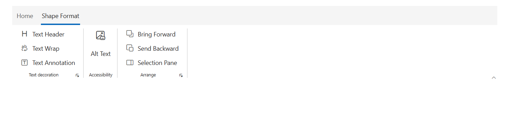
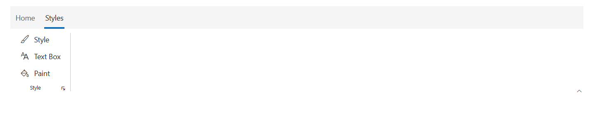
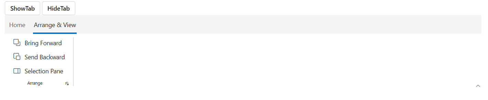

# Contextual tabs in Blazor Ribbon component

Contextual tabs in the Blazor Ribbon are dynamic tabs that appear only when needed, based on the user's context—such as selecting a specific element like an image, table, or chart. Once displayed, they provide a set of relevant tools and commands. These tabs support all built-in and custom Ribbon items.

## Controlling tab visibility 

You can utilize the `Visible` property to control the visibility of each contextual tab. By default the value is `false`.

## Adding Contextual Tabs

Define contextual tabs within the `<RibbonContextualTabs>` tag directive. Inside, each `<RibbonContextualTab>` group can contain a collection of one or more `RibbonTab` components that will be displayed together when the contextual group becomes active.

The following example demonstrates how to add a "Shape Format" contextual tab, which is initially hidden.




@using Syncfusion.Blazor.Ribbon;
@using  Syncfusion.Blazor.Buttons;
 

    <SfRibbon ID="ribbon">
        <RibbonTabs>
            <RibbonTab HeaderText="Home">
                <RibbonGroups>
                    <RibbonGroup HeaderText="Clipboard" ID="clipboardGroup" GroupIconCss="e-icons e-paste" ShowLauncherIcon="true">
                        <RibbonCollections>
                            <RibbonCollection>
                                <RibbonItems>
                                    <RibbonItem Type=RibbonItemType.Button>
                                        <RibbonButtonSettings Content="Cut" IconCss="e-icons e-cut"></RibbonButtonSettings>
                                    </RibbonItem>
                                    <RibbonItem Type=RibbonItemType.Button>
                                        <RibbonButtonSettings Content="Copy" IconCss="e-icons e-copy"></RibbonButtonSettings>
                                    </RibbonItem>
                                    <RibbonItem Type=RibbonItemType.Button>
                                        <RibbonButtonSettings Content="Format Painter" IconCss="e-icons e-format-painter"></RibbonButtonSettings>
                                    </RibbonItem>
                                </RibbonItems>
                            </RibbonCollection>
                        </RibbonCollections>
                    </RibbonGroup>
                </RibbonGroups>
            </RibbonTab>
        </RibbonTabs>
        <RibbonContextualTabs>
            <RibbonContextualTab @bind-Visible="@isVisible">
                <RibbonTabs>
                    <RibbonTab ID="ShapeFormat" HeaderText="Shape Format">
                        <RibbonGroups>
                            <RibbonGroup HeaderText="Text decoration" ShowLauncherIcon="true">
                                <RibbonCollections>
                                    <RibbonCollection>
                                        <RibbonItems>
                                            <RibbonItem Type=RibbonItemType.Button>
                                                <RibbonButtonSettings Content="Text Header" IconCss="e-icons e-text-header"></RibbonButtonSettings>
                                            </RibbonItem>
                                            <RibbonItem Type=RibbonItemType.Button>
                                                <RibbonButtonSettings Content="Text Wrap" IconCss="e-icons e-text-wrap"></RibbonButtonSettings>
                                            </RibbonItem>
                                            <RibbonItem Type=RibbonItemType.Button>
                                                <RibbonButtonSettings Content="Text Annotation" IconCss="e-icons e-text-annotation"></RibbonButtonSettings>
                                            </RibbonItem>
                                        </RibbonItems>
                                    </RibbonCollection>
                                </RibbonCollections>
                            </RibbonGroup>
                            <RibbonGroup HeaderText="Accessibility">
                                <RibbonCollections>
                                    <RibbonCollection>
                                        <RibbonItems>
                                            <RibbonItem Type=RibbonItemType.Button AllowedSizes="RibbonItemSize.Large">
                                                <RibbonButtonSettings Content="Alt Text" IconCss="e-icons e-text-alternative"></RibbonButtonSettings>
                                            </RibbonItem>
                                        </RibbonItems>
                                    </RibbonCollection>
                                </RibbonCollections>
                            </RibbonGroup>
                            <RibbonGroup HeaderText="Arrange" ShowLauncherIcon="true">
                                <RibbonCollections>
                                    <RibbonCollection>
                                        <RibbonItems>
                                            <RibbonItem Type=RibbonItemType.Button>
                                                <RibbonButtonSettings Content="Bring Forward" IconCss="e-icons e-bring-forward"></RibbonButtonSettings>
                                            </RibbonItem>
                                            <RibbonItem Type=RibbonItemType.Button>
                                                <RibbonButtonSettings Content="Send Backward" IconCss="e-icons e-send-backward"></RibbonButtonSettings>
                                            </RibbonItem>
                                            <RibbonItem Type=RibbonItemType.Button>
                                                <RibbonButtonSettings Content="Selection Pane" IconCss="e-icons e-show-hide-panel"></RibbonButtonSettings>
                                            </RibbonItem>
                                        </RibbonItems>
                                    </RibbonCollection>
                                </RibbonCollections>
                            </RibbonGroup>
                        </RibbonGroups>
                    </RibbonTab>
                </RibbonTabs>
            </RibbonContextualTab>
        </RibbonContextualTabs>
    </SfRibbon>

@code {
    bool isVisible = true;
}




## Selected tabs

Use the `IsSelected` property to specify which `RibbonContextualTab` group is active. When a contextual group is visible, setting `IsSelected` to `true` for a specific tab within that group brings it into focus. By default, its value is `false`.




@using Syncfusion.Blazor.Ribbon;
@using  Syncfusion.Blazor.Buttons;

    <SfRibbon ID="ribbon">
        <RibbonTabs>
            <RibbonTab HeaderText="Home">
                <RibbonGroups>
                    <RibbonGroup HeaderText="Clipboard" ID="clipboardGroup" GroupIconCss="e-icons e-paste" ShowLauncherIcon="true">
                        <RibbonCollections>
                            <RibbonCollection>
                                <RibbonItems>
                                    <RibbonItem Type=RibbonItemType.Button>
                                        <RibbonButtonSettings Content="Cut" IconCss="e-icons e-cut"></RibbonButtonSettings>
                                    </RibbonItem>
                                    <RibbonItem Type=RibbonItemType.Button>
                                        <RibbonButtonSettings Content="Copy" IconCss="e-icons e-copy"></RibbonButtonSettings>
                                    </RibbonItem>
                                    <RibbonItem Type=RibbonItemType.Button>
                                        <RibbonButtonSettings Content="Format Painter" IconCss="e-icons e-format-painter"></RibbonButtonSettings>
                                    </RibbonItem>
                                </RibbonItems>
                            </RibbonCollection>
                        </RibbonCollections>
                    </RibbonGroup>
                </RibbonGroups>
            </RibbonTab>
        </RibbonTabs>
        <RibbonContextualTabs>
            <RibbonContextualTab @bind-Visible=@isVisible @bind-IsSelected=@isSelected>
                <RibbonTabs>
                    <RibbonTab HeaderText="Styles">
                        <RibbonGroups>
                            <RibbonGroup HeaderText="Style" ShowLauncherIcon="true">
                                <RibbonCollections>
                                    <RibbonCollection>
                                        <RibbonItems>
                                            <RibbonItem Type=RibbonItemType.Button>
                                                <RibbonButtonSettings Content="Style" IconCss="e-icons e-style"></RibbonButtonSettings>
                                            </RibbonItem>
                                            <RibbonItem Type=RibbonItemType.Button>
                                                <RibbonButtonSettings Content="Text Box" IconCss="e-icons e-font-name"></RibbonButtonSettings>
                                            </RibbonItem>
                                            <RibbonItem Type=RibbonItemType.Button>
                                                <RibbonButtonSettings Content="Paint" IconCss="e-icons e-paint-bucket"></RibbonButtonSettings>
                                            </RibbonItem>
                                        </RibbonItems>
                                    </RibbonCollection>
                                </RibbonCollections>
                            </RibbonGroup>
                        </RibbonGroups>
                    </RibbonTab>
                </RibbonTabs>
            </RibbonContextualTab>
        </RibbonContextualTabs>
    </SfRibbon>

@code {
    bool isVisible = true;
    bool isSelected = true;
}




## Controlling Visibility and Selection

You can manage the state of contextual tabs both declaratively and programmatically.

### Visibility

The visibility of a `RibbonContextualTab` can be controlled in two ways:

*   **`ShowTabAsync` and `HideTabAsync` Methods**: To programmatically show or hide a specific tab within any contextual group, use the `ShowTabAsync` and `HideTabAsync` methods. These methods require the `ID` of the target `RibbonTab`.

The example below demonstrates how to use these methods to control a tab's visibility.




@using Syncfusion.Blazor.Ribbon;
@using  Syncfusion.Blazor.Buttons;

    <SfButton @onclick="handleShowTab">ShowTab</SfButton>
    <SfButton @onclick="handleHideTab">HideTab</SfButton>
    <SfRibbon ID="ribbon" @ref="ribbon">
        <RibbonTabs>
            <RibbonTab HeaderText="Home">
                <RibbonGroups>
                    <RibbonGroup HeaderText="Clipboard" ID="clipboardGroup" GroupIconCss="e-icons e-paste" ShowLauncherIcon="true">
                        <RibbonCollections>
                            <RibbonCollection>
                                <RibbonItems>
                                    <RibbonItem Type=RibbonItemType.Button>
                                        <RibbonButtonSettings Content="Cut" IconCss="e-icons e-cut"></RibbonButtonSettings>
                                    </RibbonItem>
                                    <RibbonItem Type=RibbonItemType.Button>
                                        <RibbonButtonSettings Content="Copy" IconCss="e-icons e-copy"></RibbonButtonSettings>
                                    </RibbonItem>
                                    <RibbonItem Type=RibbonItemType.Button>
                                        <RibbonButtonSettings Content="Format Painter" IconCss="e-icons e-format-painter"></RibbonButtonSettings>
                                    </RibbonItem>
                                </RibbonItems>
                            </RibbonCollection>
                        </RibbonCollections>
                    </RibbonGroup>
                </RibbonGroups>
            </RibbonTab>
        </RibbonTabs>
        <RibbonContextualTabs>
            <RibbonContextualTab @bind-Visible=@isVisible @bind-IsSelected=@isSelected>
                <RibbonTabs>
                    <RibbonTab HeaderText="Arrange & View" ID="ArrangeView">
                        <RibbonGroups>
                            <RibbonGroup HeaderText="Arrange" ShowLauncherIcon="true">
                                <RibbonCollections>
                                    <RibbonCollection>
                                        <RibbonItems>
                                            <RibbonItem Type=RibbonItemType.Button>
                                                <RibbonButtonSettings Content="Bring Forward" IconCss="e-icons e-bring-forward"></RibbonButtonSettings>
                                            </RibbonItem>
                                            <RibbonItem Type=RibbonItemType.Button>
                                                <RibbonButtonSettings Content="Send Backward" IconCss="e-icons e-send-backward"></RibbonButtonSettings>
                                            </RibbonItem>
                                            <RibbonItem Type=RibbonItemType.Button>
                                                <RibbonButtonSettings Content="Selection Pane" IconCss="e-icons e-show-hide-panel"></RibbonButtonSettings>
                                            </RibbonItem>
                                        </RibbonItems>
                                    </RibbonCollection>
                                </RibbonCollections>
                            </RibbonGroup>
                        </RibbonGroups>
                    </RibbonTab>
                </RibbonTabs>
            </RibbonContextualTab>
        </RibbonContextualTabs>
    </SfRibbon>

@code {
    bool isVisible = true;
    bool isSelected = true;

    SfRibbon ribbon;
    private async Task handleShowTab()
    {
        await ribbon.ShowTabAsync("ArrangeView");
    }
    private async Task handleHideTab()
    {
        await ribbon.HideTabAsync("ArrangeView");
    }
}




