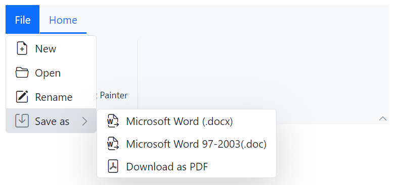
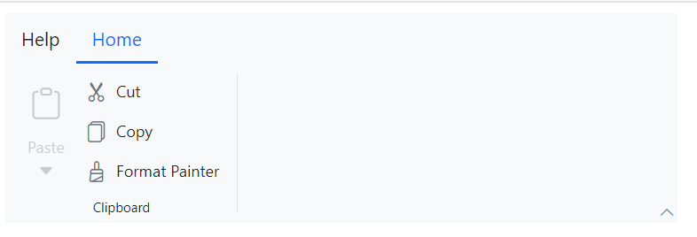

# File Menu in Blazor Ribbon component

The Ribbon component provides a built-in file menu to include menu items for performing specific actions. The file menu can be configured using the [RibbonFileMenuSettings](https://help.syncfusion.com/cr/blazor/Syncfusion.Blazor.Ribbon.RibbonFileMenuSettings.html) tag directive directly inside [SfRibbon](https://help.syncfusion.com/cr/blazor/Syncfusion.Blazor.Ribbon.SfRibbon.html).

## Visibility

You can make the file menu visible by setting the [Visible](https://help.syncfusion.com/cr/blazor/Syncfusion.Blazor.Ribbon.RibbonFileMenuSettings.html#Syncfusion_Blazor_Ribbon_RibbonFileMenuSettings_Visible) property of the [RibbonFileMenuSettings](https://help.syncfusion.com/cr/blazor/Syncfusion.Blazor.Ribbon.RibbonFileMenuSettings.html) tag directive to `true`. By default, the file menu is hidden.

## Adding menu items

Menu items can be added to the file menu by binding a collection of menu items to the [MenuItems](https://help.syncfusion.com/cr/blazor/Syncfusion.Blazor.Ribbon.RibbonFileMenuSettings.html#Syncfusion_Blazor_Ribbon_RibbonFileMenuSettings_MenuItems) property of the [RibbonFileMenuSettings](https://help.syncfusion.com/cr/blazor/Syncfusion.Blazor.Ribbon.RibbonFileMenuSettings.html) tag directive. Each menu item can have properties like [Text](https://help.syncfusion.com/cr/blazor/Syncfusion.Blazor.Navigations.MenuItem.html#Syncfusion_Blazor_Navigations_MenuItem_Text), [IconCss](https://help.syncfusion.com/cr/blazor/Syncfusion.Blazor.Navigations.MenuItem.html#Syncfusion_Blazor_Navigations_MenuItem_IconCss), and nested sub-menu items too.




@using Syncfusion.Blazor.Ribbon;
@using Syncfusion.Blazor.SplitButtons;
@using Syncfusion.Blazor.Navigations;

    <SfRibbon>
        <RibbonFileMenuSettings Visible=true MenuItems="@fileMenuItems"></RibbonFileMenuSettings>
        <RibbonTabs>
            <RibbonTab HeaderText="Home">
                <RibbonGroups>
                    <RibbonGroup HeaderText="Clipboard">
                        <RibbonCollections>
                            <RibbonCollection>
                                <RibbonItems>
                                    <RibbonItem Type=RibbonItemType.SplitButton Disabled=true>
                                        <RibbonSplitButtonSettings Content="Paste" IconCss="e-icons e-paste" Items="@formatItems"></RibbonSplitButtonSettings>
                                    </RibbonItem>
                                </RibbonItems>
                            </RibbonCollection>
                            <RibbonCollection>
                                <RibbonItems>
                                    <RibbonItem Type=RibbonItemType.Button>
                                        <RibbonButtonSettings Content="Cut" IconCss="e-icons e-cut" ></RibbonButtonSettings>
                                    </RibbonItem>
                                    <RibbonItem Type=RibbonItemType.Button>
                                        <RibbonButtonSettings Content="Copy" IconCss="e-icons e-copy"></RibbonButtonSettings>
                                    </RibbonItem>
                                    <RibbonItem Type=RibbonItemType.Button>
                                        <RibbonButtonSettings Content="Format Painter" IconCss="e-icons e-format-painter"></RibbonButtonSettings>
                                    </RibbonItem>
                                </RibbonItems>
                            </RibbonCollection>
                        </RibbonCollections>
                    </RibbonGroup>
                </RibbonGroups>
            </RibbonTab>
        </RibbonTabs>
    </SfRibbon>

@code{
    List<DropDownMenuItem> formatItems = new List<DropDownMenuItem>()
    {
        new DropDownMenuItem{ Text = "Keep Source Format" },
        new DropDownMenuItem{ Text = "Merge Format" },
        new DropDownMenuItem{ Text = "Keep Text Only" }
    };

    List<MenuItem> fileMenuItems = new List<MenuItem>()
    {
        new MenuItem { Text = "New", IconCss = "e-icons e-file-new", Id = "new" },
        new MenuItem { Text = "Open", IconCss = "e-icons e-folder-open", Id = "open" },
        new MenuItem { Text = "Rename", IconCss = "e-icons e-rename", Id = "rename" },
        new MenuItem {
            Text = "Save as",
            IconCss = "e-icons e-save",
            Id = "save",
            Items = new List<MenuItem>() {
                new MenuItem { Text = "Microsoft Word (.docx)", IconCss = "sf-icon-word", Id = "word" },
                new MenuItem { Text = "Microsoft Word 97-2003(.doc)", IconCss = "sf-icon-word", Id = "word97" },
                new MenuItem { Text = "Download as PDF", IconCss = "e-icons e-export-pdf", Id = "pdf" }
            }
        }
    };
}




## Open submenu on click

By default, submenu opens on mouse hover. To change this behavior and open submenu on menu item click, you can set the [ShowItemOnClick](https://help.syncfusion.com/cr/blazor/Syncfusion.Blazor.Ribbon.RibbonFileMenuSettings.html#Syncfusion_Blazor_Ribbon_RibbonFileMenuSettings_ShowItemOnClick) property to `true`.




@using Syncfusion.Blazor.Ribbon;
@using Syncfusion.Blazor.SplitButtons;
@using Syncfusion.Blazor.Navigations;

    <SfRibbon>
        <RibbonFileMenuSettings Visible=true MenuItems="@fileMenuItems" ShowItemOnClick="true"></RibbonFileMenuSettings>
        <RibbonTabs>
            <RibbonTab HeaderText="Home">
                <RibbonGroups>
                    <RibbonGroup HeaderText="Clipboard">
                        <RibbonCollections>
                            <RibbonCollection>
                                <RibbonItems>
                                    <RibbonItem Type=RibbonItemType.SplitButton Disabled=true>
                                        <RibbonSplitButtonSettings Content="Paste" IconCss="e-icons e-paste" Items="@formatItems"></RibbonSplitButtonSettings>
                                    </RibbonItem>
                                </RibbonItems>
                            </RibbonCollection>
                            <RibbonCollection>
                                <RibbonItems>
                                    <RibbonItem Type=RibbonItemType.Button>
                                        <RibbonButtonSettings Content="Cut" IconCss="e-icons e-cut" ></RibbonButtonSettings>
                                    </RibbonItem>
                                    <RibbonItem Type=RibbonItemType.Button>
                                        <RibbonButtonSettings Content="Copy" IconCss="e-icons e-copy"></RibbonButtonSettings>
                                    </RibbonItem>
                                    <RibbonItem Type=RibbonItemType.Button>
                                        <RibbonButtonSettings Content="Format Painter" IconCss="e-icons e-format-painter"></RibbonButtonSettings>
                                    </RibbonItem>
                                </RibbonItems>
                            </RibbonCollection>
                        </RibbonCollections>
                    </RibbonGroup>
                </RibbonGroups>
            </RibbonTab>
        </RibbonTabs>
    </SfRibbon>

@code{
    List<DropDownMenuItem> formatItems = new List<DropDownMenuItem>()
    {
        new DropDownMenuItem{ Text = "Keep Source Format" },
        new DropDownMenuItem{ Text = "Merge Format" },
        new DropDownMenuItem{ Text = "Keep Text Only" }
    };

    List<MenuItem> fileMenuItems = new List<MenuItem>()
    {
        new MenuItem { Text = "New", IconCss = "e-icons e-file-new", Id = "new" },
        new MenuItem { Text = "Open", IconCss = "e-icons e-folder-open", Id = "open" },
        new MenuItem { Text = "Rename", IconCss = "e-icons e-rename", Id = "rename" },
        new MenuItem {
            Text = "Save as",
            IconCss = "e-icons e-save",
            Id = "save",
            Items = new List<MenuItem>() {
                new MenuItem { Text = "Microsoft Word (.docx)", IconCss = "sf-icon-word", Id = "word" },
                new MenuItem { Text = "Microsoft Word 97-2003(.doc)", IconCss = "sf-icon-word", Id = "word97" },
                new MenuItem { Text = "Download as PDF", IconCss = "e-icons e-export-pdf", Id = "pdf" }
            }
        }
    };
}




## Custom header text

You can define custom header text for the file menu by using the [Text](https://help.syncfusion.com/cr/blazor/Syncfusion.Blazor.Ribbon.RibbonFileMenuSettings.html#Syncfusion_Blazor_Ribbon_RibbonFileMenuSettings_Text) property of the [RibbonFileMenuSettings](https://help.syncfusion.com/cr/blazor/Syncfusion.Blazor.Ribbon.RibbonFileMenuSettings.html) tag directive. By default, the header text is set to `File`.




@using Syncfusion.Blazor.Ribbon;
@using Syncfusion.Blazor.SplitButtons;
@using Syncfusion.Blazor.Navigations;

    <SfRibbon>
        <RibbonFileMenuSettings Text="Help" Visible=true MenuItems="@fileMenuItems" ShowItemOnClick="true"></RibbonFileMenuSettings>
        <RibbonTabs>
            <RibbonTab HeaderText="Home">
                <RibbonGroups>
                    <RibbonGroup HeaderText="Clipboard">
                        <RibbonCollections>
                            <RibbonCollection>
                                <RibbonItems>
                                    <RibbonItem Type=RibbonItemType.SplitButton Disabled=true>
                                        <RibbonSplitButtonSettings Content="Paste" IconCss="e-icons e-paste" Items="@formatItems"></RibbonSplitButtonSettings>
                                    </RibbonItem>
                                </RibbonItems>
                            </RibbonCollection>
                            <RibbonCollection>
                                <RibbonItems>
                                    <RibbonItem Type=RibbonItemType.Button>
                                        <RibbonButtonSettings Content="Cut" IconCss="e-icons e-cut" ></RibbonButtonSettings>
                                    </RibbonItem>
                                    <RibbonItem Type=RibbonItemType.Button>
                                        <RibbonButtonSettings Content="Copy" IconCss="e-icons e-copy"></RibbonButtonSettings>
                                    </RibbonItem>
                                    <RibbonItem Type=RibbonItemType.Button>
                                        <RibbonButtonSettings Content="Format Painter" IconCss="e-icons e-format-painter"></RibbonButtonSettings>
                                    </RibbonItem>
                                </RibbonItems>
                            </RibbonCollection>
                        </RibbonCollections>
                    </RibbonGroup>
                </RibbonGroups>
            </RibbonTab>
        </RibbonTabs>
    </SfRibbon>

@code{
    List<DropDownMenuItem> formatItems = new List<DropDownMenuItem>()
    {
        new DropDownMenuItem{ Text = "Keep Source Format" },
        new DropDownMenuItem{ Text = "Merge Format" },
        new DropDownMenuItem{ Text = "Keep Text Only" }
    };

    List<MenuItem> fileMenuItems = new List<MenuItem>()
    {
        new MenuItem { Text = "New", IconCss = "e-icons e-file-new", Id = "new" },
        new MenuItem { Text = "Open", IconCss = "e-icons e-folder-open", Id = "open" },
        new MenuItem { Text = "Rename", IconCss = "e-icons e-rename", Id = "rename" },
        new MenuItem {
            Text = "Save as",
            IconCss = "e-icons e-save",
            Id = "save",
            Items = new List<MenuItem>() {
                new MenuItem { Text = "Microsoft Word (.docx)", IconCss = "sf-icon-word", Id = "word" },
                new MenuItem { Text = "Microsoft Word 97-2003(.doc)", IconCss = "sf-icon-word", Id = "word97" },
                new MenuItem { Text = "Download as PDF", IconCss = "e-icons e-export-pdf", Id = "pdf" }
            }
        }
    };
}




## Events

The following events are available in the Ribbon File menu.

|Name|Args|Description|
|---|---|---|
|[FileMenuOpening](https://help.syncfusion.com/cr/blazor/Syncfusion.Blazor.Ribbon.RibbonFileMenuSettings.html#Syncfusion_Blazor_Ribbon_RibbonFileMenuSettings_FileMenuOpening)|FileMenuOpenEventArgs|Triggers before the file menu popup opens|
|[FileMenuClosing](https://help.syncfusion.com/cr/blazor/Syncfusion.Blazor.Ribbon.RibbonFileMenuSettings.html#Syncfusion_Blazor_Ribbon_RibbonFileMenuSettings_FileMenuClosing)|FileMenuCloseEventArgs|Triggers before the file menu popup closes|
|[FileMenuOpened](https://help.syncfusion.com/cr/blazor/Syncfusion.Blazor.Ribbon.RibbonFileMenuSettings.html#Syncfusion_Blazor_Ribbon_RibbonFileMenuSettings_FileMenuOpened)|FileMenuOpenedEventArgs|Triggers after the file menu popup opened|
|[FileMenuClosed](https://help.syncfusion.com/cr/blazor/Syncfusion.Blazor.Ribbon.RibbonFileMenuSettings.html#Syncfusion_Blazor_Ribbon_RibbonFileMenuSettings_FileMenuClosed)|FileMenuClosedEventArgs|Triggers after the file menu popup closed|
|[FileMenuItemRendering](https://help.syncfusion.com/cr/blazor/Syncfusion.Blazor.Ribbon.RibbonFileMenuSettings.html#Syncfusion_Blazor_Ribbon_RibbonFileMenuSettings_FileMenuItemRendering)|FileMenuItemRenderEventArgs|Triggers while a file menu item is being rendered|
|[ItemSelecting](https://help.syncfusion.com/cr/blazor/Syncfusion.Blazor.Ribbon.RibbonFileMenuSettings.html#Syncfusion_Blazor_Ribbon_RibbonFileMenuSettings_ItemSelecting)|FileMenuItemSelectEventArgs|Triggers while a file menu item is being selected|




@using Syncfusion.Blazor.Ribbon;
@using Syncfusion.Blazor.SplitButtons;
@using Syncfusion.Blazor.Navigations;

    <SfRibbon>
        <RibbonFileMenuSettings Visible=true 
                                MenuItems="@fileMenuItems" 
                                FileMenuOpening="FileMenuOpening" 
                                FileMenuClosing="FileMenuClosing" 
                                FileMenuOpened="FileMenuOpened" 
                                FileMenuClosed="FileMenuClosed" 
                                FileMenuItemRendering="FileMenuItemRendering" 
                                ItemSelecting="ItemSelecting">
        </RibbonFileMenuSettings>
        <RibbonTabs>
            <RibbonTab HeaderText="Home">
                <RibbonGroups>
                    <RibbonGroup HeaderText="Clipboard">
                        <RibbonCollections>
                            <RibbonCollection>
                                <RibbonItems>
                                    <RibbonItem Type=RibbonItemType.Button>
                                        <RibbonButtonSettings Content="Cut" IconCss="e-icons e-cut" ></RibbonButtonSettings>
                                    </RibbonItem>
                                </RibbonItems>
                            </RibbonCollection>
                        </RibbonCollections>
                    </RibbonGroup>
                </RibbonGroups>
            </RibbonTab>
        </RibbonTabs>
    </SfRibbon>

@code{

    private void FileMenuOpening(FileMenuOpenEventArgs args) { /* your actions here */ }

    private void FileMenuClosing(FileMenuCloseEventArgs args) { /* your actions here */ }

    private void FileMenuOpened(FileMenuOpenedEventArgs args) { /* your actions here */ }

    private void FileMenuClosed(FileMenuClosedEventArgs args) { /* your actions here */ }

    private void FileMenuItemRendering(FileMenuItemRenderEventArgs args) { /* your actions here */ }

    private void ItemSelecting(FileMenuItemSelectEventArgs args) { /* your actions here */ }

    List<MenuItem> fileMenuItems = new List<MenuItem>()
    {
        new MenuItem { Text = "New", IconCss = "e-icons e-file-new", Id = "new" },
        new MenuItem { Text = "Open", IconCss = "e-icons e-folder-open", Id = "open" },
        new MenuItem { Text = "Rename", IconCss = "e-icons e-rename", Id = "rename" },
        new MenuItem {
            Text = "Save as",
            IconCss = "e-icons e-save",
            Id = "save",
            Items = new List<MenuItem>() {
                new MenuItem { Text = "Microsoft Word (.docx)", IconCss = "sf-icon-word", Id = "word" },
                new MenuItem { Text = "Microsoft Word 97-2003(.doc)", IconCss = "sf-icon-word", Id = "word97" },
                new MenuItem { Text = "Download as PDF", IconCss = "e-icons e-export-pdf", Id = "pdf" }
            }
        }
    };
}


