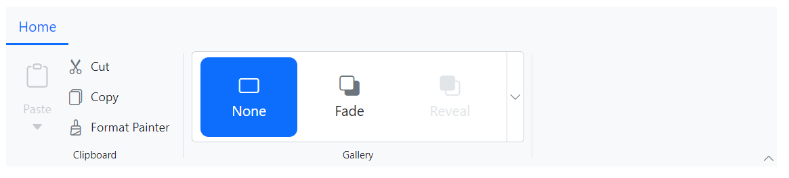
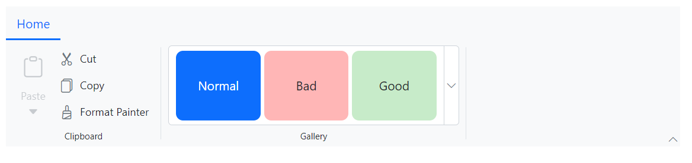

# Gallery Items in the Blazor Ribbon Component

The Blazor Ribbon component includes a gallery feature that allows users to interact with a collection of related items, such as icons, text, or images. To create a gallery, set the [Type](https://help.syncfusion.com/cr/blazor/Syncfusion.Blazor.Ribbon.RibbonItem.html#Syncfusion_Blazor_Ribbon_RibbonItem_Type) property of a `RibbonItem` to `RibbonItemType.Gallery` and configure its behavior using the [RibbonGallerySettings](https://help.syncfusion.com/cr/blazor/Syncfusion.Blazor.Ribbon.RibbonGallerySettings.html) component.

## Groups

Render groups of items within the gallery by defining a collection of [GalleryGroup](https://help.syncfusion.com/cr/blazor/Syncfusion.Blazor.Ribbon.GalleryGroup.html) objects and assigning it to the [Groups](https://help.syncfusion.com/cr/blazor/Syncfusion.Blazor.Ribbon.RibbonGallerySettings.html#Syncfusion_Blazor_Ribbon_RibbonGallerySettings_Groups) property of the `RibbonGallerySettings`. Each `GalleryGroup` can be configured with properties like [Header](https://help.syncfusion.com/cr/blazor/Syncfusion.Blazor.Ribbon.GalleryGroup.html#Syncfusion_Blazor_Ribbon_GalleryGroup_Header), [Items](https://help.syncfusion.com/cr/blazor/Syncfusion.Blazor.Ribbon.GalleryGroup.html#Syncfusion_Blazor_Ribbon_GalleryGroup_Items), and [CssClass](https://help.syncfusion.com/cr/blazor/Syncfusion.Blazor.Ribbon.GalleryGroup.html#Syncfusion_Blazor_Ribbon_GalleryGroup_CssClass).

### Adding Items

Add items to a group by defining a list of [GalleryItem](https://help.syncfusion.com/cr/blazor/Syncfusion.Blazor.Ribbon.GalleryItem.html) objects. The example below demonstrates how to configure a basic gallery with a group of [Items](https://help.syncfusion.com/cr/blazor/Syncfusion.Blazor.Ribbon.GalleryGroup.html#Syncfusion_Blazor_Ribbon_GalleryGroup_Items) and set properties such as [Content](https://help.syncfusion.com/cr/blazor/Syncfusion.Blazor.Ribbon.GalleryItem.html#Syncfusion_Blazor_Ribbon_GalleryItem_Content), [IconCss](https://help.syncfusion.com/cr/blazor/Syncfusion.Blazor.Ribbon.GalleryItem.html#Syncfusion_Blazor_Ribbon_GalleryItem_IconCss), and [Disabled](https://help.syncfusion.com/cr/blazor/Syncfusion.Blazor.Ribbon.GalleryItem.html#Syncfusion_Blazor_Ribbon_GalleryItem_Disabled).




@using Syncfusion.Blazor.Ribbon;
@using Syncfusion.Blazor.SplitButtons;

    <SfRibbon>
        <RibbonTabs>
            <RibbonTab HeaderText="Home">
                <RibbonGroups>
                    <RibbonGroup HeaderText="Clipboard">
                        <RibbonCollections>
                            <RibbonCollection>
                                <RibbonItems>
                                    <RibbonItem Type=RibbonItemType.SplitButton Disabled=true>
                                        <RibbonSplitButtonSettings Content="Paste" IconCss="e-icons e-paste" Items="@formatItems"></RibbonSplitButtonSettings>
                                    </RibbonItem>
                                </RibbonItems>
                            </RibbonCollection>
                            <RibbonCollection>
                                <RibbonItems>
                                    <RibbonItem Type=RibbonItemType.Button>
                                        <RibbonButtonSettings Content="Cut" IconCss="e-icons e-cut"></RibbonButtonSettings>
                                    </RibbonItem>
                                    <RibbonItem Type=RibbonItemType.Button>
                                        <RibbonButtonSettings Content="Copy" IconCss="e-icons e-copy"></RibbonButtonSettings>
                                    </RibbonItem>
                                    <RibbonItem Type=RibbonItemType.Button>
                                        <RibbonButtonSettings Content="Format Painter" IconCss="e-icons e-format-painter"></RibbonButtonSettings>
                                    </RibbonItem>
                                </RibbonItems>
                            </RibbonCollection>
                        </RibbonCollections>
                    </RibbonGroup>
                    <RibbonGroup HeaderText="Gallery">
                        <RibbonCollections>
                            <RibbonCollection>
                                <RibbonItems>
                                    <RibbonItem Type=RibbonItemType.Gallery>
                                        <RibbonGallerySettings Groups="galleryGroups">
                                        </RibbonGallerySettings>
                                    </RibbonItem>
                                </RibbonItems>
                            </RibbonCollection>
                        </RibbonCollections>
                    </RibbonGroup>
                </RibbonGroups>
            </RibbonTab>
        </RibbonTabs>
    </SfRibbon>

@code{
    List<DropDownMenuItem> formatItems = new List<DropDownMenuItem>()
    {
        new DropDownMenuItem{ Text = "Keep Source Format" },
        new DropDownMenuItem{ Text = "Merge Format" },
        new DropDownMenuItem{ Text = "Keep Text Only" }
    };

    List<GalleryGroup> galleryGroups = new List<GalleryGroup>
    {
        new GalleryGroup
        {
            Items = new List<GalleryItem>
            {
                new GalleryItem { Content = "None", IconCss = "e-icons e-rectangle" },
                new GalleryItem { Content = "Fade", IconCss = "e-icons e-send-backward" },
                new GalleryItem { Content = "Reveal", IconCss = "e-icons e-bring-forward", Disabled = true },
                new GalleryItem { Content = "Zoom", IconCss = "e-icons e-zoom-to-fit" }
            }
        }
    };
}




#### Css class

Apply custom styling to a gallery item by setting its [CssClass](https://help.syncfusion.com/cr/blazor/Syncfusion.Blazor.Ribbon.GalleryItem.html#Syncfusion_Blazor_Ribbon_GalleryItem_CssClass) property.




@using Syncfusion.Blazor.Ribbon;
@using Syncfusion.Blazor.SplitButtons;

    <SfRibbon>
        <RibbonTabs>
            <RibbonTab HeaderText="Home">
                <RibbonGroups>
                    <RibbonGroup HeaderText="Clipboard">
                        <RibbonCollections>
                            <RibbonCollection>
                                <RibbonItems>
                                    <RibbonItem Type=RibbonItemType.SplitButton Disabled=true>
                                        <RibbonSplitButtonSettings Content="Paste" IconCss="e-icons e-paste" Items="@formatItems"></RibbonSplitButtonSettings>
                                    </RibbonItem>
                                </RibbonItems>
                            </RibbonCollection>
                            <RibbonCollection>
                                <RibbonItems>
                                    <RibbonItem Type=RibbonItemType.Button>
                                        <RibbonButtonSettings Content="Cut" IconCss="e-icons e-cut"></RibbonButtonSettings>
                                    </RibbonItem>
                                    <RibbonItem Type=RibbonItemType.Button>
                                        <RibbonButtonSettings Content="Copy" IconCss="e-icons e-copy"></RibbonButtonSettings>
                                    </RibbonItem>
                                    <RibbonItem Type=RibbonItemType.Button>
                                        <RibbonButtonSettings Content="Format Painter" IconCss="e-icons e-format-painter"></RibbonButtonSettings>
                                    </RibbonItem>
                                </RibbonItems>
                            </RibbonCollection>
                        </RibbonCollections>
                    </RibbonGroup>
                    <RibbonGroup HeaderText="Gallery">
                        <RibbonCollections>
                            <RibbonCollection>
                                <RibbonItems>
                                    <RibbonItem Type=RibbonItemType.Gallery>
                                        <RibbonGallerySettings Groups="galleryGroups">
                                        </RibbonGallerySettings>
                                    </RibbonItem>
                                </RibbonItems>
                            </RibbonCollection>
                        </RibbonCollections>
                    </RibbonGroup>
                </RibbonGroups>
            </RibbonTab>
        </RibbonTabs>
    </SfRibbon>

@code{
    List<DropDownMenuItem> formatItems = new List<DropDownMenuItem>()
    {
        new DropDownMenuItem{ Text = "Keep Source Format" },
        new DropDownMenuItem{ Text = "Merge Format" },
        new DropDownMenuItem{ Text = "Keep Text Only" }
    };

    List<GalleryGroup> galleryGroups = new List<GalleryGroup>
    {
       new GalleryGroup
        {
            Items = new List<GalleryItem>
            {
                new GalleryItem { Content = "Normal", CssClass = "normal" },
                new GalleryItem { Content = "Bad", CssClass = "bad" },
                new GalleryItem { Content = "Good", CssClass = "good" },
                new GalleryItem { Content = "Neutral", CssClass = "neutral" }
            }
        },
    };
}




### Custom Header

Define a header for a group of items in the gallery popup using the [Header](https://help.syncfusion.com/cr/blazor/Syncfusion.Blazor.Ribbon.GalleryGroup.html#Syncfusion_Blazor_Ribbon_GalleryGroup_Header) property.




@using Syncfusion.Blazor.Ribbon;
@using Syncfusion.Blazor.SplitButtons;

    <SfRibbon>
        <RibbonTabs>
            <RibbonTab HeaderText="Home">
                <RibbonGroups>
                    <RibbonGroup HeaderText="Clipboard">
                        <RibbonCollections>
                            <RibbonCollection>
                                <RibbonItems>
                                    <RibbonItem Type=RibbonItemType.SplitButton Disabled=true>
                                        <RibbonSplitButtonSettings Content="Paste" IconCss="e-icons e-paste" Items="@formatItems"></RibbonSplitButtonSettings>
                                    </RibbonItem>
                                </RibbonItems>
                            </RibbonCollection>
                            <RibbonCollection>
                                <RibbonItems>
                                    <RibbonItem Type=RibbonItemType.Button>
                                        <RibbonButtonSettings Content="Cut" IconCss="e-icons e-cut"></RibbonButtonSettings>
                                    </RibbonItem>
                                    <RibbonItem Type=RibbonItemType.Button>
                                        <RibbonButtonSettings Content="Copy" IconCss="e-icons e-copy"></RibbonButtonSettings>
                                    </RibbonItem>
                                    <RibbonItem Type=RibbonItemType.Button>
                                        <RibbonButtonSettings Content="Format Painter" IconCss="e-icons e-format-painter"></RibbonButtonSettings>
                                    </RibbonItem>
                                </RibbonItems>
                            </RibbonCollection>
                        </RibbonCollections>
                    </RibbonGroup>
                    <RibbonGroup HeaderText="Gallery">
                        <RibbonCollections>
                            <RibbonCollection>
                                <RibbonItems>
                                    <RibbonItem Type=RibbonItemType.Gallery>
                                        <RibbonGallerySettings Groups="galleryGroups">
                                        </RibbonGallerySettings>
                                    </RibbonItem>
                                </RibbonItems>
                            </RibbonCollection>
                        </RibbonCollections>
                    </RibbonGroup>
                </RibbonGroups>
            </RibbonTab>
        </RibbonTabs>
    </SfRibbon>

@code{
    List<DropDownMenuItem> formatItems = new List<DropDownMenuItem>()
    {
        new DropDownMenuItem{ Text = "Keep Source Format" },
        new DropDownMenuItem{ Text = "Merge Format" },
        new DropDownMenuItem{ Text = "Keep Text Only" }
    };

    List<GalleryGroup> galleryGroups = new List<GalleryGroup>
    {
        new GalleryGroup
        {
            Header = "Transitions",
            Items = new List<GalleryItem>
            {
                new GalleryItem { Content = "None", IconCss = "e-icons e-rectangle" },
                new GalleryItem { Content = "Fade", IconCss = "e-icons e-send-backward" },
                new GalleryItem { Content = "Reveal", IconCss = "e-icons e-bring-forward", Disabled = true },
                new GalleryItem { Content = "Zoom", IconCss = "e-icons e-zoom-to-fit" }
            }
        }
    };
}




### Item Dimensions

Control the dimensions of gallery items within the popup by setting the [ItemWidth](https://help.syncfusion.com/cr/blazor/Syncfusion.Blazor.Ribbon.GalleryGroup.html#Syncfusion_Blazor_Ribbon_GalleryGroup_ItemWidth) and [ItemHeight](https://help.syncfusion.com/cr/blazor/Syncfusion.Blazor.Ribbon.GalleryGroup.html#Syncfusion_Blazor_Ribbon_GalleryGroup_ItemHeight) properties of a [GalleryGroup](https://help.syncfusion.com/cr/blazor/Syncfusion.Blazor.Ribbon.GalleryGroup.html). These properties ensure consistent sizing for all items in that group.




@using Syncfusion.Blazor.Ribbon;
@using Syncfusion.Blazor.SplitButtons;

    <SfRibbon>
        <RibbonTabs>
            <RibbonTab HeaderText="Home">
                <RibbonGroups>
                    <RibbonGroup HeaderText="Clipboard">
                        <RibbonCollections>
                            <RibbonCollection>
                                <RibbonItems>
                                    <RibbonItem Type=RibbonItemType.SplitButton Disabled=true>
                                        <RibbonSplitButtonSettings Content="Paste" IconCss="e-icons e-paste" Items="@formatItems"></RibbonSplitButtonSettings>
                                    </RibbonItem>
                                </RibbonItems>
                            </RibbonCollection>
                            <RibbonCollection>
                                <RibbonItems>
                                    <RibbonItem Type=RibbonItemType.Button>
                                        <RibbonButtonSettings Content="Cut" IconCss="e-icons e-cut"></RibbonButtonSettings>
                                    </RibbonItem>
                                    <RibbonItem Type=RibbonItemType.Button>
                                        <RibbonButtonSettings Content="Copy" IconCss="e-icons e-copy"></RibbonButtonSettings>
                                    </RibbonItem>
                                    <RibbonItem Type=RibbonItemType.Button>
                                        <RibbonButtonSettings Content="Format Painter" IconCss="e-icons e-format-painter"></RibbonButtonSettings>
                                    </RibbonItem>
                                </RibbonItems>
                            </RibbonCollection>
                        </RibbonCollections>
                    </RibbonGroup>
                    <RibbonGroup HeaderText="Gallery">
                        <RibbonCollections>
                            <RibbonCollection>
                                <RibbonItems>
                                    <RibbonItem Type=RibbonItemType.Gallery>
                                        <RibbonGallerySettings Groups="galleryGroups">
                                        </RibbonGallerySettings>
                                    </RibbonItem>
                                </RibbonItems>
                            </RibbonCollection>
                        </RibbonCollections>
                    </RibbonGroup>
                </RibbonGroups>
            </RibbonTab>
        </RibbonTabs>
    </SfRibbon>

@code{
    List<DropDownMenuItem> formatItems = new List<DropDownMenuItem>()
    {
        new DropDownMenuItem{ Text = "Keep Source Format" },
        new DropDownMenuItem{ Text = "Merge Format" },
        new DropDownMenuItem{ Text = "Keep Text Only" }
    };

    List<GalleryGroup> galleryGroups = new List<GalleryGroup>
    {
        new GalleryGroup
        {
            Header = "Title and Headings",
            ItemWidth = "100",
            ItemHeight = "40",
            Items = new List<GalleryItem>
            {
                new GalleryItem { Content = "Heading 1" },
                new GalleryItem { Content = "Heading 2" },
                new GalleryItem { Content = "Heading 3" },
                new GalleryItem { Content = "Heading 4" },
                new GalleryItem { Content = "Title" },
                new GalleryItem { Content = "Total" }
            }
        },
    };
}




### Group Styling

Apply custom styling to an entire group of gallery items by setting the [CssClass](https://help.syncfusion.com/cr/blazor/Syncfusion.Blazor.Ribbon.GalleryGroup.html#Syncfusion_Blazor_Ribbon_GalleryGroup_CssClass) property of the [GalleryGroup](https://help.syncfusion.com/cr/blazor/Syncfusion.Blazor.Ribbon.GalleryGroup.html).




@using Syncfusion.Blazor.Ribbon;
@using Syncfusion.Blazor.SplitButtons;

    <SfRibbon>
        <RibbonTabs>
            <RibbonTab HeaderText="Home">
                <RibbonGroups>
                    <RibbonGroup HeaderText="Clipboard">
                        <RibbonCollections>
                            <RibbonCollection>
                                <RibbonItems>
                                    <RibbonItem Type=RibbonItemType.SplitButton Disabled=true>
                                        <RibbonSplitButtonSettings Content="Paste" IconCss="e-icons e-paste" Items="@formatItems"></RibbonSplitButtonSettings>
                                    </RibbonItem>
                                </RibbonItems>
                            </RibbonCollection>
                            <RibbonCollection>
                                <RibbonItems>
                                    <RibbonItem Type=RibbonItemType.Button>
                                        <RibbonButtonSettings Content="Cut" IconCss="e-icons e-cut"></RibbonButtonSettings>
                                    </RibbonItem>
                                    <RibbonItem Type=RibbonItemType.Button>
                                        <RibbonButtonSettings Content="Copy" IconCss="e-icons e-copy"></RibbonButtonSettings>
                                    </RibbonItem>
                                    <RibbonItem Type=RibbonItemType.Button>
                                        <RibbonButtonSettings Content="Format Painter" IconCss="e-icons e-format-painter"></RibbonButtonSettings>
                                    </RibbonItem>
                                </RibbonItems>
                            </RibbonCollection>
                        </RibbonCollections>
                    </RibbonGroup>
                    <RibbonGroup HeaderText="Gallery">
                        <RibbonCollections>
                            <RibbonCollection>
                                <RibbonItems>
                                    <RibbonItem Type=RibbonItemType.Gallery>
                                        <RibbonGallerySettings Groups="galleryGroups">
                                        </RibbonGallerySettings>
                                    </RibbonItem>
                                </RibbonItems>
                            </RibbonCollection>
                        </RibbonCollections>
                    </RibbonGroup>
                </RibbonGroups>
            </RibbonTab>
        </RibbonTabs>
    </SfRibbon>

@code{
    List<DropDownMenuItem> formatItems = new List<DropDownMenuItem>()
    {
        new DropDownMenuItem{ Text = "Keep Source Format" },
        new DropDownMenuItem{ Text = "Merge Format" },
        new DropDownMenuItem{ Text = "Keep Text Only" }
    };

    List<GalleryGroup> galleryGroups = new List<GalleryGroup>
    {
        new GalleryGroup
        {
            CssClass = "custom-group",
            Items = new List<GalleryItem>
            {
                new GalleryItem { Content = "None", IconCss = "e-icons e-rectangle" },
                new GalleryItem { Content = "Fade", IconCss = "e-icons e-send-backward" },
                new GalleryItem { Content = "Reveal", IconCss = "e-icons e-bring-forward" },
                new GalleryItem { Content = "Zoom", IconCss = "e-icons e-zoom-to-fit" }
            }
        }
    };
}




## Item Count in Ribbon

Set the number of gallery items displayed directly in the ribbon layout using the [ItemCount](https://help.syncfusion.com/cr/blazor/Syncfusion.Blazor.Ribbon.RibbonGallerySettings.html#Syncfusion_Blazor_Ribbon_RibbonGallerySettings_ItemCount) property. The default value is `3`.




@using Syncfusion.Blazor.Ribbon;
@using Syncfusion.Blazor.SplitButtons;

    <SfRibbon>
        <RibbonTabs>
            <RibbonTab HeaderText="Home">
                <RibbonGroups>
                    <RibbonGroup HeaderText="Clipboard">
                        <RibbonCollections>
                            <RibbonCollection>
                                <RibbonItems>
                                    <RibbonItem Type=RibbonItemType.SplitButton Disabled=true>
                                        <RibbonSplitButtonSettings Content="Paste" IconCss="e-icons e-paste" Items="@formatItems"></RibbonSplitButtonSettings>
                                    </RibbonItem>
                                </RibbonItems>
                            </RibbonCollection>
                            <RibbonCollection>
                                <RibbonItems>
                                    <RibbonItem Type=RibbonItemType.Button>
                                        <RibbonButtonSettings Content="Cut" IconCss="e-icons e-cut"></RibbonButtonSettings>
                                    </RibbonItem>
                                    <RibbonItem Type=RibbonItemType.Button>
                                        <RibbonButtonSettings Content="Copy" IconCss="e-icons e-copy"></RibbonButtonSettings>
                                    </RibbonItem>
                                    <RibbonItem Type=RibbonItemType.Button>
                                        <RibbonButtonSettings Content="Format Painter" IconCss="e-icons e-format-painter"></RibbonButtonSettings>
                                    </RibbonItem>
                                </RibbonItems>
                            </RibbonCollection>
                        </RibbonCollections>
                    </RibbonGroup>
                    <RibbonGroup HeaderText="Gallery">
                        <RibbonCollections>
                            <RibbonCollection>
                                <RibbonItems>
                                    <RibbonItem Type=RibbonItemType.Gallery>
                                        <RibbonGallerySettings ItemCount="4" Groups="galleryGroups">
                                        </RibbonGallerySettings>
                                    </RibbonItem>
                                </RibbonItems>
                            </RibbonCollection>
                        </RibbonCollections>
                    </RibbonGroup>
                </RibbonGroups>
            </RibbonTab>
        </RibbonTabs>
    </SfRibbon>

@code{
    List<DropDownMenuItem> formatItems = new List<DropDownMenuItem>()
    {
        new DropDownMenuItem{ Text = "Keep Source Format" },
        new DropDownMenuItem{ Text = "Merge Format" },
        new DropDownMenuItem{ Text = "Keep Text Only" }
    };

    List<GalleryGroup> galleryGroups = new List<GalleryGroup>
    {
        new GalleryGroup
        {
            Header = "Title and Headings",
            Items = new List<GalleryItem>
            {
                new GalleryItem { Content = "Heading 1" },
                new GalleryItem { Content = "Heading 2" },
                new GalleryItem { Content = "Heading 3" },
                new GalleryItem { Content = "Heading 4" }
            }
        },
    };
}




## Selected Item

Programmatically set the selected item in the gallery using the [SelectedItemIndex](https://help.syncfusion.com/cr/blazor/Syncfusion.Blazor.Ribbon.RibbonGallerySettings.html#Syncfusion_Blazor_Ribbon_RibbonGallerySettings_SelectedItemIndex) property, which supports two-way binding.




@using Syncfusion.Blazor.Ribbon;
@using Syncfusion.Blazor.SplitButtons;

    <SfRibbon>
        <RibbonTabs>
            <RibbonTab HeaderText="Home">
                <RibbonGroups>
                    <RibbonGroup HeaderText="Clipboard">
                        <RibbonCollections>
                            <RibbonCollection>
                                <RibbonItems>
                                    <RibbonItem Type=RibbonItemType.SplitButton Disabled=true>
                                        <RibbonSplitButtonSettings Content="Paste" IconCss="e-icons e-paste" Items="@formatItems"></RibbonSplitButtonSettings>
                                    </RibbonItem>
                                </RibbonItems>
                            </RibbonCollection>
                            <RibbonCollection>
                                <RibbonItems>
                                    <RibbonItem Type=RibbonItemType.Button>
                                        <RibbonButtonSettings Content="Cut" IconCss="e-icons e-cut"></RibbonButtonSettings>
                                    </RibbonItem>
                                    <RibbonItem Type=RibbonItemType.Button>
                                        <RibbonButtonSettings Content="Copy" IconCss="e-icons e-copy"></RibbonButtonSettings>
                                    </RibbonItem>
                                    <RibbonItem Type=RibbonItemType.Button>
                                        <RibbonButtonSettings Content="Format Painter" IconCss="e-icons e-format-painter"></RibbonButtonSettings>
                                    </RibbonItem>
                                </RibbonItems>
                            </RibbonCollection>
                        </RibbonCollections>
                    </RibbonGroup>
                    <RibbonGroup HeaderText="Gallery">
                        <RibbonCollections>
                            <RibbonCollection>
                                <RibbonItems>
                                    <RibbonItem Type=RibbonItemType.Gallery>
                                        <RibbonGallerySettings @bind-SelectedItemIndex=@gallerySelectedItemIndex
                                                               Groups="galleryGroups">
                                        </RibbonGallerySettings>
                                    </RibbonItem>
                                </RibbonItems>
                            </RibbonCollection>
                        </RibbonCollections>
                    </RibbonGroup>
                </RibbonGroups>
            </RibbonTab>
        </RibbonTabs>
    </SfRibbon>

@code{

    private int gallerySelectedItemIndex = 2;

    List<DropDownMenuItem> formatItems = new List<DropDownMenuItem>()
    {
        new DropDownMenuItem{ Text = "Keep Source Format" },
        new DropDownMenuItem{ Text = "Merge Format" },
        new DropDownMenuItem{ Text = "Keep Text Only" }
    };

    List<GalleryGroup> galleryGroups = new List<GalleryGroup>
    {
        new GalleryGroup
        {
            Header = "Title and Headings",
            Items = new List<GalleryItem>
            {
                new GalleryItem { Content = "Heading 1" },
                new GalleryItem { Content = "Heading 2" },
                new GalleryItem { Content = "Heading 3" },
                new GalleryItem { Content = "Heading 4" },
            }
        },
    };
}




## Popup Dimensions

Specify the width and height of the gallery's popup using the [PopupWidth](https://help.syncfusion.com/cr/blazor/Syncfusion.Blazor.Ribbon.RibbonGallerySettings.html#Syncfusion_Blazor_Ribbon_RibbonGallerySettings_PopupWidth) and [PopupHeight](https://help.syncfusion.com/cr/blazor/Syncfusion.Blazor.Ribbon.RibbonGallerySettings.html#Syncfusion_Blazor_Ribbon_RibbonGallerySettings_PopupHeight) properties within the [RibbonGallerySettings](https://help.syncfusion.com/cr/blazor/Syncfusion.Blazor.Ribbon.RibbonGallerySettings.html).




@using Syncfusion.Blazor.Ribbon;
@using Syncfusion.Blazor.SplitButtons;

    <SfRibbon>
        <RibbonTabs>
            <RibbonTab HeaderText="Home">
                <RibbonGroups>
                    <RibbonGroup HeaderText="Clipboard">
                        <RibbonCollections>
                            <RibbonCollection>
                                <RibbonItems>
                                    <RibbonItem Type=RibbonItemType.SplitButton Disabled=true>
                                        <RibbonSplitButtonSettings Content="Paste" IconCss="e-icons e-paste" Items="@formatItems"></RibbonSplitButtonSettings>
                                    </RibbonItem>
                                </RibbonItems>
                            </RibbonCollection>
                            <RibbonCollection>
                                <RibbonItems>
                                    <RibbonItem Type=RibbonItemType.Button>
                                        <RibbonButtonSettings Content="Cut" IconCss="e-icons e-cut"></RibbonButtonSettings>
                                    </RibbonItem>
                                    <RibbonItem Type=RibbonItemType.Button>
                                        <RibbonButtonSettings Content="Copy" IconCss="e-icons e-copy"></RibbonButtonSettings>
                                    </RibbonItem>
                                    <RibbonItem Type=RibbonItemType.Button>
                                        <RibbonButtonSettings Content="Format Painter" IconCss="e-icons e-format-painter"></RibbonButtonSettings>
                                    </RibbonItem>
                                </RibbonItems>
                            </RibbonCollection>
                        </RibbonCollections>
                    </RibbonGroup>
                    <RibbonGroup HeaderText="Gallery">
                        <RibbonCollections>
                            <RibbonCollection>
                                <RibbonItems>
                                    <RibbonItem Type=RibbonItemType.Gallery>
                                        <RibbonGallerySettings PopupWidth="330"
                                                               PopupHeight="170"
                                                               Groups="galleryGroups">
                                        </RibbonGallerySettings>
                                    </RibbonItem>
                                </RibbonItems>
                            </RibbonCollection>
                        </RibbonCollections>
                    </RibbonGroup>
                </RibbonGroups>
            </RibbonTab>
        </RibbonTabs>
    </SfRibbon>

@code{

    List<DropDownMenuItem> formatItems = new List<DropDownMenuItem>()
    {
        new DropDownMenuItem{ Text = "Keep Source Format" },
        new DropDownMenuItem{ Text = "Merge Format" },
        new DropDownMenuItem{ Text = "Keep Text Only" }
    };

    List<GalleryGroup> galleryGroups = new List<GalleryGroup>
    {
        new GalleryGroup
        {
            Header = "Title and Headings",
            Items = new List<GalleryItem>
            {
                new GalleryItem { Content = "Heading 1" },
                new GalleryItem { Content = "Heading 2" },
                new GalleryItem { Content = "Heading 3" },
                new GalleryItem { Content = "Heading 4" },
            }
        },
    };
}




## Template Customization

Customize the content and appearance of gallery items using templates.
*   [Template](https://help.syncfusion.com/cr/blazor/Syncfusion.Blazor.Ribbon.RibbonGallerySettings.html#Syncfusion_Blazor_Ribbon_RibbonGallerySettings_Template): Modifies the appearance of the gallery item displayed *within the ribbon layout*.
*   [PopupTemplate](https://help.syncfusion.com/cr/blazor/Syncfusion.Blazor.Ribbon.RibbonGallerySettings.html#Syncfusion_Blazor_Ribbon_RibbonGallerySettings_PopupTemplate): Modifies the appearance of the gallery item *within the expanded popup*.

Both templates receive a [GalleryItemContext](https://help.syncfusion.com/cr/blazor/Syncfusion.Blazor.Ribbon.GalleryItemContext.html) object, which can be used to render custom content. The example below shows how to use both templates to create a custom table gallery.




@using Syncfusion.Blazor.Ribbon;
@using Syncfusion.Blazor.SplitButtons;

    <SfRibbon>
        <RibbonTabs>
            <RibbonTab HeaderText="Home">
                <RibbonGroups>
                    <RibbonGroup HeaderText="Clipboard">
                        <RibbonCollections>
                            <RibbonCollection>
                                <RibbonItems>
                                    <RibbonItem Type=RibbonItemType.SplitButton Disabled=true>
                                        <RibbonSplitButtonSettings Content="Paste" IconCss="e-icons e-paste" Items="@formatItems"></RibbonSplitButtonSettings>
                                    </RibbonItem>
                                </RibbonItems>
                            </RibbonCollection>
                            <RibbonCollection>
                                <RibbonItems>
                                    <RibbonItem Type=RibbonItemType.Button>
                                        <RibbonButtonSettings Content="Cut" IconCss="e-icons e-cut"></RibbonButtonSettings>
                                    </RibbonItem>
                                    <RibbonItem Type=RibbonItemType.Button>
                                        <RibbonButtonSettings Content="Copy" IconCss="e-icons e-copy"></RibbonButtonSettings>
                                    </RibbonItem>
                                    <RibbonItem Type=RibbonItemType.Button>
                                        <RibbonButtonSettings Content="Format Painter" IconCss="e-icons e-format-painter"></RibbonButtonSettings>
                                    </RibbonItem>
                                </RibbonItems>
                            </RibbonCollection>
                        </RibbonCollections>
                    </RibbonGroup>
                    <RibbonGroup HeaderText="Gallery">
                        <RibbonCollections>
                            <RibbonCollection>
                                <RibbonItems>
                                    <RibbonItem Type=RibbonItemType.Gallery>
                                        <Template Context="context">
                                            @RenderGalleryTemplate(context)
                                        </Template>
                                        <PopupTemplate Context="context">
                                            @RenderGalleryTemplate(context)
                                        </PopupTemplate>
                                    </RibbonItem>
                                </RibbonItems>
                            </RibbonCollection>
                        </RibbonCollections>
                    </RibbonGroup>
                </RibbonGroups>
            </RibbonTab>
        </RibbonTabs>
    </SfRibbon>

@code{

    private RenderFragment<GalleryItemContext> RenderGalleryTemplate => context => @

        <table class="table">
            <tbody>
                <tr class="row_one">
                    <td class="tableContent">—</td>
                    <td class="tableContent">—</td>
                    <td class="tableContent">—</td>
                    <td class="tableContent">—</td>
                    <td class="tableContent">—</td>
                </tr>
                <tr class="row_two">
                    <td class="tableContent">—</td>
                    <td class="tableContent">—</td>
                    <td class="tableContent">—</td>
                    <td class="tableContent">—</td>
                    <td class="tableContent">—</td>
                </tr>
                <tr class="row_three">
                    <td class="tableContent">—</td>
                    <td class="tableContent">—</td>
                    <td class="tableContent">—</td>
                    <td class="tableContent">—</td>
                    <td class="tableContent">—</td>
                </tr>
            </tbody>
        </table>
    
;

    List<DropDownMenuItem> formatItems = new List<DropDownMenuItem>()
    {
        new DropDownMenuItem{ Text = "Keep Source Format" },
        new DropDownMenuItem{ Text = "Merge Format" },
        new DropDownMenuItem{ Text = "Keep Text Only" }
    };

    List<GalleryGroup> galleryGroups = new List<GalleryGroup>
    {
        new GalleryGroup
        {
            Header = "Plain Tables",
            Items = new List<GalleryItem>
            {
                new GalleryItem {},
                new GalleryItem {},
                new GalleryItem {},
                new GalleryItem {},
            }
        },
                new GalleryGroup
        {
            Header = "List Tables",
            Items = new List<GalleryItem>
            {
                new GalleryItem {},
                new GalleryItem {},
                new GalleryItem {},
                new GalleryItem {},
            }
        },
    };
}




## Events

The Ribbon gallery provides a set of events to respond to user actions.

| Name | Argument Type | Description |
|---|---|---|
| [PopupOpening](https://help.syncfusion.com/cr/blazor/Syncfusion.Blazor.Ribbon.RibbonGallerySettings.html#Syncfusion_Blazor_Ribbon_RibbonGallerySettings_PopupOpening) | `GalleryPopupOpenEventArgs` | Triggers before the gallery popup opens. |
| [PopupClosing](https://help.syncfusion.com/cr/blazor/Syncfusion.Blazor.Ribbon.RibbonGallerySettings.html#Syncfusion_Blazor_Ribbon_RibbonGallerySettings_PopupClosing) | `GalleryPopupCloseEventArgs` | Triggers before the gallery popup closes. |
| [ItemHover](https://help.syncfusion.com/cr/blazor/Syncfusion.Blazor.Ribbon.RibbonGallerySettings.html#Syncfusion_Blazor_Ribbon_RibbonGallerySettings_ItemHover) | `GalleryItemHoverEventArgs` | Triggers when the mouse hovers over a gallery item. |
| [ItemRendering](https://help.syncfusion.com/cr/blazor/Syncfusion.Blazor.Ribbon.RibbonGallerySettings.html#Syncfusion_Blazor_Ribbon_RibbonGallerySettings_ItemRendering) | `GalleryItemRenderEventArgs` | Triggers when a gallery item is being rendered. |
| [Selecting](https://help.syncfusion.com/cr/blazor/Syncfusion.Blazor.Ribbon.RibbonGallerySettings.html#Syncfusion_Blazor_Ribbon_RibbonGallerySettings_Selecting) | `GallerySelectEventArgs` | Triggers before a gallery item is selected. |
| [Selected](https://help.syncfusion.com/cr/blazor/Syncfusion.Blazor.Ribbon.RibbonGallerySettings.html#Syncfusion_Blazor_Ribbon_RibbonGallerySettings_Selected) | `GallerySelectedEventArgs` | Triggers after a gallery item has been selected. |

The example below demonstrates how to handle these events.




@using Syncfusion.Blazor.Ribbon

    <SfRibbon>
        <RibbonTabs>
            <RibbonTab HeaderText="Home">
                <RibbonGroups>
                    <RibbonGroup HeaderText="Clipboard">
                        <RibbonCollections>
                            <RibbonCollection>
                                <RibbonItems>
                                    <RibbonItem Type=RibbonItemType.Button>
                                        <RibbonButtonSettings Content="Cut" IconCss="e-icons e-cut"></RibbonButtonSettings>
                                    </RibbonItem>
                                </RibbonItems>
                            </RibbonCollection>
                        </RibbonCollections>
                    </RibbonGroup>
                    <RibbonGroup HeaderText="Gallery">
                        <RibbonCollections>
                            <RibbonCollection>
                                <RibbonItems>
                                    <RibbonItem Type=RibbonItemType.Gallery>
                                        <RibbonGallerySettings Groups="galleryGroups"
                                                               PopupOpening="PopupOpening"
                                                               PopupClosing="PopupClosing"
                                                               ItemRendering="ItemRendering"
                                                               ItemHover="ItemHover"
                                                               Selecting="Selecting"
                                                               Selected="Selected">
                                        </RibbonGallerySettings>
                                    </RibbonItem>
                                </RibbonItems>
                            </RibbonCollection>
                        </RibbonCollections>
                    </RibbonGroup>
                </RibbonGroups>
            </RibbonTab>
        </RibbonTabs>
    </SfRibbon>

@code {
    
    private void PopupOpening(GalleryPopupOpenEventArgs args) { /* your actions here */ }

    private void PopupClosing(GalleryPopupCloseEventArgs args) { /* your actions here */ }

    private void ItemHover(GalleryItemHoverEventArgs args) { /* your actions here */ }

    private void ItemRendering(GalleryItemRenderEventArgs args) { /* your actions here */ }

    private void Selecting(GallerySelectEventArgs args) { /* your actions here */ }

    private void Selected(GallerySelectedEventArgs args) { /* your actions here */ }

    List<GalleryGroup> galleryGroups = new List<GalleryGroup>
    {
        new GalleryGroup
        {
            Header = "Title and Headings",
            Items = new List<GalleryItem>
            {
                new GalleryItem { Content = "Heading 1" },
                new GalleryItem { Content = "Heading 2" },
                new GalleryItem { Content = "Heading 3" },
                new GalleryItem { Content = "Heading 4" }
            }
        },
    };
}


