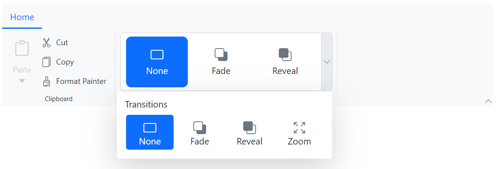

# Gallery Items in Blazor Ribbon component

The Ribbon supports a gallery view, allowing users to interact with a collection of related items such as icons, text, or images. You can render gallery items by setting the [Type](https://help.syncfusion.com/cr/blazor/Syncfusion.Blazor.Ribbon.RibbonItem.html#Syncfusion_Blazor_Ribbon_RibbonItem_Type) property of a Ribbon item to `RibbonItemType.Gallery` and customize it using the [RibbonGallerySettings](https://help.syncfusion.com/cr/blazor/Syncfusion.Blazor.Ribbon.RibbonGallerySettings.html) tag directive. The settings provide options like `Groups`, `ItemCount`, `PopupHeight`, `PopupWidth`, and more.

## Groups

You can render groups inside the gallery using the [Groups](https://help.syncfusion.com/cr/blazor/Syncfusion.Blazor.Ribbon.RibbonGallerySettings.html#Syncfusion_Blazor_Ribbon_RibbonGallerySettings_Groups) property of the [RibbonGallerySettings](https://help.syncfusion.com/cr/blazor/Syncfusion.Blazor.Ribbon.RibbonGallerySettings.html) tag directive. Groups can be customized using [GalleryGroup](https://help.syncfusion.com/cr/blazor/Syncfusion.Blazor.Ribbon.GalleryGroup.html) tag directive with properties like [Items](https://help.syncfusion.com/cr/blazor/Syncfusion.Blazor.Ribbon.GalleryGroup.html#Syncfusion_Blazor_Ribbon_GalleryGroup_Items), [CssClass](https://help.syncfusion.com/cr/blazor/Syncfusion.Blazor.Ribbon.GalleryGroup.html#Syncfusion_Blazor_Ribbon_GalleryGroup_CssClass), [Header](https://help.syncfusion.com/cr/blazor/Syncfusion.Blazor.Ribbon.GalleryGroup.html#Syncfusion_Blazor_Ribbon_GalleryGroup_Header), etc.

### Adding items

Gallery items can be added using [GalleryItem](https://help.syncfusion.com/cr/blazor/Syncfusion.Blazor.Ribbon.GalleryItem.html) tag directive within the [Items](https://help.syncfusion.com/cr/blazor/Syncfusion.Blazor.Ribbon.GalleryGroup.html#Syncfusion_Blazor_Ribbon_GalleryGroup_Items) property of a group. Below example demonstrates how to configure properties such as [Content](https://help.syncfusion.com/cr/blazor/Syncfusion.Blazor.Ribbon.GalleryItem.html#Syncfusion_Blazor_Ribbon_GalleryItem_Content), [IconCss](https://help.syncfusion.com/cr/blazor/Syncfusion.Blazor.Ribbon.GalleryItem.html#Syncfusion_Blazor_Ribbon_GalleryItem_IconCss), [Disabled](https://help.syncfusion.com/cr/blazor/Syncfusion.Blazor.Ribbon.GalleryItem.html#Syncfusion_Blazor_Ribbon_GalleryItem_Disabled) to the gallery item.




@using Syncfusion.Blazor.Ribbon;
@using Syncfusion.Blazor.SplitButtons;

    <SfRibbon>
        <RibbonTabs>
            <RibbonTab HeaderText="Home">
                <RibbonGroups>
                    <RibbonGroup HeaderText="Clipboard">
                        <RibbonCollections>
                            <RibbonCollection>
                                <RibbonItems>
                                    <RibbonItem Type=RibbonItemType.SplitButton Disabled=true>
                                        <RibbonSplitButtonSettings Content="Paste" IconCss="e-icons e-paste" Items="@formatItems"></RibbonSplitButtonSettings>
                                    </RibbonItem>
                                </RibbonItems>
                            </RibbonCollection>
                            <RibbonCollection>
                                <RibbonItems>
                                    <RibbonItem Type=RibbonItemType.Button>
                                        <RibbonButtonSettings Content="Cut" IconCss="e-icons e-cut"></RibbonButtonSettings>
                                    </RibbonItem>
                                    <RibbonItem Type=RibbonItemType.Button>
                                        <RibbonButtonSettings Content="Copy" IconCss="e-icons e-copy"></RibbonButtonSettings>
                                    </RibbonItem>
                                    <RibbonItem Type=RibbonItemType.Button>
                                        <RibbonButtonSettings Content="Format Painter" IconCss="e-icons e-format-painter"></RibbonButtonSettings>
                                    </RibbonItem>
                                </RibbonItems>
                            </RibbonCollection>
                        </RibbonCollections>
                    </RibbonGroup>
                    <RibbonGroup HeaderText="Gallery">
                        <RibbonCollections>
                            <RibbonCollection>
                                <RibbonItems>
                                    <RibbonItem Type=RibbonItemType.Gallery>
                                        <RibbonGallerySettings Groups="galleryGroups">
                                        </RibbonGallerySettings>
                                    </RibbonItem>
                                </RibbonItems>
                            </RibbonCollection>
                        </RibbonCollections>
                    </RibbonGroup>
                </RibbonGroups>
            </RibbonTab>
        </RibbonTabs>
    </SfRibbon>

@code{
    List<DropDownMenuItem> formatItems = new List<DropDownMenuItem>()
    {
        new DropDownMenuItem{ Text = "Keep Source Format" },
        new DropDownMenuItem{ Text = "Merge Format" },
        new DropDownMenuItem{ Text = "Keep Text Only" }
    };

    List<GalleryGroup> galleryGroups = new List<GalleryGroup>
    {
        new GalleryGroup
        {
            Items = new List<GalleryItem>
            {
                new GalleryItem { Content = "None", IconCss = "e-icons e-rectangle" },
                new GalleryItem { Content = "Fade", IconCss = "e-icons e-send-backward" },
                new GalleryItem { Content = "Reveal", IconCss = "e-icons e-bring-forward", Disabled = true },
                new GalleryItem { Content = "Zoom", IconCss = "e-icons e-zoom-to-fit" }
            }
        }
    };
}




#### CSS class

You can use the `CssClass` property to customize the gallery item.




@using Syncfusion.Blazor.Ribbon;
@using Syncfusion.Blazor.SplitButtons;

    <SfRibbon>
        <RibbonTabs>
            <RibbonTab HeaderText="Home">
                <RibbonGroups>
                    <RibbonGroup HeaderText="Clipboard">
                        <RibbonCollections>
                            <RibbonCollection>
                                <RibbonItems>
                                    <RibbonItem Type=RibbonItemType.SplitButton Disabled=true>
                                        <RibbonSplitButtonSettings Content="Paste" IconCss="e-icons e-paste" Items="@formatItems"></RibbonSplitButtonSettings>
                                    </RibbonItem>
                                </RibbonItems>
                            </RibbonCollection>
                            <RibbonCollection>
                                <RibbonItems>
                                    <RibbonItem Type=RibbonItemType.Button>
                                        <RibbonButtonSettings Content="Cut" IconCss="e-icons e-cut"></RibbonButtonSettings>
                                    </RibbonItem>
                                    <RibbonItem Type=RibbonItemType.Button>
                                        <RibbonButtonSettings Content="Copy" IconCss="e-icons e-copy"></RibbonButtonSettings>
                                    </RibbonItem>
                                    <RibbonItem Type=RibbonItemType.Button>
                                        <RibbonButtonSettings Content="Format Painter" IconCss="e-icons e-format-painter"></RibbonButtonSettings>
                                    </RibbonItem>
                                </RibbonItems>
                            </RibbonCollection>
                        </RibbonCollections>
                    </RibbonGroup>
                    <RibbonGroup HeaderText="Gallery">
                        <RibbonCollections>
                            <RibbonCollection>
                                <RibbonItems>
                                    <RibbonItem Type=RibbonItemType.Gallery>
                                        <RibbonGallerySettings Groups="galleryGroups">
                                        </RibbonGallerySettings>
                                    </RibbonItem>
                                </RibbonItems>
                            </RibbonCollection>
                        </RibbonCollections>
                    </RibbonGroup>
                </RibbonGroups>
            </RibbonTab>
        </RibbonTabs>
    </SfRibbon>

@code{
    List<DropDownMenuItem> formatItems = new List<DropDownMenuItem>()
    {
        new DropDownMenuItem{ Text = "Keep Source Format" },
        new DropDownMenuItem{ Text = "Merge Format" },
        new DropDownMenuItem{ Text = "Keep Text Only" }
    };

    List<GalleryGroup> galleryGroups = new List<GalleryGroup>
    {
       new GalleryGroup
        {
            Items = new List<GalleryItem>
            {
                new GalleryItem { Content = "Normal", CssClass = "normal" },
                new GalleryItem { Content = "Bad", CssClass = "bad" },
                new GalleryItem { Content = "Good", CssClass = "good" },
                new GalleryItem { Content = "Neutral", CssClass = "neutral" }
            }
        },
    };
}




### Custom header

You can use the [Header](https://help.syncfusion.com/cr/blazor/Syncfusion.Blazor.Ribbon.GalleryGroup.html#Syncfusion_Blazor_Ribbon_GalleryGroup_Header) property to set header for the groups in the Ribbon gallery popup.




@using Syncfusion.Blazor.Ribbon;
@using Syncfusion.Blazor.SplitButtons;

    <SfRibbon>
        <RibbonTabs>
            <RibbonTab HeaderText="Home">
                <RibbonGroups>
                    <RibbonGroup HeaderText="Clipboard">
                        <RibbonCollections>
                            <RibbonCollection>
                                <RibbonItems>
                                    <RibbonItem Type=RibbonItemType.SplitButton Disabled=true>
                                        <RibbonSplitButtonSettings Content="Paste" IconCss="e-icons e-paste" Items="@formatItems"></RibbonSplitButtonSettings>
                                    </RibbonItem>
                                </RibbonItems>
                            </RibbonCollection>
                            <RibbonCollection>
                                <RibbonItems>
                                    <RibbonItem Type=RibbonItemType.Button>
                                        <RibbonButtonSettings Content="Cut" IconCss="e-icons e-cut"></RibbonButtonSettings>
                                    </RibbonItem>
                                    <RibbonItem Type=RibbonItemType.Button>
                                        <RibbonButtonSettings Content="Copy" IconCss="e-icons e-copy"></RibbonButtonSettings>
                                    </RibbonItem>
                                    <RibbonItem Type=RibbonItemType.Button>
                                        <RibbonButtonSettings Content="Format Painter" IconCss="e-icons e-format-painter"></RibbonButtonSettings>
                                    </RibbonItem>
                                </RibbonItems>
                            </RibbonCollection>
                        </RibbonCollections>
                    </RibbonGroup>
                    <RibbonGroup HeaderText="Gallery">
                        <RibbonCollections>
                            <RibbonCollection>
                                <RibbonItems>
                                    <RibbonItem Type=RibbonItemType.Gallery>
                                        <RibbonGallerySettings Groups="galleryGroups">
                                        </RibbonGallerySettings>
                                    </RibbonItem>
                                </RibbonItems>
                            </RibbonCollection>
                        </RibbonCollections>
                    </RibbonGroup>
                </RibbonGroups>
            </RibbonTab>
        </RibbonTabs>
    </SfRibbon>

@code{
    List<DropDownMenuItem> formatItems = new List<DropDownMenuItem>()
    {
        new DropDownMenuItem{ Text = "Keep Source Format" },
        new DropDownMenuItem{ Text = "Merge Format" },
        new DropDownMenuItem{ Text = "Keep Text Only" }
    };

    List<GalleryGroup> galleryGroups = new List<GalleryGroup>
    {
        new GalleryGroup
        {
            Header = "Transitions",
            Items = new List<GalleryItem>
            {
                new GalleryItem { Content = "None", IconCss = "e-icons e-rectangle" },
                new GalleryItem { Content = "Fade", IconCss = "e-icons e-send-backward" },
                new GalleryItem { Content = "Reveal", IconCss = "e-icons e-bring-forward", Disabled = true },
                new GalleryItem { Content = "Zoom", IconCss = "e-icons e-zoom-to-fit" }
            }
        }
    };
}




### Setting item dimensions

You can specify the width and height of gallery items using the [ItemWidth](https://help.syncfusion.com/cr/blazor/Syncfusion.Blazor.Ribbon.GalleryGroup.html#Syncfusion_Blazor_Ribbon_GalleryGroup_ItemWidth) and [ItemHeight](https://help.syncfusion.com/cr/blazor/Syncfusion.Blazor.Ribbon.GalleryGroup.html#Syncfusion_Blazor_Ribbon_GalleryGroup_ItemHeight) properties within a [GalleryGroup](https://help.syncfusion.com/cr/blazor/Syncfusion.Blazor.Ribbon.GalleryGroup.html). If the `ItemHeight` of the gallery item is smaller, then the remaining gallery items are aligned based on the `ItemCount` specified.




@using Syncfusion.Blazor.Ribbon;
@using Syncfusion.Blazor.SplitButtons;

    <SfRibbon>
        <RibbonTabs>
            <RibbonTab HeaderText="Home">
                <RibbonGroups>
                    <RibbonGroup HeaderText="Clipboard">
                        <RibbonCollections>
                            <RibbonCollection>
                                <RibbonItems>
                                    <RibbonItem Type=RibbonItemType.SplitButton Disabled=true>
                                        <RibbonSplitButtonSettings Content="Paste" IconCss="e-icons e-paste" Items="@formatItems"></RibbonSplitButtonSettings>
                                    </RibbonItem>
                                </RibbonItems>
                            </RibbonCollection>
                            <RibbonCollection>
                                <RibbonItems>
                                    <RibbonItem Type=RibbonItemType.Button>
                                        <RibbonButtonSettings Content="Cut" IconCss="e-icons e-cut"></RibbonButtonSettings>
                                    </RibbonItem>
                                    <RibbonItem Type=RibbonItemType.Button>
                                        <RibbonButtonSettings Content="Copy" IconCss="e-icons e-copy"></RibbonButtonSettings>
                                    </RibbonItem>
                                    <RibbonItem Type=RibbonItemType.Button>
                                        <RibbonButtonSettings Content="Format Painter" IconCss="e-icons e-format-painter"></RibbonButtonSettings>
                                    </RibbonItem>
                                </RibbonItems>
                            </RibbonCollection>
                        </RibbonCollections>
                    </RibbonGroup>
                    <RibbonGroup HeaderText="Gallery">
                        <RibbonCollections>
                            <RibbonCollection>
                                <RibbonItems>
                                    <RibbonItem Type=RibbonItemType.Gallery>
                                        <RibbonGallerySettings Groups="galleryGroups">
                                        </RibbonGallerySettings>
                                    </RibbonItem>
                                </RibbonItems>
                            </RibbonCollection>
                        </RibbonCollections>
                    </RibbonGroup>
                </RibbonGroups>
            </RibbonTab>
        </RibbonTabs>
    </SfRibbon>

@code{
    List<DropDownMenuItem> formatItems = new List<DropDownMenuItem>()
    {
        new DropDownMenuItem{ Text = "Keep Source Format" },
        new DropDownMenuItem{ Text = "Merge Format" },
        new DropDownMenuItem{ Text = "Keep Text Only" }
    };

    List<GalleryGroup> galleryGroups = new List<GalleryGroup>
    {
        new GalleryGroup
        {
            Header = "Title and Headings",
            ItemWidth = "100",
            ItemHeight = "40",
            Items = new List<GalleryItem>
            {
                new GalleryItem { Content = "Heading 1" },
                new GalleryItem { Content = "Heading 2" },
                new GalleryItem { Content = "Heading 3" },
                new GalleryItem { Content = "Heading 4" },
                new GalleryItem { Content = "Title" },
                new GalleryItem { Content = "Total" }
            }
        },
    };
}




### Group styling

You can use the [CssClass](https://help.syncfusion.com/cr/blazor/Syncfusion.Blazor.Ribbon.GalleryGroup.html#Syncfusion_Blazor_Ribbon_GalleryGroup_CssClass) property within the [GalleryGroup](https://help.syncfusion.com/cr/blazor/Syncfusion.Blazor.Ribbon.GalleryGroup.html) to customize the appearance of gallery groups.




@using Syncfusion.Blazor.Ribbon;
@using Syncfusion.Blazor.SplitButtons;

    <SfRibbon>
        <RibbonTabs>
            <RibbonTab HeaderText="Home">
                <RibbonGroups>
                    <RibbonGroup HeaderText="Clipboard">
                        <RibbonCollections>
                            <RibbonCollection>
                                <RibbonItems>
                                    <RibbonItem Type=RibbonItemType.SplitButton Disabled=true>
                                        <RibbonSplitButtonSettings Content="Paste" IconCss="e-icons e-paste" Items="@formatItems"></RibbonSplitButtonSettings>
                                    </RibbonItem>
                                </RibbonItems>
                            </RibbonCollection>
                            <RibbonCollection>
                                <RibbonItems>
                                    <RibbonItem Type=RibbonItemType.Button>
                                        <RibbonButtonSettings Content="Cut" IconCss="e-icons e-cut"></RibbonButtonSettings>
                                    </RibbonItem>
                                    <RibbonItem Type=RibbonItemType.Button>
                                        <RibbonButtonSettings Content="Copy" IconCss="e-icons e-copy"></RibbonButtonSettings>
                                    </RibbonItem>
                                    <RibbonItem Type=RibbonItemType.Button>
                                        <RibbonButtonSettings Content="Format Painter" IconCss="e-icons e-format-painter"></RibbonButtonSettings>
                                    </RibbonItem>
                                </RibbonItems>
                            </RibbonCollection>
                        </RibbonCollections>
                    </RibbonGroup>
                    <RibbonGroup HeaderText="Gallery">
                        <RibbonCollections>
                            <RibbonCollection>
                                <RibbonItems>
                                    <RibbonItem Type=RibbonItemType.Gallery>
                                        <RibbonGallerySettings Groups="galleryGroups">
                                        </RibbonGallerySettings>
                                    </RibbonItem>
                                </RibbonItems>
                            </RibbonCollection>
                        </RibbonCollections>
                    </RibbonGroup>
                </RibbonGroups>
            </RibbonTab>
        </RibbonTabs>
    </SfRibbon>

@code{
    List<DropDownMenuItem> formatItems = new List<DropDownMenuItem>()
    {
        new DropDownMenuItem{ Text = "Keep Source Format" },
        new DropDownMenuItem{ Text = "Merge Format" },
        new DropDownMenuItem{ Text = "Keep Text Only" }
    };

    List<GalleryGroup> galleryGroups = new List<GalleryGroup>
    {
        new GalleryGroup
        {
            CssClass = "custom-group",
            Items = new List<GalleryItem>
            {
                new GalleryItem { Content = "None", IconCss = "e-icons e-rectangle" },
                new GalleryItem { Content = "Fade", IconCss = "e-icons e-send-backward" },
                new GalleryItem { Content = "Reveal", IconCss = "e-icons e-bring-forward" },
                new GalleryItem { Content = "Zoom", IconCss = "e-icons e-zoom-to-fit" }
            }
        }
    };
}




## Setting item count

You can customize the number of items to be displayed in Ribbon gallery by using the [ItemCount](https://help.syncfusion.com/cr/blazor/Syncfusion.Blazor.Ribbon.RibbonGallerySettings.html#Syncfusion_Blazor_Ribbon_RibbonGallerySettings_ItemCount) property. By default, the `ItemCount` is set to `3`. The following example showcases the utilization of the `ItemCount` property, displaying a ribbon gallery with 4 items.




@using Syncfusion.Blazor.Ribbon;
@using Syncfusion.Blazor.SplitButtons;

    <SfRibbon>
        <RibbonTabs>
            <RibbonTab HeaderText="Home">
                <RibbonGroups>
                    <RibbonGroup HeaderText="Clipboard">
                        <RibbonCollections>
                            <RibbonCollection>
                                <RibbonItems>
                                    <RibbonItem Type=RibbonItemType.SplitButton Disabled=true>
                                        <RibbonSplitButtonSettings Content="Paste" IconCss="e-icons e-paste" Items="@formatItems"></RibbonSplitButtonSettings>
                                    </RibbonItem>
                                </RibbonItems>
                            </RibbonCollection>
                            <RibbonCollection>
                                <RibbonItems>
                                    <RibbonItem Type=RibbonItemType.Button>
                                        <RibbonButtonSettings Content="Cut" IconCss="e-icons e-cut"></RibbonButtonSettings>
                                    </RibbonItem>
                                    <RibbonItem Type=RibbonItemType.Button>
                                        <RibbonButtonSettings Content="Copy" IconCss="e-icons e-copy"></RibbonButtonSettings>
                                    </RibbonItem>
                                    <RibbonItem Type=RibbonItemType.Button>
                                        <RibbonButtonSettings Content="Format Painter" IconCss="e-icons e-format-painter"></RibbonButtonSettings>
                                    </RibbonItem>
                                </RibbonItems>
                            </RibbonCollection>
                        </RibbonCollections>
                    </RibbonGroup>
                    <RibbonGroup HeaderText="Gallery">
                        <RibbonCollections>
                            <RibbonCollection>
                                <RibbonItems>
                                    <RibbonItem Type=RibbonItemType.Gallery>
                                        <RibbonGallerySettings ItemCount="4" Groups="galleryGroups">
                                        </RibbonGallerySettings>
                                    </RibbonItem>
                                </RibbonItems>
                            </RibbonCollection>
                        </RibbonCollections>
                    </RibbonGroup>
                </RibbonGroups>
            </RibbonTab>
        </RibbonTabs>
    </SfRibbon>

@code{
    List<DropDownMenuItem> formatItems = new List<DropDownMenuItem>()
    {
        new DropDownMenuItem{ Text = "Keep Source Format" },
        new DropDownMenuItem{ Text = "Merge Format" },
        new DropDownMenuItem{ Text = "Keep Text Only" }
    };

    List<GalleryGroup> galleryGroups = new List<GalleryGroup>
    {
        new GalleryGroup
        {
            Header = "Title and Headings",
            Items = new List<GalleryItem>
            {
                new GalleryItem { Content = "Heading 1" },
                new GalleryItem { Content = "Heading 2" },
                new GalleryItem { Content = "Heading 3" },
                new GalleryItem { Content = "Heading 4" }
            }
        },
    };
}




## Setting selected item

You can use the [SelectedItemIndex](https://help.syncfusion.com/cr/blazor/Syncfusion.Blazor.Ribbon.RibbonGallerySettings.html#Syncfusion_Blazor_Ribbon_RibbonGallerySettings_SelectedItemIndex) property to define the currently selected item in the Ribbon gallery items.




@using Syncfusion.Blazor.Ribbon;
@using Syncfusion.Blazor.SplitButtons;

    <SfRibbon>
        <RibbonTabs>
            <RibbonTab HeaderText="Home">
                <RibbonGroups>
                    <RibbonGroup HeaderText="Clipboard">
                        <RibbonCollections>
                            <RibbonCollection>
                                <RibbonItems>
                                    <RibbonItem Type=RibbonItemType.SplitButton Disabled=true>
                                        <RibbonSplitButtonSettings Content="Paste" IconCss="e-icons e-paste" Items="@formatItems"></RibbonSplitButtonSettings>
                                    </RibbonItem>
                                </RibbonItems>
                            </RibbonCollection>
                            <RibbonCollection>
                                <RibbonItems>
                                    <RibbonItem Type=RibbonItemType.Button>
                                        <RibbonButtonSettings Content="Cut" IconCss="e-icons e-cut"></RibbonButtonSettings>
                                    </RibbonItem>
                                    <RibbonItem Type=RibbonItemType.Button>
                                        <RibbonButtonSettings Content="Copy" IconCss="e-icons e-copy"></RibbonButtonSettings>
                                    </RibbonItem>
                                    <RibbonItem Type=RibbonItemType.Button>
                                        <RibbonButtonSettings Content="Format Painter" IconCss="e-icons e-format-painter"></RibbonButtonSettings>
                                    </RibbonItem>
                                </RibbonItems>
                            </RibbonCollection>
                        </RibbonCollections>
                    </RibbonGroup>
                    <RibbonGroup HeaderText="Gallery">
                        <RibbonCollections>
                            <RibbonCollection>
                                <RibbonItems>
                                    <RibbonItem Type=RibbonItemType.Gallery>
                                        <RibbonGallerySettings @bind-SelectedItemIndex=@gallerySelectedItemIndex
                                                               Groups="galleryGroups">
                                        </RibbonGallerySettings>
                                    </RibbonItem>
                                </RibbonItems>
                            </RibbonCollection>
                        </RibbonCollections>
                    </RibbonGroup>
                </RibbonGroups>
            </RibbonTab>
        </RibbonTabs>
    </SfRibbon>

@code{

    private int gallerySelectedItemIndex = 2;

    List<DropDownMenuItem> formatItems = new List<DropDownMenuItem>()
    {
        new DropDownMenuItem{ Text = "Keep Source Format" },
        new DropDownMenuItem{ Text = "Merge Format" },
        new DropDownMenuItem{ Text = "Keep Text Only" }
    };

    List<GalleryGroup> galleryGroups = new List<GalleryGroup>
    {
        new GalleryGroup
        {
            Header = "Title and Headings",
            Items = new List<GalleryItem>
            {
                new GalleryItem { Content = "Heading 1" },
                new GalleryItem { Content = "Heading 2" },
                new GalleryItem { Content = "Heading 3" },
                new GalleryItem { Content = "Heading 4" },
            }
        },
    };
}




## Setting popup dimensions

You can specify the width and height of the gallery popup by using the [PopupWidth](https://help.syncfusion.com/cr/blazor/Syncfusion.Blazor.Ribbon.RibbonGallerySettings.html#Syncfusion_Blazor_Ribbon_RibbonGallerySettings_PopupWidth) and [PopupHeight](https://help.syncfusion.com/cr/blazor/Syncfusion.Blazor.Ribbon.RibbonGallerySettings.html#Syncfusion_Blazor_Ribbon_RibbonGallerySettings_PopupHeight) properties within the [RibbonGallerySettings](https://help.syncfusion.com/cr/blazor/Syncfusion.Blazor.Ribbon.RibbonGallerySettings.html).




@using Syncfusion.Blazor.Ribbon;
@using Syncfusion.Blazor.SplitButtons;

    <SfRibbon>
        <RibbonTabs>
            <RibbonTab HeaderText="Home">
                <RibbonGroups>
                    <RibbonGroup HeaderText="Clipboard">
                        <RibbonCollections>
                            <RibbonCollection>
                                <RibbonItems>
                                    <RibbonItem Type=RibbonItemType.SplitButton Disabled=true>
                                        <RibbonSplitButtonSettings Content="Paste" IconCss="e-icons e-paste" Items="@formatItems"></RibbonSplitButtonSettings>
                                    </RibbonItem>
                                </RibbonItems>
                            </RibbonCollection>
                            <RibbonCollection>
                                <RibbonItems>
                                    <RibbonItem Type=RibbonItemType.Button>
                                        <RibbonButtonSettings Content="Cut" IconCss="e-icons e-cut"></RibbonButtonSettings>
                                    </RibbonItem>
                                    <RibbonItem Type=RibbonItemType.Button>
                                        <RibbonButtonSettings Content="Copy" IconCss="e-icons e-copy"></RibbonButtonSettings>
                                    </RibbonItem>
                                    <RibbonItem Type=RibbonItemType.Button>
                                        <RibbonButtonSettings Content="Format Painter" IconCss="e-icons e-format-painter"></RibbonButtonSettings>
                                    </RibbonItem>
                                </RibbonItems>
                            </RibbonCollection>
                        </RibbonCollections>
                    </RibbonGroup>
                    <RibbonGroup HeaderText="Gallery">
                        <RibbonCollections>
                            <RibbonCollection>
                                <RibbonItems>
                                    <RibbonItem Type=RibbonItemType.Gallery>
                                        <RibbonGallerySettings PopupWidth="330"
                                                               PopupHeight="170"
                                                               Groups="galleryGroups">
                                        </RibbonGallerySettings>
                                    </RibbonItem>
                                </RibbonItems>
                            </RibbonCollection>
                        </RibbonCollections>
                    </RibbonGroup>
                </RibbonGroups>
            </RibbonTab>
        </RibbonTabs>
    </SfRibbon>

@code{

    List<DropDownMenuItem> formatItems = new List<DropDownMenuItem>()
    {
        new DropDownMenuItem{ Text = "Keep Source Format" },
        new DropDownMenuItem{ Text = "Merge Format" },
        new DropDownMenuItem{ Text = "Keep Text Only" }
    };

    List<GalleryGroup> galleryGroups = new List<GalleryGroup>
    {
        new GalleryGroup
        {
            Header = "Title and Headings",
            Items = new List<GalleryItem>
            {
                new GalleryItem { Content = "Heading 1" },
                new GalleryItem { Content = "Heading 2" },
                new GalleryItem { Content = "Heading 3" },
                new GalleryItem { Content = "Heading 4" },
            }
        },
    };
}




## Template customization

You can customize the default appearance and content of Ribbon gallery items by using [Template](https://help.syncfusion.com/cr/blazor/Syncfusion.Blazor.Ribbon.RibbonGallerySettings.html#Syncfusion_Blazor_Ribbon_RibbonGallerySettings_Template) property. Similarly, you can also customize the appearance of Ribbon gallery popup by using the [PopupTemplate](https://help.syncfusion.com/cr/blazor/Syncfusion.Blazor.Ribbon.RibbonGallerySettings.html#Syncfusion_Blazor_Ribbon_RibbonGallerySettings_PopupTemplate) property.

[GalleryItemContext](https://help.syncfusion.com/cr/blazor/Syncfusion.Blazor.Ribbon.GalleryItemContext.html) will be passed as context to both the templates. You can utilize it to create more customized gallery items. The below minimal example demonstrates the usages of both the `Template` and `PopupTemplate` properties:




@using Syncfusion.Blazor.Ribbon;
@using Syncfusion.Blazor.SplitButtons;

    <SfRibbon>
        <RibbonTabs>
            <RibbonTab HeaderText="Home">
                <RibbonGroups>
                    <RibbonGroup HeaderText="Clipboard">
                        <RibbonCollections>
                            <RibbonCollection>
                                <RibbonItems>
                                    <RibbonItem Type=RibbonItemType.SplitButton Disabled=true>
                                        <RibbonSplitButtonSettings Content="Paste" IconCss="e-icons e-paste" Items="@formatItems"></RibbonSplitButtonSettings>
                                    </RibbonItem>
                                </RibbonItems>
                            </RibbonCollection>
                            <RibbonCollection>
                                <RibbonItems>
                                    <RibbonItem Type=RibbonItemType.Button>
                                        <RibbonButtonSettings Content="Cut" IconCss="e-icons e-cut"></RibbonButtonSettings>
                                    </RibbonItem>
                                    <RibbonItem Type=RibbonItemType.Button>
                                        <RibbonButtonSettings Content="Copy" IconCss="e-icons e-copy"></RibbonButtonSettings>
                                    </RibbonItem>
                                    <RibbonItem Type=RibbonItemType.Button>
                                        <RibbonButtonSettings Content="Format Painter" IconCss="e-icons e-format-painter"></RibbonButtonSettings>
                                    </RibbonItem>
                                </RibbonItems>
                            </RibbonCollection>
                        </RibbonCollections>
                    </RibbonGroup>
                    <RibbonGroup HeaderText="Gallery">
                        <RibbonCollections>
                            <RibbonCollection>
                                <RibbonItems>
                                    <RibbonItem Type=RibbonItemType.Gallery>
                                        <Template Context="context">
                                            @RenderGalleryTemplate(context)
                                        </Template>
                                        <PopupTemplate Context="context">
                                            @RenderGalleryTemplate(context)
                                        </PopupTemplate>
                                    </RibbonItem>
                                </RibbonItems>
                            </RibbonCollection>
                        </RibbonCollections>
                    </RibbonGroup>
                </RibbonGroups>
            </RibbonTab>
        </RibbonTabs>
    </SfRibbon>

@code{

    private RenderFragment<GalleryItemContext> RenderGalleryTemplate => context => @

        <table class="table">
            <tbody>
                <tr class="row_one">
                    <td class="tableContent">—</td>
                    <td class="tableContent">—</td>
                    <td class="tableContent">—</td>
                    <td class="tableContent">—</td>
                    <td class="tableContent">—</td>
                </tr>
                <tr class="row_two">
                    <td class="tableContent">—</td>
                    <td class="tableContent">—</td>
                    <td class="tableContent">—</td>
                    <td class="tableContent">—</td>
                    <td class="tableContent">—</td>
                </tr>
                <tr class="row_three">
                    <td class="tableContent">—</td>
                    <td class="tableContent">—</td>
                    <td class="tableContent">—</td>
                    <td class="tableContent">—</td>
                    <td class="tableContent">—</td>
                </tr>
            </tbody>
        </table>
    
;

    List<DropDownMenuItem> formatItems = new List<DropDownMenuItem>()
    {
        new DropDownMenuItem{ Text = "Keep Source Format" },
        new DropDownMenuItem{ Text = "Merge Format" },
        new DropDownMenuItem{ Text = "Keep Text Only" }
    };

    List<GalleryGroup> galleryGroups = new List<GalleryGroup>
    {
        new GalleryGroup
        {
            Header = "Plain Tables",
            Items = new List<GalleryItem>
            {
                new GalleryItem {},
                new GalleryItem {},
                new GalleryItem {},
                new GalleryItem {},
            }
        },
                new GalleryGroup
        {
            Header = "List Tables",
            Items = new List<GalleryItem>
            {
                new GalleryItem {},
                new GalleryItem {},
                new GalleryItem {},
                new GalleryItem {},
            }
        },
    };
}




## Events

The following events are available in the Ribbon Gallery.

|Name|Args|Description|
|---|---|---|
|[PopupOpening](https://help.syncfusion.com/cr/blazor/Syncfusion.Blazor.Ribbon.RibbonGallerySettings.html#Syncfusion_Blazor_Ribbon_RibbonGallerySettings_PopupOpening)|GalleryPopupOpenEventArgs|Triggers before the gallery popup opens|
|[PopupClosing](https://help.syncfusion.com/cr/blazor/Syncfusion.Blazor.Ribbon.RibbonGallerySettings.html#Syncfusion_Blazor_Ribbon_RibbonGallerySettings_PopupClosing)|GalleryPopupCloseEventArgs|Triggers before the gallery popup closes|
|[ItemHover](https://help.syncfusion.com/cr/blazor/Syncfusion.Blazor.Ribbon.RibbonGallerySettings.html#Syncfusion_Blazor_Ribbon_RibbonGallerySettings_ItemHover)|GalleryItemHoverEventArgs|Triggers when hovering over a gallery item|
|[ItemRendering](https://help.syncfusion.com/cr/blazor/Syncfusion.Blazor.Ribbon.RibbonGallerySettings.html#Syncfusion_Blazor_Ribbon_RibbonGallerySettings_ItemRendering)|GalleryItemRenderEventArgs|Triggers during the rendering of a gallery item|
|[Selecting](https://help.syncfusion.com/cr/blazor/Syncfusion.Blazor.Ribbon.RibbonGallerySettings.html#Syncfusion_Blazor_Ribbon_RibbonGallerySettings_Selecting)|GallerySelectEventArgs|Triggers before selecting a gallery item|
|[Selected](https://help.syncfusion.com/cr/blazor/Syncfusion.Blazor.Ribbon.RibbonGallerySettings.html#Syncfusion_Blazor_Ribbon_RibbonGallerySettings_Selected)|GallerySelectedEventArgs|Triggers after a gallery item has been selected|




@using Syncfusion.Blazor.Ribbon

    <SfRibbon>
        <RibbonTabs>
            <RibbonTab HeaderText="Home">
                <RibbonGroups>
                    <RibbonGroup HeaderText="Clipboard">
                        <RibbonCollections>
                            <RibbonCollection>
                                <RibbonItems>
                                    <RibbonItem Type=RibbonItemType.Button>
                                        <RibbonButtonSettings Content="Cut" IconCss="e-icons e-cut"></RibbonButtonSettings>
                                    </RibbonItem>
                                </RibbonItems>
                            </RibbonCollection>
                        </RibbonCollections>
                    </RibbonGroup>
                    <RibbonGroup HeaderText="Gallery">
                        <RibbonCollections>
                            <RibbonCollection>
                                <RibbonItems>
                                    <RibbonItem Type=RibbonItemType.Gallery>
                                        <RibbonGallerySettings Groups="galleryGroups"
                                                               PopupOpening="PopupOpening"
                                                               PopupClosing="PopupClosing"
                                                               ItemRendering="ItemRendering"
                                                               ItemHover="ItemHover"
                                                               Selecting="Selecting"
                                                               Selected="Selected">
                                        </RibbonGallerySettings>
                                    </RibbonItem>
                                </RibbonItems>
                            </RibbonCollection>
                        </RibbonCollections>
                    </RibbonGroup>
                </RibbonGroups>
            </RibbonTab>
        </RibbonTabs>
    </SfRibbon>

@code {
    
    private void PopupOpening(GalleryPopupOpenEventArgs args) { /* your actions here */ }

    private void PopupClosing(GalleryPopupCloseEventArgs args) { /* your actions here */ }

    private void ItemHover(GalleryItemHoverEventArgs args) { /* your actions here */ }

    private void ItemRendering(GalleryItemRenderEventArgs args) { /* your actions here */ }

    private void Selecting(GallerySelectEventArgs args) { /* your actions here */ }

    private void Selected(GallerySelectedEventArgs args) { /* your actions here */ }

    List<GalleryGroup> galleryGroups = new List<GalleryGroup>
    {
        new GalleryGroup
        {
            Header = "Title and Headings",
            Items = new List<GalleryItem>
            {
                new GalleryItem { Content = "Heading 1" },
                new GalleryItem { Content = "Heading 2" },
                new GalleryItem { Content = "Heading 3" },
                new GalleryItem { Content = "Heading 4" }
            }
        },
    };
}


