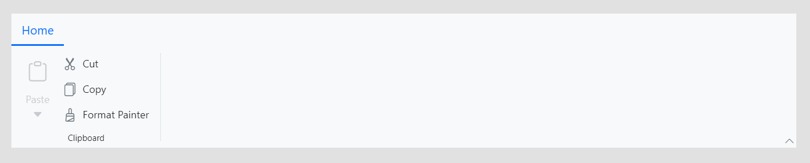

# Getting Started with Blazor Ribbon in a Blazor Web App

This section explains how to add the [Blazor Ribbon](https://www.syncfusion.com/blazor-components/blazor-ribbon) component to your Blazor Web App using [Visual Studio](https://visualstudio.microsoft.com/vs/) or Visual Studio Code.

To get started quickly with the Blazor Ribbon component, refer to the following video guide:







## Prerequisites

* [System requirements for Blazor components](https://blazor.syncfusion.com/documentation/system-requirements)

## Create a new Blazor Web App in Visual Studio

You can create a **Blazor Web App** using Visual Studio 2022 via [Microsoft Templates](https://learn.microsoft.com/en-us/aspnet/core/blazor/tooling?view=aspnetcore-8.0&pivots=vs) or the [Syncfusion<sup style="font-size:70%">&reg;</sup> Blazor Extension](https://blazor.syncfusion.com/documentation/visual-studio-integration/template-studio).

You need to configure the corresponding [Interactive render mode](https://learn.microsoft.com/en-us/aspnet/core/blazor/components/render-modes?view=aspnetcore-8.0#render-modes) and [Interactivity location](https://learn.microsoft.com/en-us/aspnet/core/blazor/tooling?view=aspnetcore-8.0&pivots=vs) while creating a Blazor Web Application.

## Install Syncfusion<sup style="font-size:70%">&reg;</sup> Blazor Ribbon and Themes NuGet in the App

To add the Blazor Ribbon component, install the `Syncfusion.Blazor.Ribbon` and `Syncfusion.Blazor.Themes` NuGet packages.

N> When using the `WebAssembly` or `Auto` render mode, it is required to install the necessary NuGet packages in the client project.

Open the NuGet package manager in Visual Studio (*Tools → NuGet Package Manager → Manage NuGet Packages for Solution*), search for and install [Syncfusion.Blazor.Ribbon](https://www.nuget.org/packages/Syncfusion.Blazor.Ribbon/) and [Syncfusion.Blazor.Themes](https://www.nuget.org/packages/Syncfusion.Blazor.Themes/).

Alternatively, you can use the Package Manager Console:




Install-Package Syncfusion.Blazor.Ribbon -Version {{ site.releaseversion }}
Install-Package Syncfusion.Blazor.Themes -Version {{ site.releaseversion }}




N> Syncfusion<sup style="font-size:70%">&reg;</sup> Blazor components are available in [nuget.org](https://www.nuget.org/packages?q=syncfusion.blazor). Refer to [NuGet packages](https://blazor.syncfusion.com/documentation/nuget-packages) topic for available NuGet packages list with component details.





## Prerequisites

* [System requirements for Blazor components](https://blazor.syncfusion.com/documentation/system-requirements)

## Create a new Blazor Web App in Visual Studio Code

You can create a **Blazor Web App** using Visual Studio Code via [Microsoft Templates](https://learn.microsoft.com/en-us/aspnet/core/blazor/tooling?view=aspnetcore-8.0&pivots=vsc) or the [Syncfusion<sup style="font-size:70%">&reg;</sup> Blazor Extension](https://blazor.syncfusion.com/documentation/visual-studio-code-integration/create-project).

You need to configure the corresponding [Interactive render mode](https://learn.microsoft.com/en-us/aspnet/core/blazor/components/render-modes?view=aspnetcore-8.0#render-modes) and [Interactivity location](https://learn.microsoft.com/en-us/aspnet/core/blazor/tooling?view=aspnetcore-8.0&pivots=vsc) while creating a Blazor Web Application.

For example, in a Blazor Web App with the `Auto` interactive render mode, use the following commands.




dotnet new blazor -o BlazorWebApp -int Auto
cd BlazorWebApp
cd BlazorWebApp.Client




N> For more information on creating a **Blazor Web App** with various interactive modes and locations, refer to this [link](https://blazor.syncfusion.com/documentation/getting-started/blazor-web-app?tabcontent=visual-studio-code#render-interactive-modes).

## Install Syncfusion<sup style="font-size:70%">&reg;</sup> Blazor Ribbon and Themes NuGet in the App

If you utilize `WebAssembly` or `Auto` render modes in the Blazor Web App need to be install Syncfusion<sup style="font-size:70%">&reg;</sup> Blazor components NuGet packages within the client project.

* Press <kbd>Ctrl</kbd>+<kbd>`</kbd> to open the integrated terminal in Visual Studio Code.
* Ensure you’re in the project root directory where your `.csproj` file is located.
* Run the following command to install a [Syncfusion.Blazor.Ribbon](https://www.nuget.org/packages/Syncfusion.Blazor.Ribbon) and [Syncfusion.Blazor.Themes](https://www.nuget.org/packages/Syncfusion.Blazor.Themes/) NuGet package and ensure all dependencies are installed.





dotnet add package Syncfusion.Blazor.Ribbon -v {{ site.releaseversion }}
dotnet add package Syncfusion.Blazor.Themes -v {{ site.releaseversion }}
dotnet restore





N> Syncfusion<sup style="font-size:70%">&reg;</sup> Blazor components are available in [nuget.org](https://www.nuget.org/packages?q=syncfusion.blazor). Refer to [NuGet packages](https://blazor.syncfusion.com/documentation/nuget-packages) topic for available NuGet packages list with component details.





## Register Syncfusion<sup style="font-size:70%">&reg;</sup> Blazor Service

| Interactive Render Mode | Description |
| -- | -- |
| WebAssembly or Auto | Open **~/_Imports.razor** file from the client project.|
| Server | Open **~/_import.razor** file, which is located in the `Components` folder.|

Import the `Syncfusion.Blazor` and `Syncfusion.Blazor.Ribbon` namespace.




@using Syncfusion.Blazor
@using Syncfusion.Blazor.Ribbon




Next, register the Syncfusion<sup style="font-size:70%">&reg;</sup> Blazor service in **~/Program.cs**.

*   For `Server` render mode, register the service in the server project's `Program.cs`.
*   For `WebAssembly` or `Auto` render modes, you must register the service in *both* the server and client (`.Client`) project `Program.cs` files.




...
...
using Syncfusion.Blazor;

var builder = WebApplication.CreateBuilder(args);

// Add services to the container.
builder.Services.AddRazorComponents()
    .AddInteractiveServerComponents()
    .AddInteractiveWebAssemblyComponents();
builder.Services.AddSyncfusionBlazor();

var app = builder.Build();
....




...
using Syncfusion.Blazor;

var builder = WebAssemblyHostBuilder.CreateDefault(args);
builder.Services.AddSyncfusionBlazor();

await builder.Build().RunAsync();




If the **Interactive Render Mode** is set to `Server`, your project will contain a single **~/Program.cs** file. So, you should register the Syncfusion<sup style="font-size:70%">&reg;</sup> Blazor Service only in that **~/Program.cs** file.




...
using Syncfusion.Blazor;

var builder = WebApplication.CreateBuilder(args);

// Add services to the container.
builder.Services.AddRazorComponents()
    .AddInteractiveServerComponents();
builder.Services.AddSyncfusionBlazor();

var app = builder.Build();
....




## Add Stylesheet and Script Resources

The theme stylesheet and script can be accessed from NuGet through [Static Web Assets](https://blazor.syncfusion.com/documentation/appearance/themes#static-web-assets). Include the stylesheet reference in the `<head>` section and the script reference at the end of the `<body>` in the **~/Components/App.razor** file as shown below:

```html
<head>
    ....
    <link href="_content/Syncfusion.Blazor.Themes/bootstrap5.css" rel="stylesheet" />
</head>

<body>
    ....
    <script src="_content/Syncfusion.Blazor.Core/scripts/syncfusion-blazor.min.js" type="text/javascript"></script>
</body>
```

N> Check out the [Blazor Themes](https://blazor.syncfusion.com/documentation/appearance/themes) topic to discover various methods ([Static Web Assets](https://blazor.syncfusion.com/documentation/appearance/themes#static-web-assets), [CDN](https://blazor.syncfusion.com/documentation/appearance/themes#cdn-reference), and [CRG](https://blazor.syncfusion.com/documentation/common/custom-resource-generator)) for referencing themes in your Blazor application. Also, check out the [Adding Script Reference](https://blazor.syncfusion.com/documentation/common/adding-script-references) topic to learn different approaches for adding script references in your Blazor application.

## Add Syncfusion<sup style="font-size:70%">&reg;</sup> Blazor Ribbon Component

Add the Syncfusion<sup style="font-size:70%">&reg;</sup> Blazor Ribbon component in the **~Pages/.razor** file. If an interactivity location as `Per page/component` in the web app, define a render mode at the top of the `~Pages/.razor` component, as follows:

| Interactivity Location | RenderMode | Code |
| --- | --- | --- |
| Per page/component | Auto | `@rendermode InteractiveAuto` |
| | WebAssembly | `@rendermode InteractiveWebAssembly` |
| | Server | `@rendermode InteractiveServer` |

N> If an **Interactivity Location** is set to `Global` and the **Render Mode** is set to `Auto` or `WebAssembly` or `Server`, the render mode is configured in the `App.razor` file by default.




@* desired render mode define here *@
@rendermode InteractiveAuto




### Adding a Ribbon Tab

Options in the ribbon are organized into tabs. Use the [RibbonTabs](https://help.syncfusion.com/cr/blazor/Syncfusion.Blazor.Ribbon.RibbonTabs.html) tag to group all tabs and the [RibbonTab](https://help.syncfusion.com/cr/blazor/Syncfusion.Blazor.Ribbon.RibbonTab.html) tag for each individual tab.




<SfRibbon>
    <RibbonTabs>
        <RibbonTab HeaderText="Home"></RibbonTab>
    </RibbonTabs>
</SfRibbon>




### Adding ribbon group

To define a ribbon group under each tab, you can use the [RibbonGroups](https://help.syncfusion.com/cr/blazor/Syncfusion.Blazor.Ribbon.RibbonGroups.html) tag directive like below. The [Orientation](https://help.syncfusion.com/cr/blazor/Syncfusion.Blazor.Ribbon.RibbonGroup.html#Syncfusion_Blazor_Ribbon_RibbonGroup_Orientation) property of ribbon group defines whether the collection of items inside the group will be rendered column-wise or row-wise.




<SfRibbon>
    <RibbonTabs>
        <RibbonTab HeaderText="Home">
            <RibbonGroups>
                <RibbonGroup HeaderText="Clipboard" Orientation="Orientation.Column"></RibbonGroup>
            </RibbonGroups>
        </RibbonTab>
    </RibbonTabs>
</SfRibbon>




### Adding a Ribbon Item

Within a group, items are organized into collections. Use the [RibbonCollection](https://help.syncfusion.com/cr/blazor/Syncfusion.Blazor.Ribbon.RibbonCollection.html) tag ditective for a set of items and the [RibbonItem](https://help.syncfusion.com/cr/blazor/Syncfusion.Blazor.Ribbon.RibbonItem.html) tag directive for each individual item. The [Type](https://help.syncfusion.com/cr/blazor/Syncfusion.Blazor.Ribbon.RibbonGroup.html#Syncfusion_Blazor_Ribbon_RibbonGroup_Orientation) property specifies the kind of item to render, such as a Button, DropDown, or ComboBox.




@using Syncfusion.Blazor.Ribbon;
@using Syncfusion.Blazor.SplitButtons;

<SfRibbon>
    <RibbonTabs>
        <RibbonTab HeaderText="Home">
            <RibbonGroups>
                <RibbonGroup HeaderText="Clipboard">
                    <RibbonCollections>
                        <RibbonCollection>
                            <RibbonItems>
                                <RibbonItem Type=RibbonItemType.SplitButton Disabled=true>
                                    <RibbonSplitButtonSettings Content="Paste" IconCss="e-icons e-paste" Items="@formatItems"></RibbonSplitButtonSettings>
                                </RibbonItem>
                            </RibbonItems>
                        </RibbonCollection>
                        <RibbonCollection>
                            <RibbonItems>
                                <RibbonItem Type=RibbonItemType.Button>
                                    <RibbonButtonSettings Content="Cut" IconCss="e-icons e-cut" ></RibbonButtonSettings>
                                </RibbonItem>
                                <RibbonItem Type=RibbonItemType.Button>
                                    <RibbonButtonSettings Content="Copy" IconCss="e-icons e-copy"></RibbonButtonSettings>
                                </RibbonItem>
                                <RibbonItem Type=RibbonItemType.Button>
                                    <RibbonButtonSettings Content="Format Painter" IconCss="e-icons e-format-painter"></RibbonButtonSettings>
                                </RibbonItem>
                            </RibbonItems>
                        </RibbonCollection>
                    </RibbonCollections>
                </RibbonGroup>
            </RibbonGroups>
        </RibbonTab>
    </RibbonTabs>
</SfRibbon>

@code{
    List<DropDownMenuItem> formatItems = new List<DropDownMenuItem>()
    {
        new DropDownMenuItem{ Text = "Keep Source Format" },
        new DropDownMenuItem{ Text = "Merge Format" },
        new DropDownMenuItem{ Text = "Keep Text Only" }
    };
}






* Press <kbd>Ctrl</kbd>+<kbd>F5</kbd> (Windows) or <kbd>⌘</kbd>+<kbd>F5</kbd> (macOS) to launch the application. This will render the Syncfusion<sup style="font-size:70%">&reg;</sup> Blazor Ribbon component in your default web browser.


