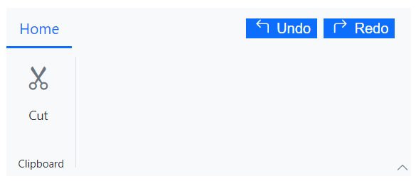

[SfRibbon]: https://help.syncfusion.com/cr/blazor/Syncfusion.Blazor.Ribbon.SfRibbon.html
[HelpPaneTemplate]: https://help.syncfusion.com/cr/blazor/Syncfusion.Blazor.Ribbon.HelpPaneTemplate.html

# Help Pane in Blazor Ribbon component

The help pane is dedicated area where the users can define help contents like controlling document permissions, sharing features, and more which appears on the right side of the Ribbon. You can use the [HelpPaneTemplate][HelpPaneTemplate] tag directive within the [SfRibbon][SfRibbon] to set the help pane contents.




@using Syncfusion.Blazor.Ribbon;
@using Syncfusion.Blazor.SplitButtons;

    <SfRibbon>
        <HelpPaneTemplate>
            <button class="action_btn">
 Undo 
</button>
            <button class="action_btn">
 Redo 
</button>
        </HelpPaneTemplate>
        <RibbonTabs>
            <RibbonTab HeaderText="Home">
                <RibbonGroups>
                    <RibbonGroup HeaderText="Clipboard">
                        <RibbonCollections>
                            <RibbonCollection>
                                <RibbonItems>
                                    <RibbonItem Type=RibbonItemType.Button AllowedSizes="RibbonItemSize.Large">
                                        <RibbonButtonSettings Content="Cut" IconCss="e-icons e-cut"></RibbonButtonSettings>
                                    </RibbonItem>
                                </RibbonItems>
                            </RibbonCollection>
                        </RibbonCollections>
                    </RibbonGroup>
                </RibbonGroups>
            </RibbonTab>
        </RibbonTabs>
    </SfRibbon>




