# Items in Blazor Ribbon Component

The Syncfusion Blazor Ribbon component supports a variety of item types that can be added to a ribbon group.

## Button Item

To add a button to the Ribbon, set the [Type](https://help.syncfusion.com/cr/blazor/Syncfusion.Blazor.Ribbon.RibbonItem.html#Syncfusion_Blazor_Ribbon_RibbonItem_Type) property of a `RibbonItem` to `RibbonItemType.Button`. You can customize its appearance and behavior using the [RibbonButtonSettings](https://help.syncfusion.com/cr/blazor/Syncfusion.Blazor.Ribbon.RibbonItem.html#Syncfusion_Blazor_Ribbon_RibbonItem_ButtonSettings) tag, which provides options such as [IconCss](https://help.syncfusion.com/cr/blazor/Syncfusion.Blazor.Ribbon.RibbonButtonSettings.html#Syncfusion_Blazor_Ribbon_RibbonButtonSettings_IconCss), [Content](https://help.syncfusion.com/cr/blazor/Syncfusion.Blazor.Ribbon.RibbonButtonSettings.html#Syncfusion_Blazor_Ribbon_RibbonButtonSettings_Content), and [IsToggle](https://help.syncfusion.com/cr/blazor/Syncfusion.Blazor.Ribbon.RibbonButtonSettings.html#Syncfusion_Blazor_Ribbon_RibbonButtonSettings_IsToggle).

### Events

The following events are available for the Button item:

|Name|Args|Description|
|---|---|---|
|[Created](https://help.syncfusion.com/cr/blazor/Syncfusion.Blazor.Ribbon.RibbonButtonSettings.html#Syncfusion_Blazor_Ribbon_RibbonButtonSettings_Created)|EventCallback|Triggers after the Ribbon Button is created, which is ideal for performing custom initialization logic.|
|[OnClick](https://help.syncfusion.com/cr/blazor/Syncfusion.Blazor.Ribbon.RibbonButtonSettings.html#Syncfusion_Blazor_Ribbon_RibbonButtonSettings_OnClick)|MouseEventArgs|Triggers when the Ribbon Button is clicked. Use this event to define the primary action for the button.|

The following example demonstrates how to configure a Button item and handle its events.




@using Syncfusion.Blazor.Ribbon

    <SfRibbon>
        <RibbonTabs>
            <RibbonTab HeaderText="Home">
                <RibbonGroups>
                    <RibbonGroup HeaderText="Clipboard">
                        <RibbonCollections>
                            <RibbonCollection>
                                <RibbonItems>
                                    <RibbonItem Type=RibbonItemType.Button>
                                        <RibbonButtonSettings Content="Cut"
                                                              IconCss="e-icons e-cut"
                                                              OnClick="ClickHandler" Created="Created">
                                        </RibbonButtonSettings>
                                    </RibbonItem>
                                </RibbonItems>
                            </RibbonCollection>
                        </RibbonCollections>
                    </RibbonGroup>
                </RibbonGroups>
            </RibbonTab>
        </RibbonTabs>
    </SfRibbon>

@code {
    private void Created() { /* your actions here */ }

    private void ClickHandler(MouseEventArgs args) { /* your actions here */ }
}




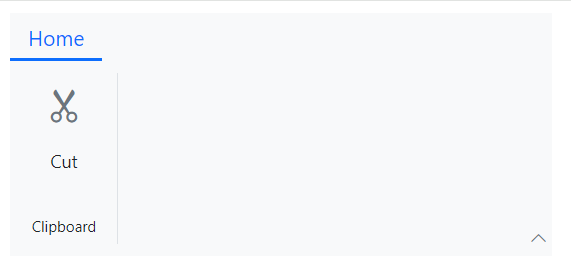

## Checkbox Item

The checkbox can be customized using the [RibbonCheckboxSettings](https://help.syncfusion.com/cr/blazor/Syncfusion.Blazor.Ribbon.RibbonCheckBoxSettings.html) tag directive, which provides options such as [Label](https://help.syncfusion.com/cr/blazor/Syncfusion.Blazor.Ribbon.RibbonCheckBoxSettings.html#Syncfusion_Blazor_Ribbon_RibbonCheckBoxSettings_Label) and [Checked](https://help.syncfusion.com/cr/blazor/Syncfusion.Blazor.Ribbon.RibbonCheckBoxSettings.html#Syncfusion_Blazor_Ribbon_RibbonCheckBoxSettings_Checked) to configure its appearance and behavior.

### Events

The following events are available for the Checkbox item:

|Name|Args|Description|
|---|---|---|
|[Created](https://help.syncfusion.com/cr/blazor/Syncfusion.Blazor.Ribbon.RibbonCheckBoxSettings.html#Syncfusion_Blazor_Ribbon_RibbonCheckBoxSettings_Created)|EventCallback|Triggers after the Ribbon checkbox is created, allowing for immediate setup actions.|
|[ValueChange](https://help.syncfusion.com/cr/blazor/Syncfusion.Blazor.Ribbon.RibbonCheckBoxSettings.html#Syncfusion_Blazor_Ribbon_RibbonCheckBoxSettings_ValueChange)|ChangeEventArgs|Triggers when the checkbox state changes (checked or unchecked). The new boolean value is available in the event arguments.|

This example shows how to configure Checkbox items and handle their events.




@using Syncfusion.Blazor.Ribbon

    <SfRibbon>
        <RibbonTabs>
            <RibbonTab HeaderText="Home">
                <RibbonGroups>
                    <RibbonGroup HeaderText="Show">
                        <RibbonCollections>
                            <RibbonCollection>
                                <RibbonItems>
                                    <RibbonItem Type=RibbonItemType.CheckBox>
                                        <RibbonCheckBoxSettings Label="Ruler"
                                                                Checked="true" 
                                                                Created="Created" 
                                                                ValueChange="ValueChange">
                                        </RibbonCheckBoxSettings>
                                    </RibbonItem>
                                    <RibbonItem Type=RibbonItemType.CheckBox>
                                        <RibbonCheckBoxSettings Label="Gridlines"></RibbonCheckBoxSettings>
                                    </RibbonItem>
                                    <RibbonItem Type=RibbonItemType.CheckBox>
                                        <RibbonCheckBoxSettings Label="Navigation Pane"></RibbonCheckBoxSettings>
                                    </RibbonItem>
                                </RibbonItems>
                            </RibbonCollection>
                        </RibbonCollections>
                    </RibbonGroup>
                </RibbonGroups>
            </RibbonTab>
        </RibbonTabs>
    </SfRibbon>

@code {
    private void Created() { /* your actions here */ }

    private void ValueChange(ChangeEventArgs args) { /* your actions here */ }
}




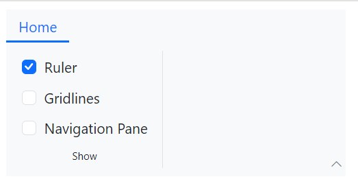

## DropDownButton Item

To render a dropdown button, set the [Type](https://help.syncfusion.com/cr/blazor/Syncfusion.Blazor.Ribbon.RibbonItem.html#Syncfusion_Blazor_Ribbon_RibbonItem_Type) property to `RibbonItemType.DropDown`. This item displays a button with a dropdown menu for additional options. The [RibbonDropDownSettings](https://help.syncfusion.com/cr/blazor/Syncfusion.Blazor.Ribbon.RibbonItem.html#Syncfusion_Blazor_Ribbon_RibbonItem_DropDownSettings) tag allows you to configure properties such as [Content](https://help.syncfusion.com/cr/blazor/Syncfusion.Blazor.Ribbon.RibbonDropDownSettings.html#Syncfusion_Blazor_Ribbon_RibbonDropDownSettings_Content), [Items](https://help.syncfusion.com/cr/blazor/Syncfusion.Blazor.Ribbon.RibbonDropDownSettings.html#Syncfusion_Blazor_Ribbon_RibbonDropDownSettings_Items), and more.

### Events

The following events are available for the DropDownButton item:

|Name|Args|Description|
|---|---|---|
|[Created](https://help.syncfusion.com/cr/blazor/Syncfusion.Blazor.Ribbon.RibbonDropDownSettings.html#Syncfusion_Blazor_Ribbon_RibbonDropDownSettings_Created)|EventCallback|Triggers after the dropdown button is created, allowing for custom setup actions.|
|[PopupOpening](https://help.syncfusion.com/cr/blazor/Syncfusion.Blazor.Ribbon.RibbonDropDownSettings.html#Syncfusion_Blazor_Ribbon_RibbonDropDownSettings_PopupOpening)|DropDownPopupOpenEventArgs|Triggers before the dropdown popup opens, enabling tasks like dynamically populating items.|
|[PopupClosing](https://help.syncfusion.com/cr/blazor/Syncfusion.Blazor.Ribbon.RibbonDropDownSettings.html#Syncfusion_Blazor_Ribbon_RibbonDropDownSettings_PopupClosing)|DropDownPopupCloseEventArgs|Triggers before the popup closes, which can be used for cleanup or validation.|
|[PopupOpened](https://help.syncfusion.com/cr/blazor/Syncfusion.Blazor.Ribbon.RibbonDropDownSettings.html#Syncfusion_Blazor_Ribbon_RibbonDropDownSettings_PopupOpened)|DropDownPopupOpenedEventArgs|Triggers after the popup has opened.|
|[PopupClosed](https://help.syncfusion.com/cr/blazor/Syncfusion.Blazor.Ribbon.RibbonDropDownSettings.html#Syncfusion_Blazor_Ribbon_RibbonDropDownSettings_PopupClosed)|DropDownPopupClosedEventArgs|Triggers after the popup has closed.|
|[ItemRendering](https://help.syncfusion.com/cr/blazor/Syncfusion.Blazor.Ribbon.RibbonDropDownSettings.html#Syncfusion_Blazor_Ribbon_RibbonDropDownSettings_ItemRendering)|DropDownItemRenderEventArgs|Triggers while rendering each dropdown item, allowing for item-level customization.|
|[ItemSelecting](https://help.syncfusion.com/cr/blazor/Syncfusion.Blazor.Ribbon.RibbonDropDownSettings.html#Syncfusion_Blazor_Ribbon_RibbonDropDownSettings_ItemSelecting)|DropDownItemSelectEventArgs|Triggers when a dropdown item is selected. Use this event to define the action for each item.|

The following example demonstrates how to configure a DropDownButton item and its events.




@using Syncfusion.Blazor.Ribbon
@using Syncfusion.Blazor.SplitButtons

    <SfRibbon>
        <RibbonTabs>
            <RibbonTab HeaderText="Home">
                <RibbonGroups>
                    <RibbonGroup HeaderText="Header">
                        <RibbonCollections>
                            <RibbonCollection>
                                <RibbonItems>
                                    <RibbonItem Type=RibbonItemType.DropDown>
                                        <RibbonDropDownSettings Content="Header" IconCss="e-icons e-header" Items="@headerItems" 
                                                                Created="Created" 
                                                                PopupOpening="PopupOpening" 
                                                                PopupClosing="PopupClosing" 
                                                                PopupOpened="PopupOpened" 
                                                                PopupClosed="PopupClosed" 
                                                                ItemRendering="ItemRendering" 
                                                                ItemSelecting="ItemSelecting">
                                        </RibbonDropDownSettings>
                                    </RibbonItem>
                                </RibbonItems>
                            </RibbonCollection>
                        </RibbonCollections>
                    </RibbonGroup>
                </RibbonGroups>
            </RibbonTab>
        </RibbonTabs>
    </SfRibbon>

@code {
    private void Created() { /* your actions here */ }

    private void PopupOpening(DropDownPopupOpenEventArgs args) { /* your actions here */ }

    private void PopupClosing(DropDownPopupCloseEventArgs args) { /* your actions here */ }

    private void PopupOpened(DropDownPopupOpenedEventArgs args) { /* your actions here */ }

    private void PopupClosed(DropDownPopupClosedEventArgs args) { /* your actions here */ }

    private void ItemRendering(DropDownItemRenderEventArgs args) { /* your actions here */ }

    private void ItemSelecting(DropDownItemSelectEventArgs args) { /* your actions here */ }

    List<DropDownMenuItem> headerItems = new List<DropDownMenuItem>()
    {
        new DropDownMenuItem{ Text = "Insert Header" },
        new DropDownMenuItem{ Text = "Edit Header" },
        new DropDownMenuItem{ Text = "Remove Header" }
    };

}




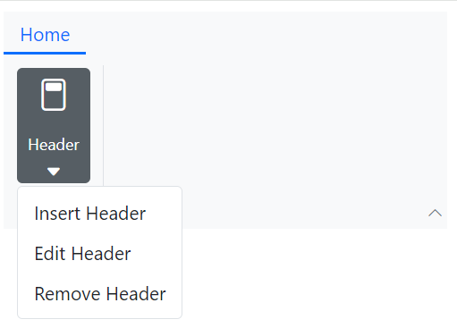

## SplitButton Item

A split button can be rendered by setting the [Type](https://help.syncfusion.com/cr/blazor/Syncfusion.Blazor.Ribbon.RibbonItem.html#Syncfusion_Blazor_Ribbon_RibbonItem_Type) property to `RibbonItemType.SplitButton`. This item combines a primary button for a default action with a dropdown list for secondary actions. Use the [RibbonSplitButtonSettings](https://help.syncfusion.com/cr/blazor/Syncfusion.Blazor.Ribbon.RibbonItem.html#Syncfusion_Blazor_Ribbon_RibbonItem_SplitButtonSettings) tag to configure options like [Content](https://help.syncfusion.com/cr/blazor/Syncfusion.Blazor.Ribbon.RibbonSplitButtonSettings.html#Syncfusion_Blazor_Ribbon_RibbonSplitButtonSettings_Content) and [Items](https://help.syncfusion.com/cr/blazor/Syncfusion.Blazor.Ribbon.RibbonSplitButtonSettings.html#Syncfusion_Blazor_Ribbon_RibbonSplitButtonSettings_Items).

### Events

The following events are available for the SplitButton item:

|Name|Args|Description|
|---|---|---|
|[Created](https://help.syncfusion.com/cr/blazor/Syncfusion.Blazor.Ribbon.RibbonSplitButtonSettings.html#Syncfusion_Blazor_Ribbon_RibbonSplitButtonSettings_Created)|EventCallback|Triggers when the split button is created, allowing for initialization.|
|[Clicked](https://help.syncfusion.com/cr/blazor/Syncfusion.Blazor.Ribbon.RibbonSplitButtonSettings.html#Syncfusion_Blazor_Ribbon_RibbonSplitButtonSettings_Clicked)|SplitButtonClickedEventArgs|Triggers when the primary button of the SplitButton is clicked, allowing you to define its main action.|
|[PopupOpening](https://help.syncfusion.com/cr/blazor/Syncfusion.Blazor.Ribbon.RibbonSplitButtonSettings.html#Syncfusion_Blazor_Ribbon_RibbonSplitButtonSettings_PopupOpening)|SplitButtonPopupOpenEventArgs|Triggers before the dropdown popup opens.|
|[PopupClosing](https://help.syncfusion.com/cr/blazor/Syncfusion.Blazor.Ribbon.RibbonSplitButtonSettings.html#Syncfusion_Blazor_Ribbon_RibbonSplitButtonSettings_PopupClosing)|SplitButtonPopupCloseEventArgs|Triggers before the popup closes.|
|[PopupOpened](https://help.syncfusion.com/cr/blazor/Syncfusion.Blazor.Ribbon.RibbonSplitButtonSettings.html#Syncfusion_Blazor_Ribbon_RibbonSplitButtonSettings_PopupOpened)|SplitButtonPopupOpenedEventArgs|Triggers after the popup has opened.|
|[PopupClosed](https://help.syncfusion.com/cr/blazor/Syncfusion.Blazor.Ribbon.RibbonSplitButtonSettings.html#Syncfusion_Blazor_Ribbon_RibbonSplitButtonSettings_PopupClosed)|SplitButtonPopupClosedEventArgs|Triggers after the popup has closed.|
|[ItemRendering](https://help.syncfusion.com/cr/blazor/Syncfusion.Blazor.Ribbon.RibbonSplitButtonSettings.html#Syncfusion_Blazor_Ribbon_RibbonSplitButtonSettings_ItemRendering)|SplitButtonItemRenderEventArgs|Triggers during item rendering, allowing for item customization.|
|[ItemSelected](https://help.syncfusion.com/cr/blazor/Syncfusion.Blazor.Ribbon.RibbonSplitButtonSettings.html#Syncfusion_Blazor_Ribbon_RibbonSplitButtonSettings_ItemSelected)|SplitButtonItemSelectedEventArgs|Triggers when a dropdown item is selected, allowing for selection-specific actions.|

The following example demonstrates how to configure a SplitButton item and handle its events.




@using Syncfusion.Blazor.Ribbon
@using Syncfusion.Blazor.SplitButtons

    <SfRibbon>
        <RibbonTabs>
            <RibbonTab HeaderText="Home">
                <RibbonGroups>
                    <RibbonGroup HeaderText="Header">
                        <RibbonCollections>
                            <RibbonCollection>
                                <RibbonItems>
                                    <RibbonItem Type=RibbonItemType.SplitButton>
                                        <RibbonSplitButtonSettings Content="Paste" IconCss="e-icons e-paste" Items="@formatItems" 
                                                                    Created="Created" 
                                                                    Clicked="Clicked" 
                                                                    PopupOpening="PopupOpening" 
                                                                    PopupClosing="PopupClosing" 
                                                                    PopupOpened="PopupOpened" 
                                                                    PopupClosed="PopupClosed" 
                                                                    ItemRendering="ItemRendering" 
                                                                    ItemSelecting="ItemSelecting">
                                        </RibbonSplitButtonSettings>
                                    </RibbonItem>
                                </RibbonItems>
                            </RibbonCollection>
                        </RibbonCollections>
                    </RibbonGroup>
                </RibbonGroups>
            </RibbonTab>
        </RibbonTabs>
    </SfRibbon>

@code {
    private void Created() { /* your actions here */ }

    private void Clicked(SplitButtonClickedEventArgs args) { /* your actions here */ }

    private void PopupOpening(SplitButtonPopupOpenEventArgs args) { /* your actions here */ }

    private void PopupClosing(SplitButtonPopupCloseEventArgs args) { /* your actions here */ }

    private void PopupOpened(SplitButtonPopupOpenedEventArgs args) { /* your actions here */ }

    private void PopupClosed(SplitButtonPopupClosedEventArgs args) { /* your actions here */ }

    private void ItemRendering(SplitButtonItemRenderEventArgs args) { /* your actions here */ }

    private void ItemSelecting(SplitButtonItemSelectedEventArgs args) { /* your actions here */ }

    List<DropDownMenuItem> formatItems = new List<DropDownMenuItem>()
    {
        new DropDownMenuItem{ Text = "Keep Source Format" },
        new DropDownMenuItem{ Text = "Merge Format" },
        new DropDownMenuItem{ Text = "Keep Text Only" }
    };

}




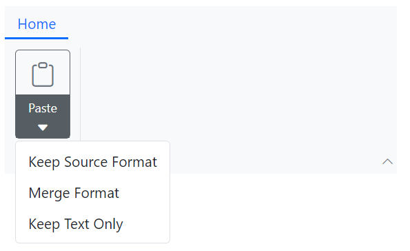

## Combobox Item

Create a combobox item by setting the [Type](https://help.syncfusion.com/cr/blazor/Syncfusion.Blazor.Ribbon.RibbonItem.html#Syncfusion_Blazor_Ribbon_RibbonItem_Type) property to `RibbonItemType.ComboBox`. This item provides an editable dropdown list with optional filtering. Use the [RibbonComboBoxSettings](https://help.syncfusion.com/cr/blazor/Syncfusion.Blazor.Ribbon.RibbonItem.html#Syncfusion_Blazor_Ribbon_RibbonItem_ComboBoxSettings) tag to configure properties like [DataSource](https://help.syncfusion.com/cr/blazor/Syncfusion.Blazor.Ribbon.RibbonComboBoxSettings.html#Syncfusion_Blazor_Ribbon_RibbonComboBoxSettings_DataSource), [AllowFiltering](https://help.syncfusion.com/cr/blazor/Syncfusion.Blazor.Ribbon.RibbonComboBoxSettings.html#Syncfusion_Blazor_Ribbon_RibbonComboBoxSettings_AllowFiltering), [Index](https://help.syncfusion.com/cr/blazor/Syncfusion.Blazor.Ribbon.RibbonComboBoxSettings.html#Syncfusion_Blazor_Ribbon_RibbonComboBoxSettings_Index), [Placeholder](https://help.syncfusion.com/cr/blazor/Syncfusion.Blazor.Ribbon.RibbonComboBoxSettings.html#Syncfusion_Blazor_Ribbon_RibbonComboBoxSettings_Placeholder), and more.

### Events

The following events are available for the ComboBox item:

|Name|Args|Description|
|---|---|---|
|[PopupOpening](https://help.syncfusion.com/cr/blazor/Syncfusion.Blazor.Ribbon.RibbonComboBoxSettings.html#Syncfusion_Blazor_Ribbon_RibbonComboBoxSettings_PopupOpening)|ComboBoxPopupOpenEventArgs|Triggers before the combobox popup opens.|
|[PopupClosing](https://help.syncfusion.com/cr/blazor/Syncfusion.Blazor.Ribbon.RibbonComboBoxSettings.html#Syncfusion_Blazor_Ribbon_RibbonComboBoxSettings_PopupClosing)|ComboBoxPopupCloseEventArgs|Triggers before the popup closes.|
|[PopupOpened](https://help.syncfusion.com/cr/blazor/Syncfusion.Blazor.Ribbon.RibbonComboBoxSettings.html#Syncfusion_Blazor_Ribbon_RibbonComboBoxSettings_PopupOpened)|ComboBoxPopupOpenedEventArgs|Triggers after the popup opens.|
|[PopupClosed](https://help.syncfusion.com/cr/blazor/Syncfusion.Blazor.Ribbon.RibbonComboBoxSettings.html#Syncfusion_Blazor_Ribbon_RibbonComboBoxSettings_PopupClosed)|ComboBoxPopupClosedEventArgs|Triggers after the popup closes.|
|[Filtering](https://help.syncfusion.com/cr/blazor/Syncfusion.Blazor.Ribbon.RibbonComboBoxSettings.html#Syncfusion_Blazor_Ribbon_RibbonComboBoxSettings_Filtering)|ComboBoxFilterEventArgs|Triggers when the user types in the combobox, allowing for custom filtering logic.|
|[Selecting](https://help.syncfusion.com/cr/blazor/Syncfusion.Blazor.Ribbon.RibbonComboBoxSettings.html#Syncfusion_Blazor_Ribbon_RibbonComboBoxSettings_Selecting)|ComboBoxSelectEventArgs|Triggers before an item is selected, which can be used for validation.|
|[ValueChange](https://help.syncfusion.com/cr/blazor/Syncfusion.Blazor.Ribbon.RibbonComboBoxSettings.html#Syncfusion_Blazor_Ribbon_RibbonComboBoxSettings_ValueChange)|ComboBoxChangeEventArgs|Triggers when the combobox value changes, enabling actions based on the new selection.|

The following example shows how to configure ComboBox items for font selection.




@using Syncfusion.Blazor.Ribbon
@using Syncfusion.Blazor.SplitButtons
@using Syncfusion.Blazor.DropDowns

    <SfRibbon>
        <RibbonTabs>
            <RibbonTab HeaderText="Home">
                <RibbonGroups>
                    <RibbonGroup Orientation=Orientation.Row HeaderText="Font">
                        <RibbonCollections>
                            <RibbonCollection>
                                <RibbonItems>
                                    <RibbonItem Type=RibbonItemType.ComboBox>
                                        <RibbonComboBoxSettings @bind-Value="@fontFamValue" ShowClearButton="true" AllowFiltering=true DataSource="@fontFamilyItems" FieldSettings="@fieldSetings"
                                        PopupOpening="PopupOpening" 
                                        PopupClosing="PopupClosing" 
                                        PopupOpened="PopupOpened" 
                                        PopupClosed="PopupClosed" 
                                        Filtering="Filtering" 
                                        Selecting="Selecting" 
                                        ValueChange="ValueChange">
                                        </RibbonComboBoxSettings>
                                    </RibbonItem>
                                    <RibbonItem Type=RibbonItemType.ComboBox>
                                        <RibbonComboBoxSettings Index="3" AllowFiltering=true DataSource="@fontSizeItems" FieldSettings="@fieldSetings"></RibbonComboBoxSettings>
                                    </RibbonItem>
                                </RibbonItems>
                            </RibbonCollection>
                        </RibbonCollections>
                    </RibbonGroup>
                </RibbonGroups>
            </RibbonTab>
        </RibbonTabs>
    </SfRibbon>

@code {

    public string fontFamValue { get; set; } = "Cambria";

    private class ComboBoxItem
    {
        public string Text { get; set; }
        public string Value { get; set; }
    }

    FieldSettingsModel fieldSetings = new FieldSettingsModel
    {
        Text = "Text",
        Value = "Value"
    };

    List<ComboBoxItem> fontFamilyItems = new List<ComboBoxItem>
    {
        new ComboBoxItem { Text = "Algerian", Value = "Algerian" },
        new ComboBoxItem { Text = "Arial", Value = "Arial" },
        new ComboBoxItem { Text = "Calibri", Value = "Calibri" },
        new ComboBoxItem { Text = "Cambria", Value = "Cambria" },
        new ComboBoxItem { Text = "Cambria Math", Value = "Cambria Math" },
    };

    List<ComboBoxItem> fontSizeItems = new List<ComboBoxItem>
    {
        new ComboBoxItem { Text = "8", Value = "8" },
        new ComboBoxItem { Text = "9", Value = "9" },
        new ComboBoxItem { Text = "10", Value = "10" },
        new ComboBoxItem { Text = "11", Value = "11" },
        new ComboBoxItem { Text = "12", Value = "12" },
    };

    private void PopupOpening(ComboBoxPopupOpenEventArgs args) { /* your actions here */ }

    private void PopupClosing(ComboBoxPopupCloseEventArgs args) { /* your actions here */ }

    private void PopupOpened(ComboBoxPopupOpenedEventArgs args) { /* your actions here */ }

    private void PopupClosed(ComboBoxPopupClosedEventArgs args) { /* your actions here */ }

    private void Filtering(ComboBoxFilterEventArgs args) { /* your actions here */ }

    private void Selecting(ComboBoxSelectEventArgs args) { /* your actions here */ }

    private void ValueChange(ComboBoxChangeEventArgs args) { /* your actions here */ }

}




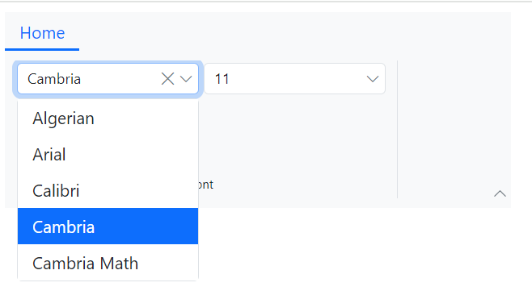

## ColorPicker Item

To add a color picker, set the [Type](https://help.syncfusion.com/cr/blazor/Syncfusion.Blazor.Ribbon.RibbonItem.html#Syncfusion_Blazor_Ribbon_RibbonItem_Type) property to `RibbonItemType.ColorPicker`. This item provides a rich color selection interface. It can be customized using the [RibbonColorPickerSettings](https://help.syncfusion.com/cr/blazor/Syncfusion.Blazor.Ribbon.RibbonItem.html#Syncfusion_Blazor_Ribbon_RibbonItem_ColorPickerSettings) tag directive with properties like [Value](https://help.syncfusion.com/cr/blazor/Syncfusion.Blazor.Ribbon.RibbonColorPickerSettings.html#Syncfusion_Blazor_Ribbon_RibbonColorPickerSettings_Value) and [Mode](https://help.syncfusion.com/cr/blazor/Syncfusion.Blazor.Ribbon.RibbonColorPickerSettings.html#Syncfusion_Blazor_Ribbon_RibbonColorPickerSettings_Mode).

### Events

The following events are available for the ColorPicker item:

|Name|Args|Description|
|---|---|---|
|[Created](https://help.syncfusion.com/cr/blazor/Syncfusion.Blazor.Ribbon.RibbonColorPickerSettings.html#Syncfusion_Blazor_Ribbon_RibbonColorPickerSettings_Created)|EventCallback|Triggers when the color picker is created.|
|[Opening](https://help.syncfusion.com/cr/blazor/Syncfusion.Blazor.Ribbon.RibbonColorPickerSettings.html#Syncfusion_Blazor_Ribbon_RibbonColorPickerSettings_Opening)|ColorPickerOpenEventArgs|Triggers before the color picker popup opens.|
|[Closing](https://help.syncfusion.com/cr/blazor/Syncfusion.Blazor.Ribbon.RibbonColorPickerSettings.html#Syncfusion_Blazor_Ribbon_RibbonColorPickerSettings_Closing)|ColorPickerCloseEventArgs|Triggers before the color picker closes.|
|[Opened](https://help.syncfusion.com/cr/blazor/Syncfusion.Blazor.Ribbon.RibbonColorPickerSettings.html#Syncfusion_Blazor_Ribbon_RibbonColorPickerSettings_Opened)|ColorPickerOpenedEventArgs|Triggers after the color picker has opened.|
|[TileRendering](https://help.syncfusion.com/cr/blazor/Syncfusion.Blazor.Ribbon.RibbonColorPickerSettings.html#Syncfusion_Blazor_Ribbon_RibbonColorPickerSettings_TileRendering)|TileRenderEventArgs|Triggers when rendering each palette tile, allowing for tile customization.|
|[ValueChange](https://help.syncfusion.com/cr/blazor/Syncfusion.Blazor.Ribbon.RibbonColorPickerSettings.html#Syncfusion_Blazor_Ribbon_RibbonColorPickerSettings_ValueChange)|ColorPickerEventArgs|Triggers when the color value changes, which is useful for live previews.|
|[Selected](https://help.syncfusion.com/cr/blazor/Syncfusion.Blazor.Ribbon.RibbonColorPickerSettings.html#Syncfusion_Blazor_Ribbon_RibbonColorPickerSettings_Selected)|ColorPickerSelectedEventArgs|Triggers when a color is selected from the palette.|

This example shows how to configure a ColorPicker item and handle its events.




@using Syncfusion.Blazor.Ribbon
@using Syncfusion.Blazor.SplitButtons

    <SfRibbon>
        <RibbonTabs>
            <RibbonTab HeaderText="Home">
                <RibbonGroups>
                    <RibbonGroup HeaderText="Font">
                        <RibbonCollections>
                            <RibbonCollection>
                                <RibbonItems>
                                    <RibbonItem Type=RibbonItemType.ColorPicker AllowedSizes="RibbonItemSize.Small">
                                        <RibbonColorPickerSettings Value="#123456"
                                                                   Created="Created" 
                                                                   Opening="Opening" 
                                                                   Closing="Closing" 
                                                                   Opened="Opened" 
                                                                   TileRendering="TileRendering" 
                                                                   Selected="Selected" 
                                                                   ValueChange="ValueChange">
                                        </RibbonColorPickerSettings>
                                    </RibbonItem>
                                </RibbonItems>
                            </RibbonCollection>
                        </RibbonCollections>
                    </RibbonGroup>
                </RibbonGroups>
            </RibbonTab>
        </RibbonTabs>
    </SfRibbon>

@code {
    private void Created() { /* your actions here */ }

    private void Opening(ColorPickerOpenEventArgs args) { /* your actions here */ }

    private void Closing(ColorPickerCloseEventArgs args) { /* your actions here */ }

    private void Opened(ColorPickerOpenedEventArgs args) { /* your actions here */ }

    private void ValueChange(ColorPickerEventArgs args) { /* your actions here */ }

    private void TileRendering(TileRenderEventArgs args) { /* your actions here */ }

    private void Selected(ColorPickerSelectedEventArgs args) { /* your actions here */ }

}




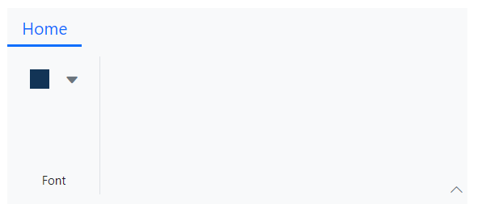

## GroupButton Item

You can render the built-in Ribbon group button item by setting the [Type](https://help.syncfusion.com/cr/blazor/Syncfusion.Blazor.Ribbon.RibbonItem.html#Syncfusion_Blazor_Ribbon_RibbonItem_Type) property as `RibbonItemType.GroupButton`. This item groups multiple buttons for single or multiple selection. Use the [RibbonGroupButtonSettings](https://help.syncfusion.com/cr/blazor/Syncfusion.Blazor.Ribbon.RibbonItem.html#Syncfusion_Blazor_Ribbon_RibbonItem_GroupButtonSettings) tag directive to configure options like [Items](https://help.syncfusion.com/cr/blazor/Syncfusion.Blazor.Ribbon.RibbonGroupButtonSettings.html#Syncfusion_Blazor_Ribbon_RibbonGroupButtonSettings_Items), [Selection](https://help.syncfusion.com/cr/blazor/Syncfusion.Blazor.Ribbon.RibbonGroupButtonSettings.html#Syncfusion_Blazor_Ribbon_RibbonGroupButtonSettings_Selection), and more. `Items` property accepts a collection of [GroupButtonItem](https://help.syncfusion.com/cr/blazor/Syncfusion.Blazor.Ribbon.GroupButtonItem.html) through which you can customize each group button item with options such as [Content](https://help.syncfusion.com/cr/blazor/Syncfusion.Blazor.Ribbon.GroupButtonItem.html#Syncfusion_Blazor_Ribbon_GroupButtonItem_Content), [IconCss](https://help.syncfusion.com/cr/blazor/Syncfusion.Blazor.Ribbon.GroupButtonItem.html#Syncfusion_Blazor_Ribbon_GroupButtonItem_IconCss), [Selected](https://help.syncfusion.com/cr/blazor/Syncfusion.Blazor.Ribbon.GroupButtonItem.html#Syncfusion_Blazor_Ribbon_GroupButtonItem_Selected) and more.

### Events

The following event is available for the GroupButton item:

|Name|Args|Description|
|---|---|---|
|[ItemClick](https://help.syncfusion.com/cr/blazor/Syncfusion.Blazor.Ribbon.RibbonGroupButtonSettings.html#Syncfusion_Blazor_Ribbon_RibbonGroupButtonSettings_ItemClick)|GroupButtonClickEventArgs|Triggers when a button within the group is clicked.|

The following example shows how to configure a GroupButton for both single and multiple selection modes.




@using Syncfusion.Blazor.Ribbon
@using Syncfusion.Blazor.SplitButtons

    <SfRibbon>
        <RibbonTabs>
            <RibbonTab HeaderText="Home">
                <RibbonGroups>
                    <RibbonGroup HeaderText="Font">
                        <RibbonCollections>
                            <RibbonCollection>
                                <RibbonItems>
                                    <RibbonItem Type=RibbonItemType.GroupButton ID="formatGroupBtn">
                                        <RibbonGroupButtonSettings HeaderText="Format Styles"
                                                                   Selection=GroupButtonSelection.Multiple
                                                                   Items="@formatGroupItems" ItemClick="HandleSelection">
                                        </RibbonGroupButtonSettings>
                                    </RibbonItem>
                                </RibbonItems>
                            </RibbonCollection>
                        </RibbonCollections>
                    </RibbonGroup>
                    <RibbonGroup HeaderText="Alignment">
                        <RibbonCollections>
                            <RibbonCollection>
                                <RibbonItems>
                                    <RibbonItem Type=RibbonItemType.GroupButton ID="alignmentGroup">
                                        <RibbonGroupButtonSettings Selection=GroupButtonSelection.Single
                                                                   Items="@alignGroupItems" ItemClick="HandleSelection">
                                        </RibbonGroupButtonSettings>
                                    </RibbonItem>
                                </RibbonItems>
                            </RibbonCollection>
                        </RibbonCollections>
                    </RibbonGroup>
                </RibbonGroups>
            </RibbonTab>
        </RibbonTabs>
    </SfRibbon>

@code {
    
    List<GroupButtonItem> formatGroupItems = new List<GroupButtonItem>
    {
        new GroupButtonItem
        {
            IconCss = "e-icons e-bold",
            Selected = true,
            Content = "Bold"
        },
        new GroupButtonItem
        {
            IconCss = "e-icons e-italic",
            Content = "Italic",
        },
        new GroupButtonItem
        {
            IconCss = "e-icons e-underline",
            Content = "Underline"
        },
        new GroupButtonItem
        {
            IconCss = "e-icons e-strikethrough",
            Content = "Strikethrough"
        },
        new GroupButtonItem
        {
            IconCss = "e-icons e-change-case",
            Content = "Change Case"
        },
    };

    List<GroupButtonItem> alignGroupItems = new List<GroupButtonItem>
    {
        new GroupButtonItem
        {
            IconCss = "e-icons e-align-left",
            Selected = true,
            Content = "Align Left"
        },
        new GroupButtonItem
        {
            IconCss = "e-icons e-align-center",
            Content = "Align Center"
        },
        new GroupButtonItem
        {
            IconCss = "e-icons e-align-right",
            Content = "Align Right"
        },
                new GroupButtonItem
        {
            IconCss = "e-icons e-justify",
            Content = "Justify"
        }
    };
    
    private void HandleSelection(GroupButtonClickEventArgs args) { /* your actions here */ }

}




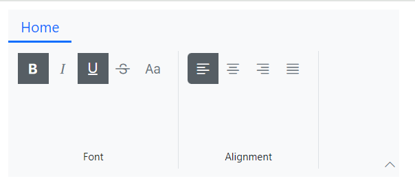

## Custom Item

The Ribbon supports rendering custom HTML content or other components by setting the [Type](https://help.syncfusion.com/cr/blazor/Syncfusion.Blazor.Ribbon.RibbonItem.html#Syncfusion_Blazor_Ribbon_RibbonItem_Type) property to `RibbonItemType.Template`. Inside the `RibbonItem`, use the [ItemTemplate](https://help.syncfusion.com/cr/blazor/Syncfusion.Blazor.Ribbon.RibbonItem.html#Syncfusion_Blazor_Ribbon_RibbonItem_ItemTemplate) tag to define a `RenderFragment` for fully customized content. The [RibbonItemContext](https://help.syncfusion.com/cr/blazor/Syncfusion.Blazor.Ribbon.RibbonItemContext.html) is passed as `context` to the template, allowing you to create dynamic content based on the Ribbon's state.




@using Syncfusion.Blazor.Ribbon

    <SfRibbon>
        <RibbonTabs>
            <RibbonTab HeaderText="Home">
                <RibbonGroups>
                    <RibbonGroup Orientation=Orientation.Row HeaderText="Inputs">
                        <RibbonCollections>
                            <RibbonCollection>
                                <RibbonItems>
                                    <RibbonItem Type="RibbonItemType.Template">
                                        <ItemTemplate>
                                            <input type="text" placeholder="Search..." style="width: 150px; padding: 8px; border: 1px solid #ccc; border-radius: 4px;">
                                        </ItemTemplate>
                                    </RibbonItem>
                                </RibbonItems>
                            </RibbonCollection>
                            <RibbonCollection>
                                <RibbonItems>
                                    <RibbonItem Type="RibbonItemType.Template">
                                        <ItemTemplate>
                                            <input type="date" style="padding: 8px; border: 1px solid #ccc; border-radius: 4px;">
                                        </ItemTemplate>
                                    </RibbonItem>
                                </RibbonItems>
                            </RibbonCollection>
                        </RibbonCollections>
                    </RibbonGroup>
                    <RibbonGroup Orientation=Orientation.Row HeaderText="Feedbacks">
                        <RibbonCollections>
                            <RibbonCollection>
                                <RibbonItems>
                                    <RibbonItem Type="RibbonItemType.Template">
                                        <ItemTemplate>
                                            

                                                ★
                                                ★
                                                ★
                                                ★
                                                ★
                                            

                                        </ItemTemplate>
                                    </RibbonItem>
                                    <RibbonItem Type="RibbonItemType.Template">
                                        <ItemTemplate>
                                            

                                                <button style="padding: 10px; border: none; background: #007bff; color: white; border-radius: 4px;">Inbox</button>
                                                5
                                                
                                            

                                        </ItemTemplate>
                                    </RibbonItem>
                                </RibbonItems>
                            </RibbonCollection>
                        </RibbonCollections>
                    </RibbonGroup>
                </RibbonGroups>
            </RibbonTab>
        </RibbonTabs>
    </SfRibbon>




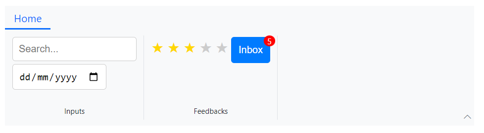

## Display Options

The [DisplayOptions](https://help.syncfusion.com/cr/blazor/Syncfusion.Blazor.Ribbon.RibbonItem.html#Syncfusion_Blazor_Ribbon_RibbonItem_DisplayOptions) property controls the visibility of Ribbon items based on the Ribbon's current layout and overflow state. The available options are:

| Value | Description |
|---|---|
| `Auto` | (Default) The item is displayed in all layouts and respects the overflow state. |
| `Classic` | The item is displayed only when the Ribbon is in the Classic layout. |
| `Simplified` | The item is displayed only when the Ribbon is in the Simplified layout. |
| `Overflow` | The item is displayed only in the overflow popup of a group. |

The following example demonstrates how to use the `DisplayOptions` property to manage item visibility across different layouts.




@using Syncfusion.Blazor.Ribbon;
@using Syncfusion.Blazor.SplitButtons;

    <SfRibbon>
        <RibbonTabs>
            <RibbonTab HeaderText="Home">
                <RibbonGroups>
                    <RibbonGroup HeaderText="Clipboard">
                        <RibbonCollections>
                            <RibbonCollection>
                                <RibbonItems>
                                    <RibbonItem Type=RibbonItemType.SplitButton DisplayOptions="@((DisplayMode)DisplayMode.Classic | DisplayMode.Simplified)">
                                        <RibbonSplitButtonSettings Content="Paste" IconCss="e-icons e-paste" Items="@formatItems"></RibbonSplitButtonSettings>
                                    </RibbonItem>
                                </RibbonItems>
                            </RibbonCollection>
                            <RibbonCollection>
                                <RibbonItems>
                                    <RibbonItem Type=RibbonItemType.Button DisplayOptions="DisplayMode.Classic">
                                        <RibbonButtonSettings Content="Cut" IconCss="e-icons e-cut"></RibbonButtonSettings>
                                    </RibbonItem>
                                    <RibbonItem Type=RibbonItemType.Button DisplayOptions="DisplayMode.Classic">
                                        <RibbonButtonSettings Content="Copy" IconCss="e-icons e-copy"></RibbonButtonSettings>
                                    </RibbonItem>
                                    <RibbonItem Type=RibbonItemType.Button DisplayOptions="DisplayMode.Simplified">
                                        <RibbonButtonSettings Content="Format Painter" IconCss="e-icons e-format-painter"></RibbonButtonSettings>
                                    </RibbonItem>
                                </RibbonItems>
                            </RibbonCollection>
                        </RibbonCollections>
                    </RibbonGroup>
                    <RibbonGroup Orientation=Orientation.Row HeaderText="Font" PopupHeaderText="Font Options" EnableGroupOverflow="true">
                        <RibbonCollections>
                            <RibbonCollection>
                                <RibbonItems>
                                    <RibbonItem Type=RibbonItemType.Button DisplayOptions="DisplayMode.Classic">
                                        <RibbonButtonSettings Content="Decrease Indent" IconCss="e-icons e-decrease-indent"></RibbonButtonSettings>
                                    </RibbonItem>
                                    <RibbonItem Type=RibbonItemType.Button DisplayOptions="DisplayMode.Overflow">
                                        <RibbonButtonSettings Content="Increase Indent" IconCss="e-icons e-increase-indent"></RibbonButtonSettings>
                                    </RibbonItem>
                                    <RibbonItem Type=RibbonItemType.Button DisplayOptions="DisplayMode.Overflow">
                                        <RibbonButtonSettings Content="Paragraph" IconCss="e-icons e-paragraph"></RibbonButtonSettings>
                                    </RibbonItem>
                                </RibbonItems>
                            </RibbonCollection>
                        </RibbonCollections>
                    </RibbonGroup>
                </RibbonGroups>
            </RibbonTab>
        </RibbonTabs>
    </SfRibbon>

@code {

    List<DropDownMenuItem> formatItems = new List<DropDownMenuItem>()
        {
        new DropDownMenuItem{ Text = "Keep Source Format" },
        new DropDownMenuItem{ Text = "Merge Format" },
        new DropDownMenuItem{ Text = "Keep Text Only" }
        };
}




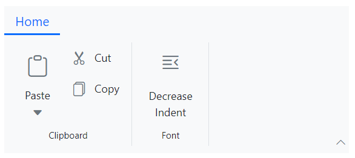

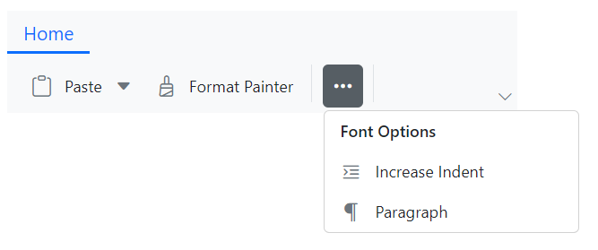

## Enable or Disable Items

You can use the [Disabled](https://help.syncfusion.com/cr/blazor/Syncfusion.Blazor.Ribbon.RibbonItem.html#Syncfusion_Blazor_Ribbon_RibbonItem_Disabled) property to disable particular Ribbon item. It prevents the user interaction when set to `true`. By default, the value is `false`.




@using Syncfusion.Blazor.Ribbon;
@using Syncfusion.Blazor.SplitButtons;

    <SfRibbon>
        <RibbonTabs>
            <RibbonTab HeaderText="Home">
                <RibbonGroups>
                    <RibbonGroup HeaderText="Clipboard">
                        <RibbonCollections>
                            <RibbonCollection>
                                <RibbonItems>
                                    <RibbonItem Type=RibbonItemType.SplitButton Disabled=true>
                                        <RibbonSplitButtonSettings Content="Paste" IconCss="e-icons e-paste" Items="@formatItems"></RibbonSplitButtonSettings>
                                    </RibbonItem>
                                </RibbonItems>
                            </RibbonCollection>
                            <RibbonCollection>
                                <RibbonItems>
                                    <RibbonItem Type=RibbonItemType.Button>
                                        <RibbonButtonSettings Content="Cut" IconCss="e-icons e-cut"></RibbonButtonSettings>
                                    </RibbonItem>
                                    <RibbonItem Type=RibbonItemType.Button>
                                        <RibbonButtonSettings Content="Copy" IconCss="e-icons e-copy"></RibbonButtonSettings>
                                    </RibbonItem>
                                    <RibbonItem Type=RibbonItemType.Button>
                                        <RibbonButtonSettings Content="Format Painter" IconCss="e-icons e-format-painter"></RibbonButtonSettings>
                                    </RibbonItem>
                                </RibbonItems>
                            </RibbonCollection>
                        </RibbonCollections>
                    </RibbonGroup>
                </RibbonGroups>
            </RibbonTab>
        </RibbonTabs>
    </SfRibbon>

@code{
    List<DropDownMenuItem> formatItems = new List<DropDownMenuItem>()
    {
        new DropDownMenuItem{ Text = "Keep Source Format" },
        new DropDownMenuItem{ Text = "Merge Format" },
        new DropDownMenuItem{ Text = "Keep Text Only" }
    };
}




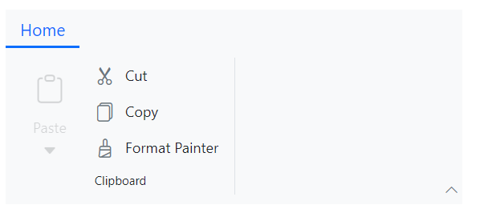
