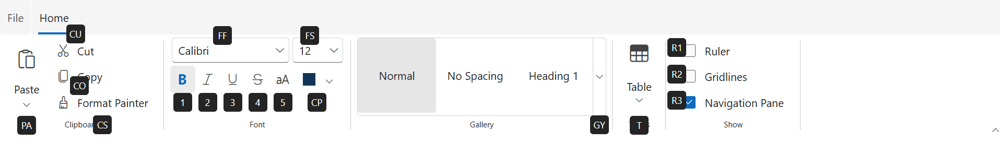
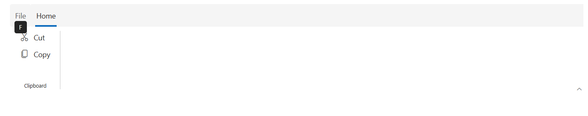
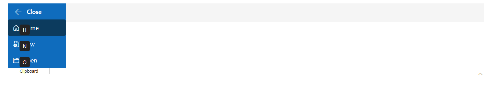
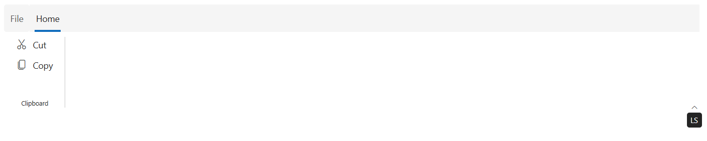
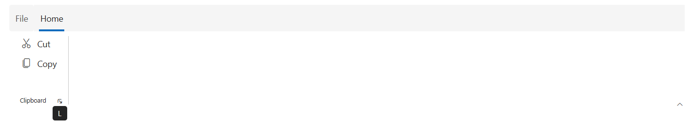
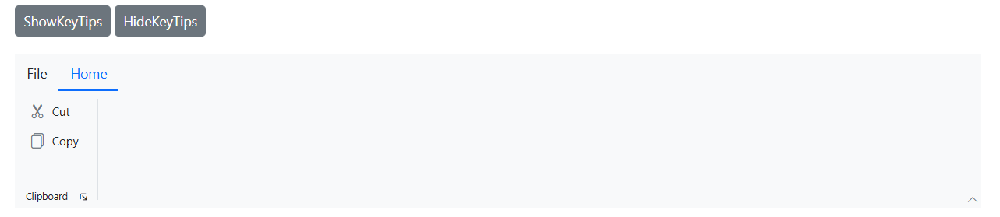

# KeyTips in Blazor Ribbon component

The Blazor Ribbon component supports keyboard navigation through keytips, enabling users to interact with the Ribbon interface without a mouse. Keytips can be enabled by setting the `EnableKeyTips` property, allowing users to quickly access commands using keyboard shortcuts.

The keyTips will be shown when the **Alt + Windows/Command(on macOS)** keys are pressed.

## KeyTips for different ribbon elements

### Ribbon items keytip

Keytips can be added to Ribbon items by using the `KeyTip` property in the `RibbonItem` directive.




@using Syncfusion.Blazor.Ribbon;
@using Syncfusion.Blazor.Navigations;
@using  Syncfusion.Blazor.Buttons;
@using Syncfusion.Blazor.DropDowns;
@using Syncfusion.Blazor.SplitButtons;

    <SfRibbon ID="ribbon" EnableKeyTips="true">
        <RibbonFileMenuSettings Visible=true MenuItems="@fileMenuItems"></RibbonFileMenuSettings>
        <RibbonTabs>
            <RibbonTab HeaderText="Home" KeyTip="H">
                <RibbonGroups>
                    <RibbonGroup HeaderText="Clipboard" GroupIconCss="e-icons e-paste" KeyTip="CD">
                        <RibbonCollections>
                            <RibbonCollection>
                                <RibbonItems>
                                    <RibbonItem AllowedSizes=RibbonItemSize.Large Type=RibbonItemType.SplitButton KeyTip="PA">
                                        <RibbonTooltipSettings Title="Paste" CssClass="custom-tooltip" IconCss="e-icons e-paste" Content="Paste content here.  Add content on the clipboard to your document."></RibbonTooltipSettings>
                                        <RibbonSplitButtonSettings Content="Paste" IconCss="e-icons e-paste" Items="@formatItems"></RibbonSplitButtonSettings>
                                    </RibbonItem>
                                </RibbonItems>
                            </RibbonCollection>
                            <RibbonCollection>
                                <RibbonItems>
                                    <RibbonItem Type=RibbonItemType.Button KeyTip="CU">
                                        <RibbonButtonSettings Content="Cut" IconCss="e-icons e-cut"></RibbonButtonSettings>
                                    </RibbonItem>
                                    <RibbonItem Type=RibbonItemType.Button KeyTip="CO">
                                        <RibbonButtonSettings Content="Copy" IconCss="e-icons e-copy"></RibbonButtonSettings>
                                    </RibbonItem>
                                    <RibbonItem Type=RibbonItemType.Button KeyTip="CS">
                                        <RibbonButtonSettings Content="Format Painter" IconCss="e-icons e-format-painter"></RibbonButtonSettings>
                                    </RibbonItem>
                                </RibbonItems>
                            </RibbonCollection>
                        </RibbonCollections>
                    </RibbonGroup>
                    <RibbonGroup Orientation=Syncfusion.Blazor.Ribbon.Orientation.Row GroupIconCss="e-icons e-bold" EnableGroupOverflow="true" HeaderText="Font" CssClass="font-group" KeyTip="FB">
                        <RibbonCollections>
                            <RibbonCollection>
                                <RibbonItems>
                                    <RibbonItem Type=RibbonItemType.ComboBox KeyTip="FF">
                                        <RibbonComboBoxSettings AllowFiltering=true DataSource="@fontFamilyItems" @bind-Index="@fontFamIndex" Width="150px" FieldSettings="@fieldSetings"></RibbonComboBoxSettings>
                                    </RibbonItem>
                                    <RibbonItem Type=RibbonItemType.ComboBox KeyTip="FS">
                                        <RibbonComboBoxSettings DataSource="@fontSizeItems" Width="65px" PopupWidth="85px" FieldSettings="@fieldSetings" @bind-Index="@fontSizeIndex"></RibbonComboBoxSettings>
                                    </RibbonItem>
                                </RibbonItems>
                            </RibbonCollection>
                            <RibbonCollection>
                                <RibbonItems>
                                    <RibbonItem Type=RibbonItemType.GroupButton ID="formatGroup" KeyTip="GB">
                                        <RibbonGroupButtonSettings Selection=GroupButtonSelection.Single
                                                                   Items="@formatGroupItems">
                                        </RibbonGroupButtonSettings>
                                    </RibbonItem>
                                    <RibbonItem Type=RibbonItemType.ColorPicker KeyTip="CP">
                                        <RibbonColorPickerSettings @bind-Value="@colorPickerValue"></RibbonColorPickerSettings>
                                    </RibbonItem>
                                </RibbonItems>
                            </RibbonCollection>
                        </RibbonCollections>
                    </RibbonGroup>
                    <RibbonGroup GroupIconCss="e-icons e-paste" HeaderText="Gallery">
                        <RibbonCollections>
                            <RibbonCollection>
                                <RibbonItems>
                                    <RibbonItem Type=RibbonItemType.Gallery KeyTip="GY">
                                        <RibbonGallerySettings ItemCount="3" Groups="galleryGroups"></RibbonGallerySettings>
                                    </RibbonItem>
                                </RibbonItems>
                            </RibbonCollection>
                        </RibbonCollections>
                    </RibbonGroup>
                    <RibbonGroup HeaderText="Tables" GroupIconCss="e-icons e-table">
                        <RibbonCollections>
                            <RibbonCollection>
                                <RibbonItems>
                                    <RibbonItem Type=RibbonItemType.DropDown AllowedSizes="RibbonItemSize.Large" KeyTip="T">
                                        <RibbonDropDownSettings Content="Table" IconCss="e-icons e-table" Items="@tableItems"></RibbonDropDownSettings>
                                    </RibbonItem>
                                </RibbonItems>
                            </RibbonCollection>
                        </RibbonCollections>
                    </RibbonGroup>
                    <RibbonGroup HeaderText="Show" GroupIconCss="e-icons e-copy">
                        <RibbonCollections>
                            <RibbonCollection>
                                <RibbonItems>
                                    <RibbonItem Type=RibbonItemType.CheckBox KeyTip="R1">
                                        <RibbonCheckBoxSettings Label="Ruler"></RibbonCheckBoxSettings>
                                    </RibbonItem>
                                    <RibbonItem Type=RibbonItemType.CheckBox KeyTip="R2">
                                        <RibbonCheckBoxSettings Label="Gridlines"></RibbonCheckBoxSettings>
                                    </RibbonItem>
                                    <RibbonItem Type=RibbonItemType.CheckBox KeyTip="R3">
                                        <RibbonCheckBoxSettings Label="Navigation Pane" @bind-Checked="@checkedState"></RibbonCheckBoxSettings>
                                    </RibbonItem>
                                </RibbonItems>
                            </RibbonCollection>
                        </RibbonCollections>
                    </RibbonGroup>
                </RibbonGroups>
            </RibbonTab>
        </RibbonTabs>
    </SfRibbon>

@code {

    private int? fontFamIndex = 2;
    private int? fontSizeIndex = 4;
    private string colorPickerValue = "#123456";
    private bool checkedState = true;

    private class ComboBoxItem
    {
        public string Text { get; set; }
        public string Value { get; set; }
    };

    FieldSettingsModel fieldSetings = new FieldSettingsModel
    {
        Text = "Text",
        Value = "Value"
    };

    List<DropDownMenuItem> formatItems = new List<DropDownMenuItem>()
    {
        new DropDownMenuItem{ Text = "Keep Source Format" },
        new DropDownMenuItem{ Text = "Merge Format" },
        new DropDownMenuItem{ Text = "Keep Text Only" }
    };

    List<MenuItem> fileMenuItems = new List<MenuItem>()
    {
        new MenuItem { Text = "New", IconCss = "e-icons e-file-new", Id = "new" },
        new MenuItem { Text = "Open", IconCss = "e-icons e-folder-open", Id = "open" },
        new MenuItem { Text = "Rename", IconCss = "e-icons e-rename", Id = "rename" },
        new MenuItem {
            Text = "Save",
            IconCss = "e-icons e-save",
            Id = "save"
        }
    };

    List<ComboBoxItem> fontFamilyItems = new List<ComboBoxItem>
    {
        new ComboBoxItem { Text = "Algerian", Value = "Algerian" },
        new ComboBoxItem { Text = "Arial", Value = "Arial" },
        new ComboBoxItem { Text = "Calibri", Value = "Calibri" },
        new ComboBoxItem { Text = "Cambria", Value = "Cambria" },
        new ComboBoxItem { Text = "Cambria Math", Value = "Cambria Math" },
        new ComboBoxItem { Text = "Courier New", Value = "Courier New" },
        new ComboBoxItem { Text = "Candara", Value = "Candara" },
        new ComboBoxItem { Text = "Georgia", Value = "Georgia" },
        new ComboBoxItem { Text = "Impact", Value = "Impact" },
        new ComboBoxItem { Text = "Segoe Print", Value = "Segoe Print" },
        new ComboBoxItem { Text = "Segoe Script", Value = "Segoe Script" },
        new ComboBoxItem { Text = "Segoe UI", Value = "Segoe UI" },
        new ComboBoxItem { Text = "Symbol", Value = "Symbol" },
        new ComboBoxItem { Text = "Times New Roman", Value = "Times New Roman" },
        new ComboBoxItem { Text = "Verdana", Value = "Verdana" },
        new ComboBoxItem { Text = "Windings", Value = "Windings" }
    };

    List<ComboBoxItem> fontSizeItems = new List<ComboBoxItem>
    {
        new ComboBoxItem { Text = "8", Value = "8" },
        new ComboBoxItem { Text = "9", Value = "9" },
        new ComboBoxItem { Text = "10", Value = "10" },
        new ComboBoxItem { Text = "11", Value = "11" },
        new ComboBoxItem { Text = "12", Value = "12" },
        new ComboBoxItem { Text = "14", Value = "14" },
        new ComboBoxItem { Text = "16", Value = "16" },
        new ComboBoxItem { Text = "18", Value = "18" },
        new ComboBoxItem { Text = "20", Value = "20" },
        new ComboBoxItem { Text = "22", Value = "22" },
        new ComboBoxItem { Text = "24", Value = "24" },
        new ComboBoxItem { Text = "26", Value = "26" },
        new ComboBoxItem { Text = "28", Value = "28" },
        new ComboBoxItem { Text = "36", Value = "36" },
        new ComboBoxItem { Text = "48", Value = "48" },
        new ComboBoxItem { Text = "72", Value = "72" },
        new ComboBoxItem { Text = "96", Value = "96" }
    };

    List<GroupButtonItem> formatGroupItems = new List<GroupButtonItem>
    {
        new GroupButtonItem
        {
            IconCss = "e-icons e-bold",
            Selected = true,
            Content = "Bold",
            KeyTip="1"
        },
        new GroupButtonItem
        {
            IconCss = "e-icons e-italic",
            Content = "Italic",
            KeyTip="2"
        },
        new GroupButtonItem
        {
            IconCss = "e-icons e-underline",
            Content = "Underline",
            KeyTip="3"
        },
        new GroupButtonItem
        {
            IconCss = "e-icons e-strikethrough",
            Content = "Strikethrough",
            KeyTip="4"
        },
        new GroupButtonItem
        {
            IconCss = "e-icons e-change-case",
            Content = "Change Case",
            KeyTip="5"
        },
    };

    List<GalleryGroup> galleryGroups = new List<GalleryGroup>
    {
        new GalleryGroup
        {
            Header = "Styles",
            ItemWidth = "100",
            Items = new List<GalleryItem>
            {
                new GalleryItem { Content = "Normal" },
                new GalleryItem { Content = "No Spacing" },
                new GalleryItem { Content = "Heading 1" },
                new GalleryItem { Content = "Heading 2" },
                new GalleryItem { Content = "Heading 3" },
                new GalleryItem { Content = "Heading 4" },
                new GalleryItem { Content = "Heading 5" }
            }
        }
    };

    List<DropDownMenuItem> tableItems = new List<DropDownMenuItem>()
    {
        new DropDownMenuItem{ Text = "Insert Table" },
        new DropDownMenuItem{ Text = "Draw Table" },
        new DropDownMenuItem{ Text = "Convert Table" },
        new DropDownMenuItem{ Text = "Excel SpreadSheet" }
    };
}




### File menu keytip

A keytip can be added to the File menu by using the `KeyTip` property.




@using Syncfusion.Blazor.Ribbon;
@using Syncfusion.Blazor.Navigations;
@using  Syncfusion.Blazor.Buttons;
@using Syncfusion.Blazor.DropDowns;
@using Syncfusion.Blazor.SplitButtons;

    <SfRibbon ID="ribbon" EnableKeyTips="true">
        <RibbonFileMenuSettings Visible=true MenuItems="@fileMenuItems" KeyTip="F"></RibbonFileMenuSettings>
        <RibbonTabs>
            <RibbonTab HeaderText="Home">
                <RibbonGroups>
                    <RibbonGroup HeaderText="Clipboard">
                        <RibbonCollections>
                            <RibbonCollection>
                                <RibbonItems>
                                    <RibbonItem Type=RibbonItemType.SplitButton AllowedSizes="RibbonItemSize.Large">
                                        <RibbonSplitButtonSettings Content="Paste" IconCss="e-icons e-paste" Items="@formatItems"></RibbonSplitButtonSettings>
                                    </RibbonItem>
                                </RibbonItems>
                                <RibbonItems>
                                    <RibbonItem Type=RibbonItemType.Button>
                                        <RibbonButtonSettings Content="Cut" IconCss="e-icons e-cut"></RibbonButtonSettings>
                                    </RibbonItem>
                                    <RibbonItem Type=RibbonItemType.Button>
                                        <RibbonButtonSettings Content="Copy" IconCss="e-icons e-copy"></RibbonButtonSettings>
                                    </RibbonItem>
                                </RibbonItems>
                            </RibbonCollection>
                        </RibbonCollections>
                    </RibbonGroup>
                </RibbonGroups>
            </RibbonTab>
        </RibbonTabs>
    </SfRibbon>

@code {

    List<DropDownMenuItem> formatItems = new List<DropDownMenuItem>()
    {
        new DropDownMenuItem{ Text = "Keep Source Format" },
        new DropDownMenuItem{ Text = "Merge Format" },
        new DropDownMenuItem{ Text = "Keep Text Only" }
    };

    List<MenuItem> fileMenuItems = new List<MenuItem>()
    {
        new MenuItem { Text = "New", IconCss = "e-icons e-file-new", Id = "new" },
        new MenuItem { Text = "Open", IconCss = "e-icons e-folder-open", Id = "open" },
        new MenuItem { Text = "Rename", IconCss = "e-icons e-rename", Id = "rename" },
        new MenuItem {
            Text = "Save",
            IconCss = "e-icons e-save",
            Id = "save",
        }
    };
}




### Backstage menu keytip

Keytips can be added for the backstage button and menu items by using the `KeyTip` property.




@using Syncfusion.Blazor.Ribbon;
@using Syncfusion.Blazor.Navigations;
@using  Syncfusion.Blazor.Buttons;
@using Syncfusion.Blazor.DropDowns;
@using Syncfusion.Blazor.SplitButtons;

    <SfRibbon ID="ribbon" EnableKeyTips="true">
        <RibbonBackstageMenuSettings KeyTip="F" Visible="true" BackButtonSettings="@backStageBackButton">
            <BackstageMenuItems>
                <BackstageMenuItem KeyTip="H" ID="home" Text="Home" IconCss="e-icons e-home"></BackstageMenuItem>
                <BackstageMenuItem KeyTip="N" ID="new" Text="New" IconCss="e-icons e-file-new"></BackstageMenuItem>
                <BackstageMenuItem KeyTip="O" ID="open" Text="Open" IconCss="e-icons e-folder-open"></BackstageMenuItem>
            </BackstageMenuItems>
        </RibbonBackstageMenuSettings>
        <RibbonTabs>
            <RibbonTab HeaderText="Home">
                <RibbonGroups>
                    <RibbonGroup HeaderText="Clipboard">
                        <RibbonCollections>
                            <RibbonCollection>
                                <RibbonItems>
                                    <RibbonItem Type=RibbonItemType.SplitButton AllowedSizes="RibbonItemSize.Large">
                                        <RibbonSplitButtonSettings Content="Paste" IconCss="e-icons e-paste" Items="@formatItems"></RibbonSplitButtonSettings>
                                    </RibbonItem>
                                </RibbonItems>
                                <RibbonItems>
                                    <RibbonItem Type=RibbonItemType.Button>
                                        <RibbonButtonSettings Content="Cut" IconCss="e-icons e-cut"></RibbonButtonSettings>
                                    </RibbonItem>
                                    <RibbonItem Type=RibbonItemType.Button>
                                        <RibbonButtonSettings Content="Copy" IconCss="e-icons e-copy"></RibbonButtonSettings>
                                    </RibbonItem>
                                </RibbonItems>
                            </RibbonCollection>
                        </RibbonCollections>
                    </RibbonGroup>
                </RibbonGroups>
            </RibbonTab>
        </RibbonTabs>
    </SfRibbon>

@code {

    List<DropDownMenuItem> formatItems = new List<DropDownMenuItem>()
    {
        new DropDownMenuItem{ Text = "Keep Source Format" },
        new DropDownMenuItem{ Text = "Merge Format" },
        new DropDownMenuItem{ Text = "Keep Text Only" }
    };

    BackstageBackButtonSettings backStageBackButton = new BackstageBackButtonSettings
        {
            Text = "Close",
            IconCss = "e-icons e-arrow-left",
            Visible = true
        };
}




### Ribbon layout switcher keytip

A keytip can be added to the layout switcher by using the `LayoutSwitcherKeyTip` property to switch between the `Classic` and `Simplified` Ribbon layouts.




@using Syncfusion.Blazor.Ribbon;
@using Syncfusion.Blazor.Navigations;
@using  Syncfusion.Blazor.Buttons;
@using Syncfusion.Blazor.DropDowns;
@using Syncfusion.Blazor.SplitButtons;

    <SfRibbon ID="ribbon" EnableKeyTips="true" LayoutSwitcherKeyTip="LS">
        <RibbonFileMenuSettings Visible=true MenuItems="@fileMenuItems"></RibbonFileMenuSettings>
        <RibbonTabs>
            <RibbonTab HeaderText="Home">
                <RibbonGroups>
                    <RibbonGroup HeaderText="Clipboard">
                        <RibbonCollections>
                            <RibbonCollection>
                                <RibbonItems>
                                    <RibbonItem Type=RibbonItemType.SplitButton AllowedSizes="RibbonItemSize.Large">
                                        <RibbonSplitButtonSettings Content="Paste" IconCss="e-icons e-paste" Items="@formatItems"></RibbonSplitButtonSettings>
                                    </RibbonItem>
                                </RibbonItems>
                                <RibbonItems>
                                    <RibbonItem Type=RibbonItemType.Button>
                                        <RibbonButtonSettings Content="Cut" IconCss="e-icons e-cut"></RibbonButtonSettings>
                                    </RibbonItem>
                                    <RibbonItem Type=RibbonItemType.Button>
                                        <RibbonButtonSettings Content="Copy" IconCss="e-icons e-copy"></RibbonButtonSettings>
                                    </RibbonItem>
                                </RibbonItems>
                            </RibbonCollection>
                        </RibbonCollections>
                    </RibbonGroup>
                </RibbonGroups>
            </RibbonTab>
        </RibbonTabs>
    </SfRibbon>

@code {

    List<DropDownMenuItem> formatItems = new List<DropDownMenuItem>()
    {
        new DropDownMenuItem{ Text = "Keep Source Format" },
        new DropDownMenuItem{ Text = "Merge Format" },
        new DropDownMenuItem{ Text = "Keep Text Only" }
    };

    List<MenuItem> fileMenuItems = new List<MenuItem>()
    {
        new MenuItem { Text = "New", IconCss = "e-icons e-file-new", Id = "new" },
        new MenuItem { Text = "Open", IconCss = "e-icons e-folder-open", Id = "open" },
        new MenuItem { Text = "Rename", IconCss = "e-icons e-rename", Id = "rename" },
        new MenuItem {
            Text = "Save",
            IconCss = "e-icons e-save",
            Id = "save",
        }
    };
}




### Ribbon launcher icon keytip

A keytip can be added to the launcher icon by using the `LauncherIconKeyTip` property to quickly open additional options in Ribbon groups.




@using Syncfusion.Blazor.Ribbon;
@using Syncfusion.Blazor.Navigations;
@using  Syncfusion.Blazor.Buttons;
@using Syncfusion.Blazor.DropDowns;
@using Syncfusion.Blazor.SplitButtons;

    <SfRibbon ID="ribbon" EnableKeyTips="true">
        <RibbonFileMenuSettings Visible=true MenuItems="@fileMenuItems"></RibbonFileMenuSettings>
        <RibbonTabs>
            <RibbonTab HeaderText="Home" KeyTip="H">
                <RibbonGroups>
                    <RibbonGroup HeaderText="Clipboard" ShowLauncherIcon="true" LauncherIconKeyTip="L">
                        <RibbonCollections>
                            <RibbonCollection>
                                <RibbonItems>
                                    <RibbonItem Type=RibbonItemType.SplitButton AllowedSizes="RibbonItemSize.Large">
                                        <RibbonSplitButtonSettings Content="Paste" IconCss="e-icons e-paste" Items="@formatItems"></RibbonSplitButtonSettings>
                                    </RibbonItem>
                                </RibbonItems>
                                <RibbonItems>
                                    <RibbonItem Type=RibbonItemType.Button>
                                        <RibbonButtonSettings Content="Cut" IconCss="e-icons e-cut"></RibbonButtonSettings>
                                    </RibbonItem>
                                    <RibbonItem Type=RibbonItemType.Button>
                                        <RibbonButtonSettings Content="Copy" IconCss="e-icons e-copy"></RibbonButtonSettings>
                                    </RibbonItem>
                                </RibbonItems>
                            </RibbonCollection>
                        </RibbonCollections>
                    </RibbonGroup>
                </RibbonGroups>
            </RibbonTab>
        </RibbonTabs>
    </SfRibbon>

@code {

    List<DropDownMenuItem> formatItems = new List<DropDownMenuItem>()
    {
        new DropDownMenuItem{ Text = "Keep Source Format" },
        new DropDownMenuItem{ Text = "Merge Format" },
        new DropDownMenuItem{ Text = "Keep Text Only" }
    };

    List<MenuItem> fileMenuItems = new List<MenuItem>()
    {
        new MenuItem { Text = "New", IconCss = "e-icons e-file-new", Id = "new" },
        new MenuItem { Text = "Open", IconCss = "e-icons e-folder-open", Id = "open" },
        new MenuItem { Text = "Rename", IconCss = "e-icons e-rename", Id = "rename" },
        new MenuItem {
            Text = "Save",
            IconCss = "e-icons e-save",
            Id = "save",
        }
    };
}




## Methods

### Show keytips

The `ShowKeyTipsAsync` method displays keytips dynamically for the Ribbon.

- To activate a specific key action, pass the corresponding keytip string as an argument.
- For example, calling `ShowKeyTipsAsync('H')` will look for the specific item associated with the **H** key and trigger its respective action.

### Hide keytips

The `HideKeyTipsAsync` method removes all visible keytips from the Ribbon dynamically.




@using Syncfusion.Blazor.Ribbon;
@using  Syncfusion.Blazor.Buttons;
@using Syncfusion.Blazor.DropDowns;
@using Syncfusion.Blazor.Navigations;
@using Syncfusion.Blazor.SplitButtons;

    <SfButton @onclick="handleShowKeyTips">ShowKeyTips</SfButton>
    <SfButton @onclick="handleHideKeyTips">HideKeyTips</SfButton>   
    <SfRibbon ID="ribbon" EnableKeyTips="true" @ref="ribbon">
        <RibbonFileMenuSettings Visible=true MenuItems="@fileMenuItems"></RibbonFileMenuSettings>
        <RibbonTabs>
            <RibbonTab HeaderText="Home" KeyTip="H">
                <RibbonGroups>
                    <RibbonGroup HeaderText="Clipboard" ShowLauncherIcon="true" LauncherIconKeyTip="L">
                        <RibbonCollections>
                            <RibbonCollection>
                                <RibbonItems>
                                    <RibbonItem Type=RibbonItemType.SplitButton AllowedSizes="RibbonItemSize.Large" KeyTip="V">
                                        <RibbonSplitButtonSettings Content="Paste" IconCss="e-icons e-paste" Items="@formatItems"></RibbonSplitButtonSettings>
                                    </RibbonItem>
                                </RibbonItems>
                                <RibbonItems>
                                    <RibbonItem Type=RibbonItemType.Button KeyTip="X">
                                        <RibbonButtonSettings Content="Cut" IconCss="e-icons e-cut"></RibbonButtonSettings>
                                    </RibbonItem>
                                    <RibbonItem Type=RibbonItemType.Button KeyTip="C">
                                        <RibbonButtonSettings Content="Copy" IconCss="e-icons e-copy"></RibbonButtonSettings>
                                    </RibbonItem>
                                </RibbonItems>
                            </RibbonCollection>
                        </RibbonCollections>
                    </RibbonGroup>
                </RibbonGroups>
            </RibbonTab>
        </RibbonTabs>
    </SfRibbon>

@code {

    SfRibbon ribbon;

    private async Task handleShowKeyTips()
    {
        await ribbon.ShowKeyTipsAsync();
    }
    private async Task handleHideKeyTips()
    {
        await ribbon.HideKeyTipsAsync();
    }

    List<DropDownMenuItem> formatItems = new List<DropDownMenuItem>()
    {
        new DropDownMenuItem{ Text = "Keep Source Format" },
        new DropDownMenuItem{ Text = "Merge Format" },
        new DropDownMenuItem{ Text = "Keep Text Only" }
    };

    List<MenuItem> fileMenuItems = new List<MenuItem>()
    {
        new MenuItem { Text = "New", IconCss = "e-icons e-file-new", Id = "new" },
        new MenuItem { Text = "Open", IconCss = "e-icons e-folder-open", Id = "open" },
        new MenuItem { Text = "Rename", IconCss = "e-icons e-rename", Id = "rename" },
        new MenuItem {
            Text = "Save",
            IconCss = "e-icons e-save",
            Id = "save",
        }
    };
}




## Guidelines for adding keytips

Before adding keytips to Ribbon items, follow these best practices:

* Avoid assigning the same keytip to multiple items.

> Each keytip must be unique. If multiple items share the same keytip (for example, `H` or `HF`), only the first occurrence is activated; subsequent items using the same keytip are ignored.

* Do not use the same first letter for single- and multi-character keytips on different items.

> When using multi-character keytips (for example, `F`, `FP`, and `FPF`) for different items, pressing `F` activates only the first-level keytip (`F`), and `FP` and `FPF` are ignored.
