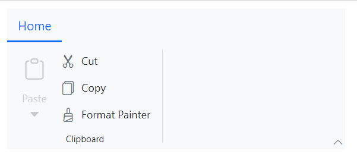
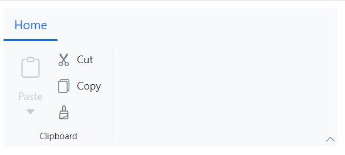
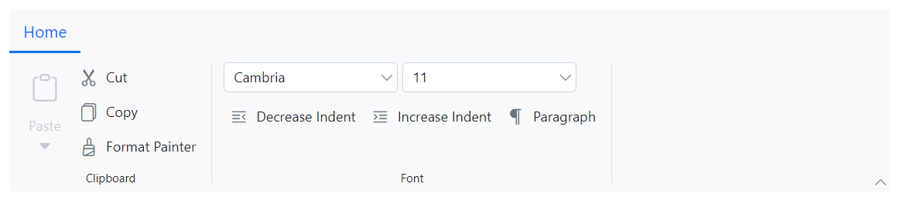
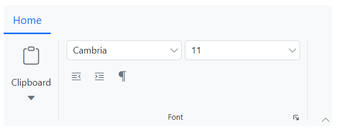
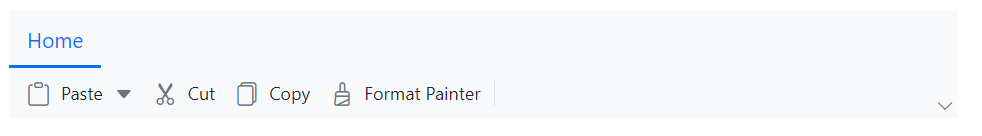
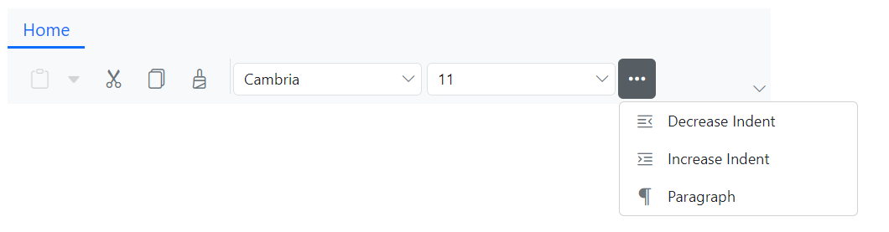
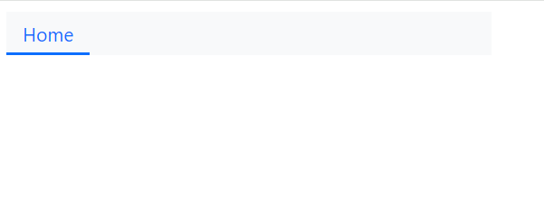
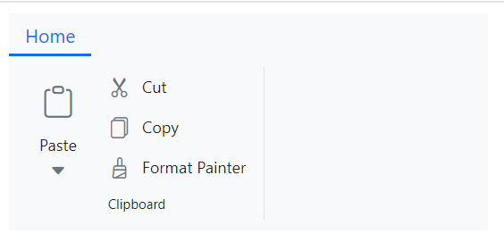

# Layouts in Blazor Ribbon component

The Ribbon component allows customization of its layout through the [ActiveLayout](https://help.syncfusion.com/cr/blazor/Syncfusion.Blazor.Ribbon.SfRibbon.html#Syncfusion_Blazor_Ribbon_SfRibbon_ActiveLayout) property. It supports two primary layouts: `Classic` and `Simplified`.

## Classic layout

The Classic layout organizes Ribbon items and groups in a traditional format. You can set the [ActiveLayout](https://help.syncfusion.com/cr/blazor/Syncfusion.Blazor.Ribbon.SfRibbon.html#Syncfusion_Blazor_Ribbon_SfRibbon_ActiveLayout) property to `RibbonLayout.Classic` to enable this layout. By default, the Ribbon component renders in the `Classic` layout.




@using Syncfusion.Blazor.Ribbon;
@using Syncfusion.Blazor.SplitButtons;

    <SfRibbon ActiveLayout="RibbonLayout.Classic">
        <RibbonTabs>
            <RibbonTab HeaderText="Home">
                <RibbonGroups>
                    <RibbonGroup HeaderText="Clipboard">
                        <RibbonCollections>
                            <RibbonCollection>
                                <RibbonItems>
                                    <RibbonItem Type=RibbonItemType.SplitButton>
                                        <RibbonSplitButtonSettings Content="Paste" IconCss="e-icons e-paste" Items="@formatItems"></RibbonSplitButtonSettings>
                                    </RibbonItem>
                                </RibbonItems>
                            </RibbonCollection>
                            <RibbonCollection>
                                <RibbonItems>
                                    <RibbonItem Type=RibbonItemType.Button>
                                        <RibbonButtonSettings Content="Cut" IconCss="e-icons e-cut"></RibbonButtonSettings>
                                    </RibbonItem>
                                    <RibbonItem Type=RibbonItemType.Button>
                                        <RibbonButtonSettings Content="Copy" IconCss="e-icons e-copy"></RibbonButtonSettings>
                                    </RibbonItem>
                                    <RibbonItem Type=RibbonItemType.Button>
                                        <RibbonButtonSettings Content="Format Painter" IconCss="e-icons e-format-painter"></RibbonButtonSettings>
                                    </RibbonItem>
                                </RibbonItems>
                            </RibbonCollection>
                        </RibbonCollections>
                    </RibbonGroup>
                </RibbonGroups>
            </RibbonTab>
        </RibbonTabs>
    </SfRibbon>

@code {

    List<DropDownMenuItem> formatItems = new List<DropDownMenuItem>()
        {
        new DropDownMenuItem{ Text = "Keep Source Format" },
        new DropDownMenuItem{ Text = "Merge Format" },
        new DropDownMenuItem{ Text = "Keep Text Only" }
        };
}




### Defining items size

You can control the size of Ribbon items using the [AllowedSizes](https://help.syncfusion.com/cr/blazor/Syncfusion.Blazor.Ribbon.RibbonItem.html#Syncfusion_Blazor_Ribbon_RibbonItem_AllowedSizes) property in the [RibbonItem](https://help.syncfusion.com/cr/blazor/Syncfusion.Blazor.Ribbon.RibbonItem.html) directive. The Ribbon supports three item sizes:

- **Large**: Large icon with text.
- **Medium**: Small icon with text.
- **Small**: Small icon only.

When resizing to smaller screen, the item sizes adjust based on the available tab content width in the order: Large → Medium → Small, and vice versa.




@using Syncfusion.Blazor.Ribbon;
@using Syncfusion.Blazor.SplitButtons;

<SfRibbon>
    <RibbonTabs>
        <RibbonTab HeaderText="Home">
            <RibbonGroups>
                <RibbonGroup HeaderText="Clipboard">
                    <RibbonCollections>
                        <RibbonCollection>
                            <RibbonItems>
                                <RibbonItem Type=RibbonItemType.SplitButton Disabled=true AllowedSizes="RibbonItemSize.Large">
                                    <RibbonSplitButtonSettings Content="Paste" IconCss="e-icons e-paste" Items="@formatItems"></RibbonSplitButtonSettings>
                                </RibbonItem>
                            </RibbonItems>
                        </RibbonCollection>
                        <RibbonCollection>
                            <RibbonItems>
                                <RibbonItem Type=RibbonItemType.Button AllowedSizes="RibbonItemSize.Medium">
                                    <RibbonButtonSettings Content="Cut" IconCss="e-icons e-cut"></RibbonButtonSettings>
                                </RibbonItem>
                                <RibbonItem Type=RibbonItemType.Button AllowedSizes="RibbonItemSize.Medium">
                                    <RibbonButtonSettings Content="Copy" IconCss="e-icons e-copy"></RibbonButtonSettings>
                                </RibbonItem>
                                <RibbonItem Type=RibbonItemType.Button AllowedSizes="RibbonItemSize.Small">
                                    <RibbonButtonSettings Content="Format Painter" IconCss="e-icons e-format-painter"></RibbonButtonSettings>
                                </RibbonItem>
                            </RibbonItems>
                        </RibbonCollection>
                    </RibbonCollections>
                </RibbonGroup>
            </RibbonGroups>
        </RibbonTab>
    </RibbonTabs>
</SfRibbon>

@code {

    List<DropDownMenuItem> formatItems = new List<DropDownMenuItem>()
        {
        new DropDownMenuItem{ Text = "Keep Source Format" },
        new DropDownMenuItem{ Text = "Merge Format" },
        new DropDownMenuItem{ Text = "Keep Text Only" }
        };
}




### Defining items orientation

You can use the [Orientation](https://help.syncfusion.com/cr/blazor/Syncfusion.Blazor.Ribbon.RibbonGroup.html#Syncfusion_Blazor_Ribbon_RibbonGroup_Orientation) property of the [RibbonGroup](https://help.syncfusion.com/cr/blazor/Syncfusion.Blazor.Ribbon.RibbonGroup.html) tag directive to arrange items vertically (Column) or horizontally (Row). By default, the orientation is `Column`.

Row: A group may have up to three collections, each containing multiple items.
Column: A group can have any number of collections, with each collection containing one large-sized item or up to three medium/small-sized items.




@using Syncfusion.Blazor.Ribbon;
@using Syncfusion.Blazor.SplitButtons;
@using Syncfusion.Blazor.DropDowns;

    <SfRibbon ActiveLayout="RibbonLayout.Classic">
        <RibbonTabs>
            <RibbonTab HeaderText="Home">
                <RibbonGroups>
                    <RibbonGroup HeaderText="Clipboard">
                        <RibbonCollections>
                            <RibbonCollection>
                                <RibbonItems>
                                    <RibbonItem Type=RibbonItemType.SplitButton Disabled=true>
                                        <RibbonSplitButtonSettings Content="Paste" IconCss="e-icons e-paste" Items="@formatItems"></RibbonSplitButtonSettings>
                                    </RibbonItem>
                                </RibbonItems>
                            </RibbonCollection>
                            <RibbonCollection>
                                <RibbonItems>
                                    <RibbonItem Type=RibbonItemType.Button>
                                        <RibbonButtonSettings Content="Cut" IconCss="e-icons e-cut"></RibbonButtonSettings>
                                    </RibbonItem>
                                    <RibbonItem Type=RibbonItemType.Button>
                                        <RibbonButtonSettings Content="Copy" IconCss="e-icons e-copy"></RibbonButtonSettings>
                                    </RibbonItem>
                                    <RibbonItem Type=RibbonItemType.Button>
                                        <RibbonButtonSettings Content="Format Painter" IconCss="e-icons e-format-painter"></RibbonButtonSettings>
                                    </RibbonItem>
                                </RibbonItems>
                            </RibbonCollection>
                        </RibbonCollections>
                    </RibbonGroup>
                    <RibbonGroup Orientation=Orientation.Row HeaderText="Font">
                        <RibbonCollections>
                            <RibbonCollection>
                                <RibbonItems>
                                    <RibbonItem Type=RibbonItemType.ComboBox>
                                        <RibbonComboBoxSettings @bind-Value="@fontFamValue" AllowFiltering=true DataSource="@fontFamilyItems" FieldSettings="@fieldSetings"></RibbonComboBoxSettings>
                                    </RibbonItem>
                                    <RibbonItem Type=RibbonItemType.ComboBox>
                                        <RibbonComboBoxSettings Index="3" AllowFiltering=true DataSource="@fontSizeItems" FieldSettings="@fieldSetings"></RibbonComboBoxSettings>
                                    </RibbonItem>
                                </RibbonItems>
                            </RibbonCollection>
                            <RibbonCollection>
                                <RibbonItems>
                                    <RibbonItem Type=RibbonItemType.Button>
                                        <RibbonButtonSettings Content="Decrease Indent" IconCss="e-icons e-decrease-indent"></RibbonButtonSettings>
                                    </RibbonItem>
                                    <RibbonItem Type=RibbonItemType.Button>
                                        <RibbonButtonSettings Content="Increase Indent" IconCss="e-icons e-increase-indent"></RibbonButtonSettings>
                                    </RibbonItem>
                                    <RibbonItem Type=RibbonItemType.Button>
                                        <RibbonButtonSettings Content="Paragraph" IconCss="e-icons e-paragraph"></RibbonButtonSettings>
                                    </RibbonItem>
                                </RibbonItems>
                            </RibbonCollection>
                        </RibbonCollections>
                    </RibbonGroup>
                </RibbonGroups>
            </RibbonTab>
        </RibbonTabs>
    </SfRibbon>

@code {
    public string fontFamValue { get; set; } = "Cambria";

    private class ComboBoxItem
    {
        public string Text { get; set; }
        public string Value { get; set; }
    }

    FieldSettingsModel fieldSetings = new FieldSettingsModel
        {
            Text = "Text",
            Value = "Value"
        };

    List<ComboBoxItem> fontFamilyItems = new List<ComboBoxItem>
    {
        new ComboBoxItem { Text = "Algerian", Value = "Algerian" },
        new ComboBoxItem { Text = "Arial", Value = "Arial" },
        new ComboBoxItem { Text = "Calibri", Value = "Calibri" },
        new ComboBoxItem { Text = "Cambria", Value = "Cambria" },
        new ComboBoxItem { Text = "Cambria Math", Value = "Cambria Math" },
    };

    List<ComboBoxItem> fontSizeItems = new List<ComboBoxItem>
    {
        new ComboBoxItem { Text = "8", Value = "8" },
        new ComboBoxItem { Text = "9", Value = "9" },
        new ComboBoxItem { Text = "10", Value = "10" },
        new ComboBoxItem { Text = "11", Value = "11" },
        new ComboBoxItem { Text = "12", Value = "12" },
    };

    List<DropDownMenuItem> formatItems = new List<DropDownMenuItem>()
        {
        new DropDownMenuItem{ Text = "Keep Source Format" },
        new DropDownMenuItem{ Text = "Merge Format" },
        new DropDownMenuItem{ Text = "Keep Text Only" }
        };
}




### Defining group properties

You can customize the appearance and functionalities of Ribbon groups by using properties of [RibbonGroup](https://help.syncfusion.com/cr/blazor/Syncfusion.Blazor.Ribbon.RibbonGroup.html) such as `HeaderText`, `GroupIconCss`, `ShowLauncherIcon`, `IsCollapsible` and `Priority`.

|Name|DataType|Description|
|---|---|---|
|[HeaderText](https://help.syncfusion.com/cr/blazor/Syncfusion.Blazor.Ribbon.RibbonGroup.html#Syncfusion_Blazor_Ribbon_RibbonGroup_HeaderText)|string|Defines the text that appears as the header for the group|
|[GroupIconCss](https://help.syncfusion.com/cr/blazor/Syncfusion.Blazor.Ribbon.RibbonGroup.html#Syncfusion_Blazor_Ribbon_RibbonGroup_GroupIconCss)|string|Icon that appears in group popup button while resizing|
|[ShowLauncherIcon](https://help.syncfusion.com/cr/blazor/Syncfusion.Blazor.Ribbon.RibbonGroup.html#Syncfusion_Blazor_Ribbon_RibbonGroup_ShowLauncherIcon)|boolean|Enables or disables the launcher icon for each group. By default, the property is set to `false`|
|[IsCollapsible](https://help.syncfusion.com/cr/blazor/Syncfusion.Blazor.Ribbon.RibbonGroup.html#Syncfusion_Blazor_Ribbon_RibbonGroup_IsCollapsible)|boolean|Controls whether a group can be collapsed or not during resizing. By default, the property is set to `true`|
|[Priority](https://help.syncfusion.com/cr/blazor/Syncfusion.Blazor.Ribbon.RibbonGroup.html#Syncfusion_Blazor_Ribbon_RibbonGroup_Priority)|int|Determines the collapse and expand order of groups during resizing. Higher priority values collapse first, while lower values expand first|




@using Syncfusion.Blazor.Ribbon;
@using Syncfusion.Blazor.SplitButtons;
@using Syncfusion.Blazor.DropDowns;

    <SfRibbon>
        <RibbonTabs>
            <RibbonTab HeaderText="Home">
                <RibbonGroups>
                    <RibbonGroup HeaderText="Clipboard" GroupIconCss="e-icons e-paste" Priority="1">
                        <RibbonCollections>
                            <RibbonCollection>
                                <RibbonItems>
                                    <RibbonItem Type=RibbonItemType.SplitButton Disabled=true>
                                        <RibbonSplitButtonSettings Content="Paste" IconCss="e-icons e-paste" Items="@formatItems"></RibbonSplitButtonSettings>
                                    </RibbonItem>
                                </RibbonItems>
                            </RibbonCollection>
                            <RibbonCollection>
                                <RibbonItems>
                                    <RibbonItem Type=RibbonItemType.Button>
                                        <RibbonButtonSettings Content="Cut" IconCss="e-icons e-cut"></RibbonButtonSettings>
                                    </RibbonItem>
                                    <RibbonItem Type=RibbonItemType.Button>
                                        <RibbonButtonSettings Content="Copy" IconCss="e-icons e-copy"></RibbonButtonSettings>
                                    </RibbonItem>
                                    <RibbonItem Type=RibbonItemType.Button>
                                        <RibbonButtonSettings Content="Format Painter" IconCss="e-icons e-format-painter"></RibbonButtonSettings>
                                    </RibbonItem>
                                </RibbonItems>
                            </RibbonCollection>
                        </RibbonCollections>
                    </RibbonGroup>
                    <RibbonGroup Orientation=Orientation.Row HeaderText="Font" ShowLauncherIcon="true" GroupIconCss="e-icons e-bold" IsCollapsible=false Priority="0">
                        <RibbonCollections>
                            <RibbonCollection>
                                <RibbonItems>
                                    <RibbonItem Type=RibbonItemType.ComboBox>
                                        <RibbonComboBoxSettings @bind-Value="@fontFamValue" ShowClearButton="true" AllowFiltering=true DataSource="@fontFamilyItems" FieldSettings="@fieldSetings"></RibbonComboBoxSettings>
                                    </RibbonItem>
                                    <RibbonItem Type=RibbonItemType.ComboBox>
                                        <RibbonComboBoxSettings Index="3" AllowFiltering=true DataSource="@fontSizeItems" FieldSettings="@fieldSetings"></RibbonComboBoxSettings>
                                    </RibbonItem>
                                </RibbonItems>
                            </RibbonCollection>
                            <RibbonCollection>
                                <RibbonItems>
                                    <RibbonItem Type=RibbonItemType.Button>
                                        <RibbonButtonSettings Content="Decrease Indent" IconCss="e-icons e-decrease-indent"></RibbonButtonSettings>
                                    </RibbonItem>
                                    <RibbonItem Type=RibbonItemType.Button>
                                        <RibbonButtonSettings Content="Increase Indent" IconCss="e-icons e-increase-indent"></RibbonButtonSettings>
                                    </RibbonItem>
                                    <RibbonItem Type=RibbonItemType.Button>
                                        <RibbonButtonSettings Content="Paragraph" IconCss="e-icons e-paragraph"></RibbonButtonSettings>
                                    </RibbonItem>
                                </RibbonItems>
                            </RibbonCollection>
                        </RibbonCollections>
                    </RibbonGroup>
                </RibbonGroups>
            </RibbonTab>
        </RibbonTabs>
    </SfRibbon>

@code {
    public string fontFamValue { get; set; } = "Cambria";

    private class ComboBoxItem
    {
        public string Text { get; set; }
        public string Value { get; set; }
    }

    FieldSettingsModel fieldSetings = new FieldSettingsModel
        {
            Text = "Text",
            Value = "Value"
        };

    List<ComboBoxItem> fontFamilyItems = new List<ComboBoxItem>
    {
        new ComboBoxItem { Text = "Algerian", Value = "Algerian" },
        new ComboBoxItem { Text = "Arial", Value = "Arial" },
        new ComboBoxItem { Text = "Calibri", Value = "Calibri" },
        new ComboBoxItem { Text = "Cambria", Value = "Cambria" },
        new ComboBoxItem { Text = "Cambria Math", Value = "Cambria Math" },
    };

    List<ComboBoxItem> fontSizeItems = new List<ComboBoxItem>
    {
        new ComboBoxItem { Text = "8", Value = "8" },
        new ComboBoxItem { Text = "9", Value = "9" },
        new ComboBoxItem { Text = "10", Value = "10" },
        new ComboBoxItem { Text = "11", Value = "11" },
        new ComboBoxItem { Text = "12", Value = "12" },
    };

    List<DropDownMenuItem> formatItems = new List<DropDownMenuItem>()
        {
        new DropDownMenuItem{ Text = "Keep Source Format" },
        new DropDownMenuItem{ Text = "Merge Format" },
        new DropDownMenuItem{ Text = "Keep Text Only" }
        };
}




## Simplified layout

In simplified layout, the Ribbon component organizes the items and groups into a single row. Set the [ActiveLayout](https://help.syncfusion.com/cr/blazor/Syncfusion.Blazor.Ribbon.SfRibbon.html#Syncfusion_Blazor_Ribbon_SfRibbon_ActiveLayout) property to `RibbonLayout.Simplified` to enable this layout.




@using Syncfusion.Blazor.Ribbon;
@using Syncfusion.Blazor.SplitButtons;

    <SfRibbon ActiveLayout="RibbonLayout.Simplified">
        <RibbonTabs>
            <RibbonTab HeaderText="Home">
                <RibbonGroups>
                    <RibbonGroup HeaderText="Clipboard">
                        <RibbonCollections>
                            <RibbonCollection>
                                <RibbonItems>
                                    <RibbonItem Type=RibbonItemType.SplitButton>
                                        <RibbonSplitButtonSettings Content="Paste" IconCss="e-icons e-paste" Items="@formatItems"></RibbonSplitButtonSettings>
                                    </RibbonItem>
                                </RibbonItems>
                            </RibbonCollection>
                            <RibbonCollection>
                                <RibbonItems>
                                    <RibbonItem Type=RibbonItemType.Button>
                                        <RibbonButtonSettings Content="Cut" IconCss="e-icons e-cut"></RibbonButtonSettings>
                                    </RibbonItem>
                                    <RibbonItem Type=RibbonItemType.Button>
                                        <RibbonButtonSettings Content="Copy" IconCss="e-icons e-copy"></RibbonButtonSettings>
                                    </RibbonItem>
                                    <RibbonItem Type=RibbonItemType.Button>
                                        <RibbonButtonSettings Content="Format Painter" IconCss="e-icons e-format-painter"></RibbonButtonSettings>
                                    </RibbonItem>
                                </RibbonItems>
                            </RibbonCollection>
                        </RibbonCollections>
                    </RibbonGroup>
                </RibbonGroups>
            </RibbonTab>
        </RibbonTabs>
    </SfRibbon>

@code {

    List<DropDownMenuItem> formatItems = new List<DropDownMenuItem>()
        {
        new DropDownMenuItem{ Text = "Keep Source Format" },
        new DropDownMenuItem{ Text = "Merge Format" },
        new DropDownMenuItem{ Text = "Keep Text Only" }
        };
}




### Enabling group overflow popup

You can control how overflow items appear in the group while resizing using the [EnableGroupOverflow](https://help.syncfusion.com/cr/blazor/Syncfusion.Blazor.Ribbon.RibbonGroup.html#Syncfusion_Blazor_Ribbon_RibbonGroup_EnableGroupOverflow) property.

- Set to `true` to display overflow items in a separate popup near the group.
- Set to `false` to display overflow items in a common popup at the right end of the tab content.




@using Syncfusion.Blazor.Ribbon;
@using Syncfusion.Blazor.SplitButtons;
@using Syncfusion.Blazor.DropDowns;

    <SfRibbon ActiveLayout="RibbonLayout.Simplified">
        <RibbonTabs>
            <RibbonTab HeaderText="Home">
                <RibbonGroups>
                    <RibbonGroup HeaderText="Clipboard">
                        <RibbonCollections>
                            <RibbonCollection>
                                <RibbonItems>
                                    <RibbonItem Type=RibbonItemType.SplitButton Disabled=true>
                                        <RibbonSplitButtonSettings Content="Paste" IconCss="e-icons e-paste" Items="@formatItems"></RibbonSplitButtonSettings>
                                    </RibbonItem>
                                </RibbonItems>
                            </RibbonCollection>
                            <RibbonCollection>
                                <RibbonItems>
                                    <RibbonItem Type=RibbonItemType.Button>
                                        <RibbonButtonSettings Content="Cut" IconCss="e-icons e-cut"></RibbonButtonSettings>
                                    </RibbonItem>
                                    <RibbonItem Type=RibbonItemType.Button>
                                        <RibbonButtonSettings Content="Copy" IconCss="e-icons e-copy"></RibbonButtonSettings>
                                    </RibbonItem>
                                    <RibbonItem Type=RibbonItemType.Button>
                                        <RibbonButtonSettings Content="Format Painter" IconCss="e-icons e-format-painter"></RibbonButtonSettings>
                                    </RibbonItem>
                                </RibbonItems>
                            </RibbonCollection>
                        </RibbonCollections>
                    </RibbonGroup>
                    <RibbonGroup Orientation=Orientation.Row HeaderText="Font" EnableGroupOverflow="true">
                        <RibbonCollections>
                            <RibbonCollection>
                                <RibbonItems>
                                    <RibbonItem Type=RibbonItemType.ComboBox>
                                        <RibbonComboBoxSettings @bind-Value="@fontFamValue" ShowClearButton="true" AllowFiltering=true DataSource="@fontFamilyItems" FieldSettings="@fieldSetings"></RibbonComboBoxSettings>
                                    </RibbonItem>
                                    <RibbonItem Type=RibbonItemType.ComboBox>
                                        <RibbonComboBoxSettings Index="3" AllowFiltering=true DataSource="@fontSizeItems" FieldSettings="@fieldSetings"></RibbonComboBoxSettings>
                                    </RibbonItem>
                                </RibbonItems>
                            </RibbonCollection>
                            <RibbonCollection>
                                <RibbonItems>
                                    <RibbonItem Type=RibbonItemType.Button>
                                        <RibbonButtonSettings Content="Decrease Indent" IconCss="e-icons e-decrease-indent"></RibbonButtonSettings>
                                    </RibbonItem>
                                    <RibbonItem Type=RibbonItemType.Button>
                                        <RibbonButtonSettings Content="Increase Indent" IconCss="e-icons e-increase-indent"></RibbonButtonSettings>
                                    </RibbonItem>
                                    <RibbonItem Type=RibbonItemType.Button>
                                        <RibbonButtonSettings Content="Paragraph" IconCss="e-icons e-paragraph"></RibbonButtonSettings>
                                    </RibbonItem>
                                </RibbonItems>
                            </RibbonCollection>
                        </RibbonCollections>
                    </RibbonGroup>
                </RibbonGroups>
            </RibbonTab>
        </RibbonTabs>
    </SfRibbon>

@code {
    public string fontFamValue { get; set; } = "Cambria";

    private class ComboBoxItem
    {
        public string Text { get; set; }
        public string Value { get; set; }
    }

    FieldSettingsModel fieldSetings = new FieldSettingsModel
        {
            Text = "Text",
            Value = "Value"
        };

    List<ComboBoxItem> fontFamilyItems = new List<ComboBoxItem>
    {
        new ComboBoxItem { Text = "Algerian", Value = "Algerian" },
        new ComboBoxItem { Text = "Arial", Value = "Arial" },
        new ComboBoxItem { Text = "Calibri", Value = "Calibri" },
        new ComboBoxItem { Text = "Cambria", Value = "Cambria" },
        new ComboBoxItem { Text = "Cambria Math", Value = "Cambria Math" },
    };

    List<ComboBoxItem> fontSizeItems = new List<ComboBoxItem>
    {
        new ComboBoxItem { Text = "8", Value = "8" },
        new ComboBoxItem { Text = "9", Value = "9" },
        new ComboBoxItem { Text = "10", Value = "10" },
        new ComboBoxItem { Text = "11", Value = "11" },
        new ComboBoxItem { Text = "12", Value = "12" },
    };

    List<DropDownMenuItem> formatItems = new List<DropDownMenuItem>()
        {
        new DropDownMenuItem{ Text = "Keep Source Format" },
        new DropDownMenuItem{ Text = "Merge Format" },
        new DropDownMenuItem{ Text = "Keep Text Only" }
        };
}




## Minimized state

You can hide the Ribbon contents and display only the tab headers by double-clicking on the tab header. When the Ribbon is on minimized state, it expands to its normal state when click on the tab header.

Also, you can programmatically control the minimized state of Ribbon using the [IsMinimized](https://help.syncfusion.com/cr/blazor/Syncfusion.Blazor.Ribbon.SfRibbon.html#Syncfusion_Blazor_Ribbon_SfRibbon_IsMinimized) property. By default, the value is `false`.




@using Syncfusion.Blazor.Ribbon;
@using Syncfusion.Blazor.SplitButtons;

    <SfRibbon IsMinimized="true">
        <RibbonTabs>
            <RibbonTab HeaderText="Home">
                <RibbonGroups>
                    <RibbonGroup HeaderText="Clipboard">
                        <RibbonCollections>
                            <RibbonCollection>
                                <RibbonItems>
                                    <RibbonItem Type=RibbonItemType.SplitButton>
                                        <RibbonSplitButtonSettings Content="Paste" IconCss="e-icons e-paste" Items="@formatItems"></RibbonSplitButtonSettings>
                                    </RibbonItem>
                                </RibbonItems>
                            </RibbonCollection>
                            <RibbonCollection>
                                <RibbonItems>
                                    <RibbonItem Type=RibbonItemType.Button>
                                        <RibbonButtonSettings Content="Cut" IconCss="e-icons e-cut"></RibbonButtonSettings>
                                    </RibbonItem>
                                    <RibbonItem Type=RibbonItemType.Button>
                                        <RibbonButtonSettings Content="Copy" IconCss="e-icons e-copy"></RibbonButtonSettings>
                                    </RibbonItem>
                                    <RibbonItem Type=RibbonItemType.Button>
                                        <RibbonButtonSettings Content="Format Painter" IconCss="e-icons e-format-painter"></RibbonButtonSettings>
                                    </RibbonItem>
                                </RibbonItems>
                            </RibbonCollection>
                        </RibbonCollections>
                    </RibbonGroup>
                </RibbonGroups>
            </RibbonTab>
        </RibbonTabs>
    </SfRibbon>

@code {

    List<DropDownMenuItem> formatItems = new List<DropDownMenuItem>()
        {
        new DropDownMenuItem{ Text = "Keep Source Format" },
        new DropDownMenuItem{ Text = "Merge Format" },
        new DropDownMenuItem{ Text = "Keep Text Only" }
        };
}




## Show or hide the layout switcher

You can use the [HideLayoutSwitcher](https://help.syncfusion.com/cr/blazor/Syncfusion.Blazor.Ribbon.SfRibbon.html#Syncfusion_Blazor_Ribbon_SfRibbon_HideLayoutSwitcher) property to show/hide the Ribbon layout switcher button. By default, the value is `false`, meaning the switcher will be visible.




@using Syncfusion.Blazor.Ribbon;
@using Syncfusion.Blazor.SplitButtons;

    <SfRibbon HideLayoutSwitcher="true">
        <RibbonTabs>
            <RibbonTab HeaderText="Home">
                <RibbonGroups>
                    <RibbonGroup HeaderText="Clipboard">
                        <RibbonCollections>
                            <RibbonCollection>
                                <RibbonItems>
                                    <RibbonItem Type=RibbonItemType.SplitButton>
                                        <RibbonSplitButtonSettings Content="Paste" IconCss="e-icons e-paste" Items="@formatItems"></RibbonSplitButtonSettings>
                                    </RibbonItem>
                                </RibbonItems>
                            </RibbonCollection>
                            <RibbonCollection>
                                <RibbonItems>
                                    <RibbonItem Type=RibbonItemType.Button>
                                        <RibbonButtonSettings Content="Cut" IconCss="e-icons e-cut"></RibbonButtonSettings>
                                    </RibbonItem>
                                    <RibbonItem Type=RibbonItemType.Button>
                                        <RibbonButtonSettings Content="Copy" IconCss="e-icons e-copy"></RibbonButtonSettings>
                                    </RibbonItem>
                                    <RibbonItem Type=RibbonItemType.Button>
                                        <RibbonButtonSettings Content="Format Painter" IconCss="e-icons e-format-painter"></RibbonButtonSettings>
                                    </RibbonItem>
                                </RibbonItems>
                            </RibbonCollection>
                        </RibbonCollections>
                    </RibbonGroup>
                </RibbonGroups>
            </RibbonTab>
        </RibbonTabs>
    </SfRibbon>

@code {

    List<DropDownMenuItem> formatItems = new List<DropDownMenuItem>()
        {
        new DropDownMenuItem{ Text = "Keep Source Format" },
        new DropDownMenuItem{ Text = "Merge Format" },
        new DropDownMenuItem{ Text = "Keep Text Only" }
        };
}




