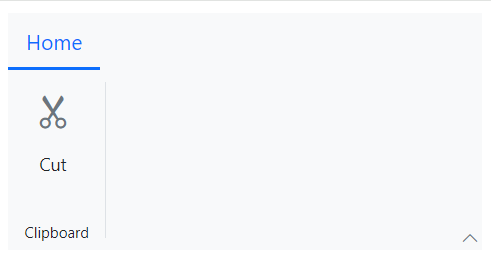

# Resizing in Blazor Ribbon component

The Ribbon dynamically adjusts its elements during resizing. When the ribbon's size increases, elements expand, and when it decreases, elements collapse. Resizing is supported in both Classic and Simplified modes, with the flexibility to customize the order in which elements resize.

- **Classic Mode**: During resizing, the size of items adjusts sequentially based on the available width of the tab content in the order: `Large → Medium → Small` (and vice versa).  
- **Simplified Mode**: During resizing, the size of items adjusts sequentially in the order: `Medium → Small` (and vice versa).

## Defining items allowed size

You can use the [AllowedSizes](https://help.syncfusion.com/cr/blazor/Syncfusion.Blazor.Ribbon.RibbonItem.html#Syncfusion_Blazor_Ribbon_RibbonItem_AllowedSizes) property within [RibbonItem](https://help.syncfusion.com/cr/blazor/Syncfusion.Blazor.Ribbon.RibbonItem.html) to specify the sizes that an item can maintain during resizing. When set, the item's size remains constant within the defined value, irrespective of resizing.




@using Syncfusion.Blazor.Ribbon;
@using Syncfusion.Blazor.SplitButtons;

    <SfRibbon>
        <RibbonTabs>
            <RibbonTab HeaderText="Home">
                <RibbonGroups>
                    <RibbonGroup HeaderText="Clipboard">
                        <RibbonCollections>
                            <RibbonCollection>
                                <RibbonItems>
                                    <RibbonItem Type=RibbonItemType.Button AllowedSizes="RibbonItemSize.Large">
                                        <RibbonButtonSettings Content="Cut" IconCss="e-icons e-cut"></RibbonButtonSettings>
                                    </RibbonItem>
                                </RibbonItems>
                            </RibbonCollection>
                        </RibbonCollections>
                    </RibbonGroup>
                </RibbonGroups>
            </RibbonTab>
        </RibbonTabs>
    </SfRibbon>




## Defining items active size

The [ActiveSize](https://help.syncfusion.com/cr/blazor/Syncfusion.Blazor.Ribbon.RibbonItem.html#Syncfusion_Blazor_Ribbon_RibbonItem_ActiveSize) property within [RibbonItem](https://help.syncfusion.com/cr/blazor/Syncfusion.Blazor.Ribbon.RibbonItem.html) indicates the current size of the rendered item. By default, the value is `Medium`. It is a read-only property.