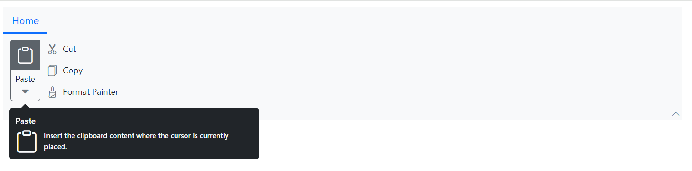
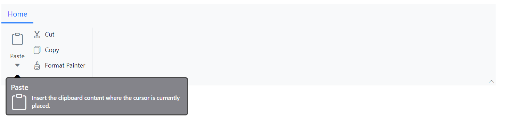

# Tooltip in Blazor Ribbon component

The Ribbon component supports tooltips to display additional information for Ribbon items. Tooltips appear when the user hovers over an item or moves keyboard focus to it; behavior on touch devices may vary. Configure tooltips per item using the [TooltipSettings](https://help.syncfusion.com/cr/blazor/Syncfusion.Blazor.Ribbon.RibbonItem.html#Syncfusion_Blazor_Ribbon_RibbonItem_TooltipSettings) property of the [RibbonItem](https://help.syncfusion.com/cr/blazor/Syncfusion.Blazor.Ribbon.RibbonItem.html) directive.

## Adding Title

Use the [Title](https://help.syncfusion.com/cr/blazor/Syncfusion.Blazor.Ribbon.RibbonTooltipSettings.html#Syncfusion_Blazor_Ribbon_RibbonTooltipSettings_Title) property to set the tooltip title for each Ribbon item.

## Adding Content

Use the [Content](https://help.syncfusion.com/cr/blazor/Syncfusion.Blazor.Ribbon.RibbonTooltipSettings.html#Syncfusion_Blazor_Ribbon_RibbonTooltipSettings_Content) property to set the tooltip content for each Ribbon item.

## Adding Icon

Use the [IconCss](https://help.syncfusion.com/cr/blazor/Syncfusion.Blazor.Ribbon.RibbonTooltipSettings.html#Syncfusion_Blazor_Ribbon_RibbonTooltipSettings_IconCss) property to specify the icons to be displayed in the tooltip.

The following example demonstrates how to configure `Title`, `Content` and `IconCss` in the `TooltipSettings` property. Inline styles are included only to simplify the sample layout.




@using Syncfusion.Blazor.Ribbon;
@using Syncfusion.Blazor.SplitButtons;

    <SfRibbon>
        <RibbonTabs>
            <RibbonTab HeaderText="Home">
                <RibbonGroups>
                    <RibbonGroup HeaderText="Clipboard">
                        <RibbonCollections>
                            <RibbonCollection>
                                <RibbonItems>
                                    <RibbonItem Type=RibbonItemType.SplitButton TooltipSettings="splitBtnTooltip">
                                        <RibbonSplitButtonSettings Content="Paste" IconCss="e-icons e-paste" Items="@formatItems"></RibbonSplitButtonSettings>
                                    </RibbonItem>
                                </RibbonItems>
                            </RibbonCollection>
                            <RibbonCollection>
                                <RibbonItems>
                                    <RibbonItem Type=RibbonItemType.Button TooltipSettings="cutBtnTooltip">
                                        <RibbonButtonSettings Content="Cut" IconCss="e-icons e-cut"></RibbonButtonSettings>
                                    </RibbonItem>
                                    <RibbonItem Type=RibbonItemType.Button>
                                        <RibbonButtonSettings Content="Copy" IconCss="e-icons e-copy"></RibbonButtonSettings>
                                    </RibbonItem>
                                    <RibbonItem Type=RibbonItemType.Button>
                                        <RibbonButtonSettings Content="Format Painter" IconCss="e-icons e-format-painter"></RibbonButtonSettings>
                                    </RibbonItem>
                                </RibbonItems>
                            </RibbonCollection>
                        </RibbonCollections>
                    </RibbonGroup>
                </RibbonGroups>
            </RibbonTab>
        </RibbonTabs>
    </SfRibbon>

@code {
    RibbonTooltipSettings splitBtnTooltip = new()
        {
            Title = "Paste",
            Content = "Insert the clipboard content where the cursor is currently placed.",
            IconCss = "e-icons e-paste"
        };

    RibbonTooltipSettings cutBtnTooltip = new()
        {
            Title = "Cut",
            Content = "Places the selected text or object on the clipboard so that you can paste it somewhere else.",
            IconCss = "e-icons e-cut"
        };

    List<DropDownMenuItem> formatItems = new List<DropDownMenuItem>()
        {
        new DropDownMenuItem{ Text = "Keep Source Format" },
        new DropDownMenuItem{ Text = "Merge Format" },
        new DropDownMenuItem{ Text = "Keep Text Only" }
        };
}




## Customization

You can use the [CssClass](https://help.syncfusion.com/cr/blazor/Syncfusion.Blazor.Ribbon.RibbonTooltipSettings.html#Syncfusion_Blazor_Ribbon_RibbonTooltipSettings_CssClass) property to customize the appearance of the tooltip with your own custom styles.




@using Syncfusion.Blazor.Ribbon;
@using Syncfusion.Blazor.SplitButtons;

    <SfRibbon>
        <RibbonTabs>
            <RibbonTab HeaderText="Home">
                <RibbonGroups>
                    <RibbonGroup HeaderText="Clipboard">
                        <RibbonCollections>
                            <RibbonCollection>
                                <RibbonItems>
                                    <RibbonItem Type=RibbonItemType.SplitButton TooltipSettings="splitBtnTooltip">
                                        <RibbonSplitButtonSettings Content="Paste" IconCss="e-icons e-paste" Items="@formatItems"></RibbonSplitButtonSettings>
                                    </RibbonItem>
                                </RibbonItems>
                            </RibbonCollection>
                            <RibbonCollection>
                                <RibbonItems>
                                    <RibbonItem Type=RibbonItemType.Button TooltipSettings="cutBtnTooltip">
                                        <RibbonButtonSettings Content="Cut" IconCss="e-icons e-cut"></RibbonButtonSettings>
                                    </RibbonItem>
                                    <RibbonItem Type=RibbonItemType.Button>
                                        <RibbonButtonSettings Content="Copy" IconCss="e-icons e-copy"></RibbonButtonSettings>
                                    </RibbonItem>
                                    <RibbonItem Type=RibbonItemType.Button>
                                        <RibbonButtonSettings Content="Format Painter" IconCss="e-icons e-format-painter"></RibbonButtonSettings>
                                    </RibbonItem>
                                </RibbonItems>
                            </RibbonCollection>
                        </RibbonCollections>
                    </RibbonGroup>
                </RibbonGroups>
            </RibbonTab>
        </RibbonTabs>
    </SfRibbon>

@code {
    RibbonTooltipSettings splitBtnTooltip = new()
        {
            Title = "Paste",
            Content = "Insert the clipboard content where the cursor is currently placed.",
            IconCss = "e-icons e-paste",
            CssClass = "custom-tooltip"
        };

    RibbonTooltipSettings cutBtnTooltip = new()
        {
            Title = "Cut",
            Content = "Places the selected text or object on the clipboard so that you can paste it somewhere else.",
            IconCss = "e-icons e-cut",
            CssClass = "custom-tooltip"
        };

    List<DropDownMenuItem> formatItems = new List<DropDownMenuItem>()
        {
        new DropDownMenuItem{ Text = "Keep Source Format" },
        new DropDownMenuItem{ Text = "Merge Format" },
        new DropDownMenuItem{ Text = "Keep Text Only" }
        };
}




