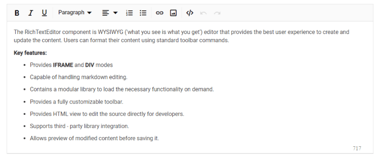

# Blazor Rich Text Editor Accessibility

The [Blazor Rich Text Editor](https://www.syncfusion.com/blazor-components/blazor-wysiwyg-rich-text-editor) is designed in compliance with [WAI-ARIA](https://www.w3.org/WAI/ARIA/apg/patterns/) specifications, applying the appropriate roles, states, and properties. This ensures that the component is accessible to users who rely on assistive technologies (AT) or keyboard navigation.

The Blazor Rich Text Editor follows established accessibility guidelines, including [ADA](https://www.ada.gov/), [Section 508](https://www.section508.gov/), [WCAG 2.2](https://www.w3.org/TR/WCAG22/) standards, and [WCAG roles](https://www.w3.org/TR/wai-aria/#roles) that are commonly used to evaluate accessibility.

The accessibility compliance for the Blazor Rich Text Editor component is outlined below.

| Accessibility Criteria | Compatibility |
| -- | -- |
| [WCAG 2.2](https://www.w3.org/TR/WCAG22/) Support |  |
| [Section 508 Support](../common/accessibility#section-508) |  |
| Screen Reader Support |  |
| Right-To-Left Support |  |
| Color Contrast |  |
| Mobile Device Support |  |
| [Keyboard Navigation](../common/accessibility#keyboard-navigation) |  |
| [Axe-core](https://www.nuget.org/packages/Deque.AxeCore.Playwright) Accessibility Validation |  |

 - All features of a component meet the requirement.

 - Some features of the component do not meet the requirement.

 - The component does not meet the requirement.

## WAI-ARIA attributes

The toolbar of the Blazor Rich Text Editor is assigned the `toolbar` role and supports the following [WAI-ARIA](https://www.w3.org/WAI/ARIA/apg/patterns/) attributes:

| **Property** | **Functionalities** |
| --- | --- |
| role="toolbar" | This attribute added to the ToolBar element describes the actual role of the element. |
| aria-orientation | Indicates the toolbar's orientation. The default value is `horizontal`. |
| aria-haspopup | Indicates if the toolbar has a popup. When popup mode is enabled, this value is set to `true`. The default is `false`. |
| aria-disabled | Indicates the disabled state of the toolbar. |
| aria-owns | Identifies an element to define a visual, functional, or contextual parent/child relationship between DOM elements when the DOM hierarchy cannot represent the relationship. In the Rich Text Editor, the attribute contains the ID of the Rich Text Editor to indicate the popup as a child element. |

For more details on toolbar WAI-ARIA attributes, refer to the [accessibility of Toolbar](https://blazor.syncfusion.com/documentation/toolbar/accessibility) documentation.

The Blazor Rich Text Editor element is assigned the `application` role.

| **Property** | **Functionalities** |
| --- | --- |
| role="application" | This attribute added to the Rich Text Editor element describes the actual role of the element. |
| aria-disabled | Indicates the disabled state of the toolbar. |









## Keyboard interaction

The Blazor Rich Text Editor component follows [keyboard interaction](https://www.w3.org/WAI/ARIA/apg/patterns/alert/#keyboardinteraction) guidelines, making it easy for people who use assistive technologies (AT) or rely solely on keyboard navigation. The component supports a variety of keyboard shortcuts for common actions.

For a complete list of keyboard shortcuts, refer to the [Keyboard Support](https://blazor.syncfusion.com/documentation/rich-text-editor/keyboard-support) documentation.

## Ensuring accessibility

The Blazor Rich Text Editor component's accessibility is validated using the [axe-core](https://www.npmjs.com/package/axe-core) software tool during automated testing.

The accessibility compliance of the Rich Text Editor component is demonstrated in the following sample. Open the [sample](https://blazor.syncfusion.com/accessibility/rich-text-editor) in a new window to evaluate the component with accessibility tools.

### Custom key configuration

You can customize the key configurations for keyboard interactions in the Rich Text Editor using the [KeyConfigure](https://help.syncfusion.com/cr/blazor/Syncfusion.Blazor.RichTextEditor.SfRichTextEditor.html#Syncfusion_Blazor_RichTextEditor_SfRichTextEditor_KeyConfigure) property.

In the following example, the bold and italic actions are customized to use **Ctrl+1** and **Ctrl+2**, respectively.









N> You can explore the [Blazor Rich Text Editor feature tour page](https://www.syncfusion.com/blazor-components/blazor-wysiwyg-rich-text-editor) to see its capabilities. You can also refer to the [Blazor Rich Text Editor demo](https://blazor.syncfusion.com/demos/rich-text-editor/overview?theme=bootstrap5) to learn how to render and configure the component and its tools.

## See also

* [Accessibility in Syncfusion&reg; Blazor components](../common/accessibility)
