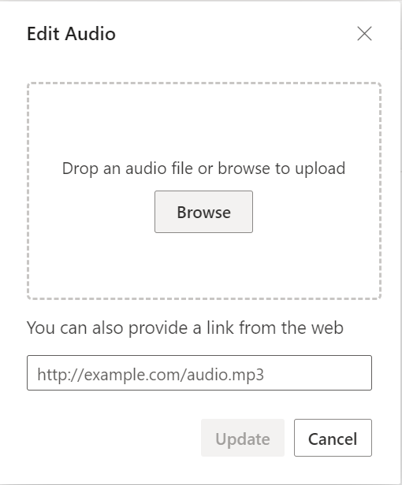
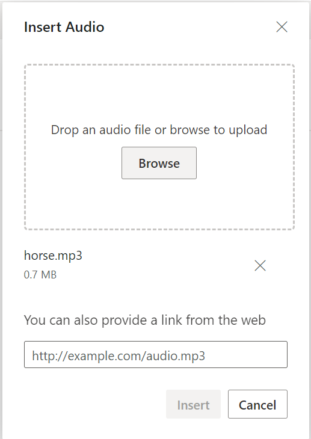

# Insert Audio in RichTextEditor

The Rich Text Editor allows inserting audio files from online sources and the local computer where you want to insert the audio in your content. For inserting the audio to the Rich Text Editor, the following list of options have been provided in the [RichTextEditorAudioSettings](https://help.syncfusion.com/cr/blazor/Syncfusion.Blazor.RichTextEditor.RichTextEditorAudioSettings.html).

| Options | Description |
|----------------|---------|
| AllowedTypes | Specifies the extensions of the audio types allowed to insert on bowering and passing the extensions with comma separators. For example, pass allowedTypes as `.mp3`, `.wav`, `.m4a` and `.wma` |
| LayoutOption | Sets the default display for audio when it is inserted into the Rich Text Editor. Possible options are: `Inline` and `Break`.|
| SaveFormat | Sets the default save format of the audio element when inserted. Possible options are: `Blob` and `Base64`.|
| SaveUrl | Provides URL to map the action result method to save the audio.|
| RemoveUrl | Provides URL to map the action result method to remove the audio.|
| Path | Specifies the location to store the audio.|

## Configure audio tool in the toolbar

To include the audio tool in the Rich Text Editor, you can add the toolbar item `Audio` to the [RichTextEditorToolbarSettings.Items](https://help.syncfusion.com/cr/aspnetmvc-js2/Syncfusion.EJ2.RichTextEditor.RichTextEditorToolbarSettings.html#Syncfusion_EJ2_RichTextEditor_RichTextEditorToolbarSettings_Items) property.

To configure `Audio` toolbar item, refer to the below code.









## Insert audio from web

To insert audio from the hosted link or local machine, you should enable the audio tool on in the editor’s toolbar.

## Insert from web URL

By default, the audio tool opens the audio dialog, allowing you to insert audio from an online source. Inserting the URL will be added to the `src` attribute of the `<source>` tag.


## Upload and insert audio

In the audio dialog, using the `browse` option, select the audio from the local machine and insert it into the Rich Text Editor content.

If the path field is not specified in the [RichTextEditorAudioSettings](https://help.syncfusion.com/cr/blazor/Syncfusion.Blazor.RichTextEditor.RichTextEditorAudioSettings.html), the audio will be converted into `Blob` url or `Base64` and inserted inside the Rich Text Editor.

### Restrict audio upload based on size

Using the Rich Text Editor `FileUploading` event, you can restrict the audio to upload when the given audio size is greater than the allowed fileSize. Also, the audio size in the argument will be returned in `bytes`.

In the following illustration, the audio size has been validated before uploading, and it is determined whether the audio has been uploaded or not.

### Server-side action

The selected audio can be uploaded to the required destination using the controller action below. Map this method name in [RichTextEditorAudioSettings.SaveUrl]() and provide the required destination path through [RichTextEditorAudioSettings.Path]() properties.

> If you want to insert lower-sized audio files in the editor and don't want a specific physical location for saving audio, you can opt to save the format as `Base64`.
In the following code blocks, you can insert the audio files which are saved in the specified path.









`controller.cs`

```cshtml

using System;
using System.IO;
using FileUpload.Models;
using System.Diagnostics;
using System.Net.Http.Headers;
using Microsoft.AspNetCore.Mvc;
using Microsoft.AspNetCore.Http;
using System.Collections.Generic;
using Microsoft.AspNetCore.Hosting;
namespace FileUpload.Controllers
{
    public class HomeController : Controller
    {
        private IHostingEnvironment hostingEnv;
        public HomeController(IHostingEnvironment env)
        {
            hostingEnv = env;
        }
        public IActionResult Index()
        {
            return View();
        }
        [AcceptVerbs("Post")]
        public void SaveFiles(IList<IFormFile> UploadFiles)
        {
            try
            {
                foreach (IFormFile file in UploadFiles)
                {
                    if (UploadFiles != null)
                    {
                        string filename = ContentDispositionHeaderValue.Parse(file.ContentDisposition).FileName.Trim('"');
                        filename = hostingEnv.WebRootPath + "\\Files" + $@"\{filename}";
                        // Create a new directory, if it does not exists
                        if (!Directory.Exists(hostingEnv.WebRootPath + "\\Files"))
                        {
                            Directory.CreateDirectory(hostingEnv.WebRootPath + "\\Files");
                        }
                        if (!System.IO.File.Exists(filename))
                        {
                            using (FileStream fs = System.IO.File.Create(filename))
                            {
                                file.CopyTo(fs);
                                fs.Flush();
                            }
                            Response.StatusCode = 200;
                        }
                    }
                }
            }
            catch (Exception)
            {
                Response.StatusCode = 204;
            }
        }
        [ResponseCache(Duration = 0, Location = ResponseCacheLocation.None, NoStore = true)]
        public IActionResult Error()
        {
            return View(new ErrorViewModel { RequestId = Activity.Current?.Id ?? HttpContext.TraceIdentifier });
        }
    }
}

```

### Audio save format

The audio files can be saved as `Blob` or `Base64` url by using the [RichTextEditorAudioSettings.SaveFormat]() property, which is of enum type and the generated url will be set to the `src` attribute of the `<source>` tag.

> By default, the files are saved in the `Blob` format.

```cshtml

<audio>
    <source src="blob:http://ej2.syncfusion.com/3ab56a6e-ec0d-490f-85a5-f0aeb0ad8879" type="audio/mp3" />
</audio>
<audio>
    <source src="data:audio/mp3;base64,iVBORw0KGgoAAAANSUhEUgAAADAAAAAwCAYAAABXAvmHA" type="audio/mp3" />
</audio>

```

## Replacing audio

Once an audio file has been inserted, you can change it using the Rich Text Editor [RichTextEditorQuickToolbarSettings](https://help.syncfusion.com/cr/blazor/Syncfusion.Blazor.RichTextEditor.RichTextEditorQuickToolbarSettings.html#Syncfusion_Blazor_RichTextEditor_RichTextEditorQuickToolbarSettings_Audio) `audioReplace` option. You can replace the audio file using the web URL or the browse option in the audio dialog.



## Delete audio

To remove audio from the Rich Text Editor content, select the audio and click the `audioRemove` tool from the quick toolbar. It will delete the audio from the Rich Text Editor content as well as from the service location if the [RichTextEditorAudioSettings.RemoveUrl]() is given.

Once you select the audio from the local machine, the URL for the audio will be generated. You can remove the audio from the service location by clicking the cross icon.



The following sample explains how to configure `RichTextEditorAudioSettings.RemoveUrl` to remove saved audio from the remote service location when the following audio removal actions are performed:

* `delete` key action.
* `backspace` key action.
* Removing uploaded audio file from the insert audio dialog.
* Deleting audio using the quick toolbar `audioRemove` option.









`controller.cs`

```cshtml

using System;
using System.IO;
using FileUpload.Models;
using System.Diagnostics;
using System.Net.Http.Headers;
using Microsoft.AspNetCore.Mvc;
using Microsoft.AspNetCore.Http;
using System.Collections.Generic;
using Microsoft.AspNetCore.Hosting;
namespace FileUpload.Controllers
{
    public class HomeController : Controller
    {
        private IWebHostEnvironment hostingEnv;

        public HomeController(IWebHostEnvironment env)
        {
            hostingEnv = env;
        }

        public ActionResult Index()
        {
            return View();
        }

        [AcceptVerbs("Post")]
        public void SaveImage(IList<IFormFile> UploadFiles)
        {
            try
            {
                foreach (IFormFile file in UploadFiles)
                {
                    if (UploadFiles != null)
                    {
                        string filename = ContentDispositionHeaderValue.Parse(file.ContentDisposition).FileName.Trim('"');
                        filename = hostingEnv.WebRootPath + "\\Uploads" + $@"\{filename}";

                        // Create a new directory, if it does not exists
                        if (!Directory.Exists(hostingEnv.WebRootPath + "\\Uploads"))
                        {
                            Directory.CreateDirectory(hostingEnv.WebRootPath + "\\Uploads");
                        }

                        if (!System.IO.File.Exists(filename))
                        {
                            using (FileStream fs = System.IO.File.Create(filename))
                            {
                                file.CopyTo(fs);
                                fs.Flush();
                            }
                            Response.StatusCode = 200;
                        }
                    }
                }
            }
            catch (Exception)
            {
                Response.StatusCode = 204;
            }
        }

        [AcceptVerbs("Post")]
        public void RemoveImage(IList<IFormFile> UploadFiles)
        {
            try
            {
                foreach (IFormFile file in UploadFiles)
                {
                    if (UploadFiles != null)
                    {
                        // Do remove action here}
                        Response.StatusCode = 200;
                    }
                }
            }
            catch (Exception)
            {
                Response.StatusCode = 204;
            }
        }
    }
}

```

## Display Position

Sets the default display for an audio when it is inserted in the Rich Text Editor using the `RichTextEditorAudioSettings.layoutOption`. It has two possible options: `Inline` and `Break`. When updating the display positions, it updates the audio elements’ layout position.









## Rename audio before inserting

Using the [RichTextEditorAudioSettings](https://help.syncfusion.com/cr/blazor/Syncfusion.Blazor.RichTextEditor.RichTextEditorAudioSettings.html) property, you can specify the server handler to upload the selected audio. Then by binding the `FileUploadSuccess` event, you can receive the modified file name from the server and update it in the Rich Text Editor's insert audio dialog.

Refer `rename.cs` controller file for configure the server-side.










`rename.cs`

```cshtml

int x = 0;
string file;
[AcceptVerbs("Post")]
public void Rename()
{
    try
    {
        var httpPostedFile = System.Web.HttpContext.Current.Request.Files["UploadFiles"];
        fileName = httpPostedFile.FileName;
        if (httpPostedFile != null)
        {
            var fileSave = System.Web.HttpContext.Current.Server.MapPath("~/Files");
            if (!Directory.Exists(fileSave))
            {
                Directory.CreateDirectory(fileSave);
            }
            var fileName = Path.GetFileName(httpPostedFile.FileName);
            var fileSavePath = Path.Combine(fileSave, fileName);
            while (System.IO.File.Exists(fileSavePath))
            {
                fileName = "rteFiles" + x + "-" + fileName;
                fileSavePath = Path.Combine(fileSave, fileName);
                x++;
            }
            if (!System.IO.File.Exists(fileSavePath))
            {
                httpPostedFile.SaveAs(fileSavePath);
                HttpResponse Response = System.Web.HttpContext.Current.Response;
                Response.Clear();
                Response.Headers.Add("name", fileName);
                Response.ContentType = "application/json; charset=utf-8";
                Response.StatusDescription = "File uploaded succesfully";
                Response.End();
            }
        }
    }
    catch (Exception e)
    {
        HttpResponse Response = System.Web.HttpContext.Current.Response;
        Response.Clear();
        Response.ContentType = "application/json; charset=utf-8";
        Response.StatusCode = 204;
        Response.Status = "204 No Content";
        Response.StatusDescription = e.Message;
        Response.End();
    }
}

```

## Upload audio with authentication

The Rich Text Editor control allows you to add additional data with the File Upload, which can be received on the server side. By using the `FileUploading` event and its `CustomFormData` argument, you can pass parameters to the controller action. On the server side, you can fetch the custom headers by accessing the form collection from the current request, which retrieves the values sent using the POST method.

> By default it doesn't support `UseDefaultCredentials` property, we need to manually append the default credentials with the upload request.









`controller.cs`

```cshtml

using System;
using System.IO;
using FileUpload.Models;
using System.Diagnostics;
using System.Net.Http.Headers;
using Microsoft.AspNetCore.Mvc;
using Microsoft.AspNetCore.Http;
using System.Collections.Generic;
using Microsoft.AspNetCore.Hosting;

namespace FileUpload.Controllers
{
    public class HomeController : Controller
    {
        private IHostingEnvironment hostingEnv;

        public HomeController(IHostingEnvironment env)
        {
            hostingEnv = env;
        }

        public IActionResult Index()
        {
            return View();
        }

        [AcceptVerbs("Post")]
        public void SaveFiles(IList<IFormFile> UploadFiles)
        {
            string currentPath = Request.Form["Authorization"].ToString();
            try
            {
                foreach (IFormFile file in UploadFiles)
                {
                    if (UploadFiles != null)
                    {
                        string filename = ContentDispositionHeaderValue.Parse(file.ContentDisposition).FileName.Trim('"');
                        filename = hostingEnv.WebRootPath + "\\Files" + $@"\{filename}";

                        // Create a new directory, if it does not exists
                        if (!Directory.Exists(hostingEnv.WebRootPath + "\\Files"))
                        {
                            Directory.CreateDirectory(hostingEnv.WebRootPath + "\\Files");
                        }

                        if (!System.IO.File.Exists(filename))
                        {
                            using (FileStream fs = System.IO.File.Create(filename))
                            {
                                file.CopyTo(fs);
                                fs.Flush();
                            }
                            Response.StatusCode = 200;
                        }
                    }
                }
            }
            catch (Exception)
            {
                Response.StatusCode = 204;
            }
        }

        [ResponseCache(Duration = 0, Location = ResponseCacheLocation.None, NoStore = true)]
        public IActionResult Error()
        {
            return View(new ErrorViewModel { RequestId = Activity.Current?.Id ?? HttpContext.TraceIdentifier });
        }
    }
}

```

## See Also

* [How to edit the quick toolbar settings](./toolbar/#quick-toolbar)
* [How to use link editing option in the toolbar items](./link)