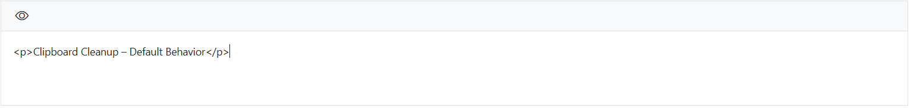
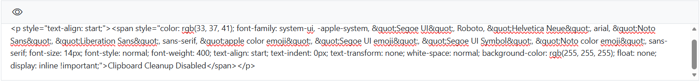

# Clipboard Clean-up in Blazor Rich Text Editor

The Rich Text Editor now provides automatic cleanup of clipboard content during copy (`Ctrl + C`) and cut (`Ctrl + X`) operations. When this feature is enabled, unwanted inline styles are removed while preserving important structural elements such as tables, lists, and images. This feature is enabled by default through [`EnableClipboardCleanup`](https://help.syncfusion.com/cr/blazor/Syncfusion.Blazor.RichTextEditor.SfRichTextEditor.html#Syncfusion_Blazor_RichTextEditor_SfRichTextEditor_EnableClipboardCleanup) property.

It can be verified by following the below steps:

- Copy or cut content within the Rich Text Editor.
- Paste the content back into the editor.
- Observe that unnecessary inline styles are removed while essential elements such as tables, lists, and images remain intact.

By default, `EnableClipboardCleanup` is set to `true`. Check with the below demonstration:









When set to `false,` the browser’s default copy and cut behavior applies. Check with the below demonstration:









