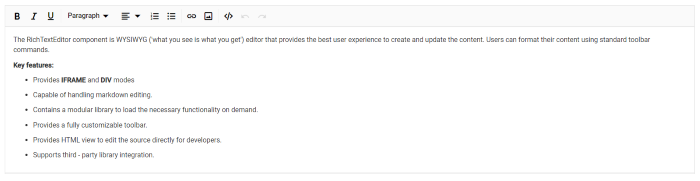
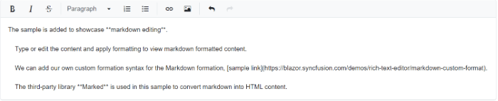

# Editor Modes in Blazor Rich Text Editor

The [Blazor Rich Text Editor](https://www.syncfusion.com/blazor-components/blazor-wysiwyg-rich-text-editor) component allows users to create and edit content, returning valid HTML markup or Markdown (MD). It supports two editing modes:

* HTML Editor
* Markdown Editor

## HTML editor

The Rich Text Editor is a [WYSIWYG Editor](https://www.syncfusion.com/blazor-components/blazor-wysiwyg-rich-text-editor) that enables users to format content as HTML. This is the default editing mode, allowing content formatting through toolbar options and returning valid HTML markup.

To enable HTML mode, set the `EditorMode` property to `HTML`.

```cshtml

@using Syncfusion.Blazor.RichTextEditor

<SfRichTextEditor EditorMode="EditorMode.HTML" >
    <p>The Rich Text Editor component is WYSIWYG ('what you see is what you get') editor that provides the best user experience to create and update the content. Users can format their content using standard toolbar commands.</p>
    <p><b> Key features:</b></p>
    <ul>
    <li><p> Provides <b>IFRAME</b> and <b>DIV</b> modes </p></li>
    <li><p> Capable of handling markdown editing.</p></li>
    <li><p> Contains a modular library to load the necessary functionality on demand.</p></li>
    <li><p> Provides a fully customizable toolbar.</p></li>
    <li><p> Provides HTML view to edit the source directly for developers.</p></li>
    <li><p> Supports third - party library integration.</p></li>
    </ul>
</SfRichTextEditor>

```



## Markdown editor

To enable Markdown editing, set the `EditorMode` property to `Markdown`. This mode allows users to create and format content using Markdown syntax. A third-party library such as `Marked` is used to convert Markdown into HTML.

**Supported Tags:**

- Headings: `h1`, `h2`, `h3`, `h4`, `h5`, `h6`
- Block elements: `blockquote`, `pre`, `p`, `OL`, `UL`

**Supported Selection Tags:**

- `Bold`, `Italic`, `StrikeThrough`, `InlineCode`, `SubScript`, `SuperScript`, `UpperCase`, `LowerCase`

```cshtml

@using Syncfusion.Blazor.RichTextEditor

<SfRichTextEditor EditorMode="EditorMode.Markdown" >
    ***Overview***The Rich Text Editor component is WYSIWYG ('what you see is what you get') editor used to create and edit the content and return valid HTML markup or markdown (MD) of the content. The editor provides a standard toolbar to format content using its commands. Modular library features to load the necessary functionality on demand. The toolbar contains commands to align the text, insert link, insert image, insert list, undo/redo operation, HTML view, and more.
    ***Key features***
    *Mode*: Provides IFRAME and DIV mode.
    *Module*: Modular library to load the necessary functionality on demand.
    *Toolbar*: Provide a fully customizable toolbar.
    *Editing*: HTML view to edit the source directly for developers.
    *Third-party Integration*: Supports to integrate third-party library.
    *Preview*: Preview the modified content before saving it.
    *Tools*: Handling images, hyperlinks, video, uploads and more.
    *Undo and Redo*: Undo/redo manager.
    *Lists*:Creates bulleted and numbered list
</SfRichTextEditor>

```



For further details on Markdown editing, refer to the [Markdown](./markdown) section.

N> You can also explore our [Blazor Rich Text Editor](https://blazor.syncfusion.com/demos/rich-text-editor/overview?theme=bootstrap5) demo to learn how to render and configure the editor tools.

## See also

* [How to render the iframe](./iframe)